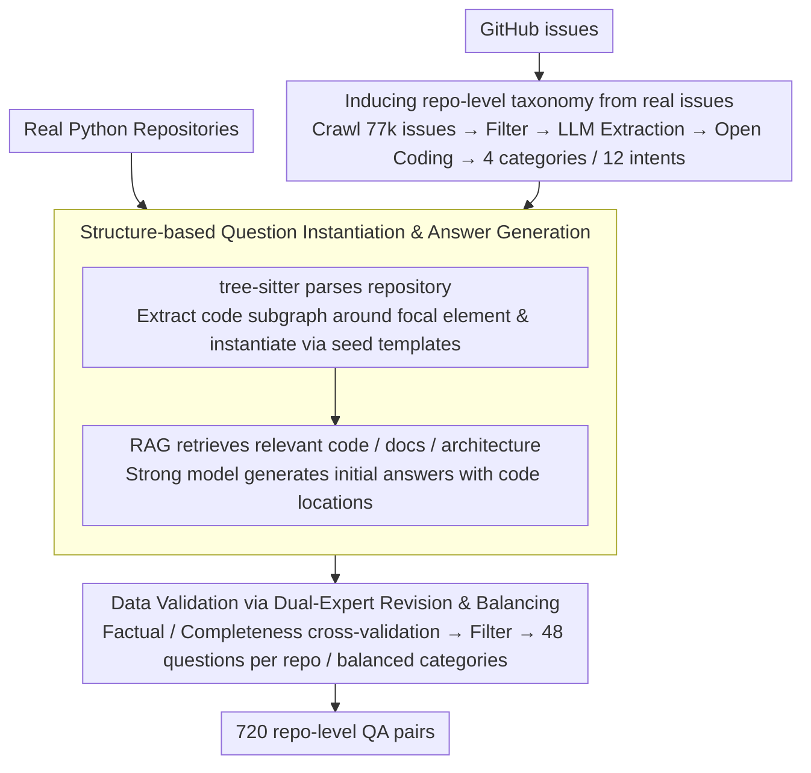

# SWE-QA: Can Language Models Answer Repository-level Code Questions?

**Conference**: ACL 2026 Findings  
**arXiv**: [2509.14635](https://arxiv.org/abs/2509.14635)  
**Code**: https://github.com/peng-weihan/SWE-QA-Bench  
**Area**: Code Intelligence / Repository-level QA  
**Keywords**: Repository-level code understanding, Code QA, RAG, Software Engineering Agent, SWE-Bench

## TL;DR
SWE-QA constructs a repository-level code QA benchmark covering 15 real-world Python repositories and 720 high-quality QA pairs. It derives question types from GitHub issues and validates answers via human experts. Experiments show that standalone LLMs are inadequate; only RAG and tool-integrated agents like OpenHands/SWE-agent approach the requirements of real-world development QA.

## Background & Motivation
**Background**: Evaluation of code QA has long trended towards functions, code snippets, API documentation, or StackOverflow-style local problems. Benchmarks such as CoSQA, CodeQA, and CodeQueries primarily test the ability to explain a given segment of code. While repository-level datasets like CodeRepoQA, CoreQA, and Spyder-CodeQA have emerged recently, they lack systematic coverage of question types, cross-file dependencies, and rigorous human validation.

**Limitations of Prior Work**: In real-world software engineering, developers rarely ask "what does this line mean." Instead, they ask questions like "where is this feature implemented," "why does this class lazily access a certain attribute," or "how does a test take effect across routes, configurations, and request contexts." These questions require models to navigate multiple files, classes, functions, and control flows. Relying on parametric memory or a single retrieved snippet often misses critical dependencies.

**Key Challenge**: While large code models are increasingly proficient at writing local code, evaluation systems still fail to adequately test the understanding of a "repository as a system." Snippet-level benchmarks can make models appear strong without demonstrating their ability to answer questions about system design, dependency tracking, and feature localization that real maintainers ask.

**Goal**: Ours aims to fill a evaluation gap closer to real-world software engineering. This involves abstracting a repository-level question taxonomy from developer issues and constructing a reusable QA generation and human validation pipeline to compare direct prompting, RAG, agents, and commercial code assistants.

**Key Insight**: Instead of creating problems from templates, the paper crawls GitHub issues from SWE-Bench repositories to observe how developers actually ask questions. These questions are categorized into four major types (What, Why, Where, How) with 12 fine-grained intents, ensuring the distribution reflects real development environments rather than synthetic academic tasks.

**Core Idea**: Use a GitHub issue-driven question taxonomy combined with static code structures and human validation to construct a scalable benchmark that examines cross-file, multi-hop, repository-level reasoning.

## Method
SWE-QA is a benchmark paper, but its method involves a comprehensive production pipeline for repository-level QA. The authors first analyze developer questions from real issues to template question types, then parse target repositories to instantiate questions around specific classes or modules. Initial answers are generated via RAG and subsequently revised and cross-validated by experienced developers.

### Overall Architecture
The input consists of real-world open-source Python repositories and developer questions extracted from GitHub issues. The output is 720 repository-level QA pairs, each bound to a target repository, a question type, a context requiring multi-hop reasoning, and a human-validated long-form answer.

The pipeline comprises four steps: first, crawling and analyzing GitHub issues to establish a question taxonomy and seed templates; second, parsing repository structures with tree-sitter to instantiate questions around focal code elements; third, generating initial reference answers using retrieval-augmented generation; and fourth, expert revision to filter low-quality samples and ensure category balance.

### Key Designs

**1. Inducing repository-level question taxonomy from real issues: Aligning problem distribution with maintainer needs.**

If question types are designed subjectively by researchers, they tend to favor "easy-to-label" local problems like "what does this line mean," missing real concerns like "where is this feature implemented." To align with real maintenance scenarios, the authors crawled 77,100 GitHub issues from 12 popular SWE-Bench repositories. After filtering for length and extracting explicit code-understanding questions via LLMs, they sampled 1,000 questions for open coding. This resulted in four categories (What, Why, Where, How) and 12 intents, such as Architecture exploration, Dependency tracing, and Design rationale, reflecting the true distribution of systemic maintenance issues.

**2. Structure-based Question Instantiation & Answer Generation: Mapping seed questions to multi-hop repo problems.**

Repository-level questions are difficult due to long and sparse contexts. Feeding the entire repository to a model is impractical, while single functions are insufficient for cross-file reasoning. The authors use tree-sitter to extract classes, functions, and dependencies, selecting a compact code subgraph around a focal element. This subgraph is fitted into seed templates to instantiate abstract questions into concrete problems. For answer generation, code elements are indexed, and relevant snippets are retrieved using semantic and structural similarity. A strong model then generates initial answers based on this context, constrained to cite specific code locations.

**3. Dual-Expert Revision & Balancing: Ensuring credibility through human cross-validation.**

Repo-level answers in SWE-QA average 266.64 words and involve 8.71 functions across 3.19 files. LLM-generated answers often suffer from being "locally correct but missing a link in the chain." Thus, two experts (3+ years experience) independently checked every answer for facts, completeness, and phrasing. Disagreements were resolved by a third expert. This process also filtered vague questions and ensured 48 samples per repository with a balanced distribution across the four question categories.

### Loss & Training
Ours does not train new models and thus has no traditional loss function. The evaluation strategy uses SWE-QA as a test set to compare six LLMs across different context enhancement methods: direct prompting, Function Chunking RAG, Sliding Window RAG, SWE-agent, and OpenHands. Automated evaluation uses Claude Sonnet 4.5 as an LLM-as-Judge, scoring across five dimensions (correctness, completeness, relevance, clarity, coherence), each worth 20 points for a total of 100. Bias is mitigated via system anonymization and answer randomization.

## Key Experimental Results

### Main Results
SWE-QA contains 720 questions across 15 Python repositories, comprising 13,300 files, 142,404 functions, and over 3.4 million lines of code. On average, each question requires 8.71 functions, 3.19 files, a reasoning chain of depth 4.72, and a dependency chain of depth 2.96. 90.9% of questions have a reasoning depth > 1, and 77.6% require cross-file knowledge.

| System / Method | Overall | Key Information | Conclusion |
|:---|:---:|:---|:---|
| Qwen3-Coder-30B direct | 50.80 | No repo context | Direct answering is weakest |
| Qwen3-Coder-30B + Sliding Window RAG | 64.86 | +14.06 | Context retrieval significantly helps |
| Qwen3-Coder-30B + OpenHands | 65.88 | +15.08 | Agents help small models but are unstable |
| GLM-4.6 + OpenHands | 70.15 | Near best | Strong models with agents are competitive |
| GPT-5.1 direct | 61.41 | Strongest base ability | Still lower than tool-based systems |
| GPT-5.1 + OpenHands | 70.79 | Best in table | Agent framework yields highest score |
| Cursor | 70.66 | Commercial tool | Approaches best open combination |
| Tongyi Lingma | 69.07 | Commercial tool | Effective end-to-end engineering |

### Ablation Study
The paper analyzes question types, repository sources, and evaluation protocols rather than traditional module ablations.

| Analysis Dimension | Key Results | Description |
|:---|:---|:---|
| Why Questions | Avg 69.77 | Design rationales often have comments/semantic cues, making them easier |
| How Questions | Avg 69.13 | Requires process understanding but supported by structural context |
| Where Questions | Avg 66.76 | Requires precise localization; higher demand on recall and cross-file tracking |
| What Questions | Avg 65.81 | Architecture exploration (61.84) is one of the hardest subcategories |
| SWE-Bench Repos | Avg 68.59 | Easier compared to SWE-Bench-Live |
| SWE-Bench-Live Repos | Avg 64.98 | 3.61 points lower, likely due to less data leakage in training |
| Human Eval GPT-5.1 + OpenHands | 82.33 | Consistent with LLM-as-Judge ranking, supporting judge credibility |

### Key Findings
- Context acquisition determines the ceiling: direct prompting is insufficient for repo-level tasks. RAG provides stable gains, and agents like OpenHands/SWE-agent offer further improvements when paired with strong models.
- "What" and "Where" questions are harder because they require precise implementation localization and reconstruction of architectural relationships rather than general explanations of purpose.
- Agents are expensive: OpenHands averages ~87,045 input tokens and 1,930 output tokens per question, indicating that performance gains come at a significant computational cost.
- Complexity matters: Large repositories like Pylint are significantly harder than smaller ones like Flask or Requests; scale and architectural complexity directly correlate with QA difficulty.

## Highlights & Insights
- The paper successfully transforms "repository-level understanding" into a concrete, evaluable data structure. By grounding taxonomy in real issues, it proves that developer questions are not just API queries but involve cross-file localization and system behavior explanation.
- The statistics are compelling: an average question involves 3.19 files and 8.71 functions. These metrics demonstrate that SWE-QA operates at a different tier of difficulty compared to snippet-based code QA.
- The comparison between RAG and agents is practical. GPT-5.1 direct scoring only 61.41 highlights that even the strongest models require retrieval and tool execution to reach 70+, providing a roadmap for code assistant design.
- The benchmark methodology is transferable to internal project documentation QA or test failure explanation: induced templates combined with structural parsing and human validation can create high-quality internal evaluation sets.

## Limitations & Future Work
- The current scope is limited to Python repositories from SWE-Bench, leaving Java, TypeScript, and C++ ecosystems unexplored.
- The scale of 720 QA pairs is high-quality but small. Training or fine-tuning repo-level QA models would require larger, continuously updated datasets.
- Evaluation relies on LLM-as-Judge. Despite human validation, fine-grained factual errors in complex code answers might still be missed.
- Answers are primarily natural language. Future work could integrate QA with repository operations, such as executing tests or providing verifiable patches.

## Related Work & Insights
- **vs CoSQA / CodeQA**: These focus on snippet retrieval or function-level questions. SWE-QA specifically probes multi-hop and cross-file reasoning.
- **vs CodeRepoQA / CoreQA**: These move into repo-level territory, but SWE-QA provides a more complete evaluation dimension through its focus on taxonomy, multi-hop reasoning, and human verification.
- **vs SWE-Bench**: SWE-Bench emphasizes issue resolution (generating patches), while SWE-QA focuses on understanding. They are complementary: one tests "can it fix," the other "does it understand."
- **Insight for Code Assistants**: Simple embedding-based retrieval of function blocks is insufficient. Robust assistants require structural indices, cross-file dependency tracking, and iterative tool use to answer "Why" and "Where" questions effectively.

## Rating
- Novelty: ⭐⭐⭐⭐☆ Grounding repo-level QA taxonomy in real issues is solid.
- Experimental Thoroughness: ⭐⭐⭐⭐☆ Covers 6 LLMs, 5 context methods, and commercial tools, though lacks multi-language or execution setups.
- Writing Quality: ⭐⭐⭐⭐☆ Process and metrics are clear, with dense information in tables.
- Value: ⭐⭐⭐⭐⭐ Highly relevant for code assistants and repo-level RAG/Agent research; a directly reusable benchmark.

<!-- RELATED:START -->

## Related Papers

- [\[ACL 2026\] RepoShapley: Shapley-Enhanced Context Filtering for Repository-Level Code Completion](reposhapley_shapley-enhanced_context_filtering_for_repository-level_code_complet.md)
- [\[ICML 2026\] MatchFixAgent: Language-Agnostic Autonomous Repository-Level Code Translation Validation and Repair](../../ICML2026/code_intelligence/matchfixagent_language-agnostic_autonomous_repository-level_code_translation_val.md)
- [\[ACL 2026\] KoCo-Bench: Can Large Language Models Leverage Domain Knowledge in Software Development?](koco-bench_can_large_language_models_leverage_domain_knowledge_in_software_devel.md)
- [\[ACL 2026\] Can LLMs Compress (and Decompress)? Evaluating Code Understanding and Execution via Invertibility](can_llms_compress_and_decompress_evaluating_code_understanding_and_execution_via.md)
- [\[ICLR 2026\] Improving Code Localization with Repository Memory](../../ICLR2026/code_intelligence/improving_code_localization_with_repository_memory.md)

<!-- RELATED:END -->
