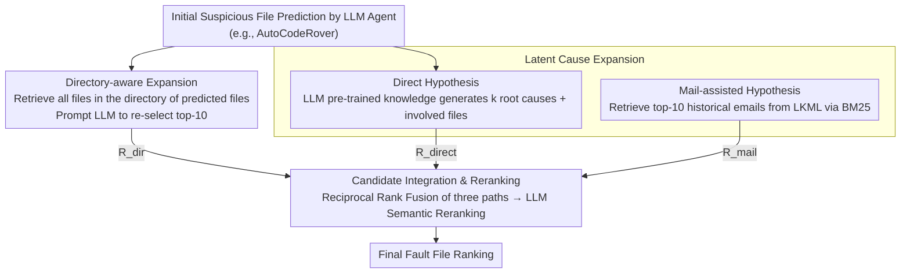

# Taming System Complexity: Demystifying Software Engineering Agents in Diagnosing Linux Kernel Faults

**Conference**: ACL2026  
**arXiv**: [2505.19489](https://arxiv.org/abs/2505.19489)  
**Code**: https://github.com/FudanSELab/LinuxFLBench  
**Area**: Software Engineering Agent / Code Intelligence  
**Keywords**: Fault Localization, Linux Kernel, LLM Agent, Code Localization, System Complexity

## TL;DR
By establishing a large-scale Linux kernel fault localization benchmark, LinuxFLBench, this paper reveals the limitations of existing LLM Agents in complex systems and proposes the LinuxFL+ framework to significantly improve fault localization accuracy at low cost through two-dimensional expansion: directory-awareness and latent cause analysis.

## Background & Motivation

**Background**: Fault Localization (FL) is a classic problem in software engineering, aiming to automatically identify defective code locations from bug reports and source code. Recently, Large Language Model (LLM) driven Agents (e.g., SWE-Agent, AutoCodeRover, Agentless) have achieved significant progress in general software systems, reaching approximately 70% accuracy on the SWE-bench benchmark and demonstrating the ability of Agents to autonomously explore codebases.

**Limitations of Prior Work**: However, the evaluation of these Agents focuses primarily on medium-sized general software projects (like Python libraries), and their applicability to real-world large-scale complex systems (like the Linux kernel) remains unknown. The Linux kernel presents three unique challenges: (1) Massive code scale: Kernel v5.8 contains 69K files and 28M lines of code, over 30 times larger than the largest project in SWE-bench; (2) Limited observability: Because the kernel runs in privileged mode with minimal overhead, user-reported bugs often lack detailed runtime information and debugging clues; (3) Multi-dimensional influencing factors: Hardware configurations, system loads, and timing factors can all lead to bugs, greatly expanding the reasoning space for diagnosis.

**Key Challenge**: While existing Agents perform excellently in general software, these advantages may not transfer to extremely challenging real-world systems like the Linux kernel. A deep study of their actual performance in this domain and the identification of improvement directions are needed.

**Goal**: First, to construct the first large-scale Linux kernel fault localization benchmark; second, to comprehensively evaluate the performance of existing top-tier LLM Agents on this task; third, to diagnose the primary causes of failure and propose effective enhancement solutions.

**Key Insight**: Starting from an empirical study, this work reveals the real shortcomings of Agents through extensive experimental data and then designs targeted improvement strategies. Key observations include: Agents can usually accurately identify relevant high-level modules but struggle to precisely locate specific files within those modules; simultaneously, the exploration range of Agents is too narrow, focusing only on a few possible causes and missing many related root causes.

**Core Idea**: Use structured expansion across two dimensions to compensate for Agent deficiencies—expanding the search range using directory structures in the spatial dimension, and expanding the potential cause pool through direct hypotheses and mail-knowledge-assisted hypotheses in the knowledge dimension. Finally, generate final predictions through aggregate reranking.

## Method

### Overall Architecture

LinuxFL+ is a post-processing framework applied to the outputs of existing Agents. It addresses two blind spots observed in empirical studies: the ability to locate modules but selecting the wrong files within them, and an overly narrow exploration range. Given initial suspicious file predictions from any LLM Agent (e.g., AutoCodeRover), the framework performs directory-aware expansion along the spatial dimension and latent cause expansion along the knowledge dimension. Candidate files from both paths are integrated using Reciprocal Rank Fusion and then refined by an LLM for final fault file ranking. This process utilizes the directory structure of the codebase and external knowledge like Linux mailing lists to correct Agent blind spots.

### Key Designs

**1. Directory-aware Expansion: Providing Agents a second chance to select precisely within the correct directory**

LLM Agents often correctly hit relevant high-level directories (modules) but select the wrong file when the directory contains many files. The average Linux kernel directory contains 16 files (compared to only 8 in SWE-bench), amplifying the difficulty of precise localization within modules. This design first collects a complete file list for all directories containing initial predicted files, then prompts the LLM to re-filter and rank the top-10 from this expanded candidate set. Essentially, it leverages directory boundaries—an explicit organizational form of the codebase—to define the search range, providing the model with sufficiently detailed context for fine-tuning while maintaining the validity of the "module-granularity hit."

**2. Latent Cause Expansion: Systematically expanding the root cause space via dual-layer hypotheses**

Real bug diagnosis is an iterative "guess-and-verify" process; relying solely on an Agent's initial intuition misses many related root causes. This design generates two layers of hypotheses: the first layer, **Direct Hypothesis**, uses only the LLM's pre-trained knowledge to prompt the model to produce $k$ possible bug causes, each with a corresponding fix and involved files; the second layer, **Mail-assisted Hypothesis**, introduces domain knowledge by using RAG to retrieve historical discussions from the Linux Kernel Mailing List (LKML). To prevent data leakage, only emails prior to the bug report are retrieved. The report is first distilled into keywords across four dimensions—behavior, cause, expected behavior, and solution—and then the top-10 related emails are retrieved via BM25 to feed the LLM. Direct hypotheses leverage general knowledge while mail hypotheses inject historical wisdom; they are complementary, especially in scenarios where performance issues involve causes dispersed across multiple modules.

**3. Candidate Integration and Reranking: Fusing three lines of evidence via Reciprocal Rank Fusion followed by semantic reranking**

Directory expansion, direct hypotheses, and mail hypotheses each offer unique perspectives and must be merged into a unified ranking. For each candidate file $f$, the ranks in the three paths $R_{dir}(f)$, $R_{direct}(f)$, and $R_{mail}(f)$ are recorded (assigned $\infty$ if absent). The aggregate score is calculated as the sum of reciprocals:

$$\text{score}(f) = \frac{1}{R_{dir}(f)} + \frac{1}{R_{direct}(f)} + \frac{1}{R_{mail}(f)}$$

Files ranked highly in any single path receive higher scores, and those ranked highly across multiple paths are prioritized further. After obtaining an initial ranking by descending score, the LLM is prompted to perform a final semantic reranking based on the correspondence between file paths and the bug report. This classic rank fusion concisely synthesizes multi-source information, while the final LLM reranking adds semantic awareness to avoid the rigidity of pure numerical aggregation.

## Key Experimental Results

### Main Results

The LinuxFLBench constructed in the paper contains 250 real Linux kernel bugs, covering 120 kernel versions and 66 different kernel sub-modules (e.g., drivers, networking, file systems). Bug reports average 283 words, and the corresponding codebases average 28,808 files and 11.49 million lines of code, far exceeding SWE-bench (averaging 195 words, 3,010 files, and 0.438 million lines).

Table 1 shows the performance comparison for file-level fault localization:

| Method | Recall@1 | Recall@5 | Recall@10 | MRR |
|------|----------|----------|-----------|-----|
| BM25 (IR Baseline) | 0.168 | 0.328 | 0.396 | 0.231 |
| BugLocator | 0.127 | 0.209 | 0.272 | 0.215 |
| BLUiR (Best traditional IR) | 0.228 | 0.317 | 0.404 | 0.321 |
| SWE-Agent | 0.416 | 0.552 | 0.584 | 0.476 |
| SWE-Agent + LinuxFL+ | **0.524** | **0.720** | **0.768** | **0.610** |
| AutoCodeRover | 0.388 | 0.496 | 0.496 | 0.435 |
| AutoCodeRover + LinuxFL+ | **0.500** | **0.712** | **0.744** | **0.589** |
| Agentless | 0.368 | 0.492 | 0.504 | 0.419 |
| Agentless + LinuxFL+ | **0.440** | **0.684** | **0.724** | **0.549** |

Key observations: (1) Although existing Agents significantly outperform traditional IR methods, their performance on LinuxFLBench is much lower than on SWE-bench (top-1 recall drops by over 15%+), revealing the real challenges of system complexity; (2) Even the best Agent (SWE-Agent) has a Recall@1 of only 41.6%, indicating that Linux kernel FL remains an extremely challenging task; (3) LinuxFL+ brought significant improvements to all three Agents, with SWE-Agent's Recall@1 increasing from 41.6% to 52.4% (+10.8%) and AutoCodeRover's from 38.8% to 50.0% (+11.2%).

### Ablation Study

Table 2 shows performance under different difficulty levels (distinguished by whether file names are explicitly mentioned in the bug report):

| Difficulty Level | Agentless Baseline | AutoCodeRover Baseline | SWE-Agent Baseline | LinuxFL+ Avg Gain |
|---------|---------------|-------------------|---|---|
| Easy (Clear file hints) | 0.605 | 0.623 | 0.664 | +0.105 |
| Hard (No file hints) | 0.273 | 0.287 | 0.341 | +0.127 |

The results show that LinuxFL+ is particularly effective at handling "Hard" cases (lacking explicit file clues), which is the target scenario for expansion strategies. At the symptom level, LinuxFL+ provides the most significant boost for bugs with vague symptoms, such as performance issues (baseline MRR 0.165 increased to 0.458, +177%). For bugs with clear symptoms (e.g., Watchdog errors), improvements still occur, though the baseline is already high (0.833). Regarding cost, LinuxFL+ uses an additional 11.8K-15.3K tokens per task, costing approximately $0.04, which is only about 10% of the base cost for each Agent.

## Highlights & Insights

- **First large-scale kernel FL benchmark**: Previous kernel-related benchmarks were either too small (Linux-3.16 only) or used unrealistic sources (fuzzer-detected crashes). LinuxFLBench covers 250 diverse bugs from real users across 120 versions and 66 components, serving as the first benchmark to truly reflect the difficulty of kernel fault localization.
- **Revealing the true boundaries of Agent capabilities**: Empirical data clearly demonstrates the limitations of general Agents in large complex systems—a performance drop of over 15%+—and qualitatively analyzes two main failure modes: confusing related files and overly narrow exploration ranges. These insights are crucial for understanding when and how to enhance Agents.
- **Low-cost, high-efficiency enhancement**: Compared to retraining Agents from scratch or fine-tuning models, LinuxFL+ operates as a post-processing framework, incurring minimal additional cost ($0.04/task) while delivering significant performance gains. The introduction of mailing list knowledge demonstrates a paradigm for effectively fusing domain-specific knowledge with general LLM capabilities.
- **Design generality**: Although designed for the Linux kernel, the ideas of directory-aware expansion and latent cause expansion are fully transferable to fault localization tasks in other large complex systems (e.g., operating systems, databases).

## Limitations & Future Work

The authors acknowledge several primary limitations:

- **Limitations of LLM selection**: Although GPT-4o and Qwen3-32B were used, the focus remains on GPT-4o. The performance of other smaller or larger models, especially open-source models, needs further exploration.
- **Coarse utilization of mail data**: LKML content is rich but messy; filtering strategies (avoiding external links, limiting modified file counts) remain somewhat heuristic. Future work could explore more refined mail content extraction and matching methods.
- **Function-level localization still needs improvement**: Function-level Recall@1 is only 0.089-0.138, much lower than file-level, indicating that while LinuxFL+ improves file-level localization, the challenge of fine-grained localization remains unresolved and may require more detailed code understanding strategies.

**Specific improvement directions**:

- Explore advanced email retrieval strategies, such as structured email parsing and multi-hop reasoning, to extract more precise root cause knowledge.
- Customize specific hypothesis generation strategies for different kernel components rather than using a global general strategy.
- Combine program analysis (e.g., data dependency, control flow) to enhance LLM-based reasoning.

## Related Work & Insights

- **vs. Traditional IR-based FL (BugLocator, BLUiR)**: Traditional methods rely on bag-of-words similarity and are limited in handling kernel-level concept drift and complex dependencies (MRR only 0.2-0.3). This paper shows that the advantage of LLM Agents lies in symbolic and multi-hop reasoning, while also revealing that even Agents require external enhancement for ultra-large systems.
- **vs. General Agents (SWE-Agent, AutoCodeRover, Agentless)**: These Agents perform well on SWE-bench (Python projects), but performance drops significantly on LinuxFLBench. This work highlights the challenges posed by differences in scale, complexity, and observability of different software systems, suggesting that future Agent design should be more domain-aware.
- **vs. Other code localization work (LocAgent, AgentFL)**: These works mainly focus on improving the Agent architecture itself. The enhancement framework in this paper emphasizes structured post-processing of Agent outputs, iterating improvements through knowledge fusion rather than retraining, providing a complementary research path.

## Rating

- **Novelty**: ⭐⭐⭐⭐ First systematic evaluation of LLM Agents on Linux kernel fault localization; benchmark construction and problem definition are clear. The two-dimensional expansion idea is intuitive but effective and practical.
- **Experimental Thoroughness**: ⭐⭐⭐⭐⭐ The benchmark size of 250 real bugs is substantial; the evaluation of three mainstream Agents is comprehensive; ablation studies reveal component contributions; fine-grained analysis (symptoms, difficulty, cost) is extensive. Extended evaluation of method-level FL strengthens multi-dimensional argumentation despite weaker metrics.
- **Writing Quality**: ⭐⭐⭐⭐ Clear organization with a natural logical progression from benchmark construction to problem analysis, system design, and comprehensive experiments. The failure modes (confusion and narrow exploration) are well-diagnosed.
- **Value**: ⭐⭐⭐⭐ Highly practical for industrial Linux kernel maintenance teams; the benchmark is highly significant for future research. The enhancement scheme is low-cost and highly effective for rapid deployment. Generality is somewhat limited by kernel specificity, and insights for fundamental Agent architecture changes are limited.

<!-- RELATED:START -->

## Related Papers

- [\[ACL 2026\] EET: Experience-Driven Early Termination for Cost-Efficient Software Engineering Agents](eet_experience-driven_early_termination_for_cost-efficient_software_engineering_.md)
- [\[ICLR 2026\] Ambig-SWE: Interactive Agents to Overcome Underspecificity in Software Engineering](../../ICLR2026/code_intelligence/ambig-swe_interactive_agents_to_overcome_underspecificity_in_software_engineerin.md)
- [\[ICML 2025\] Training Software Engineering Agents and Verifiers with SWE-Gym](../../ICML2025/code_intelligence/training_software_engineering_agents_and_verifiers_with_swe-gym.md)
- [\[NeurIPS 2025\] SWE-rebench: An Automated Pipeline for Task Collection and Decontaminated Evaluation of Software Engineering Agents](../../NeurIPS2025/code_intelligence/swe-rebench_an_automated_pipeline_for_task_collection_and_decontaminated_evaluat.md)
- [\[ACL 2026\] CodeDistiller: Automatically Generating Code Libraries for Scientific Coding Agents](codedistiller_automatically_generating_code_libraries_for_scientific_coding_agen.md)

<!-- RELATED:END -->
