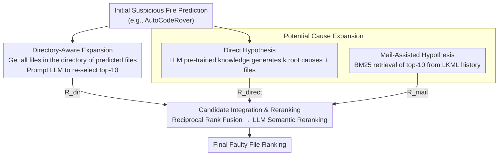

# Taming System Complexity: Demystifying Software Engineering Agents in Diagnosing Linux Kernel Faults

**Conference**: ACL2026  
**arXiv**: [2505.19489](https://arxiv.org/abs/2505.19489)  
**Code**: https://github.com/FudanSELab/LinuxFLBench  
**Area**: Software Engineering Agent / Code Intelligence  
**Keywords**: Fault Localization, Linux Kernel, LLM Agent, Code Localization, System Complexity

## TL;DR
By establishing LinuxFLBench, a large-scale Linux kernel fault localization benchmark, this study reveals the limitations of existing LLM Agents in complex systems and proposes the LinuxFL+ framework. Through two-dimensional expansion (directory-awareness and potential causes), LinuxFL+ significantly improves fault localization accuracy at a low cost.

## Background & Motivation

**Background**: Fault localization (FL) is a classic problem in software engineering, aiming to automatically identify defective code locations from bug reports and source code. Recently, large language model (LLM) driven Agents (such as SWE-Agent, AutoCodeRover, and Agentless) have achieved significant progress in general software systems, reaching approximately 70% accuracy on the SWE-bench benchmark, demonstrating the capability of Agents to autonomously explore codebases.

**Limitations of Prior Work**: However, the evaluation of these Agents focuses primarily on medium-sized general software projects (e.g., Python libraries), and their applicability to truly massive and complex systems like the Linux kernel remains unknown. The Linux kernel presents three unique challenges: (1) Immense code scale: Kernel v5.8 contains 69K files and 28M lines of code, over 30 times larger than the largest project in SWE-bench; (2) Restricted observability: Because the kernel runs in privileged mode with minimal overhead, user reports often lack detailed runtime information and debugging clues; (3) Multi-dimensional influencing factors: Hardware configurations, system loads, and timing factors can all trigger bugs, significantly expanding the reasoning space for diagnosis.

**Key Challenge**: While existing Agents perform excellently in general software, these advantages may not transfer to a highly challenging real-world system like the Linux kernel. A deep investigation into their actual performance in this domain and the identification of improvement directions are required.

**Goal**: First, to construct the first large-scale Linux kernel fault localization benchmark; second, to comprehensively evaluate the performance of existing top-tier LLM Agents on this task; third, to diagnose the primary reasons for failure and propose effective enhancement solutions.

**Key Insight**: Starting from an empirical study, the authors first reveal the actual deficiencies of Agents through extensive experimental data, subsequently designing targeted improvement strategies. Key observations include: Agents can usually identify relevant high-level modules accurately but struggle to pinpoint specific files within those modules; simultaneously, the exploration range of Agents is too narrow, focusing only on a few likely causes while missing many relevant root causes.

**Core Idea**: To compensate for Agent deficiencies through structured expansion across two dimensions—utilizing directory structures in the spatial dimension to expand the search range, and extending the potential cause pool in the knowledge dimension through direct hypotheses and mail-knowledge-assisted hypotheses. Finally, aggregate reranking is used to produce the final prediction.

## Method

### Overall Architecture

LinuxFL+ is a post-processing framework built upon the outputs of existing Agents. It addresses two blind spots observed in empirical studies: the ability to locate relevant modules but failing to select the correct file within them, and a narrow exploration scope. Given the initial suspicious file predictions from any LLM Agent (such as AutoCodeRover), the framework performs directory-aware expansion along the spatial dimension and potential cause expansion along the knowledge dimension. Candidate files generated from both paths are aggregated using Reciprocal Rank Fusion and then reranked by an LLM to output the final ranked list of faulty files. The entire process leverages the codebase directory structure and external knowledge, such as Linux mailing lists, to correct Agent blind spots.

### Key Designs

**1. Directory-Aware Expansion: Providing Agents a Second Chance within the Correct Directory**

LLM Agents often correctly hit relevant high-level directories (modules) but select the wrong file when the directory contains many files. The Linux kernel averages 16 files per directory (compared to 8 in SWE-bench), which magnifies the difficulty of precise localization. This design first collects the complete list of files in the directories of all initial predictions, then prompts the LLM to filter and rank the top-10 from this expanded candidate set. Essentially, this leverages directory boundaries—an explicit organizational form of the codebase—to define the search range, providing the model with detailed context to fine-tune results while keeping the "module-level hits" valid.

**2. Potential Cause Expansion: Systematically Spreading the Root Cause Space via Dual-Layer Hypotheses**

Real-world bug diagnosis is an iterative "guess-verify" process; relying solely on an Agent's initial intuition misses many relevant root causes. This design generates two layers of hypotheses: the first layer, **Direct Hypothesis**, uses only the LLM's pre-trained knowledge to prompt the model for $k$ possible bug causes, each with corresponding fix plans and involved files. The second layer, **Mail-Assisted Hypothesis**, introduces domain knowledge by using RAG to retrieve historical discussions from the Linux Kernel Mailing List (LKML). To prevent data leakage, only emails prior to the bug report are retrieved. The report is first distilled into keywords across four dimensions—behavior, cause, expected behavior, and solution—before using BM25 to retrieve the top-10 relevant emails to feed to the LLM. Direct hypotheses leverage general knowledge while mail hypotheses inject historical wisdom; they are complementary, showing significant improvements in scenarios where causes are dispersed across multiple modules, such as performance issues.

**3. Candidate Integration and Reranking: Fusing Three Evidence Streams via Reciprocal Rank Fusion**

The directory expansion, direct hypothesis, and mail hypothesis each offer a unique perspective and must be fused into a unified ranking. For each candidate file $f$, the ranks from the three paths are recorded: $R_{dir}(f)$, $R_{direct}(f)$, and $R_{mail}(f)$ (if a file does not appear, the rank is $\infty$). The aggregate score is calculated as the sum of reciprocals:

$$\text{score}(f) = \frac{1}{R_{dir}(f)} + \frac{1}{R_{direct}(f)} + \frac{1}{R_{mail}(f)}$$

A high rank in any single path results in a higher score, and files ranked high across multiple paths are prioritized further. After obtaining the initial ranking by descending score, the LLM is prompted to perform final semantic reranking based on the correspondence between file paths and the bug report's semantics. This classic rank fusion approach combines multi-source information concisely, while the final LLM reranking adds semantic awareness to avoid the rigidity of pure numerical aggregation.

## Key Experimental Results

### Main Results

The LinuxFLBench constructed in this paper contains 250 real Linux kernel bugs, covering 120 kernel versions and 66 different kernel sub-modules (e.g., drivers, networking, filesystems). Bug reports average 283 words, and the corresponding codebases average 28,808 files and 11.49 million lines of code, far exceeding SWE-bench (averaging 195 words, 3,010 files, and 438,000 lines).

Table 1 shows the performance comparison for file-level fault localization:

| Method | Recall@1 | Recall@5 | Recall@10 | MRR |
|------|----------|----------|-----------|-----|
| BM25 (IR Baseline) | 0.168 | 0.328 | 0.396 | 0.231 |
| BugLocator | 0.127 | 0.209 | 0.272 | 0.215 |
| BLUiR (Best traditional IR) | 0.228 | 0.317 | 0.404 | 0.321 |
| SWE-Agent | 0.416 | 0.552 | 0.584 | 0.476 |
| SWE-Agent + LinuxFL+ | **0.524** | **0.720** | **0.768** | **0.610** |
| AutoCodeRover | 0.388 | 0.496 | 0.496 | 0.435 |
| AutoCodeRover + LinuxFL+ | **0.500** | **0.712** | **0.744** | **0.589** |
| Agentless | 0.368 | 0.492 | 0.504 | 0.419 |
| Agentless + LinuxFL+ | **0.440** | **0.684** | **0.724** | **0.549** |

Key observations: (1) While existing Agents far outperform traditional IR methods, their performance on LinuxFLBench is significantly lower than on SWE-bench (Recall@1 drops by over 15%), revealing the true challenge of system complexity; (2) Even the best Agent (SWE-Agent) has a Recall@1 of only 41.6%, showing that Linux kernel FL remains a highly challenging task; (3) LinuxFL+ brings significant improvements to all three Agents, with SWE-Agent's Recall@1 increasing from 41.6% to 52.4% (+10.8%) and AutoCodeRover's from 38.8% to 50.0% (+11.2%).

### Ablation Study

Table 2 shows performance under different difficulty levels (distinguished by whether the bug report explicitly mentions filenames):

| Difficulty | Agentless Baseline | AutoCodeRover Baseline | SWE-Agent Baseline | LinuxFL+ Avg Gain |
|---------|---------------|-------------------|---|---|
| Easy (Clear file hints) | 0.605 | 0.623 | 0.664 | +0.105 |
| Hard (No file hints) | 0.273 | 0.287 | 0.341 | +0.127 |

The results indicate that LinuxFL+ is particularly adept at handling "Hard" cases (lacking explicit file clues), which is the target scenario for the expansion strategies. At the symptom level, LinuxFL+ shows the most significant improvement for bugs with vague symptoms (e.g., performance issues, where the baseline MRR is 0.165, which improves to 0.458, +177%), while improvements for clear symptoms (e.g., Watchdog errors) are noted even when the baseline is already high (0.833). Regarding cost, LinuxFL+ uses an additional 11.8K-15.3K tokens per task, costing approximately $0.04, only about 10% of the Agents' base cost.

## Highlights & Insights

- **First Large-Scale Kernel FL Benchmark**: Previous kernel-related benchmarks were either too small (e.g., Linux-3.16 only) or used unrealistic sources (e.g., fuzzer-detected crashes). LinuxFLBench covers 250 diverse bugs from real users across 120 versions and 66 components, serving as the first benchmark to truly reflect the difficulty of kernel fault localization.
- **Revealing the True Boundaries of Agent Capability**: Through empirical data, the study clearly demonstrates the limitations of general Agents in large complex systems—a performance drop of 15%+—and qualitatively analyzes two primary failure modes: confusion among related files and narrow exploration range. These insights are crucial for understanding where and how to effectively enhance Agents.
- **Low-Cost, High-Efficiency Enhancement Solution**: Compared to retraining Agents or fine-tuning models from scratch, LinuxFL+ serves as a post-processing framework that brings significant performance gains at minimal extra cost ($0.04/task). The introduction of mail-based knowledge specifically demonstrates a paradigm for effectively fusing domain-specific knowledge with general LLM capabilities.
- **Generality of Design**: Although designed for the Linux kernel, the ideas of directory-aware expansion and potential cause expansion are fully transferable to FL tasks in other large complex systems (e.g., operating systems, databases), offering potential beyond the scope of this paper.

## Limitations & Future Work

The authors acknowledge several main limitations:

- **Limitations in LLM Selection**: Although GPT-4o and Qwen3-32B were used, the focus remains on GPT-4o. The performance of other smaller or larger models, especially open-source ones, needs further exploration.
- **Coarse-Grained Utilization of Mail Data**: LKML content is rich but messy; the filtering strategies (e.g., avoiding external links, limiting modified file counts) remain heuristic. Future work could explore more refined email content extraction and matching methods.
- **Function-Level Localization Needs Improvement**: Results show function-level Recall@1 of only 0.089-0.138, far below file-level, indicating that while LinuxFL+ improves file-level localization, the challenge of fine-grained localization is not yet fully addressed and may require more detailed code understanding strategies.

**Specific Improvement Directions**:

- Explore advanced email retrieval strategies, such as structured email parsing and multi-hop reasoning, to extract more precise root cause knowledge.
- Customize specialized hypothesis generation strategies for different kernel components rather than using a global general strategy.
- Combine program analysis (e.g., data dependency, control flow) to enhance LLM-based reasoning.

## Related Work & Insights

- **vs. Traditional IR-based FL (BugLocator, BLUiR)**: Traditional methods rely on bag-of-words similarity and are limited in handling kernel-level concept drift and complex dependencies (MRR only 0.2-0.3). This study shows that the advantage of LLM Agents lies in symbolic and multi-hop reasoning, but also reveals that even Agents require external enhancement to handle ultra-large-scale systems.
- **vs. General Agents (SWE-Agent, AutoCodeRover, Agentless)**: These Agents perform well on SWE-bench (Python projects) but drop significantly on LinuxFLBench. This paper highlights the challenges brought by differences in software system scale, complexity, and observability, suggesting that future Agent design should be more domain-aware rather than one-size-fits-all.
- **vs. Other Code Localization Work (LocAgent, AgentFL)**: These works mainly focus on improving the Agent architecture itself. The enhancement framework of LinuxFL+ emphasizes structured post-processing based on Agent output, iterating improvements via knowledge fusion rather than retraining, providing a complementary research path.

## Rating

- **Novelty**: ⭐⭐⭐⭐ First systematic evaluation of LLM Agents on Linux kernel fault localization; benchmark construction and problem definition are clear. The two-dimensional expansion idea is relatively intuitive but effective and practical.
- **Experimental Thoroughness**: ⭐⭐⭐⭐⭐ A benchmark of 250 real bugs is substantial, evaluation of three mainstream Agents is comprehensive, ablation studies reveal component contributions, and fine-grained analysis (symptom, difficulty, cost) covers wide ground. Method-level FL evaluation, though weaker, strengthens multi-dimensional argumentation.
- **Writing Quality**: ⭐⭐⭐⭐ The article is clearly organized, with a natural logical progression. Qualitative analysis of failure modes is well-diagnosed. Some sections use formulaic phrasing.
- **Value**: ⭐⭐⭐⭐ Highly practical for industrial Linux kernel maintenance teams; the benchmark is significant for future research. The enhancement solution is low-cost and effective. However, limited by kernel specificity, generality is somewhat constrained; inspiration for fundamental Agent architecture changes is limited.

<!-- RELATED:START -->

## Related Papers

- [\[ACL 2026\] EET: Experience-Driven Early Termination for Cost-Efficient Software Engineering Agents](eet_experience-driven_early_termination_for_cost-efficient_software_engineering_.md)
- [\[ICLR 2026\] Ambig-SWE: Interactive Agents to Overcome Underspecificity in Software Engineering](../../ICLR2026/code_intelligence/ambig-swe_interactive_agents_to_overcome_underspecificity_in_software_engineerin.md)
- [\[ICML 2025\] Training Software Engineering Agents and Verifiers with SWE-Gym](../../ICML2025/code_intelligence/training_software_engineering_agents_and_verifiers_with_swe-gym.md)
- [\[ICLR 2026\] BOAD: Discovering Hierarchical Software Engineering Agents via Bandit Optimization](../../ICLR2026/code_intelligence/boad_discovering_hierarchical_software_engineering_agents_via_bandit_optimizatio.md)
- [\[NeurIPS 2025\] SWE-rebench: An Automated Pipeline for Task Collection and Decontaminated Evaluation of Software Engineering Agents](../../NeurIPS2025/code_intelligence/swe-rebench_an_automated_pipeline_for_task_collection_and_decontaminated_evaluat.md)

<!-- RELATED:END -->
