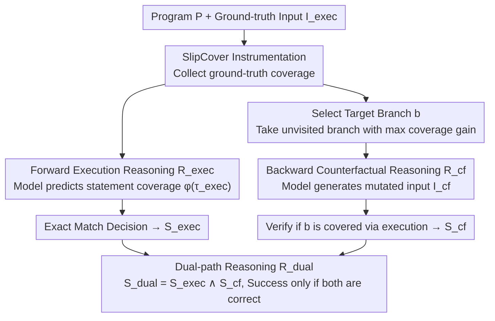

# The Path Not Taken: Duality in Reasoning about Program Execution

**Conference**: ACL 2026  
**arXiv**: [2604.20917](https://arxiv.org/abs/2604.20917)  
**Code**: [github.com/sail-ucf/dexbench](https://github.com/sail-ucf/dexbench)  
**Area**: Code Intelligence / Program Reasoning  
**Keywords**: Program Execution Reasoning, Counterfactual Reasoning, Dual-path Reasoning, Code Coverage, LLM Code Understanding

## TL;DR
This paper proposes the concept of duality in program execution reasoning. Through the DexBench benchmark (445 paired instances), it jointly evaluates LLMs' forward execution reasoning (predicting code coverage under a given input) and backward counterfactual reasoning (inferring input mutations that redirect execution flow to a target branch). It discovers that strong performance in a single direction does not translate to success under joint evaluation, revealing deficiencies in models' causal understanding of programs.

## Background & Motivation

**Background**: LLMs are widely adopted in software engineering tasks (code generation, testing, bug fixing, etc.), but their performance is inconsistent—they can solve complex programming problems yet fail on basic loop reasoning. This may stem from imitating surface patterns rather than truly understanding programs. Recent work has begun focusing on fine-grained reasoning ability assessments, such as code coverage prediction, input-output mapping, and intermediate state tracking.

**Limitations of Prior Work**: Existing program execution benchmarks only examine runtime behavior under a single test case (i.e., reasoning along one execution path), but a given program may traverse multiple paths based on different inputs. Evaluation with a single test case provides only a narrow perspective of a model's program understanding. Furthermore, benchmarks defined by fixed input-output pairs are susceptible to training data contamination (models might memorize the answers).

**Key Challenge**: Two paths of a program share an execution space, diverging only at a branch point due to differences in program state. Existing evaluations ignore the causal relationship between execution paths—only assessing whether a model can predict "which path was taken," but not "why that path was taken" or "how to take the other path."

**Goal**: Design a joint evaluation framework that simultaneously tests LLMs' forward execution reasoning and backward counterfactual reasoning capabilities to more robustly measure their causal understanding of program execution.

**Key Insight**: Two program paths share a common execution space and diverge only at branch conditions. The authors argue that understanding program execution requires simultaneously understanding "how the observed behavior occurs" and "under what conditions the execution would switch to the other path."

**Core Idea**: Define the duality of program execution reasoning—forward reasoning predicts the observable behavior of an execution path, while backward reasoning infers input mutations that redirect execution flow to a counterfactual path—the two jointly constitute dual-path reasoning $\mathcal{R}_{dual} = \mathcal{R}_{exec} \oplus \mathcal{R}_{cf}$.

## Method

### Overall Architecture

DexBench decomposes "understanding program execution" into two symmetrical questions and binds them together for evaluation using a shared context. Each instance provides a program $P$ and a ground-truth input $I_{exec}$: the forward question asks "which lines this input will execute," requiring the model to predict statement coverage; the backward question asks "how to modify this input to divert execution flow into a previously unvisited target branch," requiring the model to provide a mutated input $I_{cf}$. Both directions focus on the same program and the same branch point; success is defined only if both questions are answered correctly. The benchmark contains 445 paired instances, sampled from CruxEval (298 instances, simple control flow), HumanEval (100 instances, medium complexity), and PythonSaga (47 instances, deep nesting and recursion). Evaluation uses one-shot prompting and reports pass@k (k=1, 5).

### Key Designs

**1. Forward Execution Reasoning $\mathcal{R}_{exec}$: Let the model "run" code mentally**

Given a program $P$ and input $I_{exec}$, the model must predict the set of executed line numbers $\phi(\tau_{exec})$. The ground-truth is collected via actual instrumentation with the SlipCover tool. The success criterion is an exact match—at least one candidate answer must perfectly predict the coverage. Coverage prediction is chosen as the forward task because it forces the model to maintain a mental representation of the program state and update it according to the semantics of each statement, rather than guessing an answer based on surface patterns. Task difficulty increases with the length of the execution trajectory and the complexity of state transitions (non-trivial control flow, loop back-edges), effectively distinguishing models that "memorize patterns" from those that "truly execute."

**2. Backward Counterfactual Reasoning $\mathcal{R}_{cf}$: Infer how to modify input to take another path**

Given $P$, the original input $I_{exec}$, and a counterfactual target (covering a previously unvisited branch $b$), the model must generate a mutated input $I_{cf}$ such that $b \in \phi(\tau_{cf})$. Correctness is verified by the actual execution of the generated input. The target branch selected is the one with the maximum coverage increment, ensuring the counterfactual question is sufficiently challenging. This question differs fundamentally from coverage-guided fuzzing: fuzzing relies on luck through random mutation, whereas this requires the model to reason out "where a perturbation in the input will propagate in the intermediate program state to ultimately push control flow to the target branch." Thus, it directly probes causal understanding rather than search capability.

**3. Dual-path Reasoning $\mathcal{R}_{dual}$: Conjoin both questions to prevent single-direction fluke**

An instance is successful under dual-path reasoning if and only if both sides are answered correctly, i.e., $S_{dual} = S_{exec} \wedge S_{cf}$—predicting the original coverage correctly and generating at least one input that covers the target branch. This conjunctive constraint is the crux of the benchmark: experiments show many models perform well only in a single direction (able to predict coverage but not mutate input, or vice versa). If evaluated only in one direction as in previous benchmarks, a model's true understanding of the program would be systematically overestimated. Sharing the same execution context and then applying the conjunction is the design that locks in both layers of causality: "which path was taken" and "why and how to take the other."

## Key Experimental Results

### Main Results (Dual-path Reasoning pass@5, %)

| Model | CruxEval | HumanEval | PythonSaga |
|------|----------|-----------|------------|
| Llama-3.2-3B-Inst. | 0.0 | 0.0 | 0.0 |
| Qwen2.5-32B | 57.0 | 31.0 | 6.4 |
| QwQ-32B | 33.2 | 25.0 | 2.1 |
| Gemini 2.5 Flash | 73.8 | 62.0 | 8.5 |
| GPT-5 Mini | 91.6 | 76.0 | 44.7 |
| Claude Sonnet 4 | **95.3** | **79.0** | **70.2** |

### Ablation Study (Input Generation vs. Input Mutation, GPT-5 Mini)

| Setting | CruxEval pass@5 | HumanEval pass@5 | PythonSaga pass@5 |
|------|-----------------|-------------------|-------------------|
| Input Generation (No original input) | 97.7 | 99.0 | 95.7 |
| Input Mutation (Ours) | 97.0 | 88.0 | 95.7 |

### Key Findings
- **Single-direction success does not translate to joint success**: Many models perform well in either execution reasoning or counterfactual reasoning alone but drop significantly under dual-path evaluation, proving the incompleteness of single-path evaluation.
- **Reasoning post-training is ineffective**: Among open-source models, non-reasoning variants (Qwen2.5-32B, Mistral Small 24B) actually outperform their reasoning variants (QwQ-32B, Magistral Small) in dual-path reasoning, by an average of 63.9% and 47.9% respectively.
- **Scaling effects are non-monotonic**: Qwen2.5-32B consistently outperforms Qwen2.5-72B in dual-path reasoning; all models <10B show near-zero performance in execution reasoning but some performance in counterfactual reasoning.
- **Complexity impact is significant**: From CruxEval to PythonSaga, dual-path performance drops sharply (e.g., Gemini 2.5 Flash drops from 73.8% to 8.5%).
- **Input mutation is harder than input generation**: Models actually perform better when the original input is removed, because input mutation requires reasoning about how input perturbations propagate through intermediate program states.

## Highlights & Insights
- **Duality Framework**: Program execution reasoning naturally possesses a forward/backward dual structure; joint evaluation reflects true understanding better than separate evaluations. This concept can be extended to other reasoning tasks—such as "forward solving" and "backward problem construction" in mathematical reasoning.
- **Counterfactual Reasoning as a Causal Probe**: Unlike random fuzzing, requiring the model to identify necessary input changes through reasoning rather than trial-and-error directly tests causal understanding.
- **Counter-intuitive Findings on Reasoning Post-training**: Reasoning-specific post-training not only failed to improve program execution reasoning but caused degradation, suggesting that current reasoning enhancement strategies may be overly biased toward specific reasoning patterns.

## Limitations & Future Work
- Currently covers only the Python language; expansion to other languages requires building secure sandbox environments.
- Data is sourced from public benchmarks, posing a potential risk of data contamination (though the design of counterfactual reasoning partially mitigates this).
- The default selection of the target branch with the maximum coverage increment may be biased toward branches that are easier to reason about.
- Currently uses code coverage as the only observable behavior; future work could extend this to other execution attributes such as program output or intermediate states.

## Related Work & Insights
- **vs CruxEval**: CruxEval pairs output prediction with input prediction, but each direction is evaluated independently. DexBench jointly evaluates causal reasoning by sharing the execution context.
- **vs R-Eval (IC-Score)**: R-Eval combines an IC-Score from multiple execution tasks but remains a single-path evaluation. DexBench introduces the counterfactual dimension.
- **vs CES**: CES evaluates reasoning consistency across multiple inputs but processes each path independently, without exploring the causal logic that leads to path divergence.

## Rating
- Novelty: ⭐⭐⭐⭐⭐ The duality framework is a fresh perspective for evaluating program reasoning, elegantly designed.
- Experimental Thoroughness: ⭐⭐⭐⭐ 13 models, three levels of complexity, complete sensitivity analysis, though the data scale is relatively small (445 instances).
- Writing Quality: ⭐⭐⭐⭐⭐ Formal definitions are clear, and experimental analysis is in-depth.
- Value: ⭐⭐⭐⭐ Provides a more robust framework for evaluating code LLMs and reveals counter-intuitive phenomena in reasoning post-training.

<!-- RELATED:START -->

## Related Papers

- [\[NeurIPS 2025\] Once Upon an Input: Reasoning via Per-Instance Program Synthesis](../../NeurIPS2025/code_intelligence/once_upon_an_input_reasoning_via_per-instance_program_synthesis.md)
- [\[ICML 2026\] BoostAPR: Boosting Automated Program Repair via Execution-Grounded Reinforcement Learning with Dual Reward Models](../../ICML2026/code_intelligence/boostapr_boosting_automated_program_repair_via_execution-grounded_reinforcement_.md)
- [\[ACL 2026\] ReCode: Reinforcing Code Generation with Reasoning-Process Rewards](recode_reinforcing_code_generation_with_reasoning-process_rewards.md)
- [\[ICML 2025\] Reasoning Through Execution: Unifying Process and Outcome Rewards for Code Generation](../../ICML2025/code_intelligence/reasoning_through_execution_unifying_process_and_outcome_rewards_for_code_genera.md)
- [\[ACL 2026\] CodeRL+: Improving Code Generation via Reinforcement with Execution Semantics Alignment](coderl_improving_code_generation_via_reinforcement_with_execution_semantics_alig.md)

<!-- RELATED:END -->
