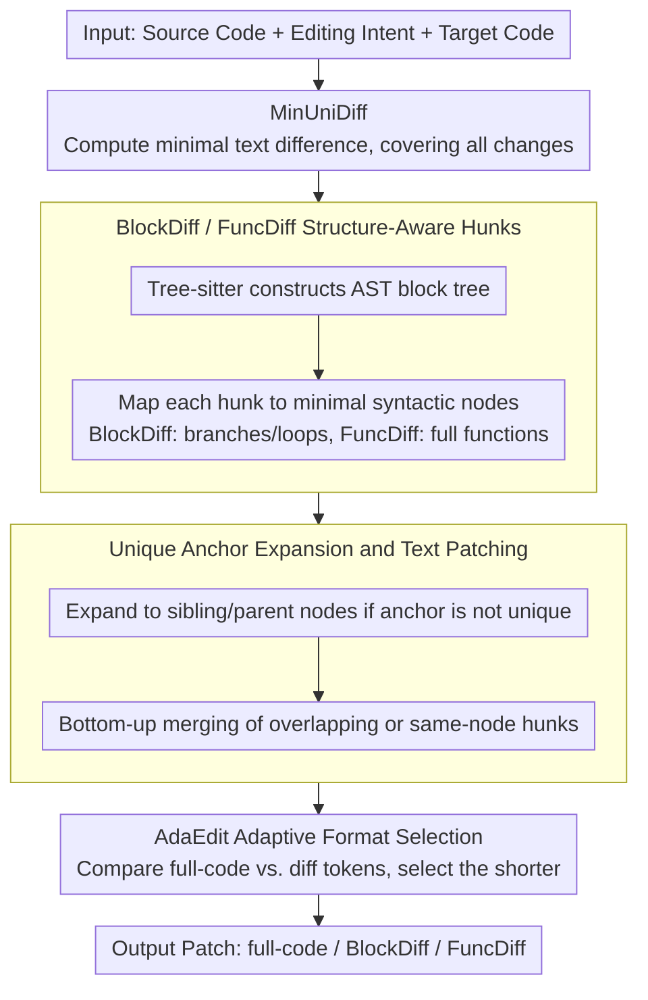

# To Diff or Not to Diff? Structure-Aware and Adaptive Output Formats for Efficient LLM-based Code Editing

**Conference**: ACL2026 Findings  
**arXiv**: [2604.27296](https://arxiv.org/abs/2604.27296)  
**Code**: https://github.com/nju-websoft/AdaEdit  
**Area**: Code Intelligence / LLM Code Editing / Edit Format Learning  
**Keywords**: Code editing, structural diff, AdaEdit, AST, low-latency generation

## TL;DR
This paper treats the "output format" of LLM code editing as a training objective. It proposes BlockDiff, FuncDiff, and an adaptive format selection strategy, AdaEdit. The approach achieves accuracy close to full-code generation while reducing latency and output token costs by over 30% in long-code editing scenarios.

## Background & Motivation
**Background**: LLM code editing has become a fundamental capability in IDEs, code assistants, and automated repair systems. Mainstream training and evaluation typically require models to output the full modified code based on editing intent or generate patch formats like unified diff / search-replace via strong model prompting.

**Limitations of Prior Work**: Full-code generation is natural for models since pre-training data consists mostly of full code, but it is inefficient: even for a single-line change, the entire file must be re-output, leading to latency, API costs, and risks of unintended changes. Traditional diffs save tokens but are unnatural for LLMs: formats with line numbers require precise offsets, while content-addressed diffs fragment code into hunks that break syntactic structures.

**Key Challenge**: Code editing must satisfy two goals simultaneously: outputs should be as short as possible for low latency and cost, yet sufficiently natural and patchable to ensure functional correctness. Full-code is natural but redundant; line-level diff is efficient but fragile. A single format struggle to cover all editing scales.

**Goal**: The authors aim to answer a fundamental question: What output representation should LLM-based code editing use? If diff formats are to be learned by models, what code structures should they preserve? Can models automatically switch formats if a diff becomes longer than the full code?

**Key Insight**: The paper systematically compares conventional diffs and proves that line-number offsets and fragmented hunks are major sources of failure. It uses AST to extend text diffs to syntactically complete blocks or functions. Finally, it allows the model to learn to choose the representation with fewer tokens between diff and full-code via SFT.

**Core Idea**: Elevate local text modifications to syntax-block-level rewrites and use AdaEdit to let the model choose "structural diff or full-code" per sample, rather than fixing a single editing format.

## Method
The method consists of two layers. The first is structure-aware diff formats: BlockDiff and FuncDiff. These remain text search/replace patches, but the hunk anchors and rewrite content are no longer arbitrary line fragments but syntactic blocks in the AST. The second layer is AdaEdit, which modifies the training labels rather than inventing new patch syntax: for each sample, it compares the token lengths of the full target code and its diff representation, using the shorter one as the training target to internalize format selection logic.

### Overall Architecture
Given the source code, editing intent, and target code, the system first computes the minimal text difference, MinUniDiff, to ensure all text changes are covered. It then constructs an AST block tree using tree-sitter to map each diff hunk to the smallest syntactic node or set of continuous nodes. Subsequently, anchor expansion ensures the segment to be replaced is uniquely locatable in the source code. Overlapping hunks or multiple modifications within the same fine-grained node are processed via bottom-up merging. During training, the model receives the intent and source code as input, and the output can be full-code, BlockDiff, FuncDiff, or a mixed format selected by AdaEdit.

### Key Designs

**1. BlockDiff / FuncDiff Structure-Aware Hunks: Making code blocks the unit of diff rather than arbitrary fragments**

Traditional content diffs slice code into arbitrary line fragments, forcing models to generate hunks that lack proper headers or footers. However, LLMs excel at generating complete, syntactically coherent code blocks—the most common pattern in pre-training. Structural formats eliminate this mismatch: BlockDiff allows editing at fine-grained AST nodes (branches, loops, context blocks, functions), while FuncDiff focuses on function-level rewrites, ignoring internal control structures. Both follow a "locate a unique anchor, then replace structural content" format. Compared to line-level diffs, structural hunks sacrifice some minimality for outputs that better fit LLM generation distributions and offer higher patch usability.

**2. Unique Anchor Expansion and Text Patching: Ensuring structural diffs can be unambiguously applied**

No matter how elegant a structural diff is, it fails if the anchor is not unique in the source code during patching. The authors use a bottom-up expansion strategy to guarantee uniqueness: each hunk is first mapped to the smallest AST node. If the node's text is not unique in the source, it merges with adjacent sibling nodes. If still not unique, it probes the parent node, eventually defaulting to the whole file as the anchor. Modifications falling into the same node or overlapping are resolved via bottom-up merging. AST is only used during format generation; patching remains text-based search/replace with fault tolerance for whitespace, allowing it to handle comments and code with syntax errors.

**3. AdaEdit Adaptive Format Selection: Let the model automatically pick the most token-efficient representation**

Diffs are not always shorter. Scattered or extensive changes can make multiple anchors and hunks more expensive than full-code. AdaEdit changes the supervision target of the training data. For each training sample with source code $C_j$ and target code $C'_j$, it calculates the tokens for full-code and diff representations, selecting the minimum as the label:

$$E_j = \arg\min\big(|C'_j|,\ |\mathrm{Diff}(C_j, C'_j)|\big)$$

This allows the model to internalize format decisions into the generation distribution without needing extra classification heads or specific format-selection prefixes. AdaEdit effectively pushes the routing logic into the data labels.

### Loss & Training
The training objective is standard token-level cross-entropy. Main experiments utilize OCEData for Python editing training, evaluated on EditEval, CanItEdit, HumanEvalFix, Aider-1, and Aider-2. Models include DeepSeek-Coder-6.7B, Qwen2.5-Coder-7B, and Qwen2.5-Coder-14B. All models undergo full-parameter SFT from base versions to isolate the effect of "output format." Performance is evaluated via pass@1, patch-apply success rates, and linter checks; efficiency is measured by time-to-first-render, total output tokens, and latency.

## Key Experimental Results

### Main Results
The main table compares full-code, traditional ContentDiff, structural BlockDiff/FuncDiff, and versions with AdaEdit.

| Base Model | FullCode | ContentDiff | BlockDiff | BlockDiff + AdaEdit | FuncDiff | FuncDiff + AdaEdit | Main Conclusion |
|----------|----------|-------------|-----------|---------------------|----------|--------------------|----------|
| DeepSeek-Coder-6.7B | 52.21 | 48.92 | 50.64 | 52.16 | 50.79 | 52.55 | AdaEdit reaches or exceeds FullCode |
| Qwen2.5-Coder-7B | 57.07 | 54.43 | 55.98 | 57.61 | 57.32 | 57.95 | FuncDiff + AdaEdit is best |
| Qwen2.5-Coder-14B | 63.89 | 62.16 | 64.11 | 63.92 | 64.89 | 64.68 | Stronger models utilize structural diff better |

The problem with traditional diff is evident: On Qwen2.5-Coder-7B, MinUniDiff yields only a 14.07 average pass@1; even with line numbers, it reaches only 37.66. ContentDiff improves to 54.43 but remains below FullCode at 57.07. This indicates that "removing line numbers" is only the first step; preserving syntactic structure is key.

### Ablation Study
AdaEdit is analyzed based on long-code efficiency, format selection accuracy, and cross-lingual generalization.

| Setting | Pass@1 | Output Cost (Tokens) | Description |
|------|--------|-----------------|------|
| FullCode, CanItEdit >300 tokens | 39.75 | 648.30 | Accurate but redundant |
| ContentDiff | 33.75 | 612.85 | Low savings, low accuracy |
| ContentDiff + AdaEdit | 33.00 | 432.73 | Cost reduced, accuracy remains low |
| BlockDiff | 38.69 | 570.26 | Closer to FullCode |
| BlockDiff + AdaEdit | 37.94 | 466.04 | Significant cost reduction |
| FuncDiff | 40.75 | 546.77 | Accuracy exceeds FullCode |
| FuncDiff + AdaEdit | 40.69 | 481.63 | Accuracy maintained, cost reduced ~25.7% |

JavaScript cross-lingual experiments support the generalization of structural formats.

| Format | HumanEvalFix-JavaScript pass@1 | Conclusion |
|------|---------------------------------|------|
| Base model | 63.48 | Not fine-tuned for editing |
| FullCode | 66.13 | Strong baseline |
| ContentDiff | 56.55 | Traditional diff degrades significantly |
| ContentDiff + AdaEdit | 64.97 | AdaEdit alleviates, but not enough |
| BlockDiff + AdaEdit | 65.70 | Close to FullCode |
| FuncDiff + AdaEdit | 67.74 | Exceeds FullCode |

### Key Findings
- The advantage of structural diff becomes more pronounced as model capability increases. On Qwen2.5-Coder-14B, FuncDiff (64.89) exceeds FullCode (63.89), suggesting stronger models better understand structural formats.
- AdaEdit's format selection accuracy exceeds 90%; if allowed a 20% token margin, accuracy exceeds 95%. Few-shot prompting of strong models does not naturally grant this cost-benefit judgment; training is necessary.
- For long code, FullCode output tokens grow linearly with file length. FuncDiff has anchor overhead for short code but becomes efficient for longer files; AdaEdit automatically selects the lower-cost format across scales.
- Usability analysis shows ContentDiff is prone to patch failures due to non-unique anchors. While formats with line numbers seem to have higher patch success, linter checks reveal they cause more structural breakage.

## Highlights & Insights
- The core value of this paper is not just another benchmark, but elevating "output format" to a first-class design component in model training. Many works treat full-code or diff as implementation details; this work proves format directly impacts accuracy, latency, and cost.
- The trade-off between BlockDiff and FuncDiff is clear: BlockDiff is finer and potentially more saving, while FuncDiff is coarser, more natural, and more stable. In experiments, FuncDiff often shows higher accuracy, suggesting "writing a bit more context" is more efficient for LLMs than extreme localization.
- AdaEdit internalizes inference-time routing into data labels. It requires no classification heads or prefix headers, as format selection becomes part of the generative distribution.
- Insights for IDE products: User experience is determined by latency, patch success rate, and unintended modifications. Structural diff provides a middle ground that is more controllable than full-code and more natural than traditional diff.

## Limitations & Future Work
- Structural diff performance depends on the base model's capability. Weaker models might not exceed FullCode accuracy when using BlockDiff/FuncDiff.
- Training data is primarily Python-based. While JavaScript experiments were added, repository-level editing, cross-file changes, and large-scale refactors are not yet fully covered.
- Any diff-based method carries risks of patch failure. While unique anchors and linter checks alleviate this, a real IDE still requires test runners and rollback mechanisms.
- AdaEdit currently uses SFT to learn from token length labels. Future work could combine functional correctness, test results, and token costs into a verifiable reward for RL exploration.

## Related Work & Insights
- **vs. FullCode generation**: FullCode is most consistent with the pre-training distribution and is accurate but highly redundant. This work's structural diff maintains enough syntax while avoiding full-file rewrites.
- **vs. UniDiff / MinUniDiff**: Traditional unified diff depends on line numbers and offsets, which LLMs struggle to generate stably. Experimental results show that even with line numbers in the source, accuracy is lower than full-code.
- **vs. ContentDiff / search-replace**: Content-addressed diff removes line-number fragility, but hunks remain arbitrary fragments. BlockDiff/FuncDiff use AST nodes to solve the unnaturalness and non-unique anchor issues.
- **vs. AST edit scripts**: Tools like GumTree are suitable for program analysis but output operation sequences or DSLs that are not ideal for token-by-token generation and often ignore whitespace/comments. This work maintains text patching, making it better for precise text-level reconstruction.

## Rating
- Novelty: ⭐⭐⭐⭐⭐ Systematizes code editing format as a trainable design; practical proposal of structural diff + adaptive selection.
- Experimental Thoroughness: ⭐⭐⭐⭐☆ Covers multiple models, benchmarks, long code, usability, and JavaScript; needs more on repository-level editing.
- Writing Quality: ⭐⭐⭐⭐☆ Clear logic, diagnostic approach to conventional diffs followed by proposed solutions, data-backed arguments.
- Value: ⭐⭐⭐⭐⭐ High engineering value for code assistants and low-latency IDE patch generation; serves as a reference for training code editing models.

<!-- RELATED:START -->

## Related Papers

- [\[ACL 2026\] Learning Adaptive Parallel Execution for Efficient Code Localization](learning_adaptive_parallel_execution_for_efficient_code_localization.md)
- [\[ACL 2026\] DUET: Dual Execution for Test Output Prediction with Generated Code and Pseudocode](duet_dual_execution_for_test_output_prediction_with_generated_code_and_pseudocod.md)
- [\[ACL 2025\] CoRet: Improved Retriever for Code Editing](../../ACL2025/code_intelligence/coret_improved_retriever_for_code_editing.md)
- [\[ACL 2026\] The Path Not Taken: Duality in Reasoning about Program Execution](the_path_not_taken_duality_in_reasoning_about_program_execution.md)
- [\[ACL 2026\] PaT: Planning-after-Trial for Efficient Test-Time Code Generation](pat_planning-after-trial_for_efficient_test-time_code_generation.md)

<!-- RELATED:END -->
