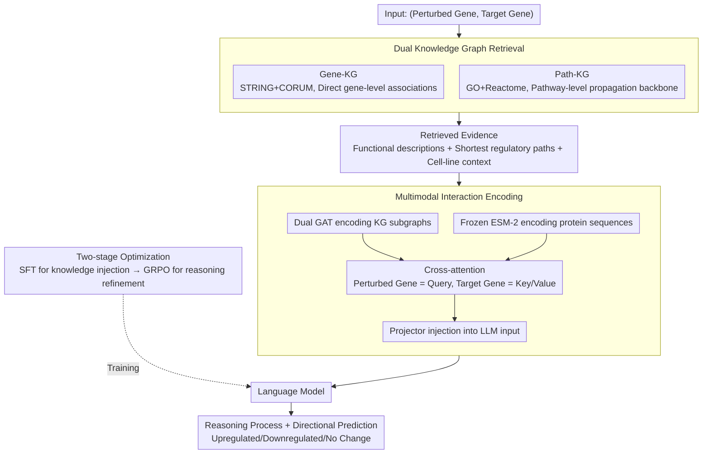

# AROMA: Augmented Reasoning Over a Multimodal Architecture for Virtual Cell Genetic Perturbation Modeling

**Conference**: ACL 2026 Findings  
**arXiv**: [2604.20263](https://arxiv.org/abs/2604.20263)  
**Code**: [github](https://github.com/blazerye/AROMA)  
**Area**: Medical Imaging / Bioinformatics  
**Keywords**: Virtual cell modeling, genetic perturbation prediction, multimodal fusion, knowledge graph, reinforcement learning reasoning

## TL;DR

The AROMA framework is proposed, which integrates text evidence, knowledge graph topology, and protein sequence features in a multimodal architecture. Combined with a two-stage training strategy (SFT + GRPO), it achieves interpretable and precise genetic perturbation effect prediction.

## Background & Motivation

**Background**: Virtual cell modeling aims to predict molecular state changes after genetic perturbations, which is crucial for biological mechanism research. Existing methods include general LLMs, domain-fine-tuned language models, cell foundation models, and retrieval-augmented methods.

**Limitations of Prior Work**: (1) General LLMs lack biological constraints, making free-form reasoning unreliable; (2) Existing foundation models only output labels or differential expression scores, lacking human-interpretable reasoning processes; (3) Retrieval signals in RAG methods are weakly aligned with regulatory topology and fail to model regulatory directionality and multi-step propagation.

**Key Challenge**: Genetic perturbation effects are highly context-dependent and propagate through multi-step regulatory cascades. Simple text similarity retrieval cannot capture mechanistic paths from perturbed genes to target genes.

**Goal**: Construct a genetic perturbation prediction framework that provides both accurate predictions and interpretable reasoning.

**Key Insight**: Anchor perturbation prediction on structured, query-specific biological evidence to explicitly model the dependencies between perturbed and target genes.

**Core Idea**: Combine knowledge graph retrieval (providing topological evidence), graph neural network encoders (structural representation), and protein sequence encoders (molecular representation). Model perturbed-target relationships through cross-modal interactive attention and optimize prediction and reasoning quality using two-stage training.

## Method

### Overall Architecture

The mechanism of AROMA is to transform the task of "predicting target gene changes upon perturbation" from simple text matching into reasoning anchored on structured biological evidence. The pipeline involves: inputting a (perturbed gene, target gene) pair; retrieving gene functional descriptions, shortest regulatory paths, and cell-line context from two knowledge graphs; feeding KG topology, protein sequence features, and text into a language model via a multimodal encoder; and finally, having the language model output a readable reasoning process and a directional prediction (upregulated/downregulated/no change). Training is conducted in two stages: large-scale supervised fine-tuning (SFT) to inject domain knowledge, followed by GRPO reinforcement learning to refine reasoning quality.

### Key Designs

**1. Dual Knowledge Graph Retrieval: Capturing "Perturbation Propagation" with Complementary Structures**

As text similarity retrieval alone fails to capture mechanistic pathways between genes, AROMA constructs two complementary graphs: Gene-KG integrates STRING and CORUM (18k nodes, 700k edges) to characterize direct gene associations; Path-KG integrates GO and Reactome (80k nodes, 400k edges) to encode high-level biological process structures. During retrieval, functional descriptions, the shortest regulatory paths (up to 3) calculated via BFS, and cell-line descriptions are extracted. This hierarchy ensures evidence includes both direct links and propagation backbones.

**2. Multimodal Interaction Encoding: Explicitly Modeling Perturbed-Target Relationships with Perturbed Gene as Query**

To capture structural and molecular signals, AROMA uses two pre-trained GAT encoders for Gene-KG and Path-KG subgraphs and a frozen ESM-2 for protein sequences. Cross-attention is performed for each modality, using the perturbed gene as the Query and the target gene as the Key/Value. A lightweight projector then injects the fused representation into the LLM. This asymmetric design intuitively reflects the biological directionality where the perturbation drives the change in the target.

**3. Two-stage Optimization (SFT + GRPO): Knowledge Injection Followed by Reasoning Refinement**

The first stage performs multimodal SFT on PerturbReason (498k+ samples) by freezing the GNN and ESM-2 while using LoRA on the LLM to inject domain knowledge. The second stage utilizes GRPO reinforcement learning, sampling multiple reasoning trajectories for each instance and calculating advantages based on task-level feedback. While SFT teaches the model to imitate correct answers, GRPO uses prediction accuracy as a reward signal to eliminate inconsistencies and drift in the reasoning process.

### Loss & Training

The SFT stage uses standard autoregressive language modeling loss. During the GRPO stage, multiple trajectories are sampled for each instance. The reward consists of three parts: prediction correctness (Correct $+5.0$ / Incorrect $-1.0$), reasoning format compliance ($+0.5$), and answer category uniqueness ($+0.5$). Advantages are computed via group normalization for policy updates.

## Key Experimental Results

### Main Results

| Method | K562 Avg | HepG2 Avg | Jurkat Avg | RPE1 Avg | Total Avg F1 |
|------|---------|---------|---------|---------|----------|
| DeepSeek-R1 | 0.32 | 0.34 | 0.33 | 0.31 | 0.33 |
| SUMMER | 0.58 | 0.67 | 0.65 | 0.67 | 0.64 |
| GAT | 0.59 | 0.67 | 0.63 | 0.65 | 0.64 |
| AROMA | **0.66** | **0.76** | **0.75** | **0.77** | **0.73** |

### Ablation Study

| Configuration | Avg F1 | Note |
|------|---------|------|
| Vanilla Qwen3-8B | 0.26 | Lacks domain knowledge |
| + SFT | 0.65 | Knowledge injection is critical |
| + SFT + GRPO | 0.68 | RL improves reasoning |
| + RAG | 0.71 | Supplementary retrieval evidence |
| Full Module (AROMA) | 0.73 | Synergistic gains from all components |

### Key Findings
- AROMA consistently outperforms all baseline methods across all 4 cell lines, achieving an average F1 of 0.73, which is 9 percentage points higher than the strongest baseline, SUMMER.
- Zero-shot generalization (RPE1) shows only a slight performance drop (0.77 → 0.73), demonstrating strong cross-distribution generalization capacity.
- Performance degradation on genes with low popularity and low connectivity is significantly smaller compared to variants without retrieval and multimodal modules, indicating that gains stem from joint modeling rather than memorizing frequent genes.
- Performance improves steadily as the number of GRPO sampled trajectories increases from 4 to 16.

## Highlights & Insights
- Systematically integrates knowledge graph topology, protein sequences, and text evidence for the first time in genetic perturbation prediction.
- The dual knowledge graph design is exemplary: Gene-KG provides local associations while Path-KG provides global pathway structures.
- The cross-attention mechanism using the perturbed gene as Query and the target gene as Key/Value offers a clear biological intuition.
- The construction of the PerturbReason dataset (498k samples) represents a significant community resource contribution.

## Limitations & Future Work
- Currently only supports single-gene perturbations and cannot handle multi-gene combinations or chemical interventions.
- Each inference iteration predicts the expression change of only a single target gene, rather than multiple downstream genes simultaneously.
- Dependence on knowledge graphs and external text resources suggests that prediction performance for poorly annotated genes may degrade.
- Future work could extend the framework to combinatorial perturbations and chemical intervention scenarios.

## Related Work & Insights
- **vs SUMMER**: While SUMMER uses text similarity retrieval, AROMA introduces topological structure and protein sequence modeling to characterize perturbed-target interactions.
- **vs GEARS**: GEARS injects graph structure priors but lacks interpretable reasoning; AROMA provides both predictions and reasoning paths.
- **vs SynthPert/rBio-1**: These rely on synthetic reasoning trajectories for training, which may inherit supervisory noise; AROMA optimizes directly from task feedback via GRPO.

## Rating
- Novelty: ⭐⭐⭐⭐ Multimodal fusion strategy is clear; dual KG and interaction encoding are well-designed.
- Experimental Thoroughness: ⭐⭐⭐⭐⭐ Comprehensive analysis across multiple cell lines, zero-shot scenarios, ablations, and robustness.
- Writing Quality: ⭐⭐⭐⭐ Clear structure with high-quality illustrations.
- Value: ⭐⭐⭐⭐ Significant advancement for virtual cell modeling with high resource contribution value.

<!-- RELATED:START -->

## Related Papers

- [\[ICLR 2026\] Retrieval-Augmented Generation for Predicting Cellular Responses to Gene Perturbation](../../ICLR2026/computational_biology/retrieval-augmented_generation_for_predicting_cellular_responses_to_gene_perturb.md)
- [\[ICLR 2026\] Adaptive Data-Knowledge Alignment in Genetic Perturbation Prediction](../../ICLR2026/computational_biology/adaptive_data-knowledge_alignment_in_genetic_perturbation_prediction.md)
- [\[ICLR 2026\] VCWorld: A Biological World Model for Virtual Cell Simulation](../../ICLR2026/computational_biology/vcworld_a_biological_world_model_for_virtual_cell_simulation.md)
- [\[ICML 2026\] What Makes a Representation Good for Single-Cell Perturbation Prediction?](../../ICML2026/computational_biology/what_makes_a_representation_good_for_single-cell_perturbation_prediction.md)
- [\[ICLR 2026\] scDFM: Distributional Flow Matching for Robust Single-Cell Perturbation Prediction](../../ICLR2026/computational_biology/scdfm_distributional_flow_matching_model_for_robust_single-cell_perturbation_pre.md)

<!-- RELATED:END -->
