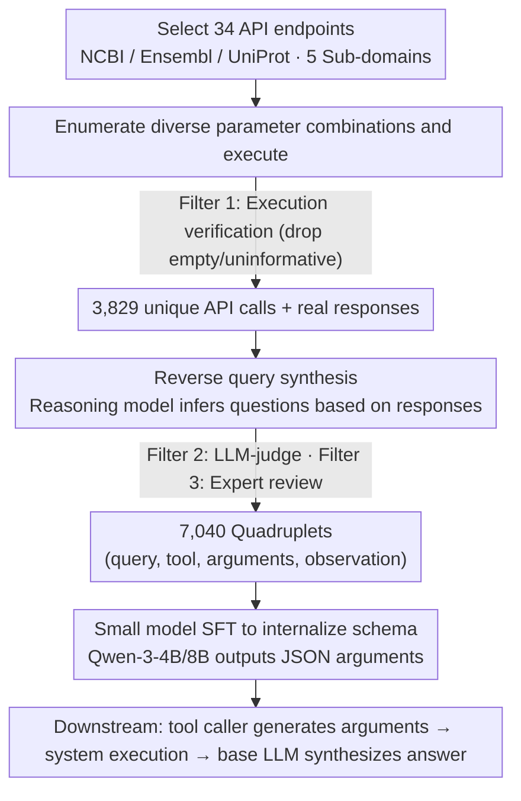

# BioTool: A Comprehensive Tool-Calling Dataset for Enhancing Biomedical Capabilities of Large Language Models

**Conference**: ACL 2026  
**arXiv**: [2605.05758](https://arxiv.org/abs/2605.05758)  
**Code**: https://github.com/gxx27/BioTool  
**Area**: Computational Biology  
**Keywords**: Biomedical tool calling, NCBI/Ensembl/UniProt, instruction fine-tuning, small models surpassing commercial LLMs

## TL;DR
BioTool constructs an instruction fine-tuning dataset consisting of 7,040 human-verified "query–API call" pairs covering 34 commonly used tools from the NCBI, Ensembl, and UniProt databases. After fine-tuning 4B-scale open-source LLMs with this data, the tool-calling quality exceeds commercial models such as GPT-5.1, Gemini-3 Pro, and Claude-4.5-Sonnet by more than 15%.

## Background & Motivation

**Background**: In general domains, mature tool-calling datasets and fine-tuning pipelines such as Toolformer, Gorilla, ToolBench, and APIGen have been established. However, in the biomedical field, the mainstream approach remains focused on agents based on in-context learning (ICL), such as GeneGPT, ChemCrow, and Biomni, which insert tool documentation into prompts for the model to learn on the fly.

**Limitations of Prior Work**: The in-context approach faces three bottlenecks: (1) it is limited by context length, restricting the number of tools (e.g., GeneGPT only covers a small subset of NCBI APIs); (2) the parameter schemas of biomedical APIs are extremely complex, and a few lines of prompt description cannot cover all invocation scenarios; (3) mapping natural language questions to professional schemas, identifiers, and parameter specifications is significantly more difficult than for general tools, leading to severe hallucination.

**Key Challenge**: No matter how large general tool-calling datasets are, the biomedical tools included are a "drop in the ocean." They cannot enable LLMs to provide executable calls in scenarios requiring strict schemas, such as BLAST, Variation API, or UniProt sequence queries. To make LLMs true assistants for biomedical researchers, a "database-native" high-quality tool-calling corpus is essential.

**Goal**: (1) Systematically select high-frequency tools from three authoritative biomedical databases; (2) automatically synthesize "query–API call" pairs in batches while ensuring semantic validity; (3) fine-tune small-to-medium open-source LLMs using this data to achieve tool-calling capabilities that match or exceed top-tier closed-source models.

**Key Insight**: The authors employ a reverse data construction approach—first enumerating diverse API parameter combinations from tool documentation and executing them; then using "real, usable API responses" as seeds, a reasoning model is used to infer a user query that can be answered by that response; finally, LLM judges and human experts perform verification. This "answer-first, question-later" paradigm naturally avoids the labeling noise of mismatched queries and APIs.

**Core Idea**: By replacing the traditional "human-written query → human-labeled API" paradigm with "response-grounded reverse query synthesis + multi-round LLM/human filtering," the scale and quality of biomedical tool-calling corpora are simultaneously enhanced. This allows a 4B model to surpass closed-source models with 200× the parameters in specialized schema tasks.

## Method

### Overall Architecture

The core of BioTool is not the model itself but a "response-grounded" data construction pipeline designed to produce a database-native, schema-strict biomedical tool-calling corpus. The pipeline consists of four steps: first, 34 high-frequency API endpoints are manually selected from NCBI, Ensembl, and UniProt, covering five sub-domains: variation, genomics, proteomics, evolution, and general biology. Second, official documentation for each tool is fed to an LLM to enumerate diverse parameter combinations for actual execution; samples with empty or uninformative returns are discarded, resulting in 3,829 unique API calls. Third, a reasoning model is provided with the "API call + real response" to infer a natural language query that is supported by the response. Finally, after LLM-judge filtering and human review by biological experts, 7,040 quadruplets (query, tool info, API arguments, observation) are retained. For downstream use, the task is decoupled into a tool caller and an answer generator—the fine-tuned small model is responsible only for generating API arguments, the system executes the call to obtain an observation, and a base LLM integrates the observation into the final answer.

### Key Designs

**1. Response-grounded reverse query synthesis: Anchoring usable responses before inferring questions**

Traditional methods involve humans writing a query first and then labeling the corresponding API, which often leads to mismatching noise where the API response cannot actually answer the query. BioTool reverses this: it first randomly generates diverse API parameter combinations, executes them, filters for those providing useful information (API call, response), and then uses the real response as an anchor for a reasoning model to draft the most logical user question. Since the response already embeds "answerability" into the data, the query is necessarily supported by the API, eliminating alignment noise at the source. This paradigm works because creating biomedical queries from scratch requires extensive domain knowledge and is prone to hallucination, whereas writing questions based on real responses is easier to control for quality.

**2. Three-layer filtering funnel: Execution verification + LLM-judge + Expert review**

To ensure the 7,040 data points meet standards in biological correctness, API schema compliance, and query-response alignment, BioTool employs three funnels: the first is execution verification, ensuring APIs return non-empty responses; the second is an LLM-judge evaluating whether the response sufficiently supports the query; and the third is manual review by biological experts focusing on biological relevance and accuracy, such as verifying if gene IDs match species and variation coordinates are valid. Purely LLM-synthesized data contains significant noise in specialized fields; without human oversight, models might learn incorrect schemas. Thus, the high proportion of human verification acts as a quality guarantee.

**3. Small model SFT internalizing schema vs. Large model ICL: Embedding domain knowledge into weights**

The authors fed the BioTool training set to small models like Qwen-3-4B / 8B for SFT, allowing them to internalize the parameter specifications of the 34 tools into their weights rather than reading them temporarily from a prompt. The inference then directly outputs API arguments in JSON format. The underlying judgment is that the bottleneck for in-context large models in professional schema tasks is specialization rather than intelligence. Once domain knowledge is hardcoded into the weights, a 4B model can surpass a general closed-source model with 200× the parameters by over 15% in tool-calling quality. This represents a typical victory of specialization over generalization.

### Loss & Training

Standard SFT cross-entropy is used, with the training target being the JSON string of (tool name, API arguments). Observations do not participate in the training loss; they are only used as fields filled by system execution during inference.

## Key Experimental Results

### Main Results: Comparison of Tool-Calling Quality

| Model | Parameters | Training Method | API-calling Quality | Notes |
|------|-----------|-----------------|---------------------|-------|
| GPT-5.1 (Closed) | Undisclosed | ICL | Baseline | Top-tier general LLM |
| Gemini-3 Pro | Undisclosed | ICL | Near GPT-5.1 | |
| Claude-4.5-Sonnet | Undisclosed | ICL | Strongest baseline | |
| Qwen-3-4B + BioTool SFT | 4B | SFT | **+15.0%** vs Claude-4.5 | Best performance |
| Qwen-3-8B + BioTool SFT | 8B | SFT | Further improvement | |

### Downstream QA Quality Assessment (Human Biologist Scoring)

| Configuration | Normalized answer quality gain vs. vanilla GPT-5.1 | Description |
|---------------|---------------------------------------------------|-------------|
| GPT-5.1 (No tools) | 0% (Baseline) | Direct answer, prone to hallucination |
| GPT-5.1 + Oracle BioTool API call | +**88.4%** | Upper bound: API call provided by ground truth |
| GPT-5.1 + BioTool-fine-tuned tool caller | +**69%** | Practical application: 4B SFT model as caller |
| GPT-5.1 + ICL tool calling | Significantly lower than both above | Traditional approach |

Test set scale: 1,048 test queries, with head-to-head preference evaluation by biological experts.

### Key Findings
- **Specialized Data Trumps General Scale**: A 4B model defeating closed-source models with 200× parameters in tool-calling tasks suggests that the marginal returns of the in-context approach for professional schema tasks have peaked. Weight-level internalization is the necessary next step.
- **Oracle (88.4%) vs. Empirical (69%) Gap**: A gap of approximately 20 percentage points indicates room for improvement for the BioTool fine-tuned caller, though it already captures roughly 78% of the potential tool-calling benefits.
- **Value of Coverage Breadth**: The 34 tools span five sub-domains (variation, genomics, proteomics, evolution, general), enabling the handling of interdisciplinary queries (e.g., complex questions requiring both NCBI gene and UniProt protein data).

## Highlights & Insights
- **Reverse Construction Paradigm**: The design of starting with a "correct API response" and having the LLM infer the query fundamentally eliminates the primary noise source in traditional tool-use datasets—mismatches between queries and ground-truth API calls. This is highly transferable to other vertical domains (e.g., finance, GIS, e-commerce APIs).
- **Victory of the Small Model Specialization Route**: This confirms that "optimizing a 4B model on a specific schema is better than pursuing a 200B general model"—a crucial directional signal for academia and smaller teams.
- **Oracle Upper Bound Analysis**: Using Oracle API calls to establish an 88.4% ceiling and fine-tuned callers to provide a 69% empirical value allows readers to distinguish between "intrinsic dataset quality" and "caller implementation gaps." This methodology is a notable strength.

## Limitations & Future Work
- **Narrow Tool Scope**: 34 tools are modest compared to the hundreds of biomedical APIs available. Expansion to chemistry, proteomics imaging, and clinical trial databases is needed.
- **High Human Verification Costs**: Requiring expert review for 7,040 items is difficult to scale infinitely. Future work could explore a hybrid paradigm of "expert review + active learning sampling."
- **Downstream Base LLM remains Closed-source**: The final answer quality assessment uses GPT-5.1 as the answer generator, which prevents full open-source replication. Ideally, a completely open-source stack would be used.
- **Multi-tool Chaining Not Explored**: Currently, each sample corresponds to a single API call. Complex biological questions often require multi-step chains (e.g., BLAST → annotation → cross-reference). Future iterations need to extend to multi-step tool use.

## Related Work & Insights
- **vs. Toolformer / Gorilla**: General tool datasets have broad coverage but negligible biomedical proportions, and the schema complexity is far lower than NCBI/Ensembl. Ours focuses specifically on the high schema-rigidity of biomedicine.
- **vs. GeneGPT**: While also targeting NCBI, GeneGPT uses ICL and can only support a few tools. BioTool internalizes the full schemas of 34 tools into weights via SFT.
- **vs. ChemCrow / SciAgent**: These scientific agent routes emphasize agent orchestration; BioTool is complementary, providing high-quality training corpora that can strengthen tool-caller modules within such agents.
- **vs. Biomni**: As a general biomedical agent, its toolset remains small; BioTool’s data can directly enhance its caller.

## Rating
- Novelty: ⭐⭐⭐⭐ The paradigm of reverse query synthesis + three-layer filtering is solid, though components are not entirely unprecedented.
- Experimental Thoroughness: ⭐⭐⭐⭐ Reporting both API-quality benchmarks and human head-to-head assessments, specifically the Oracle analysis, is a significant plus.
- Writing Quality: ⭐⭐⭐⭐ The three-part narrative (dataset → experiment → human evaluation) is clear.
- Value: ⭐⭐⭐⭐⭐ Providing 7,040 high-quality data points plus open-streaming code/data makes this a truly usable infrastructure for the biomedical LLM community.

<!-- RELATED:START -->

## Related Papers

- [\[ICLR 2026\] Tracing Pharmacological Knowledge in Large Language Models](../../ICLR2026/computational_biology/tracing_pharmacological_knowledge_in_large_language_models.md)
- [\[NeurIPS 2025\] FGBench: A Dataset and Benchmark for Molecular Property Reasoning at Functional Group-Level in Large Language Models](../../NeurIPS2025/computational_biology/fgbench_a_dataset_and_benchmark_for_molecular_property_reasoning_at_functional_g.md)
- [\[ICLR 2026\] AFD-INSTRUCTION: A Comprehensive Antibody Instruction Dataset with Functional Annotations for LLM-Based Understanding and Design](../../ICLR2026/computational_biology/afd-instruction_a_comprehensive_antibody_instruction_dataset_with_functional_ann.md)
- [\[NeurIPS 2025\] Mol-LLaMA: Towards General Understanding of Molecules in Large Molecular Language Models](../../NeurIPS2025/computational_biology/mol-llama_towards_general_understanding_of_molecules_in_large_molecular_language.md)
- [\[ACL 2026\] ProtoCycle: Reflective Tool-Augmented Planning for Text-Guided Protein Design](protocycle_reflective_tool-augmented_planning_for_text-guided_protein_design.md)

<!-- RELATED:END -->
