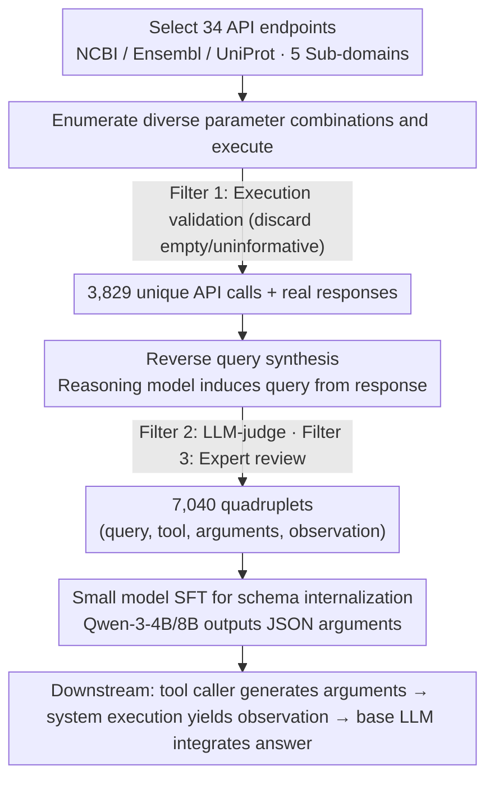

# BioTool: A Comprehensive Tool-Calling Dataset for Enhancing Biomedical Capabilities of Large Language Models

**Conference**: ACL 2026  
**arXiv**: [2605.05758](https://arxiv.org/abs/2605.05758)  
**Code**: https://github.com/gxx27/BioTool  
**Area**: Computational Biology  
**Keywords**: Biomedical tool calling, NCBI/Ensembl/UniProt, instruction fine-tuning, small models surpassing commercial LLMs

## TL;DR
BioTool constructs an instruction fine-tuning dataset consisting of 7,040 human-verified "query–API call" pairs covering 34 commonly used tools from three major biomedical databases: NCBI, Ensembl, and UniProt. After fine-tuning 4B-scale open-source LLMs with this data, the tool-calling quality exceeds commercial models such as GPT-5.1, Gemini-3 Pro, and Claude-4.5-Sonnet by over 15%.

## Background & Motivation

**Background**: In the general domain, mature tool-calling datasets and fine-tuning pipelines such as Toolformer, Gorilla, ToolBench, and APIGen have been established. In the biomedical field, however, the mainstream approach still relies on agents based on in-context learning—such as GeneGPT, ChemCrow, and Biomni—which insert tool documentation into prompts for the model to use on the fly.

**Limitations of Prior Work**: The in-context approach faces a triple bottleneck: (1) it is limited by context length, restricting the number of tools (e.g., GeneGPT only covers a small subset of NCBI APIs); (2) the parameter schemas of biomedical APIs are extremely complex, and simple prompt descriptions cannot cover various calling scenarios; (3) mapping natural language questions to professional schemas, identifiers, and parameter specifications is far more difficult than with general tools, leading to severe hallucinations.

**Key Challenge**: Regardless of the size of general tool-calling datasets, the biomedical tools within them are but a "drop in the ocean," making it impossible for LLMs to provide executable calls in scenarios requiring strict schemas like BLAST, Variation API, or UniProt sequence queries. For LLMs to truly serve as assistants to biomedical researchers, there must be a "database-native" high-quality tool-calling corpus.

**Goal**: (1) Systematically select high-frequency tools from three authoritative biomedical databases; (2) automatically synthesize "query–API call" pairs at scale while ensuring semantic validity; (3) fine-tune small-to-medium open-source LLMs with this data to reach or even exceed the tool-calling capabilities of top-tier closed-source models.

**Key Insight**: The authors construct data in reverse—first enumerating diverse API parameter combinations from tool documentation and executing them, then using the "real and valid API response" as a seed. A reasoning model backward-induces a "user query that can be answered by this response," followed by an LLM judge and human expert review. This "answer-first, problem-second" paradigm naturally avoids the annotation noise of mismatched queries and APIs.

**Core Idea**: Replacing the traditional "human-written query → human-labeled API" paradigm with "response-grounded reverse query synthesis + multi-round LLM/human filtering" to simultaneously increase the scale and quality of biomedical tool-calling corpora. This allows 4B models to surpass closed-source models with 200× the parameter count on professional schemas.

## Method

### Overall Architecture

The core of BioTool is not a model but an "answer-first" data construction pipeline designed to produce a database-native, schema-strict biomedical tool-calling corpus. The pipeline consists of four steps: First, 34 high-frequency API endpoints used by researchers are manually selected from NCBI, Ensembl, and UniProt, covering five sub-domains: variation, genomics, proteomics, evolution, and general biology. Second, the official documentation for each tool is fed into an LLM to enumerate diverse parameter combinations for actual execution; samples with empty or uninformative returns are discarded, resulting in 3,829 unique API calls. Third, a reasoning model is given the "API call + real response" to backward-induce a natural language query that is supported by that response. Finally, through LLM-judge filtering and manual review by biological experts, 7,040 quadruplets (query, tool info, API arguments, observation) are retained. For downstream use, the task is decoupled into a tool caller and an answer generator—the fine-tuned small model is responsible only for generating API arguments, the system executes the call to obtain an observation, and a base LLM integrates the observation into the final answer.

### Key Designs

**1. Response-grounded reverse query synthesis: Anchoring available responses to induce questions**

Traditional methods involve humans writing a query and then labeling the corresponding API, which often results in mismatch noise where the API response cannot actually answer the query. BioTool reverses this: it first generates diverse API parameter combinations and executes them, sifting for those (API call, response) pairs that return useful information. Using this real response as an anchor, a reasoning model generates the most logical user question. Since the response embeds "answerability" into the data, the query is inevitably supported by the API, eliminating alignment noise at the source. This paradigm is effective because writing biomedical queries from scratch requires significant domain knowledge and is prone to hallucination, whereas generating questions from real responses is easier to control.

**2. Three-layer filtering funnel: Execution validation + LLM-judge + Expert review**

To ensure the 7,040 data points meet standards in biological correctness, API schema compliance, and query-response alignment, BioTool employs three funnels: The first is execution validation, where the API must return a non-empty response. The second is an LLM-judge, evaluating whether the response sufficiently supports the answer to the query. The third is human review by biological experts, focusing on biological relevance and correctness, such as whether gene IDs match the species or if variation coordinates are compliant. Pure LLM-synthesized data in professional fields contains significant noise; without human verification, models may learn incorrect schemas as truth.

**3. Small model SFT internalizing schemas vs. Large model ICL: Hardcoding domain knowledge into weights**

The authors feed the BioTool training set to small models like Qwen-3-4B / 8B for SFT, transforming the parameter specifications of the 34 tools from "temporarily read prompts" into "internalized weights." During inference, the models directly output API arguments in JSON format. The underlying judgment is that the bottleneck for in-context large models in professional schema tasks is specialization rather than general intelligence. Once domain knowledge is hardcoded into the weights, a 4B small model can outperform a general closed-source model with 200× the parameters by over 15% in tool-calling quality. This represents a typical victory of specialization over generalization.

### Loss & Training

Standard SFT cross-entropy is used, with the training target being the JSON string of (tool name, API arguments). The observation does not participate in the training loss and is only filled by system execution during inference.

## Key Experimental Results

### Main Results: Tool-calling Quality Comparison

| Model | Parameters | Training Method | API-calling Quality | Remarks |
|------|--------|---------|------------------|------|
| GPT-5.1 (Closed) | Undisclosed | ICL | Baseline | Top-tier general LLM |
| Gemini-3 Pro | Undisclosed | ICL | Near GPT-5.1 | |
| Claude-4.5-Sonnet | Undisclosed | ICL | Strongest baseline among the three | |
| Qwen-3-4B + BioTool SFT | 4B | SFT | **15.0%** higher than Claude-4.5 | Best in this paper |
| Qwen-3-8B + BioTool SFT | 8B | SFT | Further improvement | |

### Downstream QA Quality Evaluation (Expert Biologist Scoring)

| Configuration | Normalized answer quality gain vs. vanilla GPT-5.1 | Description |
|------|------|------|
| GPT-5.1 (No tools) | 0% (Baseline) | Direct answer, prone to hallucination |
| GPT-5.1 + Oracle BioTool API call | +**88.4%** | Upper bound: API call provided by ground truth |
| GPT-5.1 + BioTool-fine-tuned tool caller | +**69%** | Practical: Using fine-tuned 4B model as caller |
| GPT-5.1 + ICL tool calling | Much lower than both above | Traditional approach |

Test set size: 1,048 test queries, with head-to-head preference evaluation conducted by biological experts.

### Key Findings
- **Specialized data outperforms general scale**: The 4B model's victory over closed-source LLMs 200× its size shows that marginal returns for in-context approaches in professional schema tasks have peaked; weight-level internalization is the necessary next step.
- **Oracle (88.4%) vs. Empirical (69%) Gap**: A gap of about 20 percentage points indicates room for improvement in the BioTool fine-tuned caller, though it already captures approximately 78% of the tool-calling benefits.
- **Value of Coverage Breadth**: The 34 tools span five sub-domains (variation, genomics, proteomics, evolution, general), enabling the system to handle interdisciplinary queries (e.g., complex questions requiring both NCBI gene and UniProt protein information).

## Highlights & Insights
- **Reverse Construction Paradigm**: The design of starting with a "correct API response" and having an LLM induce the query fundamentally eliminates the largest noise source in traditional tool-use datasets: the misalignment between queries and ground-truth API calls. This is worth migrating to other vertical domains (e.g., financial, geographic, or e-commerce APIs).
- **Victory of the Small Model Specialization Route**: This reaffirms that rather than pursuing 200B general models, fine-tuning 4B models to the extreme on specific schemas is a critical directional signal for academia and smaller teams.
- **Experimental Design of Oracle Upper-Bound Analysis**: By using Oracle API calls to establish an 88.4% ceiling and fine-tuned callers to provide a 69% empirical value, the authors clarify the contributions of "dataset intrinsic quality" versus "caller implementation gap," a methodology worth emulating.

## Limitations & Future Work
- **Tool Scope remains narrow**: 34 tools are few compared to the hundreds of biomedical APIs available; future expansion is needed for chemistry, proteomics imaging, and clinical trial databases.
- **High Human Verification Costs**: 7,040 entries require expert review, making it difficult to scale infinitely; a hybrid paradigm of expert review and active learning sample selection could be explored.
- **Downstream Base LLM is still closed-source**: GPT-5.1 was used as the answer generator for ultimate quality evaluation, which hinders full open-source replication; ideally, a fully open-source stack would be used.
- **Multi-tool Serial Calling not explored**: Currently, each sample corresponds to a single API call. Complex biological questions often require chained calls (e.g., BLAST → annotation → cross-reference), requiring future expansion to multi-step tool use.

## Related Work & Insights
- **vs Toolformer / Gorilla**: General tool datasets have broad coverage but negligible representations of biomedical tools, with schema complexity far lower than that of NCBI/Ensembl. This work specializes in biomedicine with higher schema rigor.
- **vs GeneGPT**: Also targets NCBI, but GeneGPT's ICL approach can only handle a few tools; BioTool internalizes the full schemas of 34 tools into weights via SFT.
- **vs ChemCrow / SciAgent**: These scientific agent routes emphasize agent orchestration; BioTool is complementary, providing high-quality training corpora to strengthen the tool caller modules within such agents.
- **vs Biomni**: A general biomedical agent with a relatively small toolset; BioTool's data can directly enhance its caller.

## Rating
- Novelty: ⭐⭐⭐⭐ The data construction paradigm of reverse query synthesis + three-layer filtering is solid, though components aren't entirely pioneered here.
- Experimental Thoroughness: ⭐⭐⭐⭐ Reporting both API-quality benchmarks and expert head-to-head evaluations is impressive; the Oracle analysis is a highlight.
- Writing Quality: ⭐⭐⭐⭐ Clear three-part narrative: dataset → experiments → human evaluation.
- Value: ⭐⭐⭐⭐⭐ 7,040 high-quality entries plus open-sourced data and code represent a truly usable infrastructure for the biomedical LLM community.

<!-- RELATED:START -->

## Related Papers

- [\[ICLR 2026\] Tracing Pharmacological Knowledge in Large Language Models](../../ICLR2026/computational_biology/tracing_pharmacological_knowledge_in_large_language_models.md)
- [\[NeurIPS 2025\] FGBench: A Dataset and Benchmark for Molecular Property Reasoning at Functional Group-Level in Large Language Models](../../NeurIPS2025/computational_biology/fgbench_a_dataset_and_benchmark_for_molecular_property_reasoning_at_functional_g.md)
- [\[ICLR 2026\] AFD-INSTRUCTION: A Comprehensive Antibody Instruction Dataset with Functional Annotations for LLM-Based Understanding and Design](../../ICLR2026/computational_biology/afd-instruction_a_comprehensive_antibody_instruction_dataset_with_functional_ann.md)
- [\[NeurIPS 2025\] Mol-LLaMA: Towards General Understanding of Molecules in Large Molecular Language Models](../../NeurIPS2025/computational_biology/mol-llama_towards_general_understanding_of_molecules_in_large_molecular_language.md)
- [\[ACL 2026\] ProtoCycle: Reflective Tool-Augmented Planning for Text-Guided Protein Design](protocycle_reflective_tool-augmented_planning_for_text-guided_protein_design.md)

<!-- RELATED:END -->
