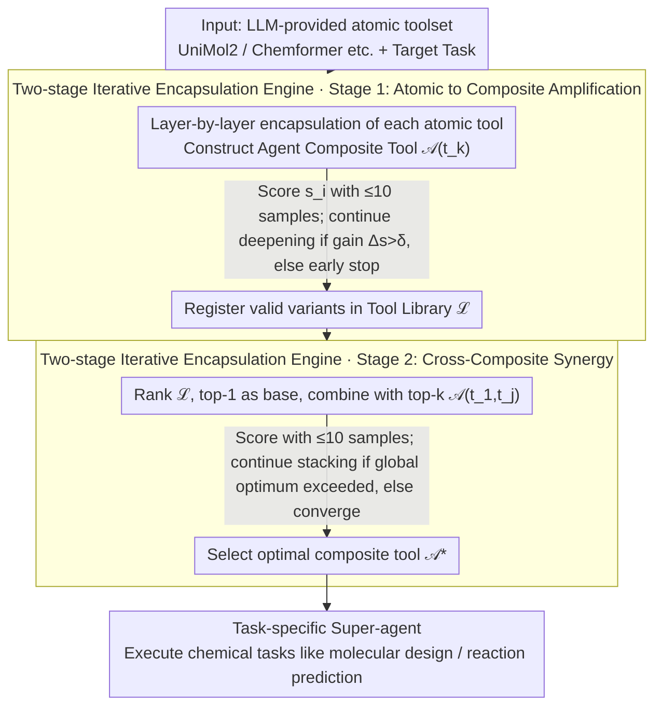

# ChemAmp: Amplified Chemistry Tools via Composable Agents

**Conference**: ACL 2026 Findings  
**arXiv**: [2505.21569](https://arxiv.org/abs/2505.21569)  
**Code**: [GitHub](https://github.com/Chang-pw/ChemAmp)  
**Area**: AI for Science/Chemistry  
**Keywords**: Tool Amplification, Composable Agents, Chemistry AI, Multi-agent Systems, Hierarchical Composition

## TL;DR

This paper proposes the "Tool Amplification" paradigm (distinct from traditional tool orchestration). Through the ChemAmp framework, chemistry-specific tools (UniMol2, Chemformer, etc.) are treated as composable building blocks to dynamically construct task-specific super-agents. It outperforms specialized models and general LLMs on four core chemistry tasks, including molecular design and reaction prediction, while reducing inference token costs by 94%.

## Background & Motivation

**Background**: LLM-based agents can already orchestrate multi-step tool usage workflows in the chemical domain (e.g., ChemCrow, Coscientist), sequentially calling tools such as RDKit and molecular generators to complete cross-task workflows.

**Limitations of Prior Work**: Existing methods focus on "tool orchestration" (scheduling tool sequences across tasks), but performance within a single task is limited by the atomic capability ceiling of the underlying tools. Even the best chemistry-specialized tools (UniMol2, ChemDFM) achieve only 35% exact match in molecular descriptions when used individually, allowing errors to propagate through the reasoning chain.

**Key Challenge**: Tool orchestration optimizes tool scheduling between tasks, but the intra-task tool performance bottleneck is the fundamental factor restricting agent performance.

**Goal**: Shift from "tool orchestration" to "tool amplification"—enabling tools to surpass their respective atomic capabilities within a single task via dynamic composition.

**Key Insight**: Treat each tool as a composable building block agent, constructing higher-performance composite tools through hierarchical iterative encapsulation.

**Core Idea**: Two-stage amplification—first encapsulate atomic tools into enhanced sub-agents (Stage 1), then combine sub-agents into a hierarchical network (Stage 2), iteratively optimizing the combination through adaptive scoring and automated feedback.

## Method

### Overall Architecture

ChemAmp reformulates "improving single-task performance" as a bottom-up tool composition search problem: given a set of atomic chemical tools (UniMol2, Chemformer, etc.) and a target task, the framework automatically identifies tool combinations that yield synergistic effects and encapsulates them into a higher-performance composite agent. The entire process is driven by a two-stage iterative encapsulation engine: atomic tools are first amplified individually (Stage 1), and then the amplified composite tools are combined with one another (Stage 2) until global performance converges.

### Key Designs

**1. Agent Composite Tool: Both Blocks and Executors**

The core abstraction of ChemAmp is the Agent Composite Tool $\mathcal{A}(t_1,...,t_n)$—it encapsulates multiple underlying tools and their coordination strategies. It plays two roles: for higher-level agents, it is a building block that can be further composed; for specific chemical sub-tasks, it is an autonomous executor capable of independent operation. This duality is the key distinction of "tool amplification" from "tool orchestration": orchestration systems only schedule fixed-capability tools between tasks, whereas ChemAmp treats composition as a first-class citizen, enabling the injection of encapsulation where tool synergy occurs to exceed the ceiling of any single atomic tool.

**2. Two-stage Iterative Encapsulation Engine**

Amplification occurs in two steps. Stage 1 iteratively encapsulates each atomic tool $t_k$ into composite variants $\mathcal{A}_i(t_k)$ and assigns a score $s_i$ based on task metrics. Encapsulation depth increases only if the gain exceeds threshold $\delta$, and all valid variants are registered in the tool library. Stage 2 performs cross-composite synergy within the library: after ranking by score, the top-1 is used as a base to combine with other top-k tools $\{\mathcal{A}(t_1,t_2),...,\mathcal{A}(t_1,t_k)\}$, followed by re-scoring and iteration until global performance no longer improves. This "rank-and-score + threshold-based early stopping" strategy balances search space and computational overhead.

**3. Low Data Requirement (≤10 samples)**

Annotated data is scarce in the chemical domain. Consequently, the entire composition optimization process uses no more than 10 samples per task for scoring and screening. This is feasible because each atomic tool already carries strong domain priors; ChemAmp only needs to identify the relative signal of whether "a certain combination brings improvement" rather than learning task knowledge from scratch. A small number of validation samples is sufficient to distinguish between effective and ineffective combinations.

## Key Experimental Results

### Main Results (Molecular Design - ChemLLMBench)

| Method | Exact Match | BLEU | FTS |
|------|---------|------|-----|
| ChemDFM-13B | 0.32 | 0.85 | 0.74 |
| Text+Chem T5 | 0.32 | 0.85 | 0.82 |
| GPT-4o | 0.01 | 0.57 | 0.54 |
| ChemAmp | **0.42** | **0.88** | **0.84** |

### Ablation Study

| Configuration | Key Metrics | Description |
|------|---------|------|
| Stage 1 only | Improvement observed | Single tool enhancement is effective |
| Stage 1 + Stage 2 | Optimal | Cross-composite synergy provides further gains |
| Vanilla Multi-agent | Poor | Simple stacking is inferior to structured composition |
| Token Cost | 94% reduction | vs vanilla multi-agent system |

### Key Findings
- ChemAmp consistently outperforms specialized chemical models, general LLMs, and traditional agent orchestration systems across four core chemical tasks.
- Inference token costs are only 6% of those in vanilla multi-agent systems, demonstrating high efficiency.
- Bottom-up composition strategies are superior to top-down orchestration strategies.
- Molecular design exact match increased from the Prev. SOTA of 0.32 to 0.42 (+31%), validating the effectiveness of tool amplification.

## Highlights & Insights
- **Novelty**: The distinction between "tool amplification" and "tool orchestration" is clear and compelling, shifting focus from "cross-task scheduling" to "intra-task enhancement."
- **Efficiency and Value**: Achieving better performance while reducing inference token costs by 94% suggests that structured composition is more efficient than brute-force stacking.
- **Experimental Thoroughness**: Although applied to chemistry, the tool amplification paradigm is potentially transferable to other scientific domains.
- **Low Data Requirement**: Optimization of combinations with ≤10 samples makes the approach highly practical for real-world scenarios.

## Limitations & Future Work
- **Reliance on GPT-4o as a core agent**: The effectiveness of the composition strategy may be limited by the capabilities of the underlying LLM.
- **Evaluation Scale**: Assessment was conducted only on 100 instances from ChemLLMBench, which is a relatively small scale.
- **Domain Specificity**: Applicability to other scientific domains remains to be verified.
- **Future Work**: Extending the framework to more scientific fields, investigating the interpretability of composition strategies, and reducing dependence on closed-source LLMs.

## Related Work & Insights
- **vs ChemCrow/Coscientist**: Typical tool orchestration systems that are effective for cross-task scheduling but do not enhance individual tool performance.
- **vs ChemToolAgent**: Supports large toolsets and dynamic selection but remains within the orchestration paradigm.
- **vs AgentPrune/GPTSwarm**: Automates workflow optimization but does not involve enhancement at the atomic tool level.

## Rating
- Novelty: ⭐⭐⭐⭐⭐ The "tool amplification" paradigm is novel and persuasive; the two-stage encapsulation engine is elegantly designed.
- Experimental Thoroughness: ⭐⭐⭐⭐ Comprehensive evaluation across four chemical tasks with ablation and efficiency analyses, though the test scale is small.
- Writing Quality: ⭐⭐⭐⭐ Clear distinction between orchestration and amplification; complete algorithmic description.
- Value: ⭐⭐⭐⭐ Provides a new direction for enhancing scientific AI tools, with practical deployment value due to combined efficiency and performance gains.

<!-- RELATED:START -->

## Related Papers

- [\[NeurIPS 2025\] Interpreting GFlowNets for Drug Discovery: Extracting Actionable Insights for Medicinal Chemistry](../../NeurIPS2025/computational_biology/interpreting_gflownets_for_drug_discovery_extracting_actionable_insights_for_med.md)
- [\[ACL 2026\] ToxReason: A Benchmark for Mechanistic Chemical Toxicity Reasoning via Adverse Outcome Pathway](toxreason_a_benchmark_for_mechanistic_chemical_toxicity_reasoning_via_adverse_ou.md)
- [\[ACL 2026\] AROMA: Augmented Reasoning Over a Multimodal Architecture for Virtual Cell Genetic Perturbation Modeling](aroma_augmented_reasoning_over_a_multimodal_architecture_for_virtual_cell_geneti.md)
- [\[ACL 2026\] BioTool: A Comprehensive Tool-Calling Dataset for Enhancing Biomedical Capabilities of Large Language Models](biotool_a_comprehensive_tool-calling_dataset_for_enhancing_biomedical_capabiliti.md)
- [\[ACL 2026\] ProtoCycle: Reflective Tool-Augmented Planning for Text-Guided Protein Design](protocycle_reflective_tool-augmented_planning_for_text-guided_protein_design.md)

<!-- RELATED:END -->
