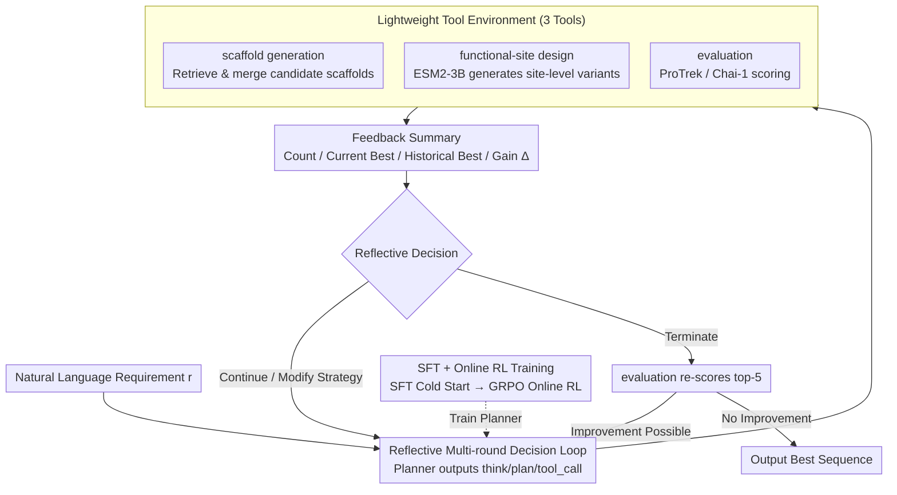

# ProtoCycle: Reflective Tool-Augmented Planning for Text-Guided Protein Design

**Conference**: ACL 2026 (Findings)  
**arXiv**: [2604.16896](https://arxiv.org/abs/2604.16896)  
**Code**: [https://github.com/huggggoooooo/ProtoCycle](https://github.com/huggggoooooo/ProtoCycle)  
**Area**: AI for Science / Protein Design  
**Keywords**: Protein Design, Text-Guided, Reflective Planning, Tool Augmentation, Reinforcement Learning

## TL;DR

ProtoCycle proposes a **reflective agent framework** that uses an LLM as a planner combined with a lightweight tool environment for text-guided protein sequence design. It replaces one-shot text-to-sequence generation with a multi-round "plan-tool-evaluate-reflect" cycle. On Mol-Instructions, it improves ProTrek to 14.681 and Retrieval to 0.936, achieving language alignment that nears or exceeds specialized protein design models using only ~2,000 SFT trajectories and online RL.

## Background & Motivation

**Background**: Designing proteins that meet functional requirements described in natural language is a core objective of protein engineering. A direct approach is fine-tuning general instruction-following LLMs as text-to-sequence generators, though this is data and compute-intensive.

**Limitations of Prior Work**: (1) Direct text-to-sequence approaches require massive amounts of supervised data and computational resources. (2) Under limited supervision, LLMs can generate coherent textual plans but cannot reliably implement them as protein sequences—resulting in a **plan-execute gap**. (3) Protein design requires iterative trial-and-error, whereas most existing methods are one-shot.

**Key Challenge**: LLMs excel at understanding natural language functional descriptions and generating plans, but they are poor at directly mapping text to valid protein sequences, particularly when training data is scarce.

**Goal**: Construct a protein design framework that leverages the planning capabilities of LLMs while addressing their weaknesses in sequence generation.

**Key Insight**: Borrow from the iterative workflow of human protein engineers—replacing one-step generation with a multi-round "plan → execute → feedback → correction" cycle, positioning the LLM as a planner rather than a generator.

**Core Idea**: Couple an LLM planner with a lightweight tool environment. Tools provide sequence operations and evaluation functions. The LLM iteratively refines design solutions by reflecting on tool feedback, with agent capabilities enhanced through supervised trajectories and online reinforcement learning.

## Method

### Overall Architecture

ProtoCycle formalizes text-guided protein design as a multi-step decision-making process. Given a natural language requirement $r$, the planner outputs a state $s_t$ and a tool action $a_t$ at round $t$ based on historical states, tool feedback, and the original requirement. The action $a_t$ is decomposed into a tool type and parameters, which are then executed by a lightweight tool environment to return a feedback summary. The LLM does not directly output full amino acid sequences; instead, it handles requirement decomposition, tool selection, strategy updates, reflection, and termination judgment. Specific sequence generation and local editing are delegated to specialized tools.

Each round follows a three-segment protocol: `<think>`, `<plan>`, and `<tool_call>`. In the first round, the planner decomposes requirements into fine-grained sub-goals and plans the tool-call sequence. In subsequent rounds, the planner reads the number of candidates, current best score, historical best score, and gain $\Delta$ returned by the tools to decide whether to continue, modify the strategy, or terminate. Before termination, an evaluation tool is triggered to re-score the top-5 candidates. If there is room for improvement, planning continues; otherwise, the best sequence is output.

### Key Designs

**1. Reflective multi-round decision loop**

Ours replaces one-shot text-to-sequence generation with an iterative trial-and-error process mimicking human engineers. In each round, the planner outputs following a `<think>/<plan>/<tool_call>` protocol: it summarizes current performance and reflects on strategy effectiveness in `<think>`, decides to continue, modify, or stop in `<plan>`, and selects a tool with parameters in `<tool_call>`. Tools return summaries including candidate counts, best scores, and gains $\Delta$. Explicit reflection allows the agent to learn from poor feedback and correct or halt early—ablations show that "modifying strategy based on feedback" is the crucial step.

**2. Lightweight tool environment**

The planner manages high-level planning, while low-level sequence operations and evaluations are handled by three tools: scaffold generation retrieves candidates from knowledge bases like UniProt and Rhea; functional-site design uses ESM2-3B to generate site-level variants; evaluation uses ProTrek for alignment and Chai-1 for foldability. Externalizing generation and scoring compensates for the LLM's weakness in residue-level decision-making (where epistemic uncertainty is systematically higher) and makes the design process interpretable and traceable.

**3. SFT + online RL training**

The planner is trained in two stages. Phase one uses ~2,000 trajectories from Mol-Instructions for SFT, calculating cross-entropy only on planner states $s_1,\ldots,s_n$ to learn the protocol. Phase two uses GRPO for online RL in the actual tool environment. The reward function incentivizes correct formatting, rational tool use, reflection after poor feedback, and task completion within a reasonable number of rounds.

## Key Experimental Results

### Main Results

| Model | PPL↓ | Repeat↓ | pTM↑ | pLDDT↑ | PAE↓ | ProTrek↑ | EvoLLaMA↑ | Retrieval↑ |
|---|---:|---:|---:|---:|---:|---:|---:|---:|
| Natural | 4.737 | 2.129 | 0.762 | 0.815 | 9.443 | 14.628 | 0.328 | 0.848 |
| Qwen2.5-7B-Agent | 8.235 | 5.153 | 0.542 | 0.699 | 15.299 | 6.926 | 0.261 | 0.523 |
| Qwen2.5-72B-Agent | 7.414 | 5.341 | 0.618 | 0.714 | 13.343 | 8.791 | 0.267 | 0.563 |
| Qwen3-8B-Agent | 7.227 | 3.795 | 0.650 | 0.723 | 13.493 | 8.705 | 0.277 | 0.573 |
| ProDVa | 5.265 | 1.580 | 0.765 | 0.800 | 8.761 | 12.037 | 0.317 | 0.730 |
| Pinal | 3.990 | 9.317 | 0.792 | 0.825 | 7.768 | 14.162 | 0.318 | 0.807 |
| ProtoCycle-SFT | 4.149 | 2.902 | 0.734 | 0.807 | 10.200 | 12.502 | 0.317 | 0.840 |
| ProtoCycle-RL | **3.865** | 2.549 | 0.775 | 0.822 | 8.543 | **14.681** | 0.323 | **0.936** |

ProtoCycle-RL excels in language alignment: ProTrek sees a Gain of 3.66% over Pinal and 21.97% over ProDVa; Retrieval reaches 0.936, significantly higher than Natural, Pinal, and ProDVa. Regarding folding quality, while pTM/pLDDT are slightly lower than Pinal, they surpass ProDVa, indicating the agentic workflow preserves structural foldability.

### Ablation Study

| Experiment | Key Finding |
|---|---|
| ProtoCycle-RL vs ProtoCycle-SFT | ProTrek increased from 12.502 to 14.681, Retrieval from 0.840 to 0.936; PPL and Repeat dropped by 6.85% and 12.16% respectively. |
| CAMEO Generalization | Without training on keyword-style data, ProtoCycle-RL achieved pLDDT 0.80, ProTrek 11.17, and Keyword Recovery 0.59. |
| Single Tool Quality | Scaffold search: ProTrek 11.42, pLDDT 0.83; Functional-site design: ProTrek 12.87, pLDDT 0.80. |
| Tool Latency | Scaffold search ~4s/round; functional-site design ~20s/seq; ProTrek-35M ~3s/round. |
| Reflection Mechanism | Language alignment for the reflective planner is nearly double that of the non-reflective version; valid tool-call rates Gain ~20%. |

### Key Findings

1. **LLMs are better suited for planning than direct sequence generation**: SFT on Qwen2.5-7B only improved ProTrek from ~1 to 7 with more data; power-law extrapolation suggest approaching a score of 12 would require ~$6\times10^8$ supervised samples.
2. **Residue tokens exhibit higher epistemic uncertainty**: While aleatoric uncertainty is similar for planning and sequence tokens, sequence tokens show systematically higher epistemic uncertainty, suggesting insufficient evidence for residue-level decisions.
3. **RL primarily enhances alignment and retrieval**: Compared to SFT-only, online RL significantly boosts ProTrek and Retrieval while reducing PPL/Repeat.
4. **Reflection is not just formatting**: Simply learning the `<think>/<plan>` format without actual reflection offers minimal benefits over fixed workflows. Effectiveness stems from strategy adjustment based on feedback.

## Highlights & Insights

1. **Cross-domain transfer**: Successfully transfers the "planning + tool use + reflection" paradigm from NLP/AI Agents to protein design.
2. **Bridging the plan-execute gap**: Explicitly identifies the "talk the talk but can't walk the walk" issue in LLMs for protein design and provides an elegant tool-based solution.
3. **Iterative optimization vs. One-shot generation**: Protein design is ill-suited for one-step generation; multi-round feedback loops better match domain reality.
4. **Supervised + RL strategy**: Balances imitation and exploration, serving as an effective paradigm for training complex agents.

## Limitations & Future Work

1. **Functional-site tools are still lightweight**: Current tools improve candidate quality within reasonable budgets but cannot guarantee ideal sequences, especially for high-specificity binding or catalytic geometries.
2. **Throughput-quality trade-off**: Agentic workflows involve multiple structural/functional tool calls, resulting in higher computational costs than one-shot generators.
3. **Computational proxy evaluation**: Language alignment and foldability are useful proxies but do not replace wet-lab validation.
4. **Tool feedback bias**: Planner performance inherits biases from ProTrek, Chai-1, or retrieval tools where coverage of certain protein families may be insufficient.
5. **Complex functional design remains unsolved**: Ours aims to improve the text-guided design process rather than providing a guaranteed de novo protein design solution.

## Related Work & Insights

1. **Protein LLMs (ProtGPT2, ESM, etc.)**: Approaches using LLMs for direct sequence generation; ProtoCycle pivots to using LLMs as planners.
2. **AlphaFold**: A structural prediction tool that can serve as an evaluation component in the environment.
3. **Agent Frameworks (ReAct, OctoTools)**: Paradigms from NLP transferred to the protein design domain.
4. **RLHF / Online RL**: Training methods borrowing from NLP RLHF, replacing human feedback with tool feedback.

## Rating

- **Novelty**: ⭐⭐⭐⭐ — Introducing the Agent paradigm to protein design is a compelling cross-domain effort; reflective iteration is intuitive for the field.
- **Experimental Thoroughness**: ⭐⭐⭐⭐ — Covers Mol-Instructions, CAMEO generalization, and extensive ablations, though wet-lab validation is absent.
- **Writing Quality**: ⭐⭐⭐⭐ — Problems like the plan-execute gap are well-defined and the framework is intuitive.
- **Value**: ⭐⭐⭐⭐ — Demonstrates the potential of LLM Agent frameworks in scientific discovery and provides a new paradigm for protein design.

<!-- RELATED:START -->

## Related Papers

- [\[NeurIPS 2025\] Protein Design with Dynamic Protein Vocabulary](../../NeurIPS2025/computational_biology/protein_design_with_dynamic_protein_vocabulary.md)
- [\[ICML 2025\] Reliable Algorithm Selection for Machine Learning-Guided Design](../../ICML2025/computational_biology/reliable_algorithm_selection_for_machine_learning-guided_design.md)
- [\[ICLR 2026\] Iterative Distillation for Reward-Guided Fine-Tuning of Diffusion Models in Biomolecular Design](../../ICLR2026/computational_biology/iterative_distillation_for_reward-guided_fine-tuning_of_diffusion_models_in_biom.md)
- [\[ICML 2026\] From Feasible to Practical: Pareto-Optimal Synthesis Planning](../../ICML2026/computational_biology/from_feasible_to_practical_pareto-optimal_synthesis_planning.md)
- [\[NeurIPS 2025\] Pharmacophore-Guided Generative Design of Novel Drug-Like Molecules](../../NeurIPS2025/computational_biology/pharmacophore-guided_generative_design_of_novel_drug-like_molecules.md)

<!-- RELATED:END -->
