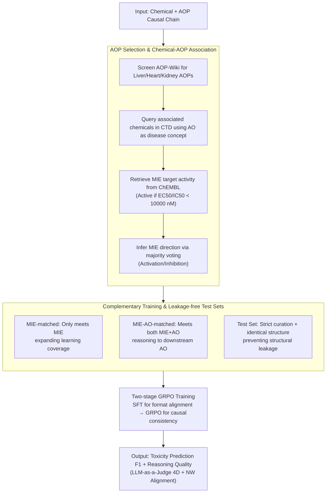

# ToxReason: A Benchmark for Mechanistic Chemical Toxicity Reasoning via Adverse Outcome Pathway

**Conference**: ACL 2026 Findings  
**arXiv**: [2604.06264](https://arxiv.org/abs/2604.06264)  
**Code**: None  
**Area**: Computational Biology  
**Keywords**: Toxicity Reasoning, Adverse Outcome Pathway (AOP), Benchmarking, Reinforcement Learning, LLM Evaluation

## TL;DR

This paper proposes ToxReason, a benchmark for mechanistic chemical toxicity reasoning based on the Adverse Outcome Pathway (AOP) framework. By integrating drug-target experimental data with toxicity labels, the benchmark requires models to reason from molecular initiating events to organ-level adverse outcomes. A 4B model trained via GRPO reinforcement learning outperforms large models like GPT-5 in both toxicity prediction (F1 71.4%) and reasoning quality.

## Background & Motivation

**Background**: LLMs have been applied to molecular reasoning and toxicity prediction tasks. Existing benchmarks (e.g., Tox21, ClinTox) primarily focus on predicting structure-property relationships, treating toxicity as a simple classification task.

**Limitations of Prior Work**: Toxicity inherently stems from complex biological mechanisms (molecular targets $\rightarrow$ cellular events $\rightarrow$ organ responses) rather than chemical structure alone. LLMs can generate fluent but biologically unreliable explanations, meaning high prediction accuracy does not equate to reliable reasoning. Reasoning in existing datasets (e.g., UniTox) is based on clinical observations rather than causal mechanistic pathways.

**Key Challenge**: There is a significant disconnect between prediction performance and reasoning quality—models may "guess the correct answer" while providing incorrect mechanistic explanations, which is unacceptable in high-risk scenarios like drug safety assessment.

**Goal**: To construct a benchmark for evaluating mechanistic toxicity reasoning, requiring models to perform step-by-step causal reasoning from Molecular Initiating Events (MIE) to Adverse Outcomes (AO), and to explore training strategies that enhance reasoning capabilities.

**Key Insight**: The AOP framework in toxicology naturally describes the causal chain from MIE $\rightarrow$ Key Events (KE) $\rightarrow$ AO, which matches the multi-step reasoning paradigm in NLP.

**Core Idea**: Using the AOP causal chain as the ground truth for toxicity reasoning, the authors construct an evaluation benchmark and simultaneously improve prediction and reasoning capabilities through reasoning-aware training.

## Method

### Overall Architecture

ToxReason redefines "chemical toxicity" from a structure-property classification task to a causal reasoning task unfolding along an Adverse Outcome Pathway (AOP). Given a chemical substance, the model must start from a Molecular Initiating Event (MIE), reason through Key Events, and arrive at an organ-level Adverse Outcome (AO). The goal is to provide both a toxicity prediction and an explanation aligned with biological mechanisms. The paper constructs data with AOP annotations from authoritative toxicology databases, splits them into training/test sets for learning and leakage-free evaluation, and finally uses reinforcement learning to explicitly optimize a joint objective of "correct prediction + faithful reasoning." Evaluation considers both the F1 score of toxicity prediction and reasoning quality via LLM-as-a-Judge using four-dimensional scoring.

### Key Designs

**1. AOP Selection and Chemical-AOP Association Derivation**

To enable mechanistic reasoning, annotated data grounded in biological causal chains is required; however, direct "chemical-MIE" experimental data is often missing. The authors filtered AOPs related to liver, heart, and kidney toxicity from AOP-Wiki. They treated each AOP's AO as a disease concept to query associated chemicals in CTD. Then, activity data for corresponding MIE targets was retrieved from ChEMBL (judged active if $\text{EC50/IC50} < 10000\,\text{nM}$). For each candidate chemical, majority voting based on structural similarity was used to infer the MIE direction (activation or inhibition). This design, which aggregates evidence from known activities of similar molecules, bypasses the lack of direct experimental data and allows for reliable labeling of the causal starting point (MIE).

**2. Complementary Training and Leakage-free Test Sets**

Data is split into two complementary training subsets: MIE-matched requires only the MIE condition (structural Dice similarity $\ge 0.5$), providing broad coverage to help the model learn patterns of "what molecules trigger initiating events"; MIE-AO-matched requires both MIE and AO, forcing the model to reason through molecular interactions all the way to downstream toxic outcomes. The test set exclusively uses strictly curated associations and chemically identical structures to eliminate structural leakage from the training set, ensuring the evaluation measures true mechanistic generalization rather than memorization.

**3. Two-stage GRPO Training**

To ensure models do not merely "guess the answer" but reason along the AOP path, training is divided into two stages: first, SFT aligns the model with the task's input/output format; then, Group Relative Policy Optimization (GRPO) uses explicit rewards to optimize causal consistency and biological faithfulness between the reasoning chain and the AOP. This design stems from findings that SFT only teaches output format without improving reasoning quality; only when reward signals directly target whether reasoning aligns with the causal path is the model guided to generate mechanistically sound reasoning chains.

### Loss & Training

The GRPO reward integrates two signals: the accuracy of the toxicity prediction and the alignment between the generated reasoning chain and the AOP path. This ensures that prediction correctness and mechanistic faithfulness are optimized jointly. The fine-tuning uses LoRA for parameter-efficient updates, allowing a 4B-scale model to be trained under this framework.

## Key Experimental Results

### Main Results

| Model | Kidney F1 | Heart F1 | Liver F1 | Avg F1 | Reasoning Overall |
| :--- | :--- | :--- | :--- | :--- | :--- |
| GPT-5 | 56.4 | 72.7 | 65.0 | 64.7 | 5.420 |
| GPT-5.1 | 50.3 | 71.2 | 58.9 | 60.1 | 5.523 |
| o3 | 60.0 | 72.5 | 58.8 | 63.8 | 5.326 |
| DeepSeek-R1-70B | 59.1 | 78.5 | 59.6 | 65.7 | 4.487 |
| Qwen3-4B (base) | 56.9 | 71.1 | 57.3 | 61.8 | 4.523 |
| ToxReason-4B-SFT | 57.9 | 74.3 | 57.4 | 63.2 | 4.554 |
| **ToxReason-4B-GRPO** | **73.4** | 72.7 | **68.2** | **71.4** | **5.642** |

### Ablation Study

| Configuration | Avg F1 | Reasoning Overall | Notes |
| :--- | :--- | :--- | :--- |
| Qwen3-4B base | 61.8 | 4.523 | Base model |
| + ICL 1-shot | 68.8 | 5.373 | Best few-shot performance |
| + ICL 2-shot | 59.1 | 4.373 | More shots introduce noise |
| + SFT | 63.2 | 4.554 | Limited improvement from SFT |
| + GRPO | 71.4 | 5.642 | Significant RL improvement |

### Key Findings

- There is a notable disconnect between prediction performance and reasoning quality: GPT-5.1 has the best reasoning but the worst prediction (60.1%), while DeepSeek-R1 predicts well but reasons poorly.
- SFT provides almost no help for reasoning quality, whereas GRPO significantly improves both prediction (+9.6%) and reasoning (+1.1 points).
- ICL performs best at 1-shot; increasing the number of shots introduces noise and degrades performance.
- NW alignment scores correlate highly with LLM-as-a-Judge scores (Spearman $\rho=0.837$), validating the reliability of the evaluation method.

## Highlights & Insights

- **Discovery of Prediction-Reasoning Disconnect**: Revealed that LLMs can perform well in toxicity prediction while following entirely incorrect reasoning mechanisms, which is a critical warning for safety-critical applications.
- **4B Model Surpassing GPT-5**: Through GRPO reasoning-aware training, a 4B parameter model surpassed closed-source large models in both prediction and reasoning, demonstrating the value of explicit reasoning optimization.
- **Mapping AOP Framework to NLP Multi-step Reasoning**: Successfully converted toxicological causal chains into an evaluable NLP reasoning task—an approach transferable to mechanistic evaluation in other scientific fields.

## Limitations & Future Work

- Coverage is limited to liver, heart, and kidney toxicity due to AOP-Wiki's scope.
- MIE inference relies on structurally similar molecules rather than direct prediction from molecular structure, limiting applicability to entirely novel chemicals.
- LLM-as-a-Judge evaluation is inherently subjective; although validated by the NW algorithm, it remains a relative measure.
- Future work could extend to more organ systems and more complex AOP networks.

## Related Work & Insights

- **vs CoTox**: CoTox improves prediction via CoT but does not evaluate whether reasoning aligns with causal paths; ToxReason makes reasoning evaluation a core goal.
- **vs Tox21/ClinTox**: Traditional toxicity benchmarks only predict outcomes; ToxReason requires the model to explain "why" a substance is toxic.
- **vs UniTox**: UniTox provides explanations based on clinical observations, whereas ToxReason requires step-by-step reasoning based on AOP causal mechanisms.

## Rating

- Novelty: ⭐⭐⭐⭐ First benchmark to systematically evaluate mechanistic toxicity reasoning in LLMs; the discovery of the prediction-reasoning disconnect is valuable.
- Experimental Thoroughness: ⭐⭐⭐⭐ Covers multiple open/closed-source models and learning strategies, though limited to three organ toxicities.
- Writing Quality: ⭐⭐⭐⭐ Clear structure with detailed AOP background.
- Value: ⭐⭐⭐⭐ Significant implications for drug safety and trustworthy AI reasoning.

<!-- RELATED:START -->

## Related Papers

- [\[NeurIPS 2025\] Beyond Chemical QA: Evaluating LLM's Chemical Reasoning with Modular Chemical Operations](../../NeurIPS2025/computational_biology/beyond_chemical_qa_evaluating_llms_chemical_reasoning_with_modular_chemical_oper.md)
- [\[ACL 2026\] AROMA: Augmented Reasoning Over a Multimodal Architecture for Virtual Cell Genetic Perturbation Modeling](aroma_augmented_reasoning_over_a_multimodal_architecture_for_virtual_cell_geneti.md)
- [\[NeurIPS 2025\] FGBench: A Dataset and Benchmark for Molecular Property Reasoning at Functional Group-Level in Large Language Models](../../NeurIPS2025/computational_biology/fgbench_a_dataset_and_benchmark_for_molecular_property_reasoning_at_functional_g.md)
- [\[ICML 2026\] SIGMA: Structure-Invariant Generative Molecular Alignment for Chemical Language Models via Autoregressive Contrastive Learning](../../ICML2026/computational_biology/sigma_structure-invariant_generative_molecular_alignment_for_chemical_language_m.md)
- [\[ICML 2026\] TadA-Bench: A Million-Variant Benchmark for Future-Round Discovery Toward Agentic Protein Engineering](../../ICML2026/computational_biology/tada-bench_a_million-variant_benchmark_for_future-round_discovery_toward_agentic.md)

<!-- RELATED:END -->
