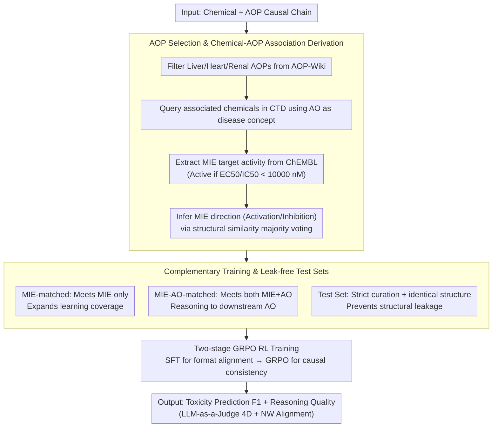

# ToxReason: A Benchmark for Mechanistic Chemical Toxicity Reasoning via Adverse Outcome Pathway

**Conference**: ACL 2026 Findings  
**arXiv**: [2604.06264](https://arxiv.org/abs/2604.06264)  
**Code**: None  
**Area**: Computational Biology  
**Keywords**: Toxicity Reasoning, Adverse Outcome Pathway, Benchmarking, Reinforcement Learning, LLM Evaluation

## TL;DR

This paper introduces ToxReason, a benchmark for mechanistic chemical toxicity reasoning based on the Adverse Outcome Pathway (AOP) framework. It integrates drug-target experimental data with toxicity labels, requiring models to reason from Molecular Initiating Events (MIE) to organ-level Adverse Outcomes (AO). A 4B model trained with GRPO reinforcement learning outperforms large models like GPT-5 in both toxicity prediction (F1 71.4%) and reasoning quality.

## Background & Motivation

**Background**: LLMs have been applied to molecular reasoning and toxicity prediction tasks. Existing benchmarks (e.g., Tox21, ClinTox) primarily focus on predicting structure-property relationships, treating toxicity as a simple classification task.

**Limitations of Prior Work**: Toxicity inherently stems from complex biological mechanisms (molecular target → cellular events → organ response) rather than chemical structure alone. LLMs can generate fluent but biologically unreliable explanations, meaning high prediction accuracy does not equate to reliable reasoning. Reasoning in existing datasets (e.g., UniTox) is based on clinical observations rather than causal mechanistic pathways.

**Key Challenge**: A significant decoupling exists between prediction performance and reasoning quality—models may "guess the answer correctly" but provide incorrect mechanistic explanations, which is unacceptable in high-risk scenarios such as drug safety assessment.

**Goal**: Construct a benchmark to evaluate mechanistic toxicity reasoning, requiring models to perform step-by-step causal reasoning from MIE to AO, and explore training strategies to enhance reasoning capabilities.

**Key Insight**: The AOP framework in toxicology naturally describes causal chains from MIE → Key Events (KE) → AO, which highly aligns with the multi-step reasoning paradigm in NLP.

**Core Idea**: Utilize AOP causal chains as ground truth for toxicity reasoning to build an evaluation benchmark and simultaneously improve prediction and reasoning capabilities through reasoning-aware training.

## Method

### Overall Architecture

ToxReason redefines "chemical toxicity" from a structure-property classification problem into a causal reasoning task unfolding along the Adverse Outcome Pathway (AOP). Given a chemical substance, the model must start from an MIE and reason through key events to an organ-level AO, providing both a toxicity prediction and an explanation aligned with biological mechanisms. To achieve this, the paper constructs data with AOP annotations from authoritative toxicological databases, splits them into training/test sets for learning and leak-free evaluation, and finally uses reinforcement learning to explicitly optimize the joint objective of "correct prediction + faithful reasoning." Evaluation considers both the F1 score for toxicity prediction and LLM-as-a-Judge scores across four dimensions for reasoning quality.

### Key Designs

**1. AOP Selection and Chemical-AOP Association Derivation**

To enable mechanistic reasoning, annotated data with biological causal chains is required; however, direct "chemical-MIE" experimental data is often missing. The paper filters AOPs related to liver, heart, and kidney toxicity from AOP-Wiki and queries associated chemicals in CTD using each AOP's AO as a disease concept. Activity data for corresponding MIE targets ($EC_{50}/IC_{50} < 10000\,\mathrm{nM}$ defined as active) is extracted from ChEMBL. The MIE direction (activation or inhibition) is inferred for each candidate chemical using majority voting based on structural similarity. This "evidence aggregation via known activities of similar molecules" bypasses the lack of direct experimental data, allowing the causal starting point (MIE) to be reliably annotated.

**2. Complementary Training and Leak-free Test Sets**

Data is divided into two complementary training subsets: MIE-matched requires only the MIE condition (structural Dice similarity $\ge 0.5$) and provides broad coverage to help the model learn patterns of "what molecules trigger initiating events." MIE-AO-matched requires both MIE and AO, forcing the model to reason through molecular interactions to downstream toxic outcomes. The test set exclusively uses strictly curated associations and structurally identical chemicals to prevent structural leakage from the training set, ensuring the evaluation reflects true mechanistic generalization rather than memorization.

**3. Two-stage GRPO Reinforcement Learning Training**

To ensure models do not merely "guess the answer" but reason along AOP pathways, training is conducted in two stages: SFT aligns the model to the task's input/output format, followed by Group Relative Policy Optimization (GRPO) to optimize the causal consistency and biological faithfulness of the reasoning chain using explicit rewards. This design addresses the experimental finding that SFT only teaches the output format without improving reasoning quality; the model is only guided to generate mechanistically sound reasoning chains when reward signals directly point to "causal pathway alignment," thereby improving both prediction and reasoning metrics.

### Loss & Training

The GRPO reward synthesizes two signals: the accuracy of the toxicity prediction and the alignment of the generated reasoning chain with the AOP pathway. This ensures that prediction correctness and mechanistic faithfulness are optimized jointly. The entire fine-tuning uses LoRA for parameter-efficient updates, allowing a 4B scale model to be trained under this framework.

## Key Experimental Results

### Main Results

| Model | Renal F1 | Heart F1 | Liver F1 | Avg F1 | Reasoning Overall |
|------|----------|-----------|----------|---------|----------|
| GPT-5 | 56.4 | 72.7 | 65.0 | 64.7 | 5.420 |
| GPT-5.1 | 50.3 | 71.2 | 58.9 | 60.1 | 5.523 |
| o3 | 60.0 | 72.5 | 58.8 | 63.8 | 5.326 |
| DeepSeek-R1-70B | 59.1 | 78.5 | 59.6 | 65.7 | 4.487 |
| Qwen3-4B (base) | 56.9 | 71.1 | 57.3 | 61.8 | 4.523 |
| ToxReason-4B-SFT | 57.9 | 74.3 | 57.4 | 63.2 | 4.554 |
| **ToxReason-4B-GRPO** | **73.4** | 72.7 | **68.2** | **71.4** | **5.642** |

### Ablation Study

| Configuration | Avg F1 | Reasoning Overall | Description |
|------|---------|-------------|------|
| Qwen3-4B base | 61.8 | 4.523 | Base model |
| + ICL 1-shot | 68.8 | 5.373 | Best Few-shot |
| + ICL 2-shot | 59.1 | 4.373 | More shots introduce noise |
| + SFT | 63.2 | 4.554 | Limited SFT gains |
| + GRPO | 71.4 | 5.642 | Significant RL gains |

### Key Findings

- A significant decoupling exists between prediction performance and reasoning quality: GPT-5.1 achieves the best reasoning but the worst prediction (60.1%), while DeepSeek-R1 yields high prediction but lower reasoning quality.
- SFT provides almost no help for reasoning quality, whereas GRPO substantially improves both prediction (+9.6%) and reasoning (+1.1 points).
- ICL is most effective at 1-shot; increasing the number of shots introduces noise, leading to performance degradation.
- NW alignment scores are highly correlated with LLM-as-a-Judge ratings (Spearman $\rho=0.837$), validating the reliability of the evaluation method.

## Highlights & Insights

- **Discovery of Prediction-Reasoning Decoupling**: Reveals that LLMs can perform well in toxicity prediction while having entirely incorrect reasoning mechanisms, providing a critical warning for safety-critical applications.
- **4B Model Outperforming GPT-5**: Through GRPO reasoning-aware training, a 4B parameter model surpasses closed-source large models in both prediction and reasoning, demonstrating the value of explicit reasoning optimization.
- **Mapping AOP Framework to NLP Multi-step Reasoning**: Translating toxicological causal chains into evaluable NLP reasoning tasks is an approach that can be generalized to mechanistic reasoning evaluation in other scientific fields.

## Limitations & Future Work

- Coverage is limited to liver, heart, and kidney toxicity due to the constraints of AOP-Wiki.
- MIE inference relies on structurally similar molecules rather than direct prediction from molecular structure, limiting applicability to entirely novel chemicals.
- LLM-as-a-Judge evaluation is inherently subjective; although validated by the NW algorithm, it should still be viewed as a relative measure.
- Future work could extend to more organ systems and complex AOP networks.

## Related Work & Insights

- **vs CoTox**: CoTox improves prediction via CoT but does not evaluate whether reasoning aligns with causal pathways; ToxReason makes reasoning evaluation a core objective.
- **vs Tox21/ClinTox**: Traditional toxicity benchmarks only predict outcomes; ToxReason requires the model to explain "why" it is toxic.
- **vs UniTox**: UniTox provides explanations based on clinical observations, whereas ToxReason requires step-by-step reasoning based on AOP causal mechanisms.

## Rating

- Novelty: ⭐⭐⭐⭐ First system to evaluate mechanistic toxicity reasoning in LLMs; the discovery of prediction-reasoning decoupling is valuable.
- Experimental Thoroughness: ⭐⭐⭐⭐ Covers multiple open/closed models and learning strategies, though limited to three organ toxicities.
- Writing Quality: ⭐⭐⭐⭐ Clear structure with detailed AOP background.
- Value: ⭐⭐⭐⭐ Highly relevant for drug safety and trustworthy AI reasoning.

<!-- RELATED:START -->

## Related Papers

- [\[NeurIPS 2025\] Beyond Chemical QA: Evaluating LLM's Chemical Reasoning with Modular Chemical Operations](../../NeurIPS2025/computational_biology/beyond_chemical_qa_evaluating_llms_chemical_reasoning_with_modular_chemical_oper.md)
- [\[ACL 2026\] AROMA: Augmented Reasoning Over a Multimodal Architecture for Virtual Cell Genetic Perturbation Modeling](aroma_augmented_reasoning_over_a_multimodal_architecture_for_virtual_cell_geneti.md)
- [\[NeurIPS 2025\] FGBench: A Dataset and Benchmark for Molecular Property Reasoning at Functional Group-Level in Large Language Models](../../NeurIPS2025/computational_biology/fgbench_a_dataset_and_benchmark_for_molecular_property_reasoning_at_functional_g.md)
- [\[ICML 2026\] SIGMA: Structure-Invariant Generative Molecular Alignment for Chemical Language Models via Autoregressive Contrastive Learning](../../ICML2026/computational_biology/sigma_structure-invariant_generative_molecular_alignment_for_chemical_language_m.md)
- [\[ICML 2026\] TadA-Bench: A Million-Variant Benchmark for Future-Round Discovery Toward Agentic Protein Engineering](../../ICML2026/computational_biology/tada-bench_a_million-variant_benchmark_for_future-round_discovery_toward_agentic.md)

<!-- RELATED:END -->
