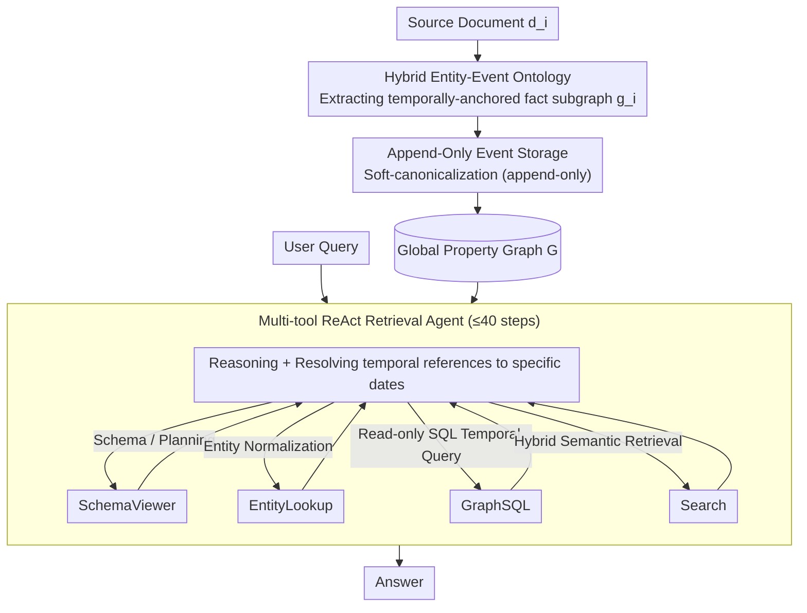

# APEX-MEM: Agentic Semi-Structured Memory with Temporal Reasoning for Long-Term Conversational AI

**Conference**: ACL 2026  
**arXiv**: [2604.14362](https://arxiv.org/abs/2604.14362)  
**Code**: None  
**Area**: Dialogue Systems / Long-term Memory / Agents  
**Keywords**: Property Graph, Append-Only Storage, Temporal Reasoning, ReAct Agent, GraphSQL

## TL;DR
The proposed system constructs long-term conversational memory using a trio of "domain-agnostic ontology-supported property graphs + append-only event storage + ReAct multi-tool retrieval agents." By never overwriting during construction and resolving temporal conflicts only at retrieval, it achieves 88.88% on LOCOMO (3.5% higher than MIRIX) and 86.2% on LongMemEval (13.7% higher than the strongest RAG baseline).

## Background & Motivation

**Background**: LLMs require the ability to "remember several previous sessions, accumulate knowledge across sessions, and update facts as context evolves" in long-term multi-turn dialogues. Common solutions fall into two categories: ① Long context windows (a 128K window yields only 51.6% F1); ② RAG based on text/summary segments (still prone to noise). Recent structured memory systems like Mem0, A-MEM, Zep, and MIRIX model memory as graphs but remain far from "glass-box" standards.

**Limitations of Prior Work**: Current structured memory systems remain weak in two aspects:  
① **Entity-centric** graphs like Mem0 compress all information into entity-relation triplets, which have limited entity categories and fail to capture the temporal evolution of attributes.  
② Almost all systems perform **merging/overwriting** during writing (eager update/state merge). By discarding historical versions early, they cannot answer temporal questions like "When did X change?" or "What was Y like before?".

**Key Challenge**: There is a natural conflict between "retaining complete history" (beneficial for temporal reasoning) and "reducing retrieval noise" (beneficial for answer accuracy). Early merging loses information, while complete retention increases retrieval burden.

**Goal**: To postpone conflict resolution from writing time to retrieval time, allowing the memory system to maintain a complete timeline while dynamically selecting the correct version based on context during a query.

**Key Insight**: By borrowing the entity type hierarchy of YAGO 4.5 from knowledge graphs and the append-only log concept from databases, conversational facts are **anchored to timestamped events** rather than directly to entities.

**Core Idea**: A triad of "property graph + append-only event storage + multi-tool temporal resolution at retrieval"—performing subtraction at the write-end (no merging) and addition at the read-end (multi-tool ReAct).

## Method

### Overall Architecture
The system consists of two stages. **Construction Stage**: Each source document $d_i$ is extracted into a subgraph $g_i$, which is incrementally merged into the global property graph $G^{(t+1)}\leftarrow\mathrm{Merge}(G^{(t)},g_t)$ through soft-canonicalization. Formally, $G=(V,E,\Pi,\Lambda)$, where $\Pi$ is a key-value attribute mapping and $\Lambda$ denotes the ontology types for nodes/edges. **Query Stage**: A ReAct agent $\pi_\theta$ generates a reasoning trace $r_t$ and action $a_t$ at each step $t$. Actions are either tool calls $(T_t,z_t)$ ($T_t\in\{\text{SchemaViewer, EntityLookup, GraphSQL, Search}\}$) or an Answer. The agent resolves temporal references into specific dates before calling tools to provide an answer.

### Key Designs

**1. Hybrid Entity-Event Ontology + Temporally Anchored Facts**

APEX-MEM does not flatten dialogue information into simple entity-relation triplets. Instead, it uses a domain-agnostic ontology to provide a unified semantic structure. It defines 35 entity categories (Person, Organization, Product, Place, Event, Software, etc.) and writes every fact as a temporally anchored tuple $f=(s,p,v,\delta,[t_{\text{from}},t_{\text{to}}],c,\mathcal{E})$, where $s$ is the subject entity, $p$ the attribute name, $v$ the value, $\delta$ the data type, $[t_{\text{from}},t_{\text{to}}]$ the validity interval, $c\in[0,1]$ the confidence, and $\mathcal{E}$ the set of supporting evidence. Furthermore, all facts must be linked to a dialogue event $\varepsilon=(\text{type},T,L,P,F,\mathcal{E}_\varepsilon)$. This design addresses the limitation of entity-centric triplets (like those in Mem0) that cannot express attribute changes over time (e.g., "Alice's favorite restaurant was Italian Garden on 2024-01-15 but changed to Sakura Sushi on 2024-03-20"). By elevating events to first-class citizens and providing validity intervals for every fact, fine-grained temporal reasoning becomes achievable.

**2. Append-Only Event Storage + Temporal Resolution at Retrieval**

This implements the "subtraction at writing, addition at reading" philosophy. During construction, old facts are never overwritten; any conflict or revision is appended as a new event. Conflict resolution is deferred to query time based on temporal validity. Entity and attribute alignment follow a RAG style: given a mention $m$, dense embeddings retrieve top-$k$ candidates $C=\{(\text{id}_i,\text{text}_i,s_i)\}$, then a structured LLM outputs a decision $d\in\{\text{choose\_existing, propose\_new, none}\}$ and a confidence score. However, only nodes are appended; nothing is deleted. During queries, GraphSQL sorts by `created_at` or `from_date`, and the agent selects the latest version or the one valid at the specified time. Early merging causes information loss, leading to an 18% drop in multi-hop performance for Mem0 and a 20% drop in temporal performance for MIRIX. Append-only storage preserves the full timeline, converting silent failure modes into "queryable states."

**3. Multi-tool ReAct Retrieval Agent (SchemaViewer / EntityLookup / GraphSQL / Search)**

Intelligence at the reading end is centralized in a ReAct agent that integrates structural reasoning, entity normalization, and semantic search into a single loop. SchemaViewer acts as a meta-planner providing database schemas and tool usage suggestions. EntityLookup normalizes surface mentions to graph IDs and returns timestamped fact snapshots. GraphSQL is a read-only SELECT interface supporting `julianday` temporal calculations, aggregations, and multi-hop JOINs across tables (entities, properties, facts, events, evidence, turns). Search performs hybrid dense+lexical retrieval, returning subgraphs $(E_q,P_q,\mathcal{V}_q,\mathcal{T}_q)$ relevant to the query. The agent follows the ReAct paradigm $(r_t,a_t)\sim\pi_\theta(\cdot\mid x,h_t)$ for up to 40 steps. Multi-tool collaboration is necessary because no single tool suffices: pure GraphSQL requires 27,282 calls (3.3× waste) for a single set of problems, and pure EntityLookup's multi-hop capability caps at 77%. Letting the agent select the optimal combination for single-hop, multi-hop, temporal, open-domain, or adversarial queries proves superior to any fixed single-tool approach.

### Loss & Training
No retraining is performed. During construction, Claude 4.5 Sonnet is used for fact extraction and Claude 4.5 Haiku for entity/property resolution (balancing cost and quality). During the query phase, powerful models such as GPT-5 or Claude 4.5 Sonnet are used with tools. For ultra-long dialogues (>$10^3$ documents), APEX-MEM Online is employed: a subset is filtered via $\mathrm{Relevance}(d_i|Q)>\Theta_{\text{rel}}=0.2$ before building a local graph. All experiments use temperature = 0 and a maximum of 40 tool calls.

## Key Experimental Results

### Main Results
Performance was evaluated across three benchmarks: LOCOMO (multi-session long-term dialogue memory), LongMemEval (long-input memory), and SealQA-Hard (noisy multi-document factoid QA), and compared against MIRIX, Mem0, Zep, A-MEM, Nemori, MemGPT, and OpenAI Memory.

| Dataset | Method | Overall | Single-hop | Multi-hop | Temporal | Open-domain | Adversarial |
|---|---|---|---|---|---|---|---|
| LOCOMO | **APEX-MEM (GPT-5)** | **88.88%** | **89.88%** | **86.29%** | **90.63%** | **91.68%** | 86.77% |
| LOCOMO | APEX-MEM (Claude 4.5 Sonnet) | 88.41% | 89.36% | 86.92% | 90.63% | 87.75% | 86.10% |
| LOCOMO | MIRIX | 85.38% | 85.11% | 83.70% | 65.62% | 88.39% | N/A |
| LOCOMO | Nemori | 79.40% | 84.90% | 75.10% | 77.60% | 51.00% | N/A |
| LOCOMO | Mem0 | 68.44% | 65.71% | 47.19% | 75.71% | 58.13% | N/A |
| LOCOMO | Zep | 75.14% | 61.70% | 41.35% | 76.60% | 49.31% | N/A |
| LOCOMO | Full Context GPT-4o | 87.52% | 88.53% | 77.70% | 71.88% | 92.70% | N/A |
| LongMemEval | **APEX-MEM (Sonnet)** | **86.2%** | - | - | - | - | - |
| LongMemEval | Nemori | 74.6% | - | - | - | - | - |
| SealQA-Hard | **APEX-MEM (GPT-5)** | **40.15%** | - | - | - | - | - |
| SealQA-Hard | O3 | 34.6% | - | - | - | - | - |

### Ablation Study (Tool Combinations, LOCOMO, Claude 4.5 Haiku backend)

| Configuration | Single-hop | Multi-hop | Temporal | Open-domain | Adversarial | Overall |
|---|---|---|---|---|---|---|
| SchemaViewer + EntityLookup | 80.85 | 76.64 | 72.92 | 76.34 | 77.80 | 77.19 |
| + GraphSQL | 80.78 | 79.75 | 82.29 | 78.00 | 81.16 | 79.45 |
| **+ Search (All 4 Tools)** | **85.46** | **84.74** | 79.17 | **89.18** | **87.22** | **87.00** |

### Key Findings
- **Temporal reasoning is the killer feature**: APEX-MEM scored 90.63% vs MIRIX's 65.62% (a 25-point gap) and Mem0's 75.71% (a 15-point gap), validating the effectiveness of the append-only + GraphSQL temporal operation combo.
- **The Search tool is critical for open-domain (+11 points)**: Performance increased from 78.00 to 89.18, as pure structured queries cannot cover semantically vague questions.
- **GraphSQL cannot work in isolation**: Using it alone requires 27,282 calls (3.3× waste) and caps at 79.45%; when paired with Search, calls decrease to 8,260, improving efficiency 3-fold.
- **Strong LLMs require fewer tool calls**: Claude 4.5 Sonnet achieves 84-86% accuracy with 10 calls, while GPT-4o requires more due to higher SQL generation error rates, resulting in lower final accuracy (86.35% vs 88.88%).
- **Token cost sweet spot**: APEX-MEM averages 30,000 tokens per query—nearly 4× lower than MIRIX's 112,000—while maintaining higher accuracy. Graph construction accounts for only 16.6% of costs.
- **SQL Error Recovery**: 87% of SQL failures can be automatically recovered via SchemaViewer re-querying (45%), EntityLookup fallback (28%), or Search fallback (14%), demonstrating the resilience of the multi-tool architecture.

## Highlights & Insights
- **"Subtraction at writing, addition at reading" is an elegant paradigm**: Similar to WAL (write-ahead log) in databases, intelligence is concentrated at the read end while the write end remains append-only. Conflict resolution becomes a "query problem resolved by query-time arbitration" rather than a "prediction problem of guessing correctness in advance."
- **SQLite is a pragmatic choice for graph storage**: It allows GraphSQL to reuse SQL's `julianday`, aggregations, and JOINs, which is more universal than custom Cypher/SPARQL languages. LLMs are significantly more proficient at writing SQL (Sonnet has a 97.6% SQL success rate).
- **The balance of 35 entity categories**: It is refined enough to distinguish between Software/Service/Device yet broad enough for cross-domain application. Flexible attribute attachment finds the sweet spot between a rigid schema and a completely schemaless design.
- **Converting silent failure into queryable states**: Questions like "When did Alice's favorite restaurant change?" or "What was Bob's previous job?"—unanswerable in overwriting systems like Mem0—become feasible.
- **Empirical evidence of append-only advantages**: APEX-MEM's temporal score of 90.63% vs Mem0's 75.71% (–14.92), MIRIX's 65.62% (–25.01), and Zep's 76.60% (–14.03) strongly suggests that the update strategy, rather than LLM strength, is the true bottleneck for temporal reasoning.

## Limitations & Future Work
- Graph construction relies on large models for fact extraction (Claude 4.5 Sonnet extraction precision: 97.3%, schema coverage: 91.1%, entity resolution: 98.2%), which entails significant deployment costs for real-time dialogue; the authors plan to investigate SLM alternatives and caching.
- Multi-tool ReAct requires 20-30 calls on average to converge, which may impact latency in interactive scenarios; marginal returns diminish after 20 calls, necessitating RL to learn smarter stop criteria.
- The 35 domain-agnostic ontology categories may not be specific enough for specialized domains (e.g., medical/legal), and the system lacks automatic ontology refinement capabilities.
- The 40.15% score on SealQA-Hard indicates room for improvement in high-noise multi-document scenarios, primarily due to insufficient coverage of implicit relationships and temporal details during fact extraction.
- The system currently supports only text; multi-modal (image/audio) inputs are not covered.
- Evaluation is limited to QA tasks; tasks requiring narrative synthesis, such as event summarization or dialogue generation, have not been verified.

## Related Work & Insights
- **vs Mem0 / Mem0g**: Mem0 has limited entity types and merges upon writing. APEX-MEM uses a 35-class ontology + append-only storage, yielding +15 points in temporal reasoning.
- **vs MIRIX**: MIRIX achieves 85.4% using 6 specialized memories and multi-agent routing, but eager state merging reduces its temporal accuracy to 65.62%. APEX-MEM’s simpler architecture achieves 90.63%.
- **vs Zep / Graphiti**: Zep builds temporal KGs but relies heavily on text retrieval. GraphSQL provides the precise structured query capability Zep lacks, giving APEX-MEM a +14 point lead in temporal tasks.
- **vs A-MEM / Nemori**: A-MEM uses Zettelkasten-style autonomous linking, and Nemori draws from cognitive science for self-organizing memory, but neither addresses the underlying "merge-at-write" issue.
- **vs Full Context GPT-4o**: Directly providing a 128K context yields 87.52%. APEX-MEM surpasses this with only 1.2× the average token consumption (30K vs 25K), proving that structured memory is not necessarily a trade-off for efficiency.

## Rating
- Novelty: ⭐⭐⭐⭐ The combination of "event ontology + append-only + retrieval-time resolution" is clever. While individual elements are not entirely new, the resulting paradigm is a breakthrough.
- Experimental Thoroughness: ⭐⭐⭐⭐⭐ Comprehensive coverage across three benchmarks, tool ablations, model comparisons, token cost analysis, and SQL recovery analysis.
- Writing Quality: ⭐⭐⭐⭐ Clear mathematical formalization, intuitive case studies, and detailed appendices (including statistics on SQL query types).
- Value: ⭐⭐⭐⭐⭐ Provides a ready-to-implement engineering template for "long-term conversational memory"; the append-only philosophy is transferable to general agent memory systems.

<!-- RELATED:START -->

## Related Papers

- [\[ACL 2025\] SHARE: Shared Memory-Aware Open-Domain Long-Term Dialogue Dataset Constructed from Movie Script](../../ACL2025/dialogue/share_shared_memory-aware_open-domain_long-term_dialogue_dataset_constructed_fro.md)
- [\[ICLR 2026\] ReIn: Conversational Error Recovery with Reasoning Inception](../../ICLR2026/dialogue/rein_conversational_error_recovery_with_reasoning_inception.md)
- [\[ICLR 2026\] Think-While-Generating: On-the-Fly Reasoning for Personalized Long-Form Generation](../../ICLR2026/dialogue/think-while-generating_on-the-fly_reasoning_for_personalized_long-form_generatio.md)
- [\[ACL 2026\] Reasoning Gets Harder for LLMs Inside A Dialogue](reasoning_gets_harder_for_llms_inside_a_dialogue.md)
- [\[ACL 2025\] PersonaLens: A Benchmark for Personalization Evaluation in Conversational AI Assistants](../../ACL2025/dialogue/personalens_a_benchmark_for_personalization_evaluation_in_conversational_ai_assi.md)

<!-- RELATED:END -->
