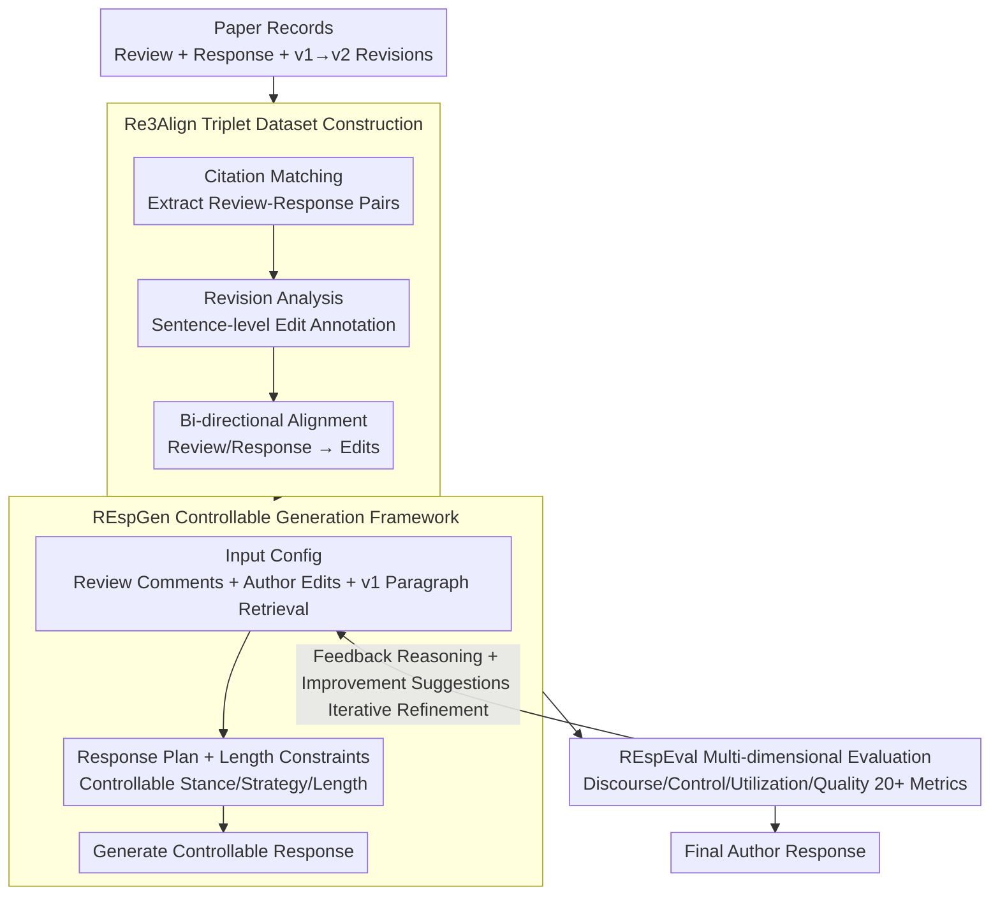

# Author-in-the-Loop Response Generation and Evaluation: Integrating Author Expertise and Intent in Responses to Peer Review

**Conference**: ACL 2026  
**arXiv**: [2602.11173](https://arxiv.org/abs/2602.11173)  
**Code**: [https://github.com/UKPLab/acl2026-respgen-respeval](https://github.com/UKPLab/acl2026-respgen-respeval)  
**Area**: Dialogue/Scientific Document Processing  
**Keywords**: Author Response Generation, Peer Review, Human-in-the-loop, Controllable Text Generation, Evaluation Framework

## TL;DR

This work redefines academic author response (rebuttal) generation as an "Author-in-the-Loop" task, introducing the Re3Align dataset (3.4K papers, 440K sentence-level edit annotations, 15K review-response-revision triplets), the REspGen controllable generation framework, and the REspEval evaluation suite with 20+ metrics. The approach systematically validates the effects of author input, controllability, and evaluation-guided refinement across 5 state-of-the-art LLMs.

## Background & Motivation

**Background**: Writing author responses (rebuttals) is a critical step in academic peer review, requiring significant effort from authors. NLP-assisted Automatic Response Generation (ARG) is an emerging but under-explored research direction.

**Limitations of Prior Work**: (1) Existing ARG research only uses review comments as input, ignoring authors' domain expertise, unique information, and response strategies—even though many review concerns can only be addressed by authors (e.g., specific experimental designs, clarification of definitions); (2) Lack of datasets providing fine-grained author signals—existing datasets lack sentence-level edit annotations, review-response paragraph alignment, and revision mappings; (3) Evaluation is limited to surface similarity metrics (ROUGE/BLEU), lacking multi-dimensional assessment of controllability, input utilization, response quality, and discourse structure.

**Key Challenge**: Rebuttal writing inherently requires integrating author-specific signals (revision plans, domain knowledge, response strategies), but current NLP methods treat it as a generic "Review → Response" text generation problem, resulting in responses that lack specific details and author-unique information.

**Goal**: (1) Formalize the "Author-in-the-Loop" ARG paradigm; (2) Build a large-scale triplet dataset to support this paradigm; (3) Provide a generation framework supporting flexible author input and multi-attribute control; (4) Establish a comprehensive evaluation system with 20+ metrics.

**Key Insight**: Utilize paper revisions as proxies for author signals—in conference settings, responses describe planned revisions; actual edits in revised papers can retrospectively proxy author intent and expertise.

**Core Idea**: Treat sentence-level edits in paper revisions as proxies for author-specific information, constructing a Review-Response-Edit aligned triplet dataset. This allows ARG models to leverage the author's actual revision intent to generate high-quality responses.

## Method

### Overall Architecture

The work constructs a closed-loop system encompassing a dataset, generation framework, and evaluation suite to inject actual author revision intent into response generation. With a complete record of a paper's review-response-revision, Re3Align aligns it into sentence-level "Review-Response-Edit" triplets. REspGen takes review comments as primary input, optionally accessing author edit signals, v1 paper paragraph retrieval, response plans, and length constraints to produce controllable responses, while supporting iterative refinement based on evaluation feedback. REspEval quantifies response effectiveness across four dimensions—discourse, controllability, input utilization, and quality—using over 20 metrics.

### Key Designs

**1. Re3Align Triplet Dataset Construction: Using Paper Revisions as Proxies for Author Signals**

Actively requesting "why did you respond this way" from authors is infeasible. However, revised versions of papers are post-hoc implementations of author intent—planned changes in responses correspond to sentence-level edits between v1 and v2. Based on this, the authors collected complete records from EMNLP24 (679 papers) and PeerJ (2,715 papers), aligning them into triplets via a three-step pipeline: (a) Citation matching to extract 16,071 review-response paragraph pairs (98% manual verification accuracy); (b) SOTA revision analysis model to annotate 439,798 sentence-level edits (Alignment F1 > 90%, Intent Classification 84.3 F1); (c) Bi-directional alignment strategy (Review → Edit + Response → Edit, using finetuned LLM classifier with >90% accuracy) to generate 15,521 sentence-level triplets. This is the first large-scale dataset with sentence-level edit annotations, review-response paragraph alignment, and revision mapping.

**2. REspGen Controllable Generation Framework: Turning Tone, Strategy, and Length into Knobs**

Previous ARG work only fed in review comments, producing "generic responses." Real rebuttal writing requires balancing stance, strategy, and length. REspGen implements three layers of control: **Response Plan Control** categorizes review comments into Criticism/Question/Request, each linked to 16 response action labels (grouped into Cooperative, Defensive, Hedging, Social, Other); authors can specify response strategy sequences. **Length Constraints** set an upper word limit (experimentally set to human length $+50$). **Input Configuration** allows author edits at two granularities: "edit strings" (raw ideas) or "edit strings + paragraph context + section titles" (precise localization), with additional support for Retrieval-Augmented Generation (RAG) based on v1 paper paragraphs. This allows the same review to yield responses with varying tone, strategy, and information density.

**3. REspEval Multi-dimensional Evaluation: Using Atomic Fact Verification instead of Surface Similarity**

ROUGE/BLEU measures lexical overlap but fails to see if a response addresses concerns or follows plans. REspEval employs 20+ metrics across four dimensions: **Discourse Analysis** provides proportions for 5 stances (%Coop/%Defe/%Hed/%Soc/%Other), ArgumentLoad, and transition flows. **Controllability** measures length compliance (%met + median diff) and plan fidelity (P/R/F1 + LCS-based Order Fidelity). **Input Utilization** uses atomic fact verification to calculate Generated Fact Precision (GFP, proportion of generated facts supported by input) and Input Coverage Recall (ICR, proportion of author edit facts appearing in response). **Response Quality** uses GPT-5 based on review criteria for a 5-point scale on Targetedness (Targ), Specificity (Spec), and Persuasiveness (Conv). Validated by 12 researchers on 1,365 manual judgments, the metrics achieved consistency scores > 4.17/5 and Krippendorff $\alpha = 0.81\text{-}0.89$.

### Loss & Training

REspGen is a prompt-driven LLM framework that does not involve parameter training. Input configuration and attribute control are achieved via prompt templates. Evaluation-guided iterative refinement forms a closed loop: REspEval metrics, reasoning, and improvement suggestions are fed back to REspGen along with original inputs to generate improved responses—increasing Targ from .85 to .94 in experiments.

## Key Experimental Results

### Main Results

**Comparison of response quality across different LLMs and settings (Selected GPT-4o and DeepSeek)**

| Setting | GFP %sup | ICR %sup | Targ | Spec | Conv |
|------|---------|---------|------|------|------|
| Human baseline | .458 | .200 | .788 | .575 | .575 |
| GPT-4o noAIx (No author input) | .443 | .033 | .842 | .508 | .554 |
| GPT-4o wAIx(S) | .689 | .668 | .826 | .638 | .654 |
| GPT-4o wAIx(+v1) | .781 | .432 | .847 | .721 | .717 |
| GPT-4o +Refine(planC) | .695 | — | .938 | .771 | .742 |
| DeepSeek noAIx | .412 | .046 | .779 | .433 | .496 |
| DeepSeek wAIx(+v1) | .738 | .452 | .861 | .692 | .700 |
| DeepSeek +Refine(planC) | .734 | — | .913 | .746 | .742 |

### Ablation Study

**Impact of author input granularity on fact utilization (Phi-4 model)**

| Setting | GFP %sup ↑ | GFP %unsup ↓ | GFP %con | ICR %sup ↑ |
|------|-----------|-------------|----------|-----------|
| noAIx (No author input) | .362 | .542 | .096 | .300 |
| wAIx edit string | .575 | .374 | .051 | .509 |
| +Paragraph context | .577 | .364 | .059 | .470 |
| +v1 retrieval | .705 | .236 | .059 | .358 |

**Interaction between length and plan control (Llama-3.3)**

| Setting | lenC %met | planC F1 | Targ | Conv |
|------|----------|---------|------|------|
| +lenC only | 1.00 | — | .771 | .638 |
| +lenC & planC | 1.00 | .619 | .850 | .638 |
| +planC only | — | .486 | .892 | .671 |

### Key Findings

- Author input significantly improves factual precision (GFP %sup increased from .36-.44 to .58-.78), while unsupported facts drastically decrease.
- Evaluation-guided refinement effectively improves Targetedness (Targ from .85 to .94) and Persuasiveness, but may decrease factual precision—revealing a quality-factuality tradeoff.
- Simultaneous length and plan control results in a quality-controllability tradeoff—quality is slightly lower when controlling both attributes versus just one.
- ICR decreases after adding more context, suggesting information overload prevents models from prioritizing core edit content.
- All models generate high levels of unsupported facts (>50%) without author input, confirming the necessity of "Author-in-the-Loop."

## Highlights & Insights

- The "Author-in-the-Loop" paradigm redefines the ARG task from generic generation to human-AI collaboration.
- Using paper revisions as proxies for author signals is a clever methodological innovation, bypassing ethical and practical barriers to real-time data collection.
- Atomic fact verification metrics (GFP/ICR) in REspEval provide a more meaningful measurement of author information utilization than ROUGE.
- The LCS-based Order Fidelity metric is elegantly designed and generalizable to other sequence control evaluation scenarios.
- Table 1 clearly demonstrates the systematic contributions by comparing against prior work across data, generation, and evaluation dimensions.

## Limitations & Future Work

- There is an inherent gap between proxy signals (paper edits) and actual author intent—not all revisions correspond to review concerns.
- Validated only on English academic text; other languages and domains remain untested.
- Evaluation-guided refinement may lead to over-optimizing REspEval metrics rather than improving genuine quality.
- Future work could explore interactive multi-turn refinement, user studies with actual authors, and finer-grained author control interfaces.

## Related Work & Insights

- **vs Jiu-Jitsu (2023)**: Only paragraph-level alignment, no sentence-level edit annotations, no author input, evaluation limited to ROUGE/BERTScore.
- **vs ReviewMT (2024)**: Only document-level alignment, evaluation limited to ROUGE/BLEU/METEOR.
- **vs Re2 (2025)**: Only document-level alignment and basic similarity/quality metrics, lacks controllability studies.

## Rating

- Novelty: ⭐⭐⭐⭐⭐ Systematically defines "Author-in-the-Loop" ARG with an integrated triplet of dataset, framework, and evaluation.
- Experimental Thoroughness: ⭐⭐⭐⭐⭐ Comprehensive evaluation with 5 LLMs, 9 settings, 20+ metrics, and 12-person manual verification.
- Writing Quality: ⭐⭐⭐⭐ Complete structure with sufficient technical detail, though high information density increases the reading threshold.
- Value: ⭐⭐⭐⭐⭐ High practical value for NLP-assisted academic writing; dataset and tools are significantly impactful.

<!-- RELATED:START -->

## Related Papers

- [\[AAAI 2026\] Auto-PRE: An Automatic and Cost-Efficient Peer-Review Framework for Language Generation Evaluation](../../AAAI2026/dialogue/auto-pre_an_automatic_and_cost-efficient_peer-review_framework_for_language_gene.md)
- [\[ACL 2026\] Discourse Coherence and Response-Guided Context Rewriting for Multi-Party Dialogue Generation](discourse_coherence_and_response-guided_context_rewriting_for_multi-party_dialog.md)
- [\[ACL 2026\] Codebook-Injected Dialogue Segmentation for Multi-Utterance Constructs Annotation: LLM-Assisted and Gold-Label-Free Evaluation](codebook-injected_dialogue_segmentation_for_multi-utterance_constructs_annotatio.md)
- [\[ACL 2025\] ReflectDiffu: Reflect between Emotion-intent Contagion and Mimicry for Empathetic Response Generation via a RL-Diffusion Framework](../../ACL2025/dialogue/reflectdiffu_empathetic_response.md)
- [\[ICLR 2026\] AQuA: Toward Strategic Response Generation for Ambiguous Visual Questions](../../ICLR2026/dialogue/aqua_toward_strategic_response_generation_for_ambiguous_visual_questions.md)

<!-- RELATED:END -->
