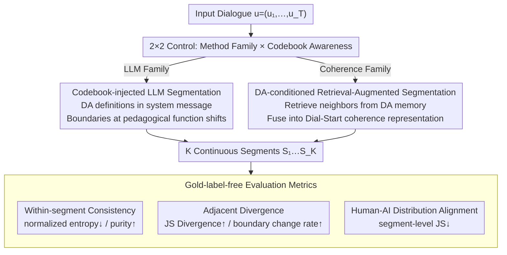

# Codebook-Injected Dialogue Segmentation for Multi-Utterance Constructs Annotation: LLM-Assisted and Gold-Label-Free Evaluation

**Conference**: ACL 2026  
**arXiv**: [2601.12061](https://arxiv.org/abs/2601.12061)  
**Code**: https://github.com/National-Tutoring-Observatory/codebook-injected-segmentation (Yes)  
**Area**: Dialogue Segmentation / Educational Dialogue Annotation  
**Keywords**: dialogue act annotation, codebook-injected segmentation, LLM annotation, gold-free evaluation, educational dialogue

## TL;DR
The paper reformulates dialogue act annotation as a two-step "segment-then-label" problem. It proposes two approaches: codebook-injected LLM segmentation (System 1) and Dial-Start with DA-aware retrieval augmentation (System 2). It further introduces three categories of evaluation metrics that do not require gold boundaries (within-segment consistency, adjacent segment divergence, and human-AI distribution alignment). Experiments on TalkMoves and CLASS-annotated educational dialogues demonstrate that DA-aware prompting enables LLMs to produce more homogeneous segments, though coherence-based baselines and LLMs excel in different evaluation dimensions with no single optimal solution.

## Background & Motivation

**Background**: Dialogue Act (DA) annotation typically defaults to labels applied to a single utterance or turn, using inter-annotator agreement (IRR) as a quality metric. Early segmentation work followed vocabulary-cohesion methods like TextTiling, C99, and LCseg, while recent research has shifted toward contrastive learning (Dial-Start) and LLM prompting.

**Limitations of Prior Work**: In educational dialogues, "pedagogical moves" naturally span multiple utterances—for instance, a teacher's explanation may be interspersed with short student responses like "mhm" or "why." Annotators often disagree on boundaries (e.g., whether this constitutes one continuous explanation), even when they agree on the underlying label. Enforcing utterance-level annotation and measuring IRR misinterprets these boundary variances as conceptual disagreements, inflating disagreement and masking actual span-level alignment.

**Key Challenge**: The unit-of-analysis problem—"what the label is" and "where the label begins/ends" are independent dimensions. Prevailing pipelines couple them at the utterance level, creating artificial disagreement. Furthermore, the educational domain lacks gold segment annotations due to high costs and inherent ambiguity, rendering classic boundary metrics like $P_k$ or WindowDiff inapplicable.

**Goal**: (1) Isolate segmentation as a first-order design task; (2) explicitly inject the codebook (DA definitions) into the segmentation stage to align boundary decisions with downstream labeling; (3) establish a set of comparable distribution-based evaluation metrics in the absence of gold segments.

**Key Insight**: The authors treat both LLMs and coherence-based methods as candidate segmenters, with the primary manipulation being whether the segmenter has access to the codebook (DA-aware vs. text-only) in a $2 \times 2$ controlled experiment. Meanwhile, utterance-level labels from both humans and GPT-5 are used to calculate "human-AI distributional agreement" as an evaluation metric.

**Core Idea**: Treat dialogue segmentation as an optimization problem for downstream annotation rather than general coherence. By presenting the codebook to the segmenter, boundary decisions are made to serve the target DA, which is then evaluated using three types of gold-free metrics.

## Method

### Overall Architecture
For a dialogue $\mathbf{u}=(u_1, \ldots, u_T)$, the segmenter outputs a set of boundaries $\mathcal{B} \subset \{1, \ldots, T-1\}$, partitioning the dialogue into $K=|\mathcal{B}|+1$ continuous segments $S_1, \ldots, S_K$. These are then scored using gold-free metrics. The core experimental manipulation is a 2 (method family) $\times$ 2 (codebook awareness) setup: Method families include LLM-zero-shot (GPT-5 / Gemini-3-pro, using topic-shift prompts to output boundary indices in JSON) and Dial-Start (non-LLM, employing a contrastive utterance encoder $f(\cdot)$ to calculate depth scores and selecting boundaries where $\text{thr} = \mu + \alpha \sigma$). Codebook awareness determines if the segmenter sees DA definitions—via system messages for LLMs or DA-conditioned retrieval for Dial-Start. Evaluation covers within-segment consistency (normalized entropy ↓ / purity ↑), adjacent segment divergence (JS divergence ↑ / boundary change rate ↑), and human-AI distribution alignment (segment-level JS ↓).

### Key Designs

**1. Codebook-injected LLM segmentation: Aligning "where to cut" with "what to label"**

Traditional topic-shift prompts rely on "thematic changes," often failing to cut at pedagogical function shifts (e.g., transitioning from explanation to questioning) where the content remains consistent. **Ours** inserts full move definitions (e.g., 6 TalkMoves or 4 CLASS support categories) into the zero-shot prompt, instructing the model to "place boundaries when the pedagogical function changes, without labeling the segment." By internalizing the pedagogical move as the unit-of-analysis, LLMs align boundaries with downstream labels. In experiments, this reduced normalized entropy for GPT-5 on CLASS from 0.349 to 0.286 and increased purity from 0.546 to 0.570, achieving the highest within-segment consistency among all methods.

**2. DA-conditioned retrieval-augmented coherence segmentation: Injecting codebook semantics without retraining**

Directly fine-tuning Dial-Start requires boundary labels, which are absent in this domain. Instead, **Ours** uses retrieval-based injection. An expert-labeled DA memory $\mathcal{M}=\{(h_j, m_j)\}$ is maintained. For an utterance $u_i$, its embedding $h_i=f(u_i)$ is used to retrieve the top-$K_{\text{ret}}$ neighbors. Attention weights are computed via cosine similarity and a temperature $\tau$ to aggregate DA embeddings $r_i=\sum_k a_k e_{m_{j_k}}$. This is fused back into the representation $\hat{h}_i=\text{norm}(h_i+\alpha r_i)$ for Dial-Start's similarity calculation. While intended to help boundary scores reflect DA consistency, results showed this was more effective for LLMs than for Dial-Start (where entropy increased on CLASS from 0.303 to 0.319), suggesting DA-awareness aligns better with instruction-following models.

**3. Gold-label-free evaluation metrics: Measuring segmentation via statistical properties of DA distributions**

Since $P_k$ and WindowDiff require reference boundaries, **Ours** uses DA distributions as indirect signals. Each segment $S_k$ is converted into a DA distribution $p_{k,c}^{(r)}=\frac{1}{|S_k|}\sum_{u_i\in S_k}\mathbb{1}[y_i^{(r)}=c]$, with segment weight $w_k=|S_k|/T$. Metrics analyze three objectives: Within-segment consistency via normalized entropy $\widetilde{H}_k^{(r)}=H_k^{(r)}/\log_2 C$ (↓) and purity $\max_c p_{k,c}^{(r)}$ (↑); Adjacent divergence via JS divergence $\overline{\text{JS}}_{\text{adj}}^{(r)}$ (↑) and boundary change rate $\text{BCR}^{(r)}$ (↑); and Human-AI alignment via $\overline{\text{JS}}_{\text{HA}}=\sum_k w_k \text{JS}(p_k^{(H)}, p_k^{(A)})$ (↓). This multi-objective framework exposes segmentation as a complex design trade-off rather than a linear quality ranking.

### Loss & Training
No new models are trained. Dial-Start uses the original contrastive utterance encoder with hyperparameters: window_size=2, $\alpha$=0.5, pick_num=4, min_gap=3. LLMs (GPT-5 / Gemini-3-pro) use fixed prompts and decoding. Retrieval-augmented Dial-Start utilizes $K_{\text{ret}}$ neighbors and temperature softmax with learned move-embeddings $E\in\mathbb{R}^{M\times d}$ (where $M$=6 or 4), but the boundary detector remains frozen.

## Key Experimental Results

### Main Results (mean [95% CI], K = average segments per dialogue)

CLASS-annotated dataset (30 tutoring sessions, 4 CLASS moves):

| Method | K | Within $\widetilde{H}$ ↓ | Purity ↑ | $\overline{\text{JS}}_{\text{adj}}$ ↑ | BCR ↑ | Human-AI $\overline{\text{JS}}_{\text{HA}}$ ↓ |
|---|---|---|---|---|---|---|
| GPT-5 | 4.90 | 0.349 | 0.546 | 0.447 | 0.222 | 0.424 |
| **GPT-5 DA-aware** | 6.30 | **0.286** | 0.570 | 0.477 | **0.288** | 0.449 |
| Gemini-3-pro | 4.47 | 0.384 | 0.528 | 0.447 | 0.237 | **0.407** |
| Gemini-3-pro DA-aware | 4.53 | 0.391 | 0.531 | 0.435 | 0.267 | 0.411 |
| Prev. SOTA (Dial-Start) | 4.60 | 0.303 | 0.564 | **0.545** | 0.208 | 0.459 |
| Dial-Start + DA-aware | 4.50 | 0.319 | 0.561 | 0.515 | 0.253 | 0.484 |

TalkMoves dataset (63 K-12 math transcripts, 6 talk moves):

| Method | K | Within $\widetilde{H}$ ↓ | Purity ↑ | $\overline{\text{JS}}_{\text{adj}}$ ↑ | BCR ↑ | Human-AI $\overline{\text{JS}}_{\text{HA}}$ ↓ |
|---|---|---|---|---|---|---|
| GPT-5 | 10.86 | 0.616 | 0.659 | 0.447 | 0.235 | **0.470** |
| GPT-5 DA-aware | 12.54 | 0.609 | 0.664 | 0.470 | 0.222 | 0.489 |
| Gemini-3-pro | 16.62 | 0.598 | 0.662 | 0.471 | 0.235 | 0.480 |
| **Gemini-3-pro DA-aware** | 19.53 | **0.566** | **0.676** | **0.478** | 0.252 | 0.505 |
| Prev. SOTA (Dial-Start) | 14.60 | 0.619 | 0.640 | 0.475 | 0.416 | 0.513 |
| Dial-Start + DA-aware | 14.75 | 0.639 | 0.633 | 0.469 | **0.524** | 0.503 |

### Ablation Study

| Analysis | Observation | Insight |
|---|---|---|
| LLM text-only → LLM DA-aware | Entropy −0.063, purity +0.024 on CLASS | DA-awareness significantly improves LLM within-segment consistency. |
| Dial-Start → Dial-Start + DA-aware | Entropy +0.016 on CLASS, −0.020 on TalkMoves | DA retrieval provides inconsistent or minimal gains for coherence-based segmenters. |
| Entropy Improvement vs. Adjacent JS | GPT-5 DA-aware has best entropy (0.286) but lower $\overline{\text{JS}}_{\text{adj}}$ (0.477) than Dial-Start (0.545) | Within-segment homogeneity often comes at the cost of boundary distinctiveness. |
| DA-aware vs. Human-AI Agreement | GPT-5 DA-aware $\overline{\text{JS}}_{\text{HA}}$ (0.449) is higher than GPT-5 (0.424) | Stringent codebook following makes LLMs less aligned with "pragmatically smoothed" human labels. |
| K Variation | DA-aware prompting increases K (4.90→6.30 in CLASS), but performance gains exceed what mere over-segmentation would explain. | Gains are not a mere artifact of finer granularity. |

## Key Findings
- **DA-aware works for LLMs, not coherence baselines**: Codebook injection thrives with instruction-following models but clashes with the "similarity drop" philosophy of traditional boundary detectors.
- **Three-way trade-offs are significant**: No method excels simultaneously in consistency, divergence, and alignment. LLMs produce more homogeneous segments, while coherence-based methods produce sharper cuts.
- **DA-aware prompting may lower human-AI agreement**: Codebook-guided LLMs follow definitions "pedantically," diverging from human annotators who tend to perform pragmatic smoothing—authors suggest this allows LLMs to act as diagnostic tools for codebook ambiguity.
- **High BCR for Dial-Start + DA-aware on TalkMoves (0.524)**: Retrieval can sharpen local boundaries in multi-party, high-density move scenarios (TalkMoves has 1.9k labeled items vs. CLASS's 301).

## Highlights & Insights
- **Repositioning segmentation as downstream optimization**: This reframing opens the path for codebook-injected designs, applicable to educational, clinical, or legal annotation.
- **Clever gold-free evaluation suite**: Using DA distribution entropy, adjacent JS, and human-AI JS allows for a unified metric framework to evaluate segments without gold standards.
- **LLMs as diagnostic tools**: The interpretation of human-AI disagreement as a signal of codebook ambiguity rather than model error provides a mature perspective for iterative annotation protocol design.
- **Clean 2×2 controlled comparison**: The method family $\times$ DA-awareness design isolates the effect of the codebook as a variable, making conclusions robust.

## Limitations & Future Work
- Authors acknowledge: (1) Gold-free metrics may miss pedagogically significant but statistically quiet shifts; (2) evaluation sensitivity depends on taxonomy quality; (3) limitations in scale (two datasets, single language/modality).
- Observations: Reliance on commercial APIs (GPT-5/Gemini) affects reproducibility; hyperparameter sensitivity for retrieval ($\alpha, \tau$) is not fully explored; latency and cost are not evaluated for real-world deployment.
- Future Work: Incorporating codebook embeddings via cross-attention; using human-AI disagreement for active learning to refine protocols; validating across multi-modal (audio/video) classroom data.

## Related Work & Insights
- **vs. Dial-Start (Gao et al. 2023)**: Dial-Start remains the strongest for "sharp boundary shifts," but loses to codebook-injected LLMs in within-segment homogeneity.
- **vs. SuperDialSeg (Jiang et al. 2023)**: While SuperDialSeg provides supervised data, **Ours** bypasses the need for gold boundaries using LLM-based design and unique metrics.
- **vs. S3-DST (Das et al. 2024)**: Unlike joint segmentation and state tracking, **Ours** treats segmentation as a first-class design component.
- **vs. EduDCM (Qi et al. 2024)**: While EduDCM decomposes constructs into acts/events, **Ours** implements a "segment-then-label" pipeline to reduce noise.

## Rating
- Novelty: ⭐⭐⭐⭐ Codebook-injected segmentation is a clear fresh perspective.
- Experimental Thoroughness: ⭐⭐⭐ Wide coverage of methods and metrics, though dataset volume is modest.
- Writing Quality: ⭐⭐⭐⭐ Transparent explanation of the unit-of-analysis problem and evaluation logic.
- Value: ⭐⭐⭐⭐ Highly transferable suite for any annotation task where labels span multiple turns.

<!-- RELATED:START -->

## Related Papers

- [\[ACL 2026\] Template-assisted Contrastive Learning of Task-oriented Dialogue Sentence Embeddings](template-assisted_contrastive_learning_of_task-oriented_dialogue_sentence_embedd.md)
- [\[ACL 2026\] ETHICMIND: A Risk-Aware Framework for Ethical-Emotional Alignment in Multi-Turn Dialogue](ethicmind_a_risk-aware_framework_for_ethical-emotional_alignment_in_multi-turn_d.md)
- [\[ACL 2026\] Discourse Coherence and Response-Guided Context Rewriting for Multi-Party Dialogue Generation](discourse_coherence_and_response-guided_context_rewriting_for_multi-party_dialog.md)
- [\[NeurIPS 2025\] AC-LoRA: (Almost) Training-Free Access Control-Aware Multi-Modal LLMs](../../NeurIPS2025/dialogue/aclora_almost_trainingfree_access_controlaware_multimodal_ll.md)
- [\[ICML 2026\] Not All Prefills Are Equal: PPD Disaggregation for Multi-turn LLM Serving](../../ICML2026/dialogue/not_all_prefills_are_equal_ppd_disaggregation_for_multi-turn_llm_serving.md)

<!-- RELATED:END -->
