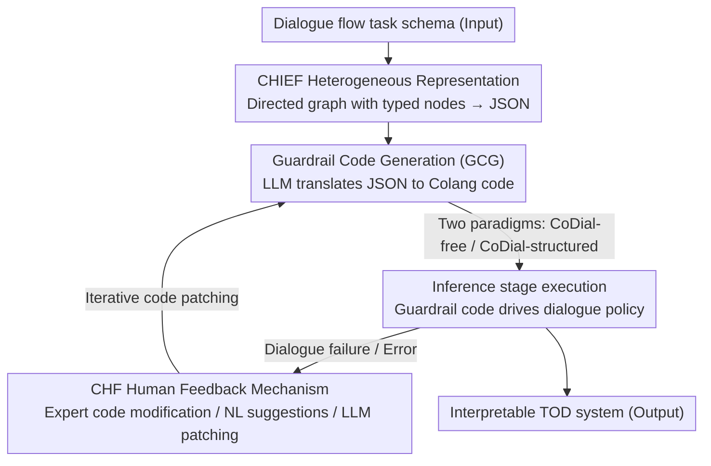

# CoDial: Interpretable Task-Oriented Dialogue Systems Through Dialogue Flow Alignment

**Conference**: ACL 2026  
**arXiv**: [2506.02264](https://arxiv.org/abs/2506.02264)  
**Code**: [https://github.com/radinshayanfar/CoDial](https://github.com/radinshayanfar/CoDial)  
**Area**: Image Generation  
**Keywords**: Task-Oriented Dialogue, LLM Guardrails, Interpretability, Dialogue Flow Alignment, Zero-shot Generalization

## TL;DR

Ours proposes CoDial, a framework that converts predefined dialogue flows (task schemas) into structured heterogeneous graphs and automatically generates LLM guardrail code (such as Colang). It achieves interpretable and controllable task-oriented dialogue policies during inference, reaching SOTA on the STAR benchmark without requiring training data.

## Background & Motivation

**Background**: Task-oriented dialogue (TOD) systems must generalize across diverse tasks. Data-driven methods struggle to transfer to unseen tasks; schema-based methods enhance generalization by decoupling language understanding from task logic but rely on neural or generative models for schema parsing, lacking interpretability.

**Limitations of Prior Work**: (1) Neural-based schema methods are opaque, preventing users from understanding how the schema affects dialogue behavior; (2) Methods like AnyTOD achieve interpretability through programmatic implementation but require users to possess manual programming skills, increasing the technical threshold; (3) Interpretability is particularly critical in high-risk domains such as law and healthcare.

**Key Challenge**: Existing TOD systems struggle to balance generalization and interpretability—neural methods offer generalization but lack transparency, while programmatic methods are interpretable but demand programming skills.

**Goal**: Design a TOD framework that requires no training data or manual programming, automatically converting dialogue flows into executable LLM guardrail programs to provide interpretable and controllable dialogue behaviors during inference.

**Key Insight**: Reposition LLM guardrails as the foundation for defining TOD system behavior, leveraging LLM code generation capabilities to automatically convert dialogue flows into guardrail code.

**Core Idea**: Dialogue flow → Heterogeneous graph (CHIEF) → Guardrail code (Colang) → Executable TOD system. The entire process is automated and inherently interpretable.

## Method

### Overall Architecture

CoDial reframes "building a task-oriented dialogue system" as "compiling a dialogue flow into an executable guardrail program." This pipeline requires neither training data nor manual programming. The input is a predefined task schema: first, it is represented as a structured heterogeneous directed graph (CHIEF), distinguishing node types such as Request, External Action, Inform, Confirm, Global, and Fallback, and encoded as JSON; then, the GCG uses an LLM to automatically translate this JSON into Colang guardrail code. This code is executed during the inference stage to drive the dialogue policy. Errors encountered during runtime are iteratively repaired through the CHF feedback mechanism (using expert advice, natural language suggestions, or LLM-aided patching). The entire process is naturally interpretable—every dialogue decision can be traced back to a specific piece of guardrail logic.

### Key Designs

**1. CHIEF Heterogeneous Dialogue Flow Representation: Structuring Task Logic via Typed Graphs**

Prior works often used homogeneous graphs where all nodes are identical, failing to distinguish between tracking a slot or calling an external API. CHIEF adopts a heterogeneous directed graph, assigning different types to nodes—Request defines slots to track, External Action calls external functions, Inform/Confirm handles information delivery and confirmation, and Global/Fallback manages global actions and defaults. These are connected via conditional edges and encoded into JSON. Typed nodes and metadata allow the schema to express complex task logic while fitting the JSON input format that LLMs process effectively, paving the way for code generation.

**2. Two Paradigms for Guardrail Code Generation (CoDial-free / CoDial-structured): From Free Generation to Structural Constraints**

The GCG translates the CHIEF JSON into executable Colang guardrails. CoDial-free provides the LLM only with Colang syntax documentation, allowing it to design guardrail logic freely as an interpretable baseline to verify the feasibility of automatic code generation. CoDial-structured explicitly instructs the LLM on how to model dialogue states and implement Dialogue State Tracking (DST) and Next Action Prediction (NAP), producing structured guardrail code. The comparison between the two serves as an ablation—experiments show that explicit structural constraints significantly enhance code quality and reliability, with CoDial-structured achieving SOTA performance.

**3. CoDial Human Feedback (CHF): Enabling Iterative Patching of Generated Guardrails**

Automatically generated guardrail code may contain errors or omissions. CHF provides three levels of feedback: (a) Expert modification, where humans directly edit the code (highest effectiveness but requires programming skills); (b) Natural language suggestions, where humans suggest changes and the LLM implements them; (c) LLM-aided feedback, where the LLM automatically analyzes failure reasons and generates suggestions. Experiments indicate that just 1–2 rounds of feedback can significantly increase dialogue success rates, making this iterative loop a key component for moving from zero-shot generation to a usable system.

### Loss & Training

CoDial is a zero-shot, training-free framework. All dialogue policies are executed by the guardrail code during the inference stage, without any gradient updates. The primary computational cost stems from two LLM calls: compiling the CHIEF JSON into Colang guardrail code and performing guardrail-based dialogue inference at runtime.

## Key Experimental Results

### Main Results

**Performance on the STAR Benchmark (Task Success Rate %)**

| Method | Training | Interpretability | Success Rate |
|------|---------|---------|--------|
| SGD-LLM | Required | No | Lower |
| AnyTOD | Training + Manual Coding | Yes | Medium |
| CoDial-free | Zero-shot | Yes | Competitive |
| CoDial-structured | Zero-shot | Yes | **SOTA** |
| CoDial-structured + CHF | Zero-shot + Feedback | Yes | **Further Gain** |

### Ablation Study

| Feedback Strategy | Effect | Description |
|----------|------|------|
| No Feedback | Baseline | Single-pass generation |
| Human Modification | Optimal | Requires programming skills |
| Human + LLM Execution | Near-Optimal | Lowers technical threshold |
| LLM-aided Feedback | Significant Gain | Fully automated |

### Key Findings

- CoDial-structured achieves SOTA on STAR and matches SOTA on MultiWOZ while being entirely zero-shot.
- The structured code generation paradigm significantly outperforms free generation, indicating that explicit structural constraints are crucial for code quality.
- Only 1-2 rounds of feedback significantly improve dialogue success rates.
- User studies confirm that code generated by CoDial is easier to understand and modify than neural-based methods.

## Highlights & Insights

- Repositions LLM guardrails from safety constraints to a general foundation for TOD behavior definition, offering a unique perspective.
- Heterogeneous graph representation is more expressive than homogeneous graphs, and JSON encoding naturally fits LLM input preferences.
- The combination of zero-shot capability and interpretability is highly valuable for real-world deployment—no labeled data is needed, and every decision is traceable to code logic.

## Limitations & Future Work

- Dependency on the Colang guardrail language; LLM familiarity with this language may be limited, potentially affecting code quality.
- The prompts for CoDial-structured are long and complex, increasing token consumption.
- Evaluation was limited to English datasets; performance in multilingual scenarios remains to be verified.
- Simulation of external actions (API calls) may differ from real-world environments.

## Related Work & Insights

- **vs AnyTOD**: AnyTOD requires manual programming and training, whereas CoDial generates code automatically in a zero-shot manner.
- **vs SGD-LLM**: Neural schema-based methods are non-interpretable, while CoDial is inherently interpretable.
- **vs NeMo Guardrails**: CoDial is the first to extend guardrails from safety constraints to a general framework for TOD behavior definition.

## Rating

- Novelty: ⭐⭐⭐⭐⭐ First to model TOD systems as automatically generated LLM guardrail programs.
- Experimental Thoroughness: ⭐⭐⭐⭐ Two benchmarks, multiple feedback strategies, and user studies, though the number of benchmarks is limited.
- Writing Quality: ⭐⭐⭐⭐ Clear framework description and detailed algorithmic pseudocode.
- Value: ⭐⭐⭐⭐ Provides a practical zero-shot framework for interpretable TOD systems.

<!-- RELATED:START -->

## Related Papers

- [\[ACL 2026\] Template-assisted Contrastive Learning of Task-oriented Dialogue Sentence Embeddings](template-assisted_contrastive_learning_of_task-oriented_dialogue_sentence_embedd.md)
- [\[ACL 2026\] ETHICMIND: A Risk-Aware Framework for Ethical-Emotional Alignment in Multi-Turn Dialogue](ethicmind_a_risk-aware_framework_for_ethical-emotional_alignment_in_multi-turn_d.md)
- [\[ACL 2025\] Know Your Mistakes: Towards Preventing Overreliance on Task-Oriented Conversational AI Through Accountability Modeling](../../ACL2025/dialogue/know_your_mistakes_towards_preventing_overreliance_on_task-oriented_conversation.md)
- [\[ACL 2026\] STRIDE-ED: A Strategy-Grounded Stepwise Reasoning Framework for Empathetic Dialogue Systems](stride-ed_a_strategy-grounded_stepwise_reasoning_framework_for_empathetic_dialog.md)
- [\[ACL 2025\] Enhancing Goal-oriented Proactive Dialogue Systems via Consistency Reflection and Correction](../../ACL2025/dialogue/enhancing_goal-oriented_proactive_dialogue_systems_via_consistency_reflection_an.md)

<!-- RELATED:END -->
