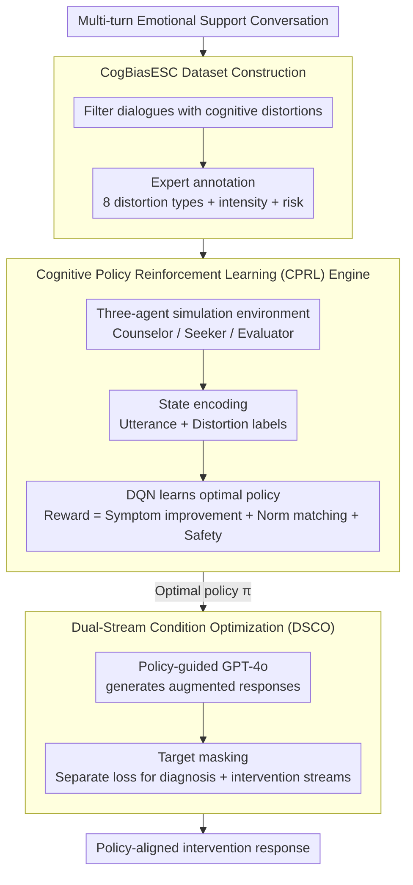

# Cognitive Policy-Driven LLM for Diagnosis and Intervention of Cognitive Distortions in Emotional Support Conversation

**Conference**: ACL 2026  
**arXiv**: [2604.17178](https://arxiv.org/abs/2604.17178)  
**Code**: [https://github.com/Chips98/CoPoLLM-for-ACL-2026](https://github.com/Chips98/CoPoLLM-for-ACL-2026)  
**Area**: Medical Imaging  
**Keywords**: Emotional Support Conversation, Cognitive Distortion, Cognitive Behavioral Therapy, Reinforcement Learning Policy, Safety Intervention

## TL;DR

The CoPoLLM framework is proposed, which constructs the first Emotional Support Conversation (ESC) dataset with cognitive distortion labels, CogBiasESC. By combining a Cognitive Policy Reinforcement Learning (CPRL) engine and Dual-Stream Condition Optimization (DSCO), the LLM can diagnose 8 types of cognitive distortions and generate policy-aware intervention responses, consistently outperforming 15 SOTA baselines.

## Background & Motivation

**Background**: LLMs have demonstrated strong empathetic capabilities in ESC tasks, with methods like SoulChat and ChatCounselor advancing fluency and empathy through SFT or DPO. However, professional psychological counseling requires not just emotional comfort but cognitive intervention based on Cognitive Behavioral Therapy (CBT).

**Limitations of Prior Work**: Existing ESC methods overlook implicit cognitive distortions in the seeker's expressions (e.g., catastrophizing, all-or-nothing thinking). Original counselor responses in existing datasets (e.g., D4, CPsyCounD) often fail to fully consider cognitive distortions, resulting in models that provide superficial comfort rather than deep cognitive-level assistance.

**Key Challenge**: There is a lack of ESC datasets with cognitive distortion annotations at the data level. At the algorithmic level, effective CBT requires precise selection of intervention strategies based on distortion type, intensity, and risk level, whereas current strategy selection mechanisms are too coarse.

**Goal**: Construct an ESC dataset with cognitive distortion annotations and design an LLM framework capable of diagnosing distortions and selecting optimal intervention strategies.

**Key Insight**: Psychological counseling is modeled as a multi-agent reinforcement learning interaction environment, allowing the counselor agent to learn optimal intervention strategies through DQN.

**Core Idea**: Use RL to learn CBT strategy selection policies, then distill this policy knowledge into the LLM via dual-stream optimization while ensuring accurate diagnosis and effective intervention.

## Method

### Overall Architecture

CoPoLLM addresses the pipeline of "diagnosing cognitive distortions in seeker utterances, then selecting the correct CBT intervention strategy." Given a multi-turn ESC, the model first learns to diagnose distortion types on annotated data. It then utilizes an RL engine to learn the optimal mapping from diagnostic states to intervention strategies. Finally, this policy knowledge is distilled into the LLM to output responses that are both diagnostically accurate and policy-aligned. The pipeline consists of two components: the CPRL engine learns policies offline using DQN in a three-agent simulation environment, and the DSCO algorithm infuses policy knowledge into the generative model while decoupling the diagnosis and intervention training streams.

### Key Designs

**1. CogBiasESC Dataset: Adding Cognitive Distortion Annotations to ESC**

Counselor responses in current ESC datasets (D4, CPsyCounD, etc.) mostly remain at the level of emotional comfort, with almost no labeling of implicit cognitive distortions. Consequently, models fail to learn cognitive-level interventions. Based on CBT theory, 8 types of cognitive distortions (e.g., emotional reasoning, catastrophizing, all-or-nothing thinking) are defined. Dialogues containing distortions were filtered from three public ESC datasets and independently annotated for type, intensity (low/medium/high), and risk level (low/medium/high) by three experts. The final dataset includes 2,499 multi-turn dialogues, 82,293 utterances, and 15,092 distortion labels, with an average of 3.2 labels per dialogue and a Fleiss' Kappa of 0.73–0.85.

**2. Cognitive Policy Reinforcement Learning (CPRL) Engine: Modeling Strategy Selection as Sequential Decision-Making with Safety Constraints**

CBT is a sequential process of "observing symptoms – selecting strategy – observing reaction – adjusting." Thus, it is modeled in a three-agent environment: the counselor agent $\mathcal{A}_{coun}$ selects actions from $K$ CBT strategies, the seeker agent $\mathcal{A}_{seek}$ generates utterances with distortions, and the evaluator agent $\mathcal{A}_{eval}$ calculates rewards. States are encoded as continuous vectors of "utterance + distortion labels," and DQN approximates the value function to learn the policy. The reward is a hybrid $R_t = \omega_1 R_{imp} + \omega_2 R_{match} + \omega_3 R_{safe}$, where symptom improvement $R_{imp}$ is evaluated by an LLM, while CBT matching $R_{match}$ and safety $R_{safe}$ are rule-based hard constraints. DQN is chosen over PPO/DPO because value-based methods can directly apply explicit penalties when unsafe strategies are chosen in high-risk states.

**3. Dual-Stream Condition Optimization (DSCO): Distilling Policy Knowledge into LLMs without Overshadowing Diagnosis**

A generative model must utilize the learned strategies. First, the trained policy $\pi_{\theta^*}$ infers the optimal strategy for each dialogue, and GPT-4o generates augmented responses under policy guidance to form CogBiasESC-PRO. Then, a target masking mechanism separates the diagnosis and intervention streams: $\mathcal{L}_{total} = \mathcal{L}_\tau(\phi; X, \mathcal{C}_t) + \mathcal{L}_\tau(\phi; X, y^*)$, where the first term calculates loss for cognitive labels $\mathcal{C}_t$ and the second for the intervention response $y^*$. This decoupling prevents the longer text of intervention responses from dominating the optimization, which would lead to the model providing comfort without proper diagnosis.

### Loss & Training

CPRL uses TD error $\mathcal{L}_{DQN}(\theta) = \mathbb{E}[(y_t - Q(s_t, a_t; \theta))^2]$ to learn the value function, employing Double DQN to decouple action selection from evaluation. The DSCO component utilizes conditional masked cross-entropy, calculating losses for the diagnosis and intervention streams separately.

## Key Experimental Results

### Main Results

CoPoLLM vs. 15 SOTA baselines (including SoulChat, ChatCounselor, PsycoLLM, etc.):

| Metric | CoPoLLM | Prev. SOTA | Gain |
|------|---------|---------|------|
| Distortion Diagnosis F1 | Best | - | Significant |
| High-Risk Missed Detection Rate (HRMDR) ↓ | Lowest | - | Major safety improvement |
| Strategy Effectiveness | Best | - | GPT/Human consistency |
| Clinical Normativity | Best | - | Confirmed by professionals |

### Ablation Study

| Configuration | Key Findings |
|------|---------|
| w/o CPRL | Strategy selection degrades to random/imitation; intervention effect drops significantly |
| w/o DSCO | LLM cannot effectively utilize policy knowledge |
| w/o $R_{safe}$ | HRMDR increases significantly |
| w/o Diagnosis Stream | Intervention responses lack specificity |

### Key Findings

- Traditional ESC methods perform poorly in cognitive distortion diagnosis, validating fundamental flaws in existing data and models.
- The hard penalty design of $R_{safe}$ is crucial for reducing high-risk misses, ensuring the model activates safety mechanisms upon detecting self-harm/suicidal tendencies.
- Emotional Reasoning (36.9%) dominates CogBiasESC, exhibiting a long-tail distribution that challenges model training.
- Decoupled dual-stream training is more effective than joint training due to the different optimization landscapes of diagnosis and intervention.

## Highlights & Insights

- Modeling psychological counseling as an RL problem is highly effective: CBT is inherently a sequential decision process—selecting strategies based on symptoms, observing reactions, and adjusting—which fits naturally into the RL framework.
- The three-agent simulation environment forms a self-contained training loop, allowing for strategy space exploration without requiring massive real-world counseling data.
- The safety mechanism design is noteworthy: rule-based hard penalties (rather than soft regularization) ensure safety in high-risk scenarios, a principle applicable to other safety-critical domains.

## Limitations & Future Work

- CogBiasESC is primarily based on Chinese datasets; cross-lingual and cross-cultural generalization remains to be verified.
- While 8 distortion types cover the core of CBT, real-world distortions are more diverse and ambiguous.
- The fidelity of the multi-agent environment depends on the role-playing capability of the LLM, potentially introducing systematic bias.
- The discrete action space of DQN limits strategy flexibility; continuous action spaces may better suit complex scenarios.

## Related Work & Insights

- **vs SoulChat/ChatCounselor**: Focus on empathy and fluency but lack cognitive intervention; CoPoLLM surpasses them in both diagnosis and intervention dimensions.
- **vs PsycoLLM**: Introduces ethical checking but strategy selection remains coarse; CoPoLLM learns finer strategy mapping via RL.
- **vs CSO (Zhao et al., 2025)**: Uses MCTS for strategy search but lacks a cognitive framework; CoPoLLM deeply integrates CBT theory into RL design.

## Rating
- Novelty: ⭐⭐⭐⭐⭐ First cognitive distortion annotated ESC dataset + RL policy framework.
- Experimental Thoroughness: ⭐⭐⭐⭐⭐ 15 baselines + multi-dimensional evaluation + human evaluation.
- Writing Quality: ⭐⭐⭐⭐ Clear framework design and strong CBT motivation.
- Value: ⭐⭐⭐⭐⭐ Drives ESC from superficial comfort towards professional cognitive intervention.

<!-- RELATED:START -->

## Related Papers

- [\[ACL 2026\] MA$^2$P: A Meta-Cognitive Autonomous Intelligent Agents Framework for Complex Persuasion](ma2p_a_meta-cognitive_autonomous_intelligent_agents_framework_for_complex_persua.md)
- [\[ACL 2026\] Stress-Testing Emotional Support Models: Moving from Homogeneous to Diverse Help Seekers](stress-testing_emotional_support_models_moving_from_homogeneous_to_diverse_help_.md)
- [\[AAAI 2026\] Chatsparent: An Interactive System for Detecting and Mitigating Cognitive Fatigue in LLMs](../../AAAI2026/dialogue/chatsparent_an_interactive_system_for_detecting_and_mitigating_cognitive_fatigue.md)
- [\[ACL 2025\] Dialogue Systems for Emotional Support via Value Reinforcement](../../ACL2025/dialogue/dialogue_systems_for_emotional_support_via_value_reinforcement.md)
- [\[ACL 2026\] ETHICMIND: A Risk-Aware Framework for Ethical-Emotional Alignment in Multi-Turn Dialogue](ethicmind_a_risk-aware_framework_for_ethical-emotional_alignment_in_multi-turn_d.md)

<!-- RELATED:END -->
