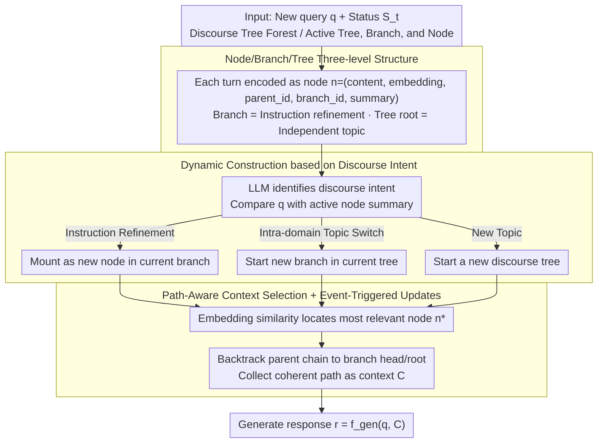

# Context-Agent: Dynamic Discourse Trees for Non-Linear Dialogue

**Conference**: ACL 2026  
**arXiv**: [2604.05552](https://arxiv.org/abs/2604.05552)  
**Code**: See GitHub (The abstract promises open-source datasets and code)  
**Area**: Dialogue Systems / Agents / Context Management  
**Keywords**: Multi-turn dialogue, dynamic trees, topic switching, context compression, long-range dialogue

## TL;DR
The authors propose Context-Agent, which models multi-turn dialogue history as a "forest of discourse trees" (where each tree represents an independent topic and each branch represent an instruction refinement/fork). Nodes are organized by navigational intent rather than semantic similarity. Accompanying the model is the NTM benchmark for evaluating non-linear long-range dialogues, demonstrating improved task completion rates and reduced token consumption across various LLMs.

## Background & Motivation

**Background**: Modern LLM Agents can handle long contexts, but dialogue history is still treated as a flat token sequence fed into the model—stacking all events chronologically without explicitly distinguishing which sentences belong to the same sub-topic.

**Limitations of Prior Work**: (1) Real-world dialogues frequently switch topics, return to previous topics, or refine earlier instructions; flat histories fail to represent this "fork + backtrack" structure. (2) Context window expansion (YaRN / LongLoRA) and compression (summarization-based) represent two extremes—the former is computationally expensive and prone to "lost-in-the-middle," while the latter loses local cues necessary for complex reasoning. (3) Structured memories like RAG, MemTree, and RAPTOR cluster by semantic similarity—but semantic proximity does not imply belonging to the same discourse thread (e.g., "traveling to Japan for vacation" and "traveling to Japan for business" might be erroneously merged).

**Key Challenge**: When dialogue history must support both long-range spans and local coherence, there is a fundamental mismatch between structural memory **organized by text similarity** and cognitive structures **organized by discourse intent**.

**Goal**: (1) Support non-linear dialogue by representing it through a structural memory that allows backtracking while maintaining local coherence. (2) Implement "event-triggered" low-cost context selection on this structure. (3) Provide a dedicated benchmark for evaluating long-range non-linear dialogues.

**Key Insight**: Drawing from the Attentional State theory (Grosz & Sidner, 1986), the human focus of attention follows a stack-based structure of topic switching and sub-topic expansion rather than arbitrary graph-like connections. Trees naturally match this "focus stack."

**Core Idea**: Model dialogue history as a "forest of discourse trees" $F_t$. Each tree represents an independent topic, and each branch represents an instruction refinement. Node/branch creation is triggered by discourse intent (topic switch / instruction refinement), and retrieval returns a coherent path instead of isolated fragments.

## Method

### Overall Architecture

Context-Agent transforms multi-turn dialogue history from a "flat token sequence" into a "forest of discourse trees," enabling the explicit representation of non-linear structures like backtracking and forking. For each turn $t+1$, the framework maintains the state $S_t = (H_t, T_{\text{act}}, B_{\text{act}}, n_{\text{cur}})$, representing the historical forest, active discourse tree, active branch, and current node. When a new query $q_{t+1}$ arrives, the process follows three steps: first, discourse classification determines if $q_{t+1}$ belongs to the current branch, a new branch of the current tree, or an entirely new topic to decide the mounting position; second, a context selection function $C_{t+1} = f_{\text{select}}(q_{t+1}, S_t)$ extracts a "coherent path" from the forest; finally, $r_{t+1} = f_{\text{gen}}(q_{t+1}, C_{t+1})$ generates the response. The optimization goal is to maximize task completion while minimizing the token count of $C_{t+1}$.

### Key Designs

**1. Node/Branch/Tree Three-level Structure: Representing Discourse Levels**

The fundamental flaw of a single flat list is its inability to express relationships like "refining the previous instruction." Thus, the authors encode each turn as a tuple $n = (c, v, p, \beta, s_i)$: where $c$ is the content, $v \in \mathbb{R}^d$ is the embedding, $p$ is the parent node ID (null for roots), $\beta$ is the branch ID, and $s_i = S_{node}(c_i)$ is the LLM-generated summary. The branch ID explicitly marks "the 3rd refinement of the same instruction," while the tree root represents an independent topic mainline, structurally ensuring that different topics do not erroneously share context. Node summaries are used for subsequent topic attribution and branch management, avoiding the overhead of re-reading full texts.

**2. Dynamic Construction based on Discourse Intent: Organizing Nodes by Navigation Intent**

This is the core differentiator of the paper. When deciding where to mount a new turn, the authors do not rely solely on embedding similarity. Instead, they use an LLM to perform discourse discrimination between $q_{t+1}$ and the summary of the active node: instruction refinement leads to a new node in the same branch, an intra-domain topic switch opens a new branch in the current tree, and a completely new topic starts a new tree. This stands in contrast to MemTree, which clusters by similarity. For instance, two conversations about "Japan" (one for tourism and one for business) may have high semantic similarity but should not be merged due to different navigational intents. Table 1 of the paper defines this as "Discourse Intent Construction + Path-Aware Retrieval," distinguishing it from RAPTOR (offline static reconstruction), MemTree (online semantic clustering), and DH-RAG (semantic chains) by isolating diverging paths to prevent context pollution.

**3. Path-Aware Context Selection + Event-Triggered Updates: Returning Paths instead of Fragments**

During retrieval, the system first finds the most relevant node $n^*$ using embedding similarity, then backtracks along the parent chain to collect the entire path to the branch head or tree root as the context $C_{t+1}$. The process stops upon reaching a different tree to ensure irrelevant cues are excluded. This yields a "complete evolution of an instruction from proposal to refinement" rather than five isolated chunks, significantly aiding local coherence in long-range refinement tasks. Updates are triggered only when nodes, branches, or trees are created, keeping maintenance costs near $O(\log N)$, much lower than the $O(N^2)$ re-computation required by summarization methods.

### Loss & Training

This work is an inference-time framework and does not require training the LLM; any LLM can be used out-of-the-box. Gains come from structural context management rather than model preferences. The accompanying NTM benchmark uses a mix of synthetic and real dialogues, intentionally inserting multiple topic switches and refinements to stress-test long-range non-linear conversations.

## Key Experimental Results

### Main Results

| Method | Structure | Construction Basis | Retrieval Unit | Local Coherence | Update Efficiency |
|------|------|----------|----------|----------|----------|
| Full Context | Linear Sequence | Token Concatenation | Full History | High | Extremely Low $O(N^2)$ |
| MemGPT | OS-like Layers | Event/Function triggers | Paged Memory | High (self-edit) | Medium |
| Standard RAG | Flat Index | Semantic Similarity | Independent Chunk | Low (fragmented) | High |
| DH-RAG | Chain | Semantic Clustering | Query Chain | High (dynamic) | Medium (incremental) |
| RAPTOR | Static Tree | Bottom-up Clustering | Abstract Summary | High | Low (offline) |
| MemTree | Dynamic Tree | Online Clustering | Collapsed Node | Medium (fragmented)| High $O(\log N)$ |
| **Ours** | **Dynamic Tree** | **Discourse Intent** | **Coherent Path** | **Very High (path-aware)** | **High (event-triggered)** |

### Ablation Study

| Configuration | Task Completion Rate | Token Consumption | Description |
|------|-----------|-----------|------|
| Linear baseline (Flat history) | Low | High | Prone to memory loss in long-range + topic switching |
| Semantic cluster tree (No discourse intent) | Medium | Medium | Local coherence compromised |
| **Full Context-Agent (Ours)** | **Highest** | **Lowest** | Benefits from discourse-aware + path retrieval |
| Across multiple LLM backbones | Consistent Gain | Consistent Reduction | Stable out-of-the-box performance |

### Key Findings
- In multiple NTM non-linear long-range scenarios, Context-Agent simultaneously improves task completion and reduces tokens—two goals that traditionally involve a trade-off. Tree-based retrieval breaks this trade-off by "only retrieving the same branch path."
- The advantage over the baseline grows as dialogue length, topic switching frequency, and instruction refinements increase; linear methods degrade significantly in these settings.
- Gains are stable across various LLM backbones, implying that improvements stem from structural context management rather than specific model biases.

## Highlights & Insights
- The separation of "Discourse intent" vs. "semantic similarity" is a crucial insight—works like MemTree misjudge by using semantics as the primary organizational basis. The true determinant of whether context should be shared is the speaker's navigational intent.
- "Path retrieval" instead of "chunk retrieval" is a simple yet powerful design: returning a coherent path allows the model to see the refinement history directly, which is more useful than five disjoint relevant chunks.
- The direct mapping of Grosz & Sidner's Attentional State theory to engineering implementation (forest of trees + focus stack) is a classic example of "old idea, new application."
- Event-triggered updates, rather than turn-by-turn re-computation, keep the framework affordable even for long dialogues, making it reusable as a low-level memory abstraction for general dialogue agents.

## Limitations & Future Work
- The tree structure assumes discourse is strictly nested, but real dialogues often feature cross-tree references (e.g., "Remember X from our Japan chat? Back to the work topic..."). A simple forest cannot easily express cross-tree dependencies.
- Discourse intent classification relies heavily on the LLM's judgment; if the LLM misidentifies a topic switch, it may create an incorrect tree/branch, affecting all subsequent retrieval.
- The ecological validity of the NTM benchmark requires further validation—synthetic non-linearity might differ from real user behavior.
- Node summaries $s_i = S_{node}(c_i)$ constitute lossy compression; details in complex instruction refinements might be lost, necessitating finer summarization strategies or links to the original text.

## Related Work & Insights
- **vs. MemTree (Dynamic Tree + Online Clustering)**: They use semantic similarity for clustering, leading to medium local coherence; Ours uses discourse intent to enforce path-awareness, resulting in very high coherence.
- **vs. RAPTOR (Static Tree + Offline Reconstruction)**: RAPTOR is costly to reconstruct; Ours uses event-triggered updates + dynamic branching, making it suitable for online dialogue.
- **vs. MemGPT (OS-like Layers + Paging)**: MemGPT treats memory as paged RAM with self-editing; Ours treats memory as a discourse tree, which is structurally closer to dialogue patterns.
- **vs. DH-RAG (Query Chain)**: DH-RAG uses chains rather than trees and cannot express parallel branches; Our forest supports concurrent topics.

## Rating
- Novelty: ⭐⭐⭐⭐ "Discourse intent + path-aware retrieval" is a clear, differentiated contribution to memory structures.
- Experimental Thoroughness: ⭐⭐⭐ Proposed the NTM benchmark and verified across multiple LLMs, though detailed values require the full paper text.
- Writing Quality: ⭐⭐⭐⭐ The connection to cognitive science (Grosz & Sidner) is natural, and the paradigm comparison table is clear.
- Value: ⭐⭐⭐⭐ Highly applicable to long-range agents, multi-step instruction refinement, and customer service/coding assistants.

<!-- RELATED:START -->

## Related Papers

- [\[ACL 2026\] Discourse Coherence and Response-Guided Context Rewriting for Multi-Party Dialogue Generation](discourse_coherence_and_response-guided_context_rewriting_for_multi-party_dialog.md)
- [\[ACL 2026\] Metro: Towards Strategy Induction from Expert Dialogue Transcripts for Non-collaborative Dialogues](metro_towards_strategy_induction_from_expert_dialogue_transcripts_for_non-collab.md)
- [\[ACL 2026\] SPASM: Stable Persona-driven Agent Simulation for Multi-turn Dialogue Generation](spasm_stable_persona-driven_agent_simulation_for_multi-turn_dialogue_generation.md)
- [\[ACL 2026\] ETHICMIND: A Risk-Aware Framework for Ethical-Emotional Alignment in Multi-Turn Dialogue](ethicmind_a_risk-aware_framework_for_ethical-emotional_alignment_in_multi-turn_d.md)
- [\[ACL 2026\] GenesisFunc: Multi-Agent Data Generation for Accurate and Generalizable Function-Calling](genesisfunc_multi-agent_data_generation_for_accurate_and_generalizable_function-.md)

<!-- RELATED:END -->
