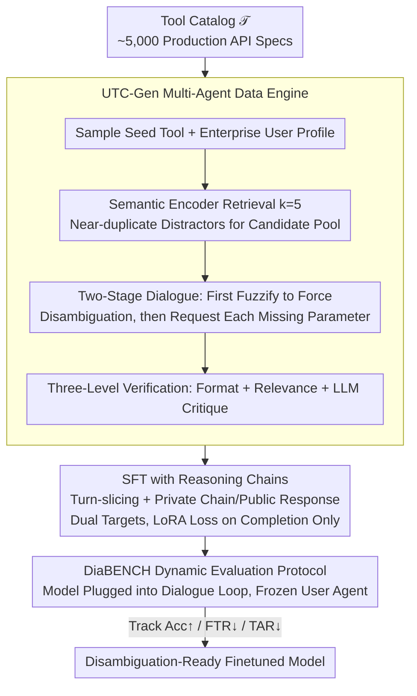

# Disambiguation-Centric Finetuning Makes Enterprise Tool-Calling LLMs More Realistic and Less Risky

**Conference**: ACL 2026 Findings  
**arXiv**: [2507.03336](https://arxiv.org/abs/2507.03336)  
**Code**: [HuggingFace](https://huggingface.co/SAP/diaforge-utc-r-0725)  
**Area**: Dialogue Systems / LLM Agent  
**Keywords**: Tool-calling, Disambiguation, Multi-turn Dialogue, Enterprise API, Finetuning

## TL;DR

The DiaFORGE framework is proposed, featuring a disambiguation-centric synthetic data generation pipeline, reasoning-chain finetuning, and a dynamic evaluation system. This allows open-source LLMs to achieve a tool-calling success rate 27 percentage points higher than GPT-4o and 49 percentage points higher than Claude-3.5-Sonnet when facing near-duplicate enterprise APIs.

## Background & Motivation

**Background**: LLMs are evolving from dialogue assistants into operational agents capable of calling APIs. Enterprise environments manage thousands of APIs, many of which are slight variants of core functions (e.g., different versions for customer support, finance, or supply chain).

**Limitations of Prior Work**: In reality, approximately 35-38% of queries retrieve highly similar distractor APIs, 71% of APIs have mandatory parameters, and 76-81% of calls miss at least one required field. However, existing tool-calling benchmarks (BFCL, ToolBench, API-Bank) use static evaluations with pre-written user scripts, failing to expose the "incomplete request + near-duplicate tool" cascade failure mode.

**Key Challenge**: Enterprise tool-calling requires two tightly intertwined capabilities—multi-turn dialogue to complete missing parameters and fine-grained disambiguation over a dense, overlapping API surface—yet existing training data and evaluation methods ignore this.

**Goal**: (1) Construct disambiguation-centric training data, (2) finetune open-source models to learn proactive questioning and precise tool selection, and (3) design a dynamic evaluation framework to measure end-to-end goal completion rates.

**Key Insight**: Authors from SAP Labs utilized real-world enterprise API production telemetry data to identify that disambiguation is the core bottleneck in tool-calling.

**Core Idea**: Use a "bottom-up" multi-agent data engine to synthesize disambiguation-centric dialogues—providing the assistant with sets of near-duplicate tools and intentionally hiding key information to force the assistant to learn to disambiguate before calling.

## Method

### Overall Architecture

DiaFORGE addresses the "incomplete request + near-duplicate tool" cascade failure in enterprise settings. The input is a tool catalog $\mathcal{T}$ consisting of approximately 5,000 production-grade API specifications, and the output is a finetuned model that learns to disambiguate before calling. The pipeline consists of three stages: the UTC-Gen data engine synthesizes disambiguation-centric dialogues from the bottom up; supervised finetuning with reasoning chains injects this capability into open-source models; and finally, a dual-track static and dynamic evaluation verifies end-to-end goal completion in real dialogue loops.

### Key Designs

**1. UTC-Gen Multi-Agent Data Engine: Making Disambiguation a Hard Constraint for Synthesis**

Existing datasets generally assume user requests are fully specified, leaving models no opportunity to learn how to handle ambiguity. UTC-Gen does the opposite: for each seed tool $\tau^*$, it samples an enterprise user profile $p$ and uses a semantic encoder $\phi$ to retrieve $k=5$ nearest-neighbor distractor tools to form a candidate pool $\mathcal{C}_k(\tau^*)$, structurally creating near-duplicate confusion. Dialogues are forced into two stages: in the tool selection stage, the user intentionally speaks ambiguously, forcing the assistant to eliminate distractors through questioning; in the parameter completion stage, the assistant requests missing mandatory fields one-by-one. All synthesized dialogues pass through format, relevance, and LLM critique verification before storage to ensure clean training signals.

**2. SFT with Reasoning Chains: Making the Model Know Why, Not Just What**

If tool selection relies on pattern matching, it easily fails with near-duplicate tools. Therefore, the authors require the model to generate an interpretable reasoning process before calling. Training employs a turn-slicing strategy, constructing input-target pairs $x_{i,t} = [\text{SYS}]\;u_1\;a_1\;\ldots\;u_t$ and $y_{i,t} = a_t$ for each assistant turn. Each assistant response is split into a private reasoning chain (thought process) and a public response, both of which are learning targets. Finetuning uses LoRA with loss calculation restricted to the completion tokens, teaching the model to explicitly explain "why certain distractors were excluded" rather than guessing in a black-box manner.

**3. DiaBENCH Dynamic Evaluation Protocol: Measuring End-to-End Success in Live Loops**

Static evaluations with pre-written scripts cannot capture the cascade effect of how an assistant's turn affects the user's next response. DiaBENCH re-inserts the finetuned model as the assistant into the UTC-Gen loop, freezes the user agent policy, and conducts up to $T_{max}$ rounds of interaction to generate full trajectories. It tracks three metrics: Accuracy (Acc, both tool and parameters correct), False Trigger Rate (FTR, calling the wrong tool), and Trigger Abstention Rate (TAR, failing to call when necessary). The user agent utilizes multi-sampling and voting to reduce evaluation noise, making results more representative of real deployment scenarios.

### Loss & Training

Training follows standard SFT + LoRA using AdamW for a single epoch. The data consists of 13,649 turn-sliced completion samples derived from 5,000 DiaFORGE dialogues. Loss is calculated only on the completion tokens (loss masking) to avoid including user inputs in the optimization target.

## Key Experimental Results

### Main Results

DiaBENCH dynamic evaluation results (Accuracy Acc↑ / False Trigger Rate FTR↓ / Trigger Abstention Rate TAR↓):

| Model | Acc↑ | FTR↓ | TAR↓ |
|------|------|------|------|
| GPT-4o | 0.62 | 0.02 | 0.36 |
| GPT-4o-fc | 0.56 | 0.59 | 0.05 |
| Claude-3.5-Sonnet | 0.39 | 0.03 | 0.55 |
| Gemma-3-DiaFORGE-27B | **0.89** | 0.03 | 0.03 |
| Nemotron-DiaFORGE-49B | **0.89** | 0.06 | 0.03 |
| Gemma-3-DiaFORGE-4B | 0.81 | 0.09 | 0.05 |
| Llama-3.2-DiaFORGE-3B | 0.80 | 0.08 | 0.06 |

### Ablation Study

Ablation based on Gemma-3-27B (Dynamic Eval Acc):

| Setting | Acc↑ | FTR↓ | TAR↓ |
|------|------|------|------|
| Full DiaFORGE | 0.89 | 0.03 | 0.03 |
| w/o Verification Cascade | 0.56 | 0.06 | 0.35 |
| w/o Near-duplicate Sampling | 0.63 | 0.18 | 0.19 |
| w/o Reasoning Chain | 0.77 | 0.16 | 0.04 |

### Key Findings

- With only 5,000 synthetic dialogues for finetuning, a 3B small model can outperform GPT-4o in dynamic evaluation (0.80 vs 0.62).
- Native function-calling modes (indicated by -fc) actually increase the False Trigger Rate; GPT-4o-fc's FTR reaches as high as 0.59.
- In a scenario with 10K daily tool calls, GPT-4o would result in ~3,500-3,800 abstentions or 5,500-6,000 incorrect calls, while DiaFORGE models result in only 250-350 total failures.
- Near-duplicate distractor sampling is the most critical component; removing it causes the FTR to jump from 0.03 to 0.18.

## Highlights & Insights

- Data-driven insights from SAP production environments are highly compelling: 35-38% of queries encounter near-duplicate tools, and 76-81% of calls lack parameters.
- The conceptual shift of elevating disambiguation from an "incidental requirement" to a "core training objective" is highly inspiring.
- The dynamic evaluation framework fills a major gap in existing tool-calling benchmarks.

## Limitations & Future Work

- DiaBENCH contains only 119 seed tools, which is limited in scale.
- User agents are still simulated by LLMs, which may differ from real human behavior.
- Retrieval-augmented tool selection was not explored; retrieval quality will become a new bottleneck as the number of tools grows further.

## Related Work & Insights

- ReAct and HuggingGPT established the basic paradigm of LLMs as tool-calling agents; DiaFORGE complements this with disambiguation capabilities.
- APIGen and ToolACE focus on data verification but assume fully specified requests; DiaFORGE's disambiguation-centric strategy is a vital complement.
- Insight: The core challenge for enterprise-grade AI Agents is not "can it call a tool," but "can it safely refrain from calling or clarify when faced with ambiguity."

## Rating

- Novelty: ⭐⭐⭐⭐ The disambiguation-centric problem definition and systematic solution are unique in the tool-calling field.
- Experimental Thoroughness: ⭐⭐⭐⭐⭐ 6 open-source models + 2 closed-source models, dual-track static and dynamic evaluation, and comprehensive ablations.
- Writing Quality: ⭐⭐⭐⭐ Clear motivation, persuasive industrial perspective, and coherent logic despite the density of mathematical notation.

<!-- RELATED:START -->

## Related Papers

- [\[NeurIPS 2025\] Less is More: Local Intrinsic Dimensions of Contextual Language Models](../../NeurIPS2025/dialogue/less_is_more_local_intrinsic_dimensions_of_contextual_language_models.md)
- [\[ACL 2026\] GenesisFunc: Multi-Agent Data Generation for Accurate and Generalizable Function-Calling](genesisfunc_multi-agent_data_generation_for_accurate_and_generalizable_function-.md)
- [\[ICLR 2026\] Non-Collaborative User Simulators for Tool Agents](../../ICLR2026/dialogue/non-collaborative_user_simulators_for_tool_agents.md)
- [\[ACL 2026\] Reasoning Gets Harder for LLMs Inside A Dialogue](reasoning_gets_harder_for_llms_inside_a_dialogue.md)
- [\[ACL 2026\] Preference Learning Unlocks LLMs' Psycho-Counseling Skills](preference_learning_unlocks_llms_psycho-counseling_skills.md)

<!-- RELATED:END -->
