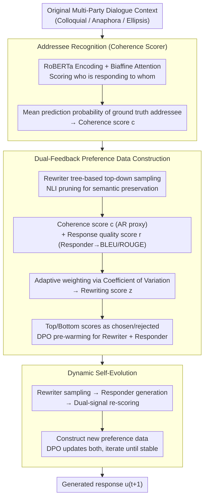

# Discourse Coherence and Response-Guided Context Rewriting for Multi-Party Dialogue Generation

**Conference**: ACL 2026  
**arXiv**: [2604.06784](https://arxiv.org/abs/2604.06784)  
**Code**: None  
**Area**: Dialogue Systems / Multi-Party Dialogue  
**Keywords**: Multi-party dialogue, context rewriting, discourse coherence, preference learning, dynamic self-evolution

## TL;DR

This paper proposes DRCR, the first framework to introduce context rewriting into multi-party dialogue generation. It utilizes dual feedback signals—discourse coherence and response quality—to construct preference data, enabling the rewriter and responder to mutually enhance each other through iterative dynamic self-evolution.

## Background & Motivation

**Background**: Multi-party dialogue generation (MDG) involves multiple roles and complex discourse structures (interaction relationships across multiple utterances), making it significantly more challenging than dyadic dialogue. Existing methods assist generation by encoding dialogue structure information.

**Limitations of Prior Work**: (1) Colloquial expressions and incomplete utterances (e.g., anaphora, ellipsis) in dialogues impair discourse coherence, which in turn affects the quality of dialogue structure representation; (2) Previous methods directly encode structures using flawed dialogue contexts without attempting to improve context quality first; (3) These issues are more prominent in multi-party dialogues where multiple speakers increase the complexity of anaphora and ellipsis.

**Key Challenge**: The quality of dialogue structure encoding depends on context coherence, but colloquial expressions and omissions in the original context disrupt this coherence. Simple rewriting may fail to balance discourse coherence with the quality of downstream response generation.

**Goal**: To enhance the quality of multi-party dialogue generation through dialogue context rewriting, while ensuring that rewriting both improves discourse coherence and facilitates the generation of high-quality responses.

**Key Insight**: Using discourse coherence quality and response generation quality as dual feedback signals to construct preference data, training a rewriter to generate contexts that are both coherent and beneficial for response generation.

**Core Idea**: The rewriter and responder are mutually enhanced through iterative training—better rewriting produces better responses, and better response feedback guides better rewriting.

## Method

### Overall Architecture

DRCR decomposes the task of "cleaning colloquial multi-party dialogue contexts containing ellipses and anaphora before encoding structure for response generation" into a closed loop coordinated by two modules: a Rewriter and a Responder. The entire process proceeds in three stages: ① Training an Addressee Recognition (AR) classifier to score the discourse coherence of the context; ② Constructing preference data by ranking candidates sampled from the rewriter using both discourse coherence and response quality signals, followed by DPO pre-warming for both the rewriter and responder; ③ Allowing both modules to iterate through dynamic self-evolution based on mutual feedback until the rewriting is both "readable" and "useful for downstream generation."

### Key Designs

**1. Addressee Recognition: Transforming "Discourse Coherence" into a Scorable Proxy Signal**

Multi-party dialogues are dense with anaphora and ellipses. If the original context is encoded with these flaws, the discourse structure representation becomes distorted—yet "coherence" itself is difficult to quantify. DRCR leverages an observation: if a dialogue is sufficiently coherent, a model can easily determine which utterance is responding to whom. Consequently, an Addressee Recognition (AR) classifier is trained using RoBERTa to encode context followed by biaffine attention to score every pair of utterances. The average prediction probability assigned to the ground truth addressees is then used as the coherence score $c$ for the context. In this way, "readability" is translated into a comparable numerical value, serving as the source of coherence feedback for ranking rewriting candidates.

**2. Dual-Feedback Preference Data Construction: Adaptive Weighting of Coherence and Response Quality**

Coherence alone is insufficient—smoothing the context while losing information critical for generation is counterproductive. Thus, DRCR assigns two scores to each rewriting candidate: a coherence score $c$ (from the AR classifier in Design 1) measuring upstream readability, and a response quality score $r$ (calculated via BLEU-1 + ROUGE-L between the responder's generation and the ground truth) measuring downstream utility. Candidates are generated utterance-by-utterance via "tree-based top-down sampling," with branches deviating from the original meaning pruned using Natural Language Inference (NLI). To address the weighting of these two scores, DRCR employs the Coefficient of Variation ($CV = \sigma / \mu$): whichever signal shows higher fluctuation and discriminative power within a batch of candidates receives a higher weight. These are fused via softmax normalization into a final rewriting score $z$. Finally, candidates with the highest and lowest scores are selected as chosen/rejected preference pairs for DPO pre-warming of the rewriter and responder.

**3. Dynamic Self-Evolution: Mutual Iterative Training Without External Data Dependence**

The preference data in the pre-warming phase originates from an external teacher LLM and remains static. However, during training, the preferences of the two modules shift, rendering static data obsolete. DRCR allows the modules to undergo self-evolution: in each round, the current rewriter samples new candidates, the current responder generates responses, and scores are recalculated based on the dual signals from Design 1/2. This generates new preference data for the current round to update both modules via DPO. If a rewriting candidate's score exceeds that of the original context, it directly replaces the original to denoise the input. This creates a self-strengthening loop of "better rewriting → better responses → better feedback → better rewriting" until both rewriting and response quality stabilize.

### Loss & Training

Both the rewriter and responder adopt DPO-style preference learning. Preference pairs are jointly constructed from discourse coherence and response quality signals. Iterative training continues until the quality of both rewriting and response generation stabilizes.

## Key Experimental Results

### Main Results

**BLEU/ROUGE scores across four multi-party dialogue datasets**

| Method | Dataset 1 | Dataset 2 | Dataset 3 | Dataset 4 |
|------|--------|--------|--------|--------|
| SS-MPC (Prev. SOTA) | Baseline | Baseline | Baseline | Baseline |
| LLM Direct Gen | Medium | Medium | Medium | Medium |
| **DRCR (Ours)** | **Surpasses** | **Surpasses** | **Surpasses** | **Surpasses** |

### Ablation Study

| Configuration | Effect | Description |
|------|------|------|
| Coherence feedback only | Limited Gain | Lacks downstream signal |
| Response quality feedback only | Gain | Direct optimization of objective |
| Dual feedback | Optimal | Complementary signals |
| Without self-evolution (Single stage) | Sub-optimal | Lacks collaborative optimization |
| With self-evolution | Optimal | Iterative improvement |

### Key Findings

- DRCR surpasses previous SOTA methods on all four multi-party dialogue datasets.
- Dual feedback signals outperform single signals—discourse coherence and response quality provide complementary perspectives.
- Iterative training through dynamic self-evolution significantly outperforms single-stage training, demonstrating a synergistic effect between the rewriter and responder.
- Context rewriting effectively eliminates comprehension barriers caused by anaphora and ellipses.

## Highlights & Insights

- First introduction of context rewriting to multi-party dialogue generation—addressing the often-overlooked issue of colloquialism.
- The dual-feedback + self-evolution design forms an elegant closed-loop optimization.
- As a pre-processing step, rewriting is orthogonal to existing generation methods and can be layered on top of them.

## Limitations & Future Work

- Rewriting increases computational overhead during inference due to the additional rewriting step.
- The number of iterations and convergence conditions for self-evolution require further empirical determination.
- Validation was limited to Chinese multi-party dialogue datasets; cross-lingual effectiveness remains to be confirmed.
- Rewriting might introduce information bias, particularly in scenarios involving ambiguous intentions.

## Related Work & Insights

- **vs SS-MPC**: SS-MPC directly encodes original dialogue structures, whereas DRCR rewrites before encoding.
- **vs Query Rewriting**: Query rewriting in search inspired the context rewriting in dialogue, though multi-party dialogue structures are considerably more complex.

## Rating

- Novelty: ⭐⭐⭐⭐ First application of context rewriting + dual-feedback self-evolution in multi-party dialogues.
- Experimental Thoroughness: ⭐⭐⭐⭐ Four datasets with detailed ablations.
- Writing Quality: ⭐⭐⭐⭐ Clear framework description and intuitive examples.
- Value: ⭐⭐⭐⭐ Provides a new preprocessing paradigm for multi-party dialogue generation.

<!-- RELATED:START -->

## Related Papers

- [\[ACL 2026\] Context-Agent: Dynamic Discourse Trees for Non-Linear Dialogue](context-agent_dynamic_discourse_trees_for_non-linear_dialogue.md)
- [\[ICML 2026\] Context-Driven Incremental Compression for Multi-Turn Dialogue Generation](../../ICML2026/dialogue/context-driven_incremental_compression_for_multi-turn_dialogue_generation.md)
- [\[ACL 2026\] Author-in-the-Loop Response Generation and Evaluation: Integrating Author Expertise and Intent in Responses to Peer Review](author-in-the-loop_response_generation_and_evaluation_integrating_author_experti.md)
- [\[ACL 2026\] SPASM: Stable Persona-driven Agent Simulation for Multi-turn Dialogue Generation](spasm_stable_persona-driven_agent_simulation_for_multi-turn_dialogue_generation.md)
- [\[ACL 2026\] ETHICMIND: A Risk-Aware Framework for Ethical-Emotional Alignment in Multi-Turn Dialogue](ethicmind_a_risk-aware_framework_for_ethical-emotional_alignment_in_multi-turn_d.md)

<!-- RELATED:END -->
