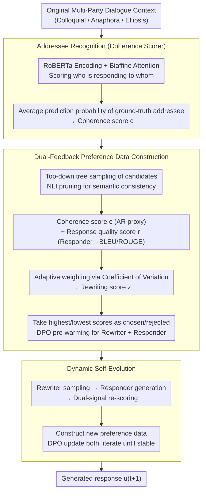

# Discourse Coherence and Response-Guided Context Rewriting for Multi-Party Dialogue Generation

**Conference**: ACL 2026  
**arXiv**: [2604.06784](https://arxiv.org/abs/2604.06784)  
**Code**: None  
**Area**: Dialogue Systems / Multi-Party Dialogue  
**Keywords**: Multi-party Dialogue, Context Rewriting, Discourse Coherence, Preference Learning, Dynamic Self-Evolution

## TL;DR

This paper proposes DRCR, the first framework to introduce context rewriting into multi-party dialogue generation. It utilizes dual feedback signals—discourse coherence and response quality—to construct preference data, enabling the rewriter and responder to mutually enhance each other through iterative training via dynamic self-evolution.

## Background & Motivation

**Background**: Multi-party dialogue generation (MDG) involves multiple roles and complex discourse structures (utterance relationships spanning multiple turns), making it significantly more challenging than two-party dialogue. Existing methods assist generation by encoding dialogue structure information.

**Limitations of Prior Work**: (1) Colloquial expressions and incomplete utterances (e.g., anaphora, ellipsis) in dialogues impair discourse coherence, which in turn affects the representation quality of dialogue structures; (2) Previous methods directly encode structures using flawed dialogue contexts without attempting to improve context quality first; (3) These issues are more prominent in multi-party dialogues, where multiple speakers increase the complexity of anaphora and ellipsis.

**Key Challenge**: The quality of dialogue structure encoding depends on context coherence, yet colloquial expressions and omissions in raw contexts disrupt this coherence. Simple rewriting may fail to balance discourse coherence with the quality of downstream response generation.

**Goal**: To enhance multi-party dialogue generation quality through context rewriting while ensuring that the rewriting improves discourse coherence and facilitates high-quality response generation.

**Key Insight**: Utilize discourse coherence quality and response generation quality as dual feedback signals to construct preference data, training the rewriter to generate contexts that are both coherent and beneficial for response generation.

**Core Idea**: The rewriter and responder mutually enhance each other through iterative training—better rewriting produces better responses, and better response feedback guides better rewriting.

## Method

### Overall Architecture

DRCR decomposes the task of "cleaning colloquial, elliptical, and anaphoric multi-party dialogue contexts before encoding structure for response generation" into a closed-loop system of two collaborating modules: a Rewriter and a Responder. The entire process proceeds in three stages: ① Training an Addressee Recognition classifier to score discourse coherence; ② Constructing preference data by ranking candidates sampled from the rewriter using both coherence and response quality signals, followed by DPO pre-warming for both modules; ③ Allowing both modules to iterate through dynamic self-evolution based on mutual feedback until the rewriting is both "readable" and "useful for downstream generation."

### Key Designs

**1. Addressee Recognition: Turning "Discourse Coherence" into a Scorable Proxy Signal**

Multi-party dialogues are dense with anaphora and ellipsis. If raw contexts are encoded with these flaws, the discourse structure representation becomes distorted—yet "coherence" itself is difficult to quantify. DRCR leverages an observation: if a dialogue is coherent enough, a model can easily determine which utterance is responding to whom. Thus, it first trains an Addressee Recognition (AR) classifier using RoBERTa encoding and biaffine attention to score every pair of utterances. The average prediction probability assigned to the ground-truth addressee is then used as the coherence score $c$ for the context. This translates "readability" into a comparable numerical value, serving as a feedback source for ranking rewriting candidates.

**2. Dual-Feedback Preference Data Construction: Adaptive Weighting of Coherence and Response Quality**

Coherence alone is insufficient—rewriting a context to be fluent while losing information critical to generation is counterproductive. Therefore, DRCR assigns two scores to each rewriting candidate: a coherence score $c$ (from the AR classifier) to measure upstream readability, and a response quality score $r$ (calculated via BLEU-1 + ROUGE-L by generating a response with the responder) to measure downstream utility. Candidates are generated turn-by-turn via "top-down tree sampling" and pruned using Natural Language Inference (NLI) to remove branches deviating from the original meaning. To balance the two scores, DRCR employs the Coefficient of Variation (standard deviation/mean) for adaptive weighting: signals with higher fluctuation and discriminative power among candidates receive higher weights, merged into a rewriting score $z$ via softmax normalization. Finally, the highest and lowest scoring candidates are selected as chosen/rejected pairs for DPO pre-warming.

**3. Dynamic Self-Evolution: Mutual Iteration of Rewriter and Responder**

Preference data in the pre-warming stage comes from a static external teacher LLM; however, the preferences of the two modules shift during training, and static data cannot adapt. DRCR enables the two to evolve through alternating iterations—each round uses the current rewriter to sample new candidates and the current responder to generate responses, followed by re-scoring via the dual signals described in Designs 1 and 2. New preference data is then constructed to update both modules via DPO. If a rewriting candidate's score exceeds that of the original context, it replaces the original to denoise the data. This "better rewriting → better response → better feedback → better rewriting" chain forms a self-strengthening cycle until both rewriting and response quality stabilize.

### Loss & Training

Both the rewriter and responder utilize DPO-style preference learning. Preference pairs are jointly constructed from discourse coherence and response quality signals. Iterative training continues until both rewriting and response qualities reach stability.

## Key Experimental Results

### Main Results

**BLEU/ROUGE Scores on Four Multi-Party Dialogue Datasets**

| Method | Dataset 1 | Dataset 2 | Dataset 3 | Dataset 4 |
|------|--------|--------|--------|--------|
| SS-MPC (Prev. SOTA) | Baseline | Baseline | Baseline | Baseline |
| LLM Direct Generation | Medium | Medium | Medium | Medium |
| **DRCR (Ours)** | **Outperforms** | **Outperforms** | **Outperforms** | **Outperforms** |

### Ablation Study

| Configuration | Effect | Description |
|------|------|------|
| Only Coherence Feedback | Limited Gain | Lacks downstream signal |
| Only Response Quality Feedback | Gain | Directly optimizes the objective |
| Dual Feedback | Best | Signals are complementary |
| No Self-Evolution (Single Training) | Suboptimal | Lacks collaborative optimization |
| With Self-Evolution | Best | Iterative enhancement |

### Key Findings

- DRCR outperforms the Prev. SOTA across all four multi-party dialogue datasets.
- Dual feedback signals are superior to single signals, as discourse coherence and response quality provide complementary perspectives.
- Iterative training via dynamic self-evolution significantly outperforms single-pass training, demonstrating the synergy between the rewriter and responder.
- Context rewriting effectively eliminates comprehension barriers caused by anaphora and ellipsis.

## Highlights & Insights

- First to introduce context rewriting into multi-party dialogue generation, addressing the often-overlooked issue of colloquialism.
- The dual-feedback and self-evolution design forms an elegant closed-loop optimization.
- As a pre-processing step, rewriting is orthogonal to existing generation methods and can be layered for further improvement.

## Limitations & Future Work

- Rewriting increases computational overhead at inference time due to the additional rewriting step.
- The number of iterations and convergence conditions for self-evolution require further empirical determination.
- Validated only on Chinese multi-party dialogue datasets; cross-lingual effectiveness remains to be confirmed.
- Rewriting might introduce information bias, particularly in scenarios involving ambiguous intentions.

## Related Work & Insights

- **vs SS-MPC**: SS-MPC directly encodes original dialogue structures, whereas DRCR rewrites before encoding.
- **vs Query Rewriting**: Query rewriting in search inspired context rewriting in dialogue, but multi-party dialogue structures are significantly more complex.

## Rating

- Novelty: ⭐⭐⭐⭐ First application of context rewriting + dual-feedback self-evolution in MDG.
- Experimental Thoroughness: ⭐⭐⭐⭐ Four datasets and detailed ablation studies.
- Writing Quality: ⭐⭐⭐⭐ Clear framework description and intuitive examples.
- Value: ⭐⭐⭐⭐ Provides a new pre-processing paradigm for multi-party dialogue generation.

<!-- RELATED:START -->

## Related Papers

- [\[ACL 2026\] Context-Agent: Dynamic Discourse Trees for Non-Linear Dialogue](context-agent_dynamic_discourse_trees_for_non-linear_dialogue.md)
- [\[ACL 2026\] Author-in-the-Loop Response Generation and Evaluation: Integrating Author Expertise and Intent in Responses to Peer Review](author-in-the-loop_response_generation_and_evaluation_integrating_author_experti.md)
- [\[ACL 2026\] SPASM: Stable Persona-driven Agent Simulation for Multi-turn Dialogue Generation](spasm_stable_persona-driven_agent_simulation_for_multi-turn_dialogue_generation.md)
- [\[ACL 2026\] ETHICMIND: A Risk-Aware Framework for Ethical-Emotional Alignment in Multi-Turn Dialogue](ethicmind_a_risk-aware_framework_for_ethical-emotional_alignment_in_multi-turn_d.md)
- [\[ACL 2026\] GenesisFunc: Multi-Agent Data Generation for Accurate and Generalizable Function-Calling](genesisfunc_multi-agent_data_generation_for_accurate_and_generalizable_function-.md)

<!-- RELATED:END -->
