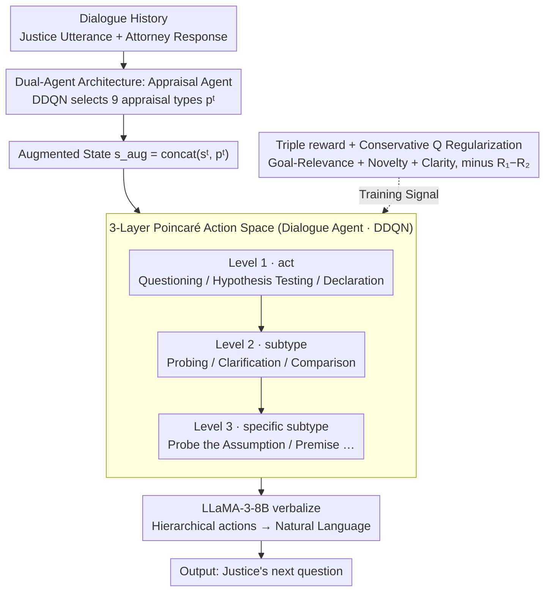

# Dual Hierarchical Dialogue Policy Learning for Legal Inquisitive Conversational Agents

**Conference**: ACL 2026 Findings  
**arXiv**: [2605.14057](https://arxiv.org/abs/2605.14057)  
**Code**: The paper footnote mentions a Git repository, but no public link is provided.  
**Area**: Dialogue / Law / Reinforcement Learning  
**Keywords**: Inquisitive Conversational Agent, Dual Hierarchical RL, Appraisal Agent, Poincaré Embedding, Offline DDQN

## TL;DR
The authors define "Inquisitive Dialogue"—where an AI actively questions an uncooperative interlocutor, exemplified by U.S. Supreme Court justices questioning attorneys—and propose a Dual Hierarchical RL framework. This framework consists of an Appraisal Agent that scores attorney responses in real-time across 9 appraisal categories, and a Hierarchical Dialogue Agent that performs DDQN in a three-layer (act/subtype/utterance) Poincaré action space. Combined with triple rewards (goal-relevance, novelty, and conciseness) and a conservative regularization term, the method improves Probing Effectiveness (PES) from a baseline of 4.22 to 4.47 on the Oyez Supreme Court dataset, achieving the highest Coverage and MR in multi-turn scenarios.

## Background & Motivation

**Background**: Mainstream dialogue systems (MultiWOZ, Schema-Guided, Taskmaster, etc.) are almost entirely "collaborative TOD," where the user asks questions and the agent complies. Recently, negotiation dialogue (Lewis 2017) has emerged. However, Conversational AI has lacked systematic research into "agent-led, uncooperative scenarios" where information must be actively extracted by the agent.

**Limitations of Prior Work**: In scenarios such as courtroom trials, investigative journalism, medical consultations, and police interrogations, AI cannot merely respond passively; it must actively probe, reframe, and challenge. Applying existing TOD frameworks directly leads to three issues: (i) Heuristics and slot ontologies cannot support optimal questioning strategies; (ii) Supreme Court transcripts often exceed 5000 tokens, surpassing the context limits of mainstream seq2seq models; (iii) Adversarial goals—attorneys may use evasive or incomplete answers—make simple reward maximization easy to circumvent.

**Key Challenge**: Modeling dialogue as RL in a "flat action space" leads to either an oversized action space (NLG level) that is untrainable or an undersized space (act level) that lacks expressiveness. Furthermore, a single reward signal (like task success) fails to capture the core metric of "questioning quality."

**Goal**: Design an RL framework that enables the agent to learn: (i) **When to probe** (evaluating if the response is sufficient), (ii) **What type of question to ask** (probing / hypothesis / challenge / clarification), and (iii) **How to articulate it** (specific phrasing).

**Key Insight**: The authors observe that Supreme Court justices' questioning behavior is naturally hierarchical—deciding first on the act (Questioning vs. Declaration), then the subtype (Probing vs. Clarification), and finally the utterance. Crucially, justices **appraise the attorney's previous answer** ("you avoided it / you didn't answer / satisfactory") before deciding on the next strategy.

**Core Idea**: Decouple "appraisal" and "dialogue decision-making" into two coupled RL agents. An Appraisal Agent outputs 9 discrete appraisal categories $p^t$ as internal states, which are fed into a Hierarchical Dialogue Agent performing DDQN across three action layers. This naturally reflects the two-step thinking process of a justice.

## Method

### Overall Architecture
The method models the justice-attorney interaction as an augmented MDP: each justice utterance $u_j^t$ is an action $a^t$, the attorney response $u_a^{t+1}$ is an observation, and the transition is expanded to $\mathcal{D} \sim (s^t, p^t, a^t, r^t, s^{t+1})$, where $p^t = f(u_j^{t-1}, u_a^t, u_j^t)$ represents the justice's appraisal of the attorney's prior answer. Two coupled RL agents operate within this MDP: the Appraisal Agent maps the history to a discrete appraisal $p^t$, and the Dialogue Agent concatenates $p^t$ into the state before making sequential decisions across act, subtype, and utterance spaces. The selected hierarchical actions and augmented state are prompted to LLaMA-3-8B-Instruct to verbalize the final natural language question. The entire pipeline from "appraising the interlocutor" to "deciding the question" and "verbalization" mirrors judicial reasoning.

### Key Designs

**1. Dual-Agent Architecture: Decoupling appraisal from policy**

If a single agent is trained end-to-end, it must simultaneously judge if an attorney is evasive and decide whether to probe or challenge, leading to conflicting state signals. This method assigns appraisal to a dedicated Appraisal Agent. It receives dialogue history and uses DDQN to select $p(s) = \arg\max_p Q_{\text{App}}(s, p; \theta)$, outputting 9 discrete appraisal categories (evasive, incomplete, satisfactory, contradictory, etc.). This is converted to a one-hot vector and concatenated into an augmented state $s_{\text{aug}}^t = \text{concat}(s^t, p^t)$ for the Dialogue Agent. Both agents are trained independently via DDQN and coupled only through state augmentation. Removing the Appraisal Agent drops PES from 4.47 to 4.30—the largest drop among components—validating that "appraise before deciding" is the primary source of probing effectiveness.

**2. Three-Layer Poincaré Action Space: Tree-structured actions with hyperbolic embeddings**

In a flat action space, "Probe assumption" and "Challenge premise" are treated as unrelated tokens, failing to generalize. The Dialogue Agent decomposes actions into three levels: Level 1 (high-level act), Level 2 (subtype), and Level 3 (specific subtype). This hierarchy is represented using hyperbolic Poincaré embeddings, trained with objective $\mathcal{L} = \sum_{(u,v) \in D} \log \frac{e^{-d(u,v)}}{\sum_{v' \in \mathcal{N}(u)} e^{-d(u, v')}}$. This ensures parents are near the origin while children are exponentially distant and siblings are naturally similar, fitting tree-like structures better than Euclidean space. The Q-network predicts three sequential actions, and a hierarchical consistency loss $\mathcal{L}_{\text{Dia}}^{\text{hier}} = \sum_i (Q(s, a_i) - \max_{a_{i+1}} Q(s, a_{i+1}))^2$ forces the parent's Q-value to align with the optimal child, allowing siblings to share signals and improving generalization.

**3. Triple Reward + Conservative Q Regularization: Multi-dimensional objectives and offline RL stability**

A single task-success reward provides sparse signals in dialogue. This method decomposes "good questioning" into three complementary rewards: Goal-Relevance $R_{\text{rel}}^{t+1} = \max_i \text{sim}(C[i], u_a^{t+1})$ (similarity between attorney response and case sub-conclusions $C[i]$), Novelty $R_{\text{nov}}^{t+1}$ based on EAD (ratio of new tokens), and Clarity $R_{\text{clarity}}^{t+1} = -\log|u_a^{t+1}|$ (preference for concise responses). For offline RL stability, a conservative regularization $\mathcal{L}^{\text{Reg}} = R_1(s) - R_2(s)$ is added, where $R_1 = \max_a Q(s,a)$ is the potentially overestimated maximum and $R_2 = Q(s, a)$ is sampled from the dataset. This pulls OOD Q-values toward the dataset policy, acting as a lightweight version of CQL suitable for datasets like Oyez where the behavior policy is near-optimal.

### Loss & Training
- **Backbone**: Both agents use Double DQN (DDQN).
- **Appraisal Agent**: $\mathcal{L}_{\text{App}} = \mathcal{L}_{\text{App}}^{\text{DDQN}} + \alpha \mathcal{L}_{\text{App}}^{\text{Reg}}$, where $Y_{\text{App}} = r + \gamma Q(s, \arg\max_{p'} Q(s', p'; \theta_{App}); \theta_{App}^-)$.
- **Dialogue Agent**: $\mathcal{L}_{\text{Dia}} = \mathcal{L}_{\text{Dia}}^{\text{DDQN}} + \beta \mathcal{L}_{\text{Dia}}^{\text{Reg}} + \lambda \mathcal{L}_{\text{Dia}}^{\text{hier}}$, with hierarchical consistency loss forcing $Q(s, a_0) = \max_{a_1} Q(s, a_1)$.
- **Data**: U.S. Supreme Court Oral Argument Transcript (Oyez, 1955–2023), partitioned by year.
- **Verbalization**: Hierarchical actions are mapped to natural language using LLaMA-3-8B-Instruct with templates; the method is fine-tuning-free for the LLM.

## Key Experimental Results

### Main Results
Evaluated by SaulLM-7B (1–5 scale) on four metrics: CS (Conformity), PS (Progression), OS (Outcome Relevance), and PES (Probing Effectiveness) (Tab.1):

| Method | CS | PS | OS | PES | Overall |
| :--- | :--- | :--- | :--- | :--- | :--- |
| Vanilla LLaMA-3 | 3.99 | 3.94 | 4.70 | 3.92 | 4.14 |
| SFT LLaMA-3 | 3.98 | 3.81 | 4.45 | 3.38 | 3.91 |
| SaulLM-7B (Legal LLM) | 4.01 | 3.91 | 4.56 | 3.75 | 4.06 |
| Hudeček et al. (pipeline TOD) | 3.99 | 3.97 | 4.77 | 3.63 | 4.09 |
| VaRMI (offline policy gradient) | 4.00 | 3.94 | 4.71 | 3.93 | 4.15 |
| ArCHer (Actor-Critic) | 3.96 | 3.79 | 4.17 | 4.22 | 4.04 |
| **Ours (Dual Hierarchical)** | **4.01** | **3.98** | **4.89** | **4.47** | **4.34** |

In multi-turn simulations (SeCom attorney opponent, max 10 turns), **Ours** consistently achieves the highest Coverage Score and Marginal Relevance Score. Human evaluation (Tab.8) also rated **Ours** highest at 4.53 Overall.

### Ablation Study
Ablation analysis (Full Model: 4.34) in Tab.2:

| Configuration | CS | PS | OS | PES | Overall |
| :--- | :--- | :--- | :--- | :--- | :--- |
| Full Model | 4.01 | 3.98 | 4.89 | 4.47 | **4.34** |
| w/o Appraisal Agent | 4.03 | 4.00 | 4.74 | **4.30** | 4.27 |
| w/o Succinct Reward | 4.01 | 3.97 | 4.85 | 4.39 | 4.31 |
| w/o Novelty Reward | 4.01 | 3.97 | 4.82 | 4.34 | 4.29 |
| w/o Goal-Relevance | 4.00 | 3.97 | 4.83 | 4.32 | 4.28 |

### Key Findings
- **Appraisal Agent is the primary contributor to PES**: Removing it causes PES to drop from 4.47 to 4.30 (−0.17), the largest single-component impact. This proves that an "evaluate then decide" mechanism is significantly superior to end-to-end agents for probing.
- **Domain-specific LLMs do not guarantee victory**: SaulLM-7B, despite legal training, was outperformed by Vanilla LLaMA-3 (4.06 vs 4.14), indicating that domain knowledge does not equate to dialogue policy; RL-style policy learning is essential.
- **SFT failure due to data quality**: SFT LLaMA-3 performed worst (3.91) because it absorbed low-quality fragments inherently present in the Supreme Court dataset. RL with conservative regularization effectively "ignores" poor data by not rewarding those transitions.
- **Complementary Rewards**: Removing any reward component decreased the Overall score by 0.03–0.06. OS is most affected by novelty (−0.07), while PES relies heavily on goal-relevance and succinctness.
- **Stronger Multi-turn Persistence**: **Ours** leads across 2/4/6/8/10 turns in Coverage and MR, showing that dual agents are more robust for long-range dialogue planning.

## Highlights & Insights
- **Conceptual Trichotomy**: Re-defining TOD into collaborative, negotiation, and inquisitive categories is a major contribution, formalizing proactive probing as a distinct research scenario.
- **Explicit Appraisal Agent**: Decoupling Theory of Mind (appraising the interlocutor) from decision-making transforms implicit evaluation into a learnable, discrete signal, providing a clean architectural solution for dialogue policy.
- **Poincaré Embeddings**: Using hyperbolic space for hierarchical actions represents the act/subtype tree more effectively than flat one-hot encodings, improving generalization with fewer parameters.
- **Lightweight Conservative Regularization**: The $R_1 - R_2$ term is computationally simple but highly effective for datasets with near-optimal policies, offering an alternative to complex CQL implementations.
- **Length-Normalized Novelty**: The EAD-based novelty reward is a clever adjustment over standard distinct-N, as it penalizes verbosity while rewarding information density.

## Limitations & Future Work
- **Reliance on LLM for Verbalization**: Performance is bottlenecked by the LLM's probability distribution; if the verbalization doesn't match the optimal RL action sequence, the model cannot reach its upper bound.
- **Hand-crafted Rewards and Taxonomy**: The transition to medical or journalistic domains would require manual redesign of the 9 appraisal categories and 3-level action taxonomy.
- **Dependency on Dataset Quality**: The conservative regularization assumes a near-optimal behavior policy (expert justices). In amateur datasets, pulling Q-values toward the dataset policy could be detrimental.
- **Single Dataset Verification**: The study only uses Oyez; cross-dataset generalization across lower courts or depositions is not tested.
- **Lack of Real-time Human Evaluation**: Interactions are simulated via SeCom, lacking evaluation by expert attorneys who could provide "counter-probing" dynamics.

## Related Work & Insights
- **vs. Collaborative TOD (MultiWOZ / Taskmaster)**: These focus on "user ask, agent answer." This work completes the landscape by formalizing inquisitive tasks.
- **vs. Negotiation Dialogue (Lewis 2017)**: Negotiation involves trade-offs between conflicting goals; inquisitive dialogue involves one-sided probing of an often uncooperative counterpart.
- **vs. ArCHer (Zhou 2024)**: While ArCHer uses hierarchical AC, it employs flat rewards. **Ours** shows that dual agents and Poincaré structures provide better overall performance (4.34 vs 4.04).
- **vs. VaRMI (Shea & Yu 2023)**: VaRMI uses policy gradients for consistency; this method's DDQN + conservative regularization shows a significant advantage in PES (4.47 vs 3.93).

## Rating
- Novelty: ⭐⭐⭐⭐ Defining Inquisitive Dialogue and combining Dual Hierarchical RL with Poincaré space is a clean, innovative combination.
- Experimental Thoroughness: ⭐⭐⭐ Comprehensive ablation and multi-turn simulation, though limited to one dataset and missing human-in-the-loop tests.
- Writing Quality: ⭐⭐⭐⭐ High clarity in defining dialogue categories and structured presentation of Method/Reward formulas.
- Value: ⭐⭐⭐⭐ Pushes the boundaries for proactive Conversational AI with direct relevance to specialized domains like law and medicine.

<!-- RELATED:START -->

## Related Papers

- [\[ACL 2026\] Template-assisted Contrastive Learning of Task-oriented Dialogue Sentence Embeddings](template-assisted_contrastive_learning_of_task-oriented_dialogue_sentence_embedd.md)
- [\[ICLR 2026\] DRIFT: Learning from Abundant User Dissatisfaction in Real-World Preference Learning](../../ICLR2026/dialogue/drift_learning_from_abundant_user_dissatisfaction_in_real-world_preference_learn.md)
- [\[ACL 2026\] Preference Learning Unlocks LLMs' Psycho-Counseling Skills](preference_learning_unlocks_llms_psycho-counseling_skills.md)
- [\[ACL 2026\] Cognitive Policy-Driven LLM for Diagnosis and Intervention of Cognitive Distortions in Emotional Support Conversation](cognitive_policy-driven_llm_for_diagnosis_and_intervention_of_cognitive_distorti.md)
- [\[ACL 2025\] Single- vs. Dual-Prompt Dialogue Generation with LLMs for Job Interviews in Human Resources](../../ACL2025/dialogue/single-_vs_dual-prompt_dialogue_generation_with_llms_for_job_interviews_in_human.md)

<!-- RELATED:END -->
## Related Papers

- [\[ACL 2026\] Template-assisted Contrastive Learning of Task-oriented Dialogue Sentence Embeddings](template-assisted_contrastive_learning_of_task-oriented_dialogue_sentence_embedd.md)
- [\[ACL 2026\] Preference Learning Unlocks LLMs' Psycho-Counseling Skills](preference_learning_unlocks_llms_psycho-counseling_skills.md)
- [\[ACL 2026\] Cognitive Policy-Driven LLM for Diagnosis and Intervention of Cognitive Distortions in Emotional Support Conversation](cognitive_policy-driven_llm_for_diagnosis_and_intervention_of_cognitive_distorti.md)
- [\[CVPR 2026\] Evolutionary Multimodal Reasoning via Hierarchical Semantic Representation for Intent Recognition](../../CVPR2026/dialogue/evolutionary_multimodal_reasoning_via_hierarchical_semantic_representation_for_i.md)
- [\[ACL 2025\] Single- vs. Dual-Prompt Dialogue Generation with LLMs for Job Interviews in Human Resources](../../ACL2025/dialogue/single-_vs_dual-prompt_dialogue_generation_with_llms_for_job_interviews_in_human.md)

<!-- RELATED:END -->
