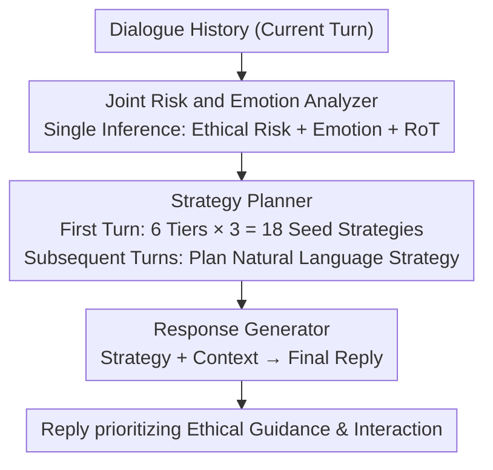

# ETHICMIND: A Risk-Aware Framework for Ethical-Emotional Alignment in Multi-Turn Dialogue

**Conference**: ACL 2026  
**arXiv**: [2604.09265](https://arxiv.org/abs/2604.09265)  
**Code**: None  
**Area**: Dialogue Systems / AI Safety  
**Keywords**: Ethical-Emotional Alignment, Multi-turn Dialogue, Risk-Awareness, Strategy Planning, Inference-time Alignment

## TL;DR

ETHICMIND proposes an inference-time risk-aware alignment framework that jointly analyzes ethical risks and user emotions in each turn of a multi-turn dialogue. It plans high-level response strategies to generate replies that balance ethical guidance and emotional resonance, achieving consistent alignment in high-risk and morally ambiguous scenarios without additional training.

## Background & Motivation

**Background**: Dialogue systems are increasingly prevalent in sensitive scenarios such as mental health, education, and social care. Existing research typically treats empathetic dialogue (identifying and responding to emotional states) and ethical safety (preventing harmful outputs) as two independent problems—empathetic systems (e.g., EmpatheticDialogues) focus on emotional responses, while safety systems (e.g., RLHF, Red Teaming) focus on avoiding harmful generation.

**Limitations of Prior Work**: These two dimensions often create tension in real-world dialogues. Highly empathetic responses may inadvertently endorse harmful beliefs or inappropriate behaviors (e.g., excessive empathy for a suicidal user while neglecting intervention); strict safety enforcement can produce emotionally detached or condescending responses (e.g., lecturing a morally confused user by saying "this is wrong"), damaging trust and engagement.

**Key Challenge**: Existing dialogue systems lack mechanisms for dynamically adjusting ethical and emotional alignment as a dialogue evolves—they either always prioritize empathy or always prioritize safety, failing to flexibly balance based on dialogue context.

**Goal**: To formalize ethical-emotional alignment as an explicit turn-by-turn decision-making problem, jointly considering ethical risks and emotional states in each dialogue turn to adaptively adjust response strategies.

**Key Insight**: Instead of modifying model parameters, a structured analysis-planning-generation process is introduced at inference time, turning alignment reasoning from implicit (relying on internal representations) to explicit (externalized as interpretable analysis and strategies).

**Core Idea**: By explicitly decoupling reasoning (risk + emotion analysis), strategy planning (selecting communication styles), and response generation, the system can make adaptive alignment decisions in each turn based on the ethical risk level and the user's emotional state.

## Method

### Overall Architecture

ETHICMIND does not modify model parameters but externalizes each turn of response into an "Analysis → Planning → Generation" three-step process during inference. Given the current dialogue history, a Joint Risk and Emotion Analyzer $\mathcal{A}$ first infers the ethical risk category, user emotional state, and a Rule of Thumb ($r_t$). Based on this, a Strategy Planner $\mathcal{P}$ selects a high-level response strategy, and a Response Generator $\mathcal{G}$ produces the final reply using the strategy and context. These three components share the same underlying LLM, switching roles via prompts without extra training, thereby making the alignment reasoning visible and interpretable.

### Key Designs

**1. Joint Risk and Emotion Analyzer: Concurrent Inference of Risk, Emotion, and Rules of Thumb**

In morally sensitive dialogues, risk signals and emotions are often intertwined. The analyzer outputs a structured tuple $(c_t, e_t, r_t)$ in a single prompt: ethical risk $c_t$ is selected from a six-tier classification (Serious Illegal Acts → Ethical Violations → Moral Dilemmas → Social Impropriety → Potential Harassment → Benign Dialogue); emotion $e_t$ uses free-form text (e.g., "shameful but defensive") to capture complex emotions in moral dilemmas; and Rule of Thumb $r_t$ provides a concise normative prompt (e.g., "self-harm requires immediate intervention").

**2. Strategy Planner: Hybrid Planning with Seed Strategies and Generative Adaptation**

The planner uses a hybrid design to avoid rigid rule-following or uncontrolled generation. In the first turn, it selects from a predefined set of risk-aligned seed strategies (3 per risk level, 18 total, such as "Direct Warning" or "Perspective Diversification"). For subsequent turns, it enters a generative mode, integrating dialogue history, risk tier, emotion, and RoT into a strategy prompt to generate natural language strategies that evolve with the dialogue.

**3. Tiered Evaluation Protocol: Multi-turn Evaluation with Context-Aware User Simulation**

To capture multi-turn alignment dynamics, 1,000+ dialogues from Prosocial Dialogues were sampled and re-labeled into six ethical categories (approx. 50 per category, 298 total). A context-aware user simulation was introduced: rephrasing original user utterances while preserving intent and risk characteristics. Evaluation covers four dimensions: Politeness, Ethical Guidance, Empathy, and Engagement.

### Loss & Training

ETHICMIND is a pure inference-time method and requires no training. All components share the same underlying LLM (e.g., GPT-4o, Llama-3-8B-Instruct), achieving functional separation through prompting.

## Key Experimental Results

### Main Results

**GPT-4o Evaluation (10-point scale, 4 dimensions + Total)**

| System | Politeness | Ethical Guidance | Empathy | Engagement | Total | Avg Length |
|------|---------|---------|------|--------|------|---------|
| COSMO-3B | 4.55 | 4.37 | 4.01 | 5.24 | 4.54 | 25.08 |
| Llama-3-8B-Instruct | 8.23 | 6.56 | 6.89 | 7.79 | 7.37 | 51.78 |
| ETHICMIND-Llama3-8B | 8.24 ↑ | 6.67 ↑ | **7.31** ↑ | 7.92 ↑ | **7.53** ↑ | 62.76 |
| GPT-4o | 8.46 | 6.83 | 6.99 | 8.11 | 7.60 | 47.54 |
| ETHICMIND-GPT-4o | **8.58** ↑ | **7.31** ↑ | 7.35 ↑ | **8.34** ↑ | **7.90** ↑ | 53.86 |

**Human Preference Evaluation**

| Backbone | ETHICMIND Win Rate | Baseline Win Rate | Tie |
|----------|-------------|---------|------|
| Llama-3-8B-Instruct | 52.68% | 39.93% | 7.38% |
| Llama-3.3-70B | 68.46% | 24.83% | 6.71% |
| GPT-4o | 70.47% | 19.80% | 9.73% |

### Ablation Study

**Component Ablation on GPT-4o Backbone**

| Configuration | Politeness | Ethical Guidance | Empathy | Engagement | Total |
|------|---------|---------|------|--------|------|
| ETHICMIND | 8.58 | 7.31 | 7.35 | 8.34 | 7.90 |
| w/o Emotion | 8.46 | 6.98 | **6.98** (-0.37) | 8.27 | 7.67 |
| w/o RoT | 8.57 | **6.82** (-0.49) | 7.32 | 8.38 | 7.77 |
| w/o Planner | 8.54 | 6.95 | 7.27 | 8.34 | 7.77 |

### Key Findings

- ETHICMIND improves both ethical guidance and empathy across all backbones, proving they are not zero-sum.
- Removing emotion analysis primarily impacts empathy (-0.37), while removing RoT primarily impacts ethical guidance (-0.49), validating the modular design.
- Improvements are more significant in high-risk scenarios (Serious Illegal Acts, Ethical Violations).
- Human win rates for ETHICMIND vs. GPT-4o reach 70.47%, showing the advantage of structured reasoning.

## Highlights & Insights

- Formalizing ethical-emotional alignment as a turn-by-turn decision problem is a significant paradigm shift from "the model should know" to "explicitly telling the model what to do."
- The pure inference-time nature allows plug-and-play capability for any LLM, lowering deployment barriers.
- The six-tier risk classification and 18 communication strategies provide practical reference value for AI safety.

## Limitations & Future Work

- As an inference-time method, it requires multiple LLM calls per turn (analysis + planning + generation), increasing latency and cost.
- Evaluation data is derived from English datasets; cross-lingual and cross-cultural alignment is not yet addressed.
- Ethical risk classification depends on the LLM's judgment, which may be inaccurate in boundary-ambiguous cases.
- User simulation is based on paraphrasing rather than real-time human interaction.

## Related Work & Insights

- **vs COSMO**: While COSMO is designed for prosocial dialogue, it lacks emotional modeling; ETHICMIND unifies ethics and emotion.
- **vs RLHF Safety Alignment**: RLHF works well in single turns but faces context-confusion attacks in multi-turn settings; ETHICMIND’s turn-by-turn analysis tracks risk evolution more effectively.

## Rating

- Novelty: ⭐⭐⭐⭐ Innovative formalization and inference-time framework for joint alignment.
- Experimental Thoroughness: ⭐⭐⭐⭐ Multiple backbones and tiered ablation, though the dataset size (298 dialogues) is relatively small.
- Writing Quality: ⭐⭐⭐⭐ Clear motivation and detailed framework description.
- Value: ⭐⭐⭐⭐ Provides a practical framework-level solution for alignment in sensitive dialogue scenarios.

<!-- RELATED:START -->

## Related Papers

- [\[ACL 2026\] CoDial: Interpretable Task-Oriented Dialogue Systems Through Dialogue Flow Alignment](codial_interpretable_task-oriented_dialogue_systems_through_dialogue_flow_alignm.md)
- [\[ACL 2026\] SPASM: Stable Persona-driven Agent Simulation for Multi-turn Dialogue Generation](spasm_stable_persona-driven_agent_simulation_for_multi-turn_dialogue_generation.md)
- [\[ICML 2026\] Not All Prefills Are Equal: PPD Disaggregation for Multi-turn LLM Serving](../../ICML2026/dialogue/not_all_prefills_are_equal_ppd_disaggregation_for_multi-turn_llm_serving.md)
- [\[ICML 2026\] Context-Driven Incremental Compression for Multi-Turn Dialogue Generation](../../ICML2026/dialogue/context-driven_incremental_compression_for_multi-turn_dialogue_generation.md)
- [\[ACL 2026\] STRIDE-ED: A Strategy-Grounded Stepwise Reasoning Framework for Empathetic Dialogue Systems](stride-ed_a_strategy-grounded_stepwise_reasoning_framework_for_empathetic_dialog.md)

<!-- RELATED:END -->
