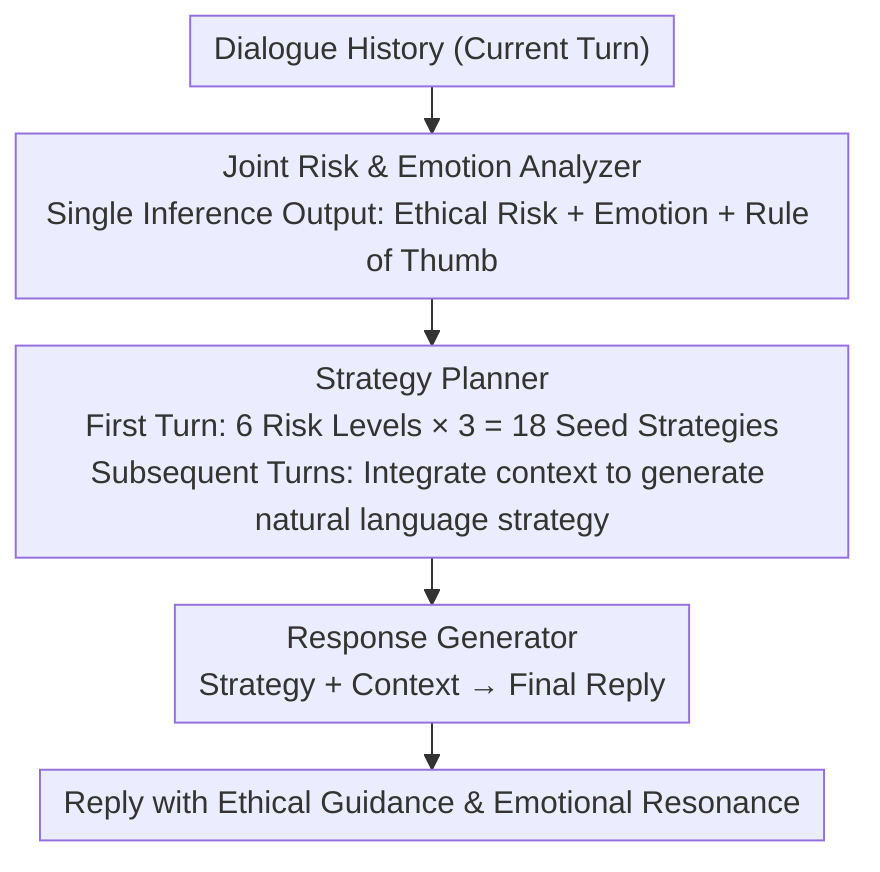

# ETHICMIND: A Risk-Aware Framework for Ethical-Emotional Alignment in Multi-Turn Dialogue

**Conference**: ACL 2026  
**arXiv**: [2604.09265](https://arxiv.org/abs/2604.09265)  
**Code**: None  
**Area**: Dialogue Systems / AI Safety  
**Keywords**: Ethical-Emotional Alignment, Multi-turn Dialogue, Risk-aware, Strategy Planning, Inference-time Alignment

## TL;DR

ETHICMIND proposes an inference-time risk-aware alignment framework that jointly analyzes ethical risks and user emotions in each turn of a multi-turn dialogue. It plans high-level response strategies to generate replies that balance ethical guidance and emotional resonance without additional training, achieving consistent alignment performance in high-risk and morally ambiguous scenarios.

## Background & Motivation

**Background**: Dialogue systems are increasingly popular in sensitive scenarios such as mental health, education, and social care. Existing research treats empathetic dialogue (identifying and responding to emotional states) and ethical safety (preventing harmful outputs) as two independent problems—empathetic systems (e.g., EmpatheticDialogues) focus on emotional responses, while safety systems (e.g., RLHF, red-teaming) focus on avoiding harmful generation.

**Limitations of Prior Work**: These two dimensions often create tension in real-world dialogues. Highly empathetic responses may inadvertently validate harmful beliefs or inappropriate behaviors (e.g., over-empathizing with a suicidal user while neglecting intervention); strict safety enforcement may produce emotionally distant or condescending responses (e.g., preaching "this is wrong" to a morally confused user), damaging trust and engagement.

**Key Challenge**: Existing dialogue systems lack mechanisms to dynamically adjust ethical and emotional alignment as a dialogue evolves—they either always prioritize empathy or always prioritize safety, failing to balance them flexibly based on context changes.

**Goal**: To formalize ethical-emotional alignment as an explicit per-turn decision problem, jointly considering ethical risks and emotional states in every dialogue turn to adaptively adjust response strategies.

**Key Insight**: Instead of modifying model parameters, a structured analysis-planning-generation three-stage pipeline is introduced at inference time. This transforms alignment reasoning from implicit (relying on internal model representations) to explicit (externalized as interpretable analysis and strategies).

**Core Idea**: By explicitly separating reasoning (risk + emotion analysis), strategy planning (selecting communication methods), and response generation, the dialogue system can make adaptive alignment decisions in every turn based on ethical risk levels and user emotional states.

## Method

### Overall Architecture

ETHICMIND keeps model parameters fixed and externalizes each turn into an "Analyze → Plan → Generate" process. Given the current dialogue history, a Joint Risk & Emotion Analyzer $\mathcal{A}$ first infers the ethical risk category, the user's emotional state, and a Rule of Thumb ($r_t$). The Strategy Planner $\mathcal{P}$ then selects a high-level response strategy, which the Response Generator $\mathcal{G}$ uses along with the context to produce the final reply. All three components share the same underlying LLM, switching roles via prompts without any additional training, thereby making the alignment reasoning visible and interpretable.

### Key Designs

**1. Joint Risk & Emotion Analyzer: Simultaneous Inference of Risk, Emotion, and Rules of Thumb**

In ethically sensitive dialogues, risk signals and emotions are often intertwined. The analyzer outputs a structured tuple $(c_t, e_t, r_t)$ in a single prompt: the ethical risk $c_t$ is selected from a six-level hierarchy (Serious Illegal Acts → Ethical Violations → Moral Dilemmas → Social Impropriety → Potential Harm → Benign Dialogue); emotion $e_t$ is free-text (e.g., "ashamed but defensive") to capture complex emotions in moral dilemmas; and Rule of Thumb $r_t$ is a concise normative hint.

**2. Strategy Planner: Hybrid Planning with Seed Strategies and Generative Adaptation**

The core of ethical-emotional alignment is determining the "guiding tone." The planner uses a hybrid design: in the first turn, it selects a seed strategy from a predefined set (18 strategies across 6 risk levels, such as "Direct Warning," "Perspective Diversification," or "Encourage Positive Change"). In subsequent turns, it switches to generative mode, integrating dialogue history and previous analysis into a natural language strategy, allowing communication to evolve flexibly.

**3. Evaluation Protocol: Layered Assessment with Context-Aware User Simulation**

Existing evaluations are often single-turn or binary (safe/unsafe). This work samples 1000+ dialogues from Prosocial Dialogues, re-labeled into six ethical categories (approx. 50 per category, 298 total), and introduces context-aware simulation: conditional paraphrasing of original user utterances to maintain intent and risk while introducing surface variations for multi-turn testing. Assessment covers Politeness, Ethical Guidance, Empathy, and Engagement.

### Loss & Training

ETHICMIND is a pure inference-time method and requires no training. All components share the same underlying LLM (e.g., GPT-4o, Llama-3-8B-Instruct), using prompting to achieve functional separation.

## Key Experimental Results

### Main Results

**GPT-4o Evaluation (10-point scale, 4 dimensions + Total)**

| System | Politeness | Ethical Guidance | Empathy | Engagement | Total | Avg. Length |
|------|---------|---------|------|--------|------|---------|
| COSMO-3B | 4.55 | 4.37 | 4.01 | 5.24 | 4.54 | 25.08 |
| Llama-3-8B-Instruct | 8.23 | 6.56 | 6.89 | 7.79 | 7.37 | 51.78 |
| ETHICMIND-Llama3-8B | 8.24 ↑ | 6.67 ↑ | **7.31** ↑ | 7.92 ↑ | **7.53** ↑ | 62.76 |
| GPT-4o | 8.46 | 6.83 | 6.99 | 8.11 | 7.60 | 47.54 |
| ETHICMIND-GPT-4o | **8.58** ↑ | **7.31** ↑ | 7.35 ↑ | **8.34** ↑ | **7.90** ↑ | 53.86 |

**Human Preference Evaluation**

| Backbone | ETHICMIND Win Rate | Baseline Win Rate | Tie |
|----------|-------------|---------|------|
| Llama-3-8B-Instruct | 52.68% | 39.93% | 7.38% |
| Llama-3.3-70B | 68.46% | 24.83% | 6.71% |
| GPT-4o | 70.47% | 19.80% | 9.73% |

### Ablation Study

**Ablation on GPT-4o Backbone**

| Configuration | Politeness | Ethical Guidance | Empathy | Engagement | Total |
|------|---------|---------|------|--------|------|
| ETHICMIND | 8.58 | 7.31 | 7.35 | 8.34 | 7.90 |
| w/o Emotion | 8.46 | 6.98 | **6.98** (-0.37) | 8.27 | 7.67 |
| w/o RoT | 8.57 | **6.82** (-0.49) | 7.32 | 8.38 | 7.77 |
| w/o Planner | 8.54 | 6.95 | 7.27 | 8.34 | 7.77 |

### Key Findings

- ETHICMIND improves both ethical guidance and empathy across all backbones, proving they are not a zero-sum game.
- Removing emotion analysis primarily impacts empathy (-0.37), while removing RoT primarily impacts ethical guidance (-0.49), validating the modular design.
- Gains are more significant in high-risk scenarios (Serious Illegal, Ethical Violations)—ETHICMIND-GPT-4o scores 7.85 vs 7.71 in serious illegal scenarios.
- In human evaluation, ETHICMIND achieves a 70.47% win rate over GPT-4o, demonstrating the advantage of structured reasoning for alignment.

## Highlights & Insights

- Formalizing ethical-emotional alignment as a per-turn decision problem is a significant paradigm shift—moving from "the model should know what to do" to "explicitly telling the model how to act."
- The pure inference-time design (no training) makes it plug-and-play for any LLM, lowering deployment barriers.
- The 6-level ethical risk hierarchy and 18 communication strategies provide practical reference value for the field.
- The layered evaluation protocol offers a more granular standard for assessing alignment in multi-turn dialogues.

## Limitations & Future Work

- As an inference-time method, it requires multiple LLM calls per turn (analyze + plan + generate), increasing latency and cost.
- Evaluation data is derived from English Prosocial Dialogues; cross-lingual and cross-cultural ethical alignment were not considered.
- Ethical risk classification relies on the LLM's judgment, which may be inaccurate in boundary-ambiguous scenarios.
- User simulation is based on paraphrasing rather than real-time interaction, potentially failing to capture the full dynamics of human dialogue.

## Related Work & Insights

- **vs COSMO**: While COSMO is designed for prosocial dialogue, it lacks emotional modeling; ETHICMIND unifies ethics and emotion.
- **vs RLHF Safety Alignment**: RLHF is effective for single turns but vulnerable to context-confusion attacks in multi-turn settings; ETHICMIND's per-turn analysis better tracks risk evolution.
- **Inspiration**: Explicitly separating reasoning and generation may be effective for other tasks requiring dynamic alignment.

## Rating

- Novelty: ⭐⭐⭐⭐ The formalization of joint ethical-emotional alignment and the inference-time framework are innovative.
- Experimental Thoroughness: ⭐⭐⭐⭐ Covered multiple backbones, risk layering, ablations, and human evaluation, though the dataset size is relatively small (298 dialogues).
- Writing Quality: ⭐⭐⭐⭐ Clear motivation and detailed framework description.
- Value: ⭐⭐⭐⭐ Provides a practical framework-level solution for alignment in sensitive dialogue scenarios.

<!-- RELATED:START -->

## Related Papers

- [\[ACL 2026\] SPASM: Stable Persona-driven Agent Simulation for Multi-turn Dialogue Generation](spasm_stable_persona-driven_agent_simulation_for_multi-turn_dialogue_generation.md)
- [\[ACL 2026\] CoDial: Interpretable Task-Oriented Dialogue Systems Through Dialogue Flow Alignment](codial_interpretable_task-oriented_dialogue_systems_through_dialogue_flow_alignm.md)
- [\[ICML 2026\] Not All Prefills Are Equal: PPD Disaggregation for Multi-turn LLM Serving](../../ICML2026/dialogue/not_all_prefills_are_equal_ppd_disaggregation_for_multi-turn_llm_serving.md)
- [\[ACL 2026\] STRIDE-ED: A Strategy-Grounded Stepwise Reasoning Framework for Empathetic Dialogue Systems](stride-ed_a_strategy-grounded_stepwise_reasoning_framework_for_empathetic_dialog.md)
- [\[ACL 2026\] Discourse Coherence and Response-Guided Context Rewriting for Multi-Party Dialogue Generation](discourse_coherence_and_response-guided_context_rewriting_for_multi-party_dialog.md)

<!-- RELATED:END -->
