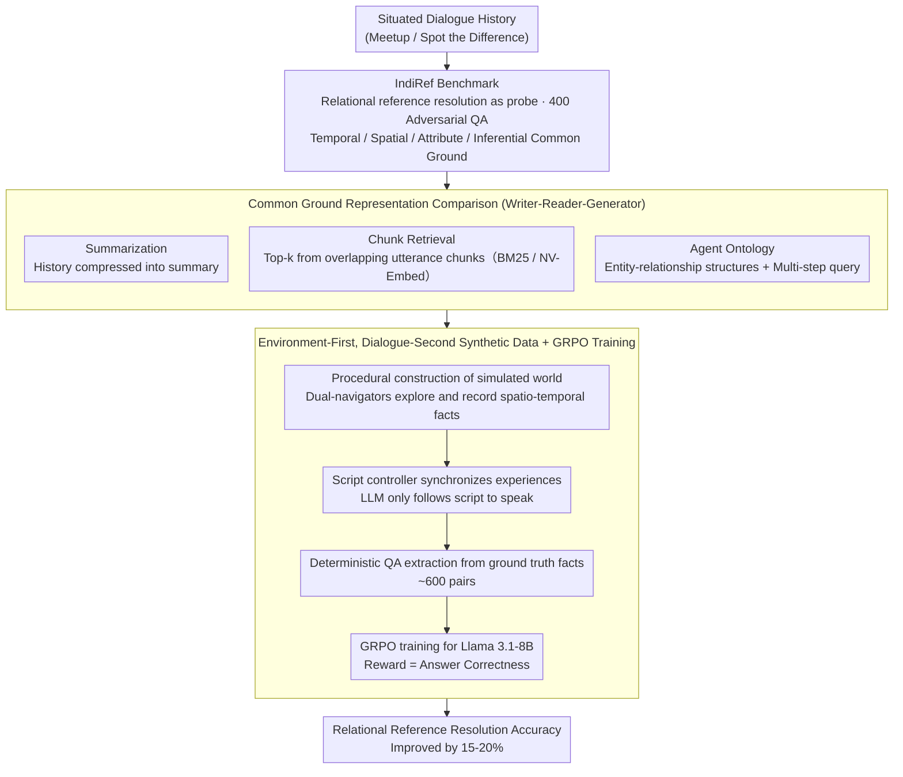

# Frame of Reference: Addressing the Challenges of Common Ground Representation in Dialogue

**Conference**: ACL 2026 Findings  
**arXiv**: [2601.09365](https://arxiv.org/abs/2601.09365)  
**Code**: [GitHub](https://github.com/biswesh/IndiRef)  
**Area**: Reinforcement Learning  
**Keywords**: common ground establishment, relational reference, situated dialogue, reinforcement learning, dialogue memory

## TL;DR

Ours proposes the IndiRef benchmark to evaluate the ability of dialogue systems to establish and utilize persistent common ground through "relational reference" (e.g., "the cafe near the park we went to yesterday"). It finds that existing LLMs do not exceed 50% accuracy under full-context conditions and improves performance by 15-20% through synthetic data + GRPO reinforcement learning training.

## Background & Motivation

**Background**: In dialogue, common ground refers to the shared knowledge, beliefs, and assumptions accumulated among participants. Recently, LLMs have demonstrated the ability to perform basic dialogue acts (e.g., acknowledgment, responses), but whether these behaviors represent true understanding remains uncertain.

**Limitations of Prior Work**: (1) Existing LLMs might only "simulate" understanding by generating plausible responses rather than truly establishing and utilizing common ground—an "illusion of understanding"; (2) as dialogue history grows, systems must rely on memory management techniques to retrieve information from established common ground, but existing methods (summarization, RAG, knowledge graphs) perform poorly when handling complex relational references; (3) there is a lack of effective benchmarks to measure the ability of dialogue systems to establish persistent and usable common ground.

**Key Challenge**: In situated dialogue, entities often lack unique referring expressions (e.g., the same room can be called "the room with the TV" or "the room in front of the bathroom"), and referring relationships involve multi-dimensional reasoning across space, time, and attributes. Existing representation methods cannot sufficiently capture these inter-entity relations.

**Goal**: (1) Propose a benchmark based on relational reference resolution to evaluate the common ground establishment ability of dialogue systems; (2) assess the effectiveness of commonly used common ground representation methods; (3) improve the dialogue understanding capabilities of the system through synthetic data and reinforcement learning.

**Key Insight**: Inspired by Kruijt and Vossen (2022), "relational reference" (referring to entities through spatial, temporal, and attribute relations common in human dialogue) is utilized as a probe to test common ground capabilities—if a model can correctly resolve such references, it indicate that it has indeed established effective common ground.

**Core Idea**: Treat "resolving complex relational references" as the core metric for measuring common ground establishment in dialogue systems, and enhance the multi-step reasoning capabilities of LLMs through synthetic situated dialogue data + GRPO training.

## Method

### Overall Architecture

The work is built around three research questions: first, using an adversarial benchmark IndiRef to quantify "whether a dialogue system can truly establish persistent common ground"; second, comparing the retrieval effectiveness of several mainstream common ground representation methods under resource-constrained conditions; and finally, boosting the multi-step relational reasoning capabilities of the model using synthetic situated dialogue data + reinforcement learning. The input for the entire pipeline is a situated dialogue history, and the output is the correct answer to "relational reference" questions (e.g., which entity is "the cafe near the park we went to yesterday")—correct answers indicate that the model has successfully distilled the shared knowledge accumulated in the dialogue into actionable common ground.

### Key Designs

**1. IndiRef Benchmark: Translating "Understanding" into Adversarial QA.** Most existing dialogue benchmarks only measure immediate behaviors (acknowledgment, responses), which models can fake by generating plausible responses. IndiRef instead uses "relational reference resolution" as a probe: 400 QA pairs (100 per category) were manually constructed based on the Meetup and Spot the Difference datasets, covering temporal reference ("the Thai restaurant we went to after seeing Spider-Man"), spatial reference ("the bottle on the table"), attribute reference ("the yellow house"), and inferential common ground (understanding implicit information).

The key lies in its adversarial nature—multiple entities of the same type are inserted into each dialogue to make simple keyword matching fail; indexical pronouns (your/my) force the model to distinguish between speaker perspectives. Only models that truly integrate multi-dimensional relations (space, time, attributes) into the common ground representation can answer correctly, thus turning the abstract concept of "understanding" into a quantifiable metric.

**2. Comparison of Common Ground Representations under the Writer-Reader-Generator Framework.** Since the full history of long dialogues cannot fit into context windows, some representation must store and retrieve common ground, but which representation best preserves relational information is unknown. Ours uses a unified $W$ (Write)-$R$ (Read)-$G$ (Generate) framework to evaluate three approaches: Summarization compresses history into $s_t$; Chunk Retrieval slices the dialogue into overlapping chunks $c_i$ (7 utterances per chunk, stride 3) and retrieves the top-k relevant fragments; the Agent Ontology approach uses an agent to extract entities, attributes, relations, and speaker info to form structured knowledge, then retrieves via multi-step queries (RAG[n]→Process→Final).

Both sparse (BM25) and dense (NV-Embed-V2) embeddings were tested. This comparison directly reveals that information loss is the core bottleneck in resource-constrained scenarios and explains why the Agent Ontology method, which explicitly models entity-relationships, slightly outperforms summarization and chunking for relational reference.

**3. "Environment-First, Dialogue-Second" Synthetic Data + GRPO Training.** Existing LLMs have almost no training data for situated dialogue, and asking LLMs to generate dialogues from scratch often leads to unreliable reasoning (generated spatio-temporal relations are often self-contradictory). This paper decouples reasoning logic from language generation using a three-stage process: first, procedurally construct a simulated world where two navigators explore and record spatio-temporal facts; second, use a script controller to synchronize experiences and generate dialogue scripts, where LLMs are only responsible for speaking each line under script constraints; finally, extract QA pairs deterministically from ground truth facts.

After generating approximately 600 QA pairs, Llama 3.1-8B is trained using GRPO (Group Relative Policy Optimization), where the reward function only considers answer correctness—a positive reward is given if the model's answer matches the predefined answer. Since facts are guaranteed by the program and reasoning is handled by the script controller, the correctness of the synthetic data is controllable, resulting in clean training signals and stable 15-20% improvements on both Meetup and STD.

## Key Experimental Results

### Main Results

**Full-Context Baseline (Performance of different LLMs on IndiRef, FEM/LLM-as-Judge)**

| Model | Temporal Ref | Spatial Ref | Attribute Ref | Inference |
|------|---------|---------|---------|---------|
| Gemma2-2B | 0.20/0.18 | 0.18/0.16 | 0.24/0.26 | 0.26/0.16 |
| Llama3.1-8B | 0.38/0.32 | 0.46/0.38 | 0.46/0.44 | 0.20/0.20 |
| Gemma2-27B | 0.50/0.44 | 0.58/0.56 | 0.48/0.44 | 0.28/0.26 |
| Qwen-QWQ-32B | 0.38/0.32 | 0.52/0.38 | 0.44/0.40 | 0.40/0.40 |

**Comparison of Representations in Resource-Constrained Scenarios (Llama3.1-8B, Meetup)**

| Method | Temporal | Spatial | Attribute | Inference |
|------|------|------|------|------|
| Full-Context Baseline | 0.38/0.32 | 0.46/0.38 | 0.46/0.44 | 0.20/0.20 |
| Summarization | 0.32/0.28 | 0.34/0.26 | 0.30/0.25 | 0.28/0.18 |
| Chunking (NV-Embed) | 0.24/0.20 | 0.08/0.06 | 0.16/0.08 | 0.22/0.24 |
| Chunking (BM25) | 0.26/0.24 | 0.20/0.16 | 0.20/0.18 | 0.24/0.26 |
| Agent Ontology | 0.40/0.36 | 0.38/0.34 | 0.38/0.30 | 0.24/0.22 |

### Ablation Study

**GRPO Training Effect (Llama3.1-8B)**

| Configuration | Temporal | Spatial | Attribute | Inference |
|------|------|------|------|------|
| Original (Full Context) | 0.38/0.32 | 0.46/0.38 | 0.46/0.44 | 0.20/0.20 |
| In-Context Learning | 0.60/0.56 | 0.58/0.54 | 0.62/0.58 | 0.42/0.34 |
| GRPO Training | 0.58/0.52 | 0.66/0.54 | 0.62/0.60 | 0.46/0.42 |

**Agent Ontology + GRPO Training**

| Configuration | Temporal | Spatial | Attribute | Inference |
|------|------|------|------|------|
| w/o GRPO | 0.40/0.36 | 0.38/0.34 | 0.38/0.30 | 0.24/0.22 |
| w/ GRPO | 0.48/0.46 | 0.44/0.42 | 0.52/0.44 | 0.36/0.38 |

### Key Findings

- Even under full-context conditions, the strongest model (Gemma2-27B) did not exceed 58% accuracy in all categories, illustrating that relational reference resolution is highly challenging for current LLMs.
- All resource-constrained representation methods underperform the full-context baseline; information loss is the core issue.
- The Agent Ontology method outperforms summarization and chunking, suggesting that multi-step retrieval and explicit entity-relation modeling aid context understanding.
- Reasoning models (Qwen-QWQ) perform best in the inference category (0.40) but average in others and often exhibit hallucinations.
- GRPO training provides a consistent 15-20% gain on both Meetup and STD datasets, proving that synthetic data training can transfer across different scenarios.

## Highlights & Insights

- Using "relational reference resolution" as a probe for common ground capability is an ingenious design—it transforms abstract "understanding" into a quantifiable QA task.
- The "environment-first" approach for synthetic data generation is worth emulating—it delegates reasoning logic to a procedural controller and language generation to the LLM to ensure factual correctness.
- We discovered that sparse embeddings (BM25) slightly outperform dense embeddings for named entity retrieval, which serves as a useful reference for RAG system design.

## Limitations & Future Work

- The IndiRef benchmark is small (400 QA pairs), and manual construction limits scalability.
- GRPO training was only conducted on 8B parameter models; larger models may benefit more.
- The domain of synthetic data is narrow (primarily navigation), and its generalizability to other situated dialogues remains to be verified.
- The Agent Ontology method tends to merge information from different participants in scenarios with similar images (STD).

## Related Work & Insights

- **vs Dialog State Tracking (DST)**: DST uses slot-value pairs to represent task-oriented dialogue states but lacks the flexibility to handle inter-entity relations; our relational reference requires richer representations.
- **vs Knowledge Graph Methods**: Knowledge graphs can model entity relations, but in situated dialogue, entities often lack stable referring expressions; ours' ontology method partially solves this through event logs and multi-step querying.
- **vs RAG Methods**: RAG relies on similarity retrieval, but in relational reference, the semantics of the query may differ significantly from the semantics of the segment containing the answer, leading to retrieval failure.

## Rating

- Novelty: ⭐⭐⭐⭐ Using "relational reference" as a probe for common ground is a unique perspective, and the synthetic data method is cleverly designed.
- Experimental Thoroughness: ⭐⭐⭐⭐ Comparison of multiple representations and models, though the dataset size is small.
- Writing Quality: ⭐⭐⭐⭐⭐ Three research questions progress logically, experimental design is clear, and analysis is deep.
- Value: ⭐⭐⭐⭐ Reveals fundamental flaws in dialogue systems regarding common ground establishment and provides an evaluation direction for embodied dialogue and social robotics.

<!-- RELATED:START -->

## Related Papers

- [\[CVPR 2026\] Evolutionary Multimodal Reasoning via Hierarchical Semantic Representation for Intent Recognition](../../CVPR2026/dialogue/evolutionary_multimodal_reasoning_via_hierarchical_semantic_representation_for_i.md)
- [\[ACL 2026\] Dual Hierarchical Dialogue Policy Learning for Legal Inquisitive Conversational Agents](dual_hierarchical_dialogue_policy_learning_for_legal_inquisitive_conversational_.md)
- [\[ACL 2026\] SPASM: Stable Persona-driven Agent Simulation for Multi-turn Dialogue Generation](spasm_stable_persona-driven_agent_simulation_for_multi-turn_dialogue_generation.md)
- [\[ACL 2026\] CoDial: Interpretable Task-Oriented Dialogue Systems Through Dialogue Flow Alignment](codial_interpretable_task-oriented_dialogue_systems_through_dialogue_flow_alignm.md)
- [\[ACL 2026\] Reasoning Gets Harder for LLMs Inside A Dialogue](reasoning_gets_harder_for_llms_inside_a_dialogue.md)

<!-- RELATED:END -->
