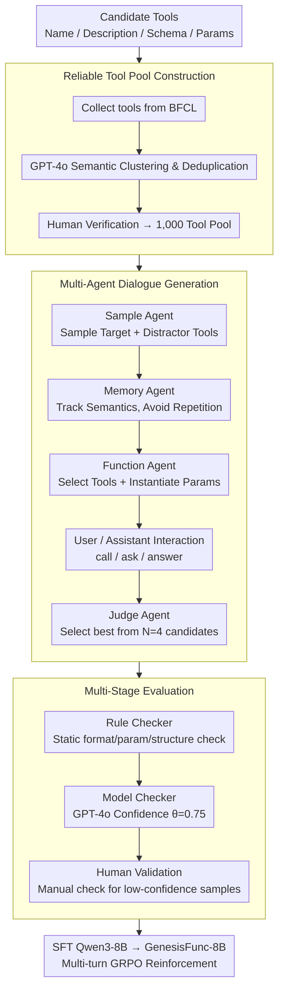

# GenesisFunc: Multi-Agent Data Generation for Accurate and Generalizable Function-Calling

**Conference**: ACL2026  
**arXiv**: [2605.28835](https://arxiv.org/abs/2605.28835)  
**Code**: https://github.com/famoustourist/GenesisFunc  
**Area**: Agent / Function Calling / Synthetic Data  
**Keywords**: Function Calling, Multi-agent data generation, Tool learning, Synthetic data quality check, GRPO  

## TL;DR
GenesisFunc automatically constructs high-quality function-calling training data through a reliable tool pool, multi-agent dialogue generation, and multi-stage quality control. Fine-tuning Qwen3-8B on this data outperforms open-source function-calling models of equivalent scale on BFCL, API-Bank, and ACEBench, demonstrating strong potential for scalability to broader toolsets and multi-turn RL training.

## Background & Motivation
**Background**: Function calling enables LLMs to evolve from pure text generators into agents capable of invoking external tools, serving as the foundation for workflow automation, travel planning, information retrieval, and complex task execution. Current mainstream approaches to enhance function-calling include prompting, SFT, and RL with feedback.

**Limitations of Prior Work**: Function-calling capabilities are highly dependent on the quality of training data. However, real-world annotated data is costly to obtain, and practical scenarios often involve ambiguous intentions, multi-tool combinations, multi-turn interactions, dynamic constraints, and error handling. Existing synthesis pipelines often rely on manual designs or public APIs, leading to issues such as unreliable tools, poor scalability, narrow scenarios, and weak quality control, which results in limited generalization of the learned tool-use capabilities.

**Key Challenge**: To train robust function-calling models, the data must simultaneously be reliable, accurate, diverse, and broad in coverage. However, as the scale of automatic generation increases, it becomes prone to tool definition errors, inconsistent parameter extraction, repetitive dialogue intentions, and non-executable samples.

**Goal**: The authors aim to construct an end-to-end automatic data generation pipeline that starts from a reliable tool repository to systematically generate single-turn, multi-turn, and special error/unsolvable scenarios, ensuring data quality through an integrated automatic and human evaluation module.

**Key Insight**: Rather than designing synthetic APIs from scratch, GenesisFunc extracts reliable tools from mature benchmarks like BFCL. It then leverages a multi-agent mechanism to expand semantic scenarios, parameter slots, and dialogue forms, finally employing a three-layer validation process (rule/model/human) for quality assurance.

**Core Idea**: Construct function-calling data using a "reliable tool pool + multi-agent generation of diverse dialogues + multi-stage quality control," and then use this data to perform SFT/RL on small-scale models to achieve tool-calling capabilities comparable to proprietary API-based models.

## Method
The methodology of GenesisFunc focuses on data engineering and a closed-loop quality control system. Instead of having a single LLM write tool-calling samples directly, the generation process is decomposed into roles such as tool selection, memory maintenance, function parameter selection, dialogue judging, and posterior verification to prevent low-quality synthetic data from entering training.

### Overall Architecture
The input consists of a set of candidate tools, each containing a name, description, schema, and required/optional parameters. The pipeline consists of three stages: The first stage constructs a Tool Pool of 1,000 reliable tools from BFCL; the second stage generates single-turn, multi-turn, and special-case function-calling dialogues using a Multi-Agent Dialogue Generation System; the third stage utilizes a Rule Checker, Model Checker, and Human Validation to inspect formatting, parameters, semantic completeness, and executability. The final data is used for SFT on Qwen3-8B to obtain GenesisFunc-8B, and multi-turn scenarios are further enhanced using GRPO.

### Key Designs

**1. Reliable Tool Pool Construction: Stabilizing the tool source before dialogue generation**

Many issues in synthetic data stem not from unnatural dialogue, but from unreliable underlying tools or schemas that are difficult to implement. GenesisFunc avoids creating APIs from scratch and instead collects tools from the BFCL evaluation set. It uses GPT-4o for semantic clustering to remove redundant or highly similar tools, followed by a round of lightweight human verification for correctness and usability, ultimately yielding a Tool Pool of 1,000 tools. Selecting BFCL as the source ensures coverage across diverse real-world tool scenarios, allowing the pool to balance reliability and domain diversity.

**2. Multi-Agent Dialogue Generation: Integrating diversity and accuracy through role specialization**

Real-world function calling involves more than just "user asks, model calls an API." It requires distinguishing between relevant and irrelevant tools, completing missing parameters, handling multi-tool combinations, and maintaining dialogue history. A single LLM struggle to manage all these dimensions simultaneously. Thus, generation is split among four roles: the Sample Agent selects target and distractor tools; the Memory Agent tracks historical dialogues and semantic types to avoid redundancy; the Function Agent identifies tools to resolve the request and randomly instantiates optional parameter slots; and the Judge Agent selects the best sample from $N=4$ candidate dialogues. The interaction between a user agent and an assistant agent covers actions such as `call`, `ask`, and `answer`, ensuring the data encompasses single-task, multi-task, multi-turn clarification, and error handling scenarios.

**3. Multi-Stage Evaluation: Intercepting bad samples with three-layer quality control**

SFT is highly sensitive to incorrect labels; wrongly labeled tool parameters can misguide the model. Quality control is applied in three layers from low to high cost: the Rule Checker performs static checks on tool definition integrity, formatting, and structural consistency; the Model Checker uses GPT-4o to assess faithfulness, task satisfaction, and compliance, retaining only samples with a confidence score above $\theta=0.75$. Finally, remaining low-confidence samples undergo human validation. This combination avoids massive manual labeling while maintaining data quality above a usable threshold.

### Example Walkthrough

Consider a dialogue sample: The Sample Agent selects a target tool (e.g., `book_flight`) and several distractor tools (e.g., `search_hotel`, `get_weather`) from the 1,000-tool pool to force the model to distinguish relevance. The Memory Agent checks that the semantic type "booking flight + missing departure city" has not been generated yet. The Function Agent selects `book_flight` and leaves the `departure_city` slot empty. The user agent asks to book a flight to Tokyo; the assistant agent identifies the missing parameter and uses the `ask` action for clarification instead of an premature `call`. Once the user provides the departure city, the assistant executes the `call` and finally `answer` with the result. The Judge Agent selects the best of $N=4$ candidates, and the samples undergo Rule and Model checking before entering the training set.

### Loss & Training
The primary model, GenesisFunc-8B, is obtained by performing SFT on Qwen3-8B using the pipeline-generated data (averaged over three runs). The RL phase utilizes GRPO, with rewards based on format compliance and function correctness. The authors also leverage Qwen3-8B's thinking mode to incorporate explicit reasoning traces. GenesisFunc-8B-RL(part) is first SFT-trained on single-turn and special-case data, followed by targeted RL on multi-turn dialogues to enhance complex interaction capabilities.

## Key Experimental Results

### Main Results

| Dataset / Setting | Metric | GenesisFunc-8B | Strong Baseline | Gain / Conclusion |
|--------|------|------|----------|------|
| BFCL Non-Live | Overall accuracy | 93.31 ± 0.42 | ToolACE-8B 91.04; Qwen3-32B 89.90 | Outperforms same-scale SOTA and larger models |
| BFCL Live | Overall accuracy | 83.78 ± 0.37 | ToolACE-8B 80.73; Qwen3-32B 81.13 | Leads in in-domain live settings |
| API-Bank | Overall accuracy | 64.79 ± 0.41 | Qwen-ToolRL-8B 60.36; ToolACE-8B 56.21 | Best among open-source methods on out-of-domain API-Bank |
| ACEBench Normal | Overall accuracy | 73.60 ± 0.32 | Qwen-ToolRL-8B 65.10; ToolACE-8B 70.30 | Significant improvement in normal tool-learning |
| ACEBench Special | Overall accuracy | 83.67 ± 0.35 | Qwen-ToolRL-8B 78.67; Qwen3-8B 76.67 | Maintains strong generalization on special cases |
| Out-of-domain Avg | API-Bank / ACEBench | API-Bank 64.79; ACEBench ~78.64 | Prior open-source SOTA | Relative improvements of 7.3% and 9.4% |

### Ablation Study

| Configuration | Key Metric | Description |
|------|---------|------|
| Remove Judge Agent | BFCL Non-Live / Live decrease | Dialogue judging is critical for sample accuracy |
| Remove Memory Agent | BFCL Non-Live / Live decrease significantly | Memory/deduplication contributes more to scenario diversity |
| 1 / 5 / 10 dialogues per tool | Significant gain from 1 to 5; diminishing returns from 5 to 10 | Volume helps, but marginal utility drops after reaching sufficient diversity |
| No Multi-Stage Evaluation | Accuracy lower across all conditions | Rule + Model + Human verification improves training data quality |
| GenesisFunc-8B-RL(part) | ACEBench Normal 75.20; Multi-Turn 70.00 | Targeted multi-turn RL significantly enhances complex interactions |

### Key Findings
- On in-domain BFCL, GenesisFunc-8B achieves 93.31 Non-Live Overall accuracy, significantly narrowing the gap between small models and API models.
- In out-of-domain settings, GenesisFunc-8B still outperforms models of the same scale, suggesting it learns general patterns of tool selection and interaction rather than just memorizing BFCL tools.
- The Memory Agent acts as a "diversity controller," guiding the generation toward uncovered scenarios and avoiding templated repetition.
- Targeted RL(part) for multi-turn scenarios is more effective than full RL(all), suggesting complex function-calling capabilities may require phased training.

## Highlights & Insights
- **Engineering-driven synthetic data quality**: Decomposing quality issues into tool reliability, dialogue diversity, parameter accuracy, and multi-stage verification is more robust than single-prompt generation.
- **Pragmatic Tool Pool source**: Repurposing reliable tools from BFCL avoids synthetic schema issues and facilitates natural extension to downstream tools.
- **Importance of special scenarios**: Models must learn when to ask for clarification or refuse a request. Special-case data improves deployment stability.
- **Clear SFT and RL boundaries**: Using SFT for basic format and semantic alignment followed by RL(part) for multi-turn reasoning is more controllable than end-to-end RL.

## Limitations & Future Work
- While GenesisFunc-8B is strong among open-source models, it still trails behind API-based models like GPT-4 in general reasoning and comprehension.
- Current data does not fully cover highly complex, multi-turn, and tightly coupled agentic workflows.
- The generation and quality control phases depend on closed-source models like GPT-4o, posing costs and dependency challenges.
- Automated screening still requires human verification for low-confidence samples; the complexity of manual auditing may increase as the tool pool expands into high-risk domains.

## Related Work & Insights
- **vs ToolACE / APIGen / ToolForge**: Unlike others, GenesisFunc emphasizes reliable tool sources, multi-agent collaboration, and a closed-loop evaluation focusing on parameter error control.
- **vs Prompting-based tool use**: GenesisFunc internalizes capabilities into model parameters via SFT/RL, providing more stability than ReAct-style prompting for complex tools.
- **vs ToolRL / AWPO**: GenesisFunc demonstrates that high-quality SFT data remains a strong baseline, and RL should be used directionally for multi-turn weaknesses.
- **Insight**: When building agent datasets, the focus should be on controlling tool reliability, semantic coverage, and the proportion of failure/insufficient-information samples rather than just volume.

## Rating
- Novelty: ⭐⭐⭐⭐☆ (Combines existing agent concepts into a solid, effective closed-loop for function calling.)
- Experimental Thoroughness: ⭐⭐⭐⭐☆ (Covers standard benchmarks, ablations, and RL; some ablation figures lack precise values in the text.)
- Writing Quality: ⭐⭐⭐⭐☆ (Clear pipeline explanation and organized experiments.)
- Value: ⭐⭐⭐⭐⭐ (Highly practical for improving small model agent capabilities and building private tool ecosystems.)

<!-- RELATED:START -->

## Related Papers

- [\[ACL 2026\] SPASM: Stable Persona-driven Agent Simulation for Multi-turn Dialogue Generation](spasm_stable_persona-driven_agent_simulation_for_multi-turn_dialogue_generation.md)
- [\[ICML 2026\] From Self-Evolving Synthetic Data to Verifiable-Reward RL: Post-Training Multi-turn Interactive Tool-Using Agents](../../ICML2026/dialogue/from_self-evolving_synthetic_data_to_verifiable-reward_rl_post-training_multi-tu.md)
- [\[ACL 2026\] Discourse Coherence and Response-Guided Context Rewriting for Multi-Party Dialogue Generation](discourse_coherence_and_response-guided_context_rewriting_for_multi-party_dialog.md)
- [\[ACL 2026\] Context-Agent: Dynamic Discourse Trees for Non-Linear Dialogue](context-agent_dynamic_discourse_trees_for_non-linear_dialogue.md)
- [\[ACL 2026\] Disambiguation-Centric Finetuning Makes Enterprise Tool-Calling LLMs More Realistic and Less Risky](disambiguation-centric_finetuning_makes_enterprise_tool-calling_llms_more_realis.md)

<!-- RELATED:END -->
