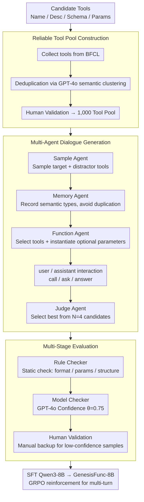

# GenesisFunc: Multi-Agent Data Generation for Accurate and Generalizable Function-Calling

**Conference**: ACL2026  
**arXiv**: [2605.28835](https://arxiv.org/abs/2605.28835)  
**Code**: https://github.com/famoustourist/GenesisFunc  
**Area**: Agent / Function Calling / Synthetic Data  
**Keywords**: Function Calling, Multi-agent data generation, Tool learning, Synthetic data quality control, GRPO  

## TL;DR
GenesisFunc automatically constructs high-quality function-calling training data using a reliable tool pool, multi-agent dialogue generation, and multi-stage quality control. After fine-tuning Qwen3-8B, it outperforms open-source function-calling models of the same scale on BFCL, API-Bank, and ACEBench, demonstrating potential for scaling to more tools and multi-turn RL training.

## Background & Motivation
**Background**: Function calling transforms LLMs from text generators into agents capable of invoking external tools, serving as a foundational capability for workflow automation, travel planning, information retrieval, and complex task execution. Current mainstream approaches to enhance function-calling include prompting, SFT, and RL with rewards.

**Limitations of Prior Work**: Function-calling capabilities are highly dependent on training data quality. However, real annotated data is costly, and real-world scenarios often involve ambiguous intentions, multi-tool compositions, multi-turn interactions, dynamic constraints, and error handling. Existing synthesis pipelines often use manual designs or public APIs, facing issues such as unreliable tools, poor scalability, simplistic scenarios, and weak quality control, leading to insufficient generalization of learned tool-use capabilities.

**Key Challenge**: To train robust function-calling models, data must simultaneously be reliable, accurate, diverse, and broad in coverage. However, as the scale of automatic generation increases, errors in tool definitions, inconsistent parameter extraction, repetitive dialogue intentions, and unexecutable samples become more prevalent.

**Goal**: The authors aim to build an end-to-end automated data generation pipeline that starts from reliable tools to systematically generate single-turn, multi-turn, and special error/no-solution scenarios, ensuring data quality through an evaluation module combining automation and human intervention.

**Key Insight**: Rather than designing synthetic APIs from scratch, GenesisFunc extracts reliable tools from mature benchmarks like BFCL, employs a multi-agent mechanism to expand semantic scenarios, parameter slots, and dialogue forms, and finally establishes a three-layer validation system (rule/model/human).

**Core Idea**: Construct function-calling data through a "reliable tool pool + multi-agent generation of diverse dialogues + multi-stage quality control," and then use this data to perform SFT/RL on small models to achieve tool-calling capabilities approaching those of API-based models.

## Method
GenesisFunc emphasizes data engineering and a quality control loop. Instead of a single LLM writing samples directly, the generation process is decomposed into roles—tool selection, scenario memory, function parameter selection, candidate dialogue judging, and posterior verification—to minimize low-quality synthetic data entering training.

### Overall Architecture
The input consists of candidate tools, each containing a name, description, schema, and required/optional parameters. The pipeline consists of three stages: Stage 1 builds a pool of 1,000 reliable tools from BFCL; Stage 2 generates single-turn, multi-turn, and special-case dialogues using a multi-agent assisted system; Stage 3 uses a Rule Checker, Model Checker, and Human Validation to inspect format, parameters, semantic completeness, and executability. The final data is used for SFT on Qwen3-8B to obtain GenesisFunc-8B; for multi-turn scenarios, GRPO reinforcement training is further applied.

### Key Designs

**1. Reliable Tool Pool Construction: Stabilizing tool sources before dialogue generation**

Many synthesis problems stem not from unnatural dialogue, but from unreliable underlying tools and impractical schemas. GenesisFunc avoids creating APIs from scratch and instead collects tools from the BFCL evaluation set. GPT-4o is used for semantic clustering to remove redundant or highly similar tools, followed by light human verification to ensure correctness and availability, resulting in a 1,000-tool pool. Selecting BFCL ensures reliability and domain diversity while preventing the generation from being limited to a single field.

**2. Multi-Agent Dialogue Generation: Balancing diversity and accuracy via role division**

Real-world function calling involves distinguishing relevant from irrelevant tools, filling missing parameters, handling multi-tool combinations, and maintaining history. A single LLM struggle to manage all these dimensions. Roles include: the Sample Agent selects target and distractor tools; the Memory Agent tracks historical dialogues and semantic types to avoid repetition; the Function Agent selects the appropriate tool and randomly instantiates optional parameter slots; and the Judge Agent selects the best sample from $N=4$ candidates. The interaction between user and assistant agents includes actions like `call`, `ask`, and `answer`, covering single-task, multi-task, multi-turn clarification, and error handling scenarios.

**3. Multi-Stage Evaluation: Preventing bad samples via three-layer quality control**

SFT is sensitive to incorrect labels, especially parameter errors. The pipeline uses three layers: the Rule Checker performs static checks on tool definitions, formats, and parameter compliance; the Model Checker uses GPT-4o for higher-level faithfulness and satisfaction judgments (keeping samples with confidence $\theta > 0.75$). Finally, human validation addresses remaining failure or low-confidence samples (approximately 15 hours of human labor). This combination avoids large-scale manual labeling while maintaining data quality above the usability threshold.

### Loss & Training
The primary model, GenesisFunc-8B, is derived from Qwen3-8B via SFT on the generated data. RL uses GRPO, with rewards based on format compliance and functional correctness. Explicit reasoning traces are added using Qwen3-8B's thinking mode. Specifically, GenesisFunc-8B-RL(part) undergoes SFT on single-turn/special-case data first, followed by RL on multi-turn dialogues to enhance complex interaction capabilities.

## Key Experimental Results

### Main Results

| Dataset / Setting | Metric | GenesisFunc-8B | Strong Baselines / Comparisons | Gain / Conclusion |
|--------|------|------|----------|------|
| BFCL Non-Live | Overall accuracy | 93.31 ± 0.42 | ToolACE-8B: 91.04; Qwen3-32B: 89.90 | Outperforms same-scale SOTA and larger models |
| BFCL Live | Overall accuracy | 83.78 ± 0.37 | ToolACE-8B: 80.73; Qwen3-32B: 81.13 | Leading in in-domain live tool settings |
| API-Bank | Overall accuracy | 64.79 ± 0.41 | Qwen-ToolRL-8B: 60.36; ToolACE-8B: 56.21 | Best among open-source methods on out-of-domain |
| ACEBench Normal | Overall accuracy | 73.60 ± 0.32 | Qwen-ToolRL-8B: 65.10; ToolACE-8B: 70.30 | Significant improvement in normal scenarios |
| ACEBench Special | Overall accuracy | 83.67 ± 0.35 | Qwen-ToolRL-8B: 78.67; Qwen3-8B: 76.67 | Strong generalization in special cases |
| Out-of-domain Avg | API-Bank / ACEBench | - | Prior open-source SOTA | Relative gains of 7.3% and 9.4% |

### Ablation Study

| Configuration | Key Metric | Description |
|------|---------|------|
| w/o Judge Agent | BFCL Non-Live / Live ↓ | Candidate judging is crucial for sample accuracy |
| w/o Memory Agent | BFCL Non-Live / Live ↓↓ | Memory and deduplication contribute more to diversity |
| 1 / 5 / 10 dialogues per tool | Significant gain at 5 | Gain diminishes after 5 dialogues per tool as diversity saturates |
| w/o Multi-Stage Eval | Accuracy lower across all conditions | Rule + Model + Human verification improves data quality |
| GenesisFunc-8B-RL(part) | ACEBench MT: 70.00 | Multi-turn RL significantly enhances complex interactions over SFT (65.00) |

### Key Findings
- On in-domain BFCL, GenesisFunc-8B significantly closes the gap with API models, indicating the importance of semantic alignment between training data and real tools.
- On out-of-domain datasets, the model still outperforms same-scale baselines, suggesting it learns general patterns of tool selection and multi-turn interaction rather than just memorizing tools.
- The Memory Agent acts as a "diversity controller," guiding generation toward uncovered scenarios and avoiding stereotypical templates.
- Targeted multi-turn RL (part) is more effective than full RL (all), suggesting complex function-calling capabilities require staged training.

## Highlights & Insights
- **Engineering-driven synthesis**: Breaking down data quality into reliable tools, diversity, accuracy, candidate selection, and verification proves much more stable than single-prompt generation.
- **Pragmatic Tool Pool source**: Reusing BFCL tools avoids artificial schemas and facilitates natural expansion to real downstream tools.
- **Importance of special scenarios**: Models must learn when to ask for missing info or reject mismatched tools, which is crucial for deployment stability.
- **Clear boundary between SFT and RL**: SFT establishes the format and semantics, while RL(part) optimizes reasoning and interaction.

## Limitations & Future Work
- While GenesisFunc-8B is strong among its scale, it still lags behind API models (e.g., GPT-4o) in broad reasoning and comprehension.
- The training data does not yet fully cover highly complex, tool-coupled agentic workflows.
- The generation and evaluation stages depend on closed-source models (Gemini, GPT-4o), entailing construction costs and dependencies.
- Manual verification is still needed for low-confidence samples; although the 15-hour cost is low, standards might become complex as the tool pool expands to high-risk domains.

## Related Work & Insights
- **vs ToolACE / APIGen**: GenesisFunc emphasizes reliable tool sources and multi-stage evaluation, specifically targeting parameter errors.
- **vs prompting-based tool use**: ReAct-style methods are unstable for complex tools; GenesisFunc embeds capabilities into model parameters via SFT/RL.
- **Insight**: For agent datasets, prioritize explicit control over tool reliability, semantic coverage, and the ratio of failure/unsolvable samples over raw quantity.

## Rating
- Novelty: ⭐⭐⭐⭐☆ Combines multi-agent generation and quality control into a robust closed loop for function calling.
- Experimental Thoroughness: ⭐⭐⭐⭐☆ Covers major benchmarks, ablation, tool expansion, and RL components.
- Writing Quality: ⭐⭐⭐⭐☆ Pipeline is clearly explained, though some tables are dense.
- Value: ⭐⭐⭐⭐⭐ Highly practical for teams aiming to improve small model agent capabilities and private tool ecosystems.

<!-- RELATED:START -->

## Related Papers

- [\[ACL 2026\] SPASM: Stable Persona-driven Agent Simulation for Multi-turn Dialogue Generation](spasm_stable_persona-driven_agent_simulation_for_multi-turn_dialogue_generation.md)
- [\[ICML 2026\] From Self-Evolving Synthetic Data to Verifiable-Reward RL: Post-Training Multi-turn Interactive Tool-Using Agents](../../ICML2026/dialogue/from_self-evolving_synthetic_data_to_verifiable-reward_rl_post-training_multi-tu.md)
- [\[ACL 2026\] Discourse Coherence and Response-Guided Context Rewriting for Multi-Party Dialogue Generation](discourse_coherence_and_response-guided_context_rewriting_for_multi-party_dialog.md)
- [\[ACL 2026\] Context-Agent: Dynamic Discourse Trees for Non-Linear Dialogue](context-agent_dynamic_discourse_trees_for_non-linear_dialogue.md)
- [\[ACL 2026\] Disambiguation-Centric Finetuning Makes Enterprise Tool-Calling LLMs More Realistic and Less Risky](disambiguation-centric_finetuning_makes_enterprise_tool-calling_llms_more_realis.md)

<!-- RELATED:END -->
