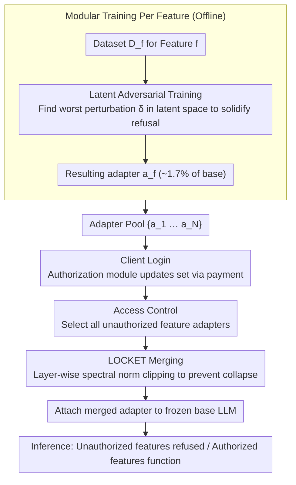

# LOCKET: Robust Feature-Locking Technique for Language Models

**Conference**: ACL 2026  
**arXiv**: [2510.12117](https://arxiv.org/abs/2510.12117)  
**Code**: https://github.com/ssg-research/locket (Available)  
**Area**: LLM Control / Feature Locking / Model Monetization  
**Keywords**: Feature Locking, LoRA Adapter Merging, Latent Adversarial Training, Spectral Norm Clipping, Jailbreak Defense, Pay-to-Unlock

## TL;DR
LOCKET is a password-less, scalable, and jailbreak-resistant feature-locking scheme designed for the "pay-to-unlock" business model of LLMs. It trains a LoRA adapter for each feature to be locked (using LAT for adversarial reinforcement of refusals). When merging multiple adapters, it applies per-layer spectral norm clipping to prevent "over-refusal" collapse. Across 3 models and 4 features (Math/SQL/Summarize/MMLU), LOCKET achieves a 100% refusal rate, $\leq$ 7% utility loss, and $\leq$ 5% jailbreak attack success rate, significantly outperforming password-locking baselines.

## Background & Motivation

**Background**: LLM service providers like OpenAI and Anthropic currently use "tiered subscription" models (Free = Basic, Paid = Pro) to sell APIs. However, "Pro subscriptions are losing money" (Sam Altman, Twitter), which is unsustainable. SaaS and mobile games have long shifted to "pay-to-unlock" models with finer granularity and higher commercial flexibility. LLMs currently lack the technical foundation to support a model where the "base model is free, and premium capabilities like math, coding, or summarization are unlocked upon payment."

**Limitations of Prior Work**: Implementing this business model requires a "Feature-Locking Technique" (FLoTE) that meets four stringent requirements: (R1) **Effective**—successfully refuses unauthorized features; (R2) **Utility-Preserving**—authorized features perform consistently with the unlocked state; (R3) **Robust**—resists jailbreak attacks, credential sharing, and brute-force guessing; (R4) **Scalable**—supports multiple features and multiple clients without combinatorial explosion. Existing password-locking schemes (Greenblatt 2024 / Tang 2024 / Su 2025 / Hofstätter 2025) fail—either utility drops drastically, they offer no defense against adaptive jailbreaks, passwords can be stolen or shared, or the entire model must be re-SFTed for every new feature/client, leading to explosive complexity.

**Key Challenge**: Traditional schemes bind "unlocking" to a **secret credential** (password); once leaked, the mechanism collapses. Meanwhile, the only way to support multiple features/clients is SFT on the whole model, which inevitably triggers catastrophic forgetting and utility loss. These problems constrain each other: avoiding passwords requires "endogenous functional locks," but creating such locks via SFT destroys utility. "Strawman" solutions like System Prompts, Unlearning, API Routers, or Prompt Filtering all violate at least one of R3 or R4.

**Goal**: (a) Formally define R1-R4 for FLoTE; (b) Design a "password-less + modular adapter + train-once-reuse-forever" FLoTE; (c) Resolve the over-refusal collapse caused by the superposition and amplification of refusal directions when merging multiple adapters.

**Key Insight**: Treat functional locks as "hot-pluggable LoRA adapters" rather than password-triggered backdoors. Train one adapter for each feature to be locked. When a client logs in, an access control module dynamically attaches the "unauthorized feature adapters" to the base model based on their authorization list, forcing the model to refuse those features. Authorized features work normally because no adapter is attached. No password = impossible to steal or share. One adapter per feature = adding a new feature only requires training one new adapter, $O(N)$ instead of $O(2^N)$.

**Core Idea**: Replace password triggers with LoRA adapters + reinforce refusal robustness with LAT + prevent refusal direction explosion during adapter merging with spectral norm clipping.

## Method

### Overall Architecture

LOCKET reframes functional locks from password-triggered backdoors into hot-pluggable LoRA adapters. The mechanism is divided into offline and online phases. In the offline phase, an adapter $a_f$ is trained independently for each feature $f \in \mathcal{F}$. The training objective $\mathcal{L}_{\text{lock}} = \mathcal{L}_{\text{utility}} + \mathcal{L}_{\text{robust}}$ uses KL divergence constraints against a frozen reference model $\pi_{\theta'}$ to preserve base conversational ability, while using LAT-based refusal enhancement loss to solidify the "refusal." Each adapter accounts for only 1.6-1.7% of the base model parameters. In the online phase, when a client logs in, the Authorization Module updates the authorized feature set based on payment credentials. For each request, the Access Control Module identifies the set of all **unauthorized** feature adapters $\{a_k : k \notin \text{auth}(C)\}$. These are merged using LOCKET Merging and attached to the frozen base LLM for inference. Authorized features function normally without attached adapters, while unauthorized features are forced into stable refusal. Attaching takes ~1 second per login, and TTFT does not change with the number of adapters (~3 ms), making engineering overhead negligible.

### Key Designs

**1. Latent Adversarial Training: Solidifying the refusal direction in latent space.** Models trained with standard SFT/refusal leave a "refusal direction" in the latent space, which is fragile against adaptive jailbreaks. Attackers can bypass it by finding prompts that push activations away from this direction. This is why password-locking schemes are broken by GCG or AutoDAN-Turbo. LAT finds a "worst-case perturbation" on latent activations before updating the adapter. For each prompt $x_i$, a pair is used (chosen = fixed refusal string $c_i =$"Sorry, you are not authorized...", rejected = ground truth response $r_i$). First, calculate $\delta_i = \arg\min_\delta \mathcal{L}_{\text{evade}}(c_i, r_i; \delta)$, where $\mathcal{L}_{\text{evade}} = -\log \pi_\theta(c_i | \alpha(x_i, \delta)) - \log(1 - \pi_\theta(r_i | \alpha(x_i, \delta)))$. The perturbation is searched using PGD for 16 steps within the $\|\delta\|_2 \leq \epsilon$ ball.

Updating adapter weights with this worst-case $\delta_i$ reinforces the refusal direction in all directions within the perturbation ball. Even if an attacker shifts activations in latent space, the model still tends to output $c_i$ rather than $r_i$. This is the core engine that reduces jailbreak ASR from 0.95 in PWD baselines to 0.05 in LOCKET.

**2. LOCKET Merging: Preventing merging collapse via spectral norm clipping.** When multiple LAT-trained adapters are added together, the refusal directions are superposed and amplified, causing the adapter norm to explode. This leads to the model outputting "Sorry, sorry, ..." for all queries (even unlocked features), a disaster known as over-refusal. LOCKET Merging applies two steps: Offline, per layer $\ell$, each adapter $a_i$ is decomposed via SVD $\Delta W_\ell^i \approx \mathbf{U}^i \mathbf{S}^i (\mathbf{V}^i)^T$ to find the largest singular value $\sigma^i = \|\Delta W_\ell^i\|_2$. A clipping threshold $Clip_\ell = \tau \cdot \max_i \sigma^i$ is defined ($\tau \in (0,1]$, typically 0.5-0.9). Online, unauthorized adapters are merged using CAT as $\Delta W_\ell = \sum_{i \in L} \Delta W_\ell^i$. If $\|\Delta W_\ell\|_2 > Clip_\ell$, it is linearly rescaled: $\Delta W_\ell \leftarrow \frac{Clip_\ell}{\|\Delta W_\ell\|_2} \Delta W_\ell$.

This ensures the spectral norm of each layer after merging remains within the "maximum of a single adapter," suppressing the refusal direction enough to preserve utility while keeping it strong enough to lock features. Why is this necessary? Appendix Table 8 shows that SVD / TIES SVD / DARE Linear results in ACC=0 (unlocked features refused), while DARE TIES results in ALA=0.37 (locked features not secured). The root cause is that the refusal direction is heavy across multiple adapters; summing them makes the spectral norm in that direction far exceed any single adapter, saturating attention/MLP outputs. Rescaling the merged norm back to the single-adapter upper bound is the only way to preserve both utility and effectiveness.

**3. Modular Training Per Feature + Dynamic Attachment.** Training a separate model for every (client, authorized feature set) combination has a complexity of $O(2^N)$, which explodes as $N$ grows and requires retraining for every change. LOCKET reduces this to $O(N)$: during training, each feature $f$ is trained as an independent adapter $a_f$ using only its task-specific dataset $D_f$. At inference, access control determines the subset of adapters to attach. New features only require training one new adapter, and new clients require no model changes, only authorization table updates.

The authors compared "training a single adapter to lock multiple combinations" vs. "one adapter per feature" and chose the latter because the former still suffers from $O(2^N)$ complexity. Modular training + merging keeps the storage at $O(N)$ while allowing $2^N-1$ combinations, making it compatible with serving frameworks like vLLM or PEFT.

### Loss & Training

Adapters use LoRA rank=64, alpha=64, dropout=0.1, with RSLoRA scaling. LAT uses 16-step PGD on target layers $[8, 16, 24, 30]$ (embedding + three hidden layers), with 100 total steps and batch size 2. The utility dataset $D_{\text{auth}}$ uses UltraChat (165k samples). Feature datasets $D_f$ include MATH (7.5k), SQL Create Context (62.8k), SAMSum (819), and MMLU (99.8k). The hyperparameter $\tau$ is grid-searched using 100 samples per (model, feature combination) pair; $\tau = 0.75$ is used for DeepSeek-7B-Math when all 4 features are locked. Total compute cost: 8×A100 40GB × 6000 GPU hours.

## Key Experimental Results

### Main Results
Effectiveness and Utility of single-feature locking for 3 models (DeepSeek-7B-Math / DeepSeek-7B-Coder / Llama-3-8B-Instruct) × 4 features (M/Q/S/U):

| Model | Lock → | Baseline M | M after Lock | Q after Lock | S after Lock | U after Lock | Description |
|------|------|-----------|----------|----------|----------|----------|------|
| DeepSeek-7B-Math | Math | 0.40 | **0.00** | 0.95 | 0.23 | 0.51 | M 100% locked, others stable |
| DeepSeek-7B-Math | SQL | 0.93 | 0.45 | **0.00** | 0.24 | 0.50 | M slightly increases when Q locked |
| DeepSeek-7B-Math | MMLU | 0.53 | 0.42 | 0.93 | 0.24 | **0.00** | 100% U locked |
| Llama-3-8B-Instruct | Math | 0.28 | **0.00** | 0.92 | 0.34 | 0.64 | 6% utility loss on U (M-U interference) |
| Llama-3-8B-Instruct | MMLU | 0.67 | 0.22 | 0.89 | 0.32 | **0.00** | 6% drop on M (M-U overlap) |

All "diagonal" entries are a perfect 0.00 (100% refusal), with non-diagonal entries showing $\leq$ 7% loss (mostly within $\pm$ 2%). Comparing to the PWD password-locking baseline: when locking M on DeepSeek-7B-Math, PWD drops Summarize by 12%, while LOCKET does not. **Robustness** comparison (ASR on 1000 test samples across 4 SOTA jailbreak attacks, lower is better):

| Attack | Locked Feature | PWD ASR | LOCKET ASR |
|------|--------|---------|-----------|
| Many-shot | Math | 0.57 | **0.00** |
| GCG | Math | 0.87 | **0.01** |
| TAP | Math | 0.91 | **0.02** |
| AutoDAN-Turbo | Math | 0.95 | **0.05** |
| AutoDAN-Turbo | SQL (Coder) | 0.96 | **0.05** |
| AutoDAN-Turbo | MMLU (Llama-3) | 0.68 | **0.03** |

Scalability (Table 4, DeepSeek-7B-Math): Under all $2^4 - 1 = 15$ combinations of the 4 features, effectiveness remains 100% and utility loss $\leq$ 7%. It even scales to 8 features (Table 9) with utility degradation within 15% (consistent with the 8-adapter merging limit in Lee et al. 2025).

### Ablation Study
Comparison of merging methods (DeepSeek-7B-Math, 4 LAT adapters, one feature unlocked):

| Merging Method | Unlocked Math ACC↑ | Locked SQL/Sum/MMLU Avg ALA↓ | Conclusion |
|---------|--------------|-------------------------------|------|
| Baseline (No LOCK) | 0.40 | 0.00 | Upper bound |
| **LOCKET Merging** | **0.45** | **0.00** | ✓ No utility loss + Perfect locking |
| Pure SVD | 0.00 | 0.00 | Over-refusal collapse |
| TIES + SVD | 0.00 | 0.00 | Over-refusal |
| DARE TIES | 0.40 | 0.37 | Utility OK but locking fails |
| DARE Linear | 0.00 | 0.02 | Over-refusal |
| Magnitude Prune | 0.00 | 0.00 | Over-refusal |

$\tau$ hyperparameter sensitivity (Figure 2 Bottom): $\tau > 0.9$ leads to failed locks; $\tau < 0.5$ leads to over-refusal. The sweet spot $\tau \in [0.7, 0.85]$ on DeepSeek-7B-Math achieves both perfect effectiveness and utility. Token-level overhead: attaching adapters takes 1.0 $\pm$ 0.06s (once per session), detaching takes 0.02s, and TTFT is 3ms (independent of the number of adapters).

### Key Findings
- **Spectral norm clipping is the unique key to preventing merge collapse**: All other LoRA merging methods (CAT / TIES / DARE / Linear) on LAT-trained adapters either collapse or fail. LOCKET Merging is the only one that preserves both utility and effectiveness. This indicates that the "strong refusal direction" introduced by LAT must be explicitly constrained; simple "weighted sums + sign selection" approaches fail.
- **PWD suffers from catastrophic forgetting in multi-feature locking**: Table 5 shows that when locking M+Q+S, PWD's accuracy on Summarize drops from 0.27 to 0.12 (baseline 0.23). Full SFT for three rounds of refusal overwrites other feature knowledge. LOCKET attaches adapters without touching base weights, avoiding forgetting.
- **Feature interference vs. catastrophic forgetting**: The 6% utility drop for LOCKET in Math vs. MMLU is identified as feature interference (MMLU contains math problems, overlapping semantically) rather than forgetting. This can be mitigated by pre-cleaning datasets and is an inherent issue for any FLoTE.
- **Marginal cost to adapt LOCKET to new features = training one adapter**: Table 9 shows scaling from 4 to 8 features only involves training 4 more adapters (~hours each) while maintaining 100% effectiveness (except for slight interference in MMLU sub-categories like H/Y/P/O due to semantic proximity).
- **Extremely low adapter storage cost**: A single adapter is only 1.6-1.7% of the base (120-130M parameters). Total overhead for N features is ~N × 130M, which is 100× more efficient than N independent LLMs.

## Highlights & Insights
- **A model for "Business-Driven Technical Problems"**: The motivation traces from the commercial reality that "OpenAI Pro is losing money" to the requirement for FLoTE meeting R1-R4, and finally to the specific method. The narrative is highly industrial and relevant—providers like OpenAI or Anthropic could directly pilot this for feature-based billing.
- **Spectral norm clipping as a highly effective trick**: Using SVD + per-layer thresholds for over-refusal suppression in LoRA merging is a novel combination. Inspired by STAR (Lee et al. 2025) but more lightweight, it does not require retraining adapters. This trick is transferable to any scenario where multiple alignment adapters merge and cause direction explosion (e.g., combining multiple safety filters).
- **Innovation in LAT application for functional locking**: Reversing LAT from "preventing jailbreaks" to "reinforcing refusal" makes the adapter robust in latent space against perturbations, suppressing ASR below 5%. This is an order of magnitude stronger than pure SFT refusal and serves as a valuable lesson for all LLM safety guardrails.
- **The "Modular Training + Dynamic Merging + Spectral Clipping" trifecta**: This solves the four main flaws of password-based FLoTE (utility / robustness / credential sharing / scalability) with negligible engineering overhead (constant TTFT / 1s attach / 1.7% storage). It is one of the few LLM safety research works ready for immediate deployment.
- **Comprehensive comparison with strawman solutions** (System Prompt / Unlearning / API Router / Prompt Filter) demonstrates a thorough exploration of the design space, strengthening the argument by explicitly showing how each alternative fails specific requirements.

## Limitations & Future Work
- **Feature interference remains unresolved**: When two features overlap (e.g., math problems in MMLU), locking one affects the other. A 6% utility drop is non-negligible. The authors admit this is an open problem and suggest pre-cleaning or explicit non-overlapping feature design but provide no concrete solution.
- **The jailbreak arms race continues**: The current $\leq$ 5% ASR is relative to known attacks like GCG/TAP/AutoDAN-Turbo. Future stronger attacks (e.g., white-box adapter inversion) might bypass this. The authors suggest "fine-tuning LOCKET adapters further," but the long-term durability is not quantified.
- **White-box settings**: LOCKET is ineffective if the base model and adapters are both public. The authors explicitly limit the scope to "black-box APIs" where the provider controls the server. Open-source LLM vendors cannot use this scheme.
- **Energy consumption**: Running LOCKET costs the same as the baseline LLM. Pay-to-unlock addresses revenue, not operational costs. The authors recommend vLLM PagedAttention for adapter optimization but did not provide empirical tests.
- **Scaling to larger models**: Main experiments were on 7B-8B models. 70B was only verified in Appendix (Llama-3-70B 4-bit quantized); scaling laws were not systematically studied.
- **Lack of multi-client concurrency testing**: While access control + per-session merging should work theoretically, the effects of 1000 concurrent clients with different authorizations—and thus different merged adapters—on GPU memory and throughput were not measured.

## Related Work & Insights
- **vs. Greenblatt et al. 2024 (Password-Locked Models)**: Both aim to make LLMs refuse certain queries under specific conditions. Greenblatt uses password-triggered backdoors and focuses on sandbagging. LOCKET replaces passwords with adapters to avoid credential-sharing attacks. Greenblatt actually proved that passwords could be bypassed via fine-tuning; LOCKET bypasses this entirely.
- **vs. Tang et al. 2024 (Key Prompt Protection)**: Tang trains password prompts directly into the model, which scales poorly (requires whole-model SFT per feature) and lacks defense against adaptive attacks. LOCKET's LAT adapter + clipping is an order of magnitude lower in ASR.
- **vs. Hofstätter et al. 2025 (Elicitation Game)**: Hofstätter uses password-locking + circuit breaking for robust refusal but suffers significant utility loss. Appendix Table 12 shows PWD+CB still fails effectiveness in multi-feature locking, whereas LOCKET maintains higher utility.
- **vs. CAT / TIES / DARE / Linear LoRA merging**: These are general LoRA merging methods for "multi-skill fusion." LOCKET Merging specifically addresses "refusal direction superposition" via spectral norm clipping, extending LoRA merging into the safety sub-domain.
- **vs. Unlearning (Gao et al. 2025)**: Unlearning tries to "forget" knowledge permanently. LOCKET is "reversible and dynamic"—the same base model can present different capabilities for different clients in different sessions, offering much higher flexibility without retraining the entire model.
- **Insights**: (1) The **adapter-based access control paradigm** can extend to any scenario requiring dynamic control (e.g., a medical LLM locking diagnostic capabilities based on regional regulations). (2) **Spectral norm clipping can be generalized** to any multi-adapter context where alignment-style directions (RLHF / safety / refusal) are involved. (3) **LAT is currently the most practical tool for latent-level robust training**, useful not just for jailbreak defense but any case where stable model behavior is required under specific conditions.

## Rating
- Novelty: ⭐⭐⭐⭐ The combination of adapter + LAT + spectral clipping is innovative. Spectral norm clipping specifically for LoRA refusal merging is truly new. This is the first work targeting "pay-to-unlock" in LLM safety.
- Experimental Thoroughness: ⭐⭐⭐⭐⭐ 3 models × 4 features × 15 combinations × 4 SOTA attacks + 9 merging ablation + $\tau$ sensitivity + 70B scaling + 8-feature scaling + probability sampling. Perfect coverage.
- Writing Quality: ⭐⭐⭐⭐ Clear R1-R4 framework, detailed strawman comparisons, and Figure 1 clearly explains the pipeline. Algorithm 1 and formulas are complete. The $\tau$ selection logic in 4.6 is a bit brief.
- Value: ⭐⭐⭐⭐⭐ Extremely high industrial relevance (essential for LLM billing). Code is open-sourced and the technology is ready for deployment. Spectral norm clipping and the LAT-adapter paradigm have spilled-over value for the LLM safety community.

<!-- RELATED:START -->

## Related Papers

- [\[NeurIPS 2025\] Less is More: Local Intrinsic Dimensions of Contextual Language Models](../../NeurIPS2025/dialogue/less_is_more_local_intrinsic_dimensions_of_contextual_language_models.md)
- [\[ACL 2025\] UniConv: Unifying Retrieval and Response Generation for Large Language Models in Conversations](../../ACL2025/dialogue/uniconv_retrieval_response_gen.md)
- [\[ACL 2026\] Stress-Testing Emotional Support Models: Moving from Homogeneous to Diverse Help Seekers](stress-testing_emotional_support_models_moving_from_homogeneous_to_diverse_help_.md)
- [\[ICLR 2026\] Understanding Language Prior of LVLMs by Contrasting Chain-of-Embedding](../../ICLR2026/dialogue/understanding_language_prior_of_lvlms_by_contrasting_chain-of-embedding.md)
- [\[NeurIPS 2025\] LatentGuard: Controllable Latent Steering for Robust Refusal of Attacks and Reliable Response Generation](../../NeurIPS2025/dialogue/latentguard_controllable_latent_steering_for_robust_refusal_of_attacks_and_relia.md)

<!-- RELATED:END -->
