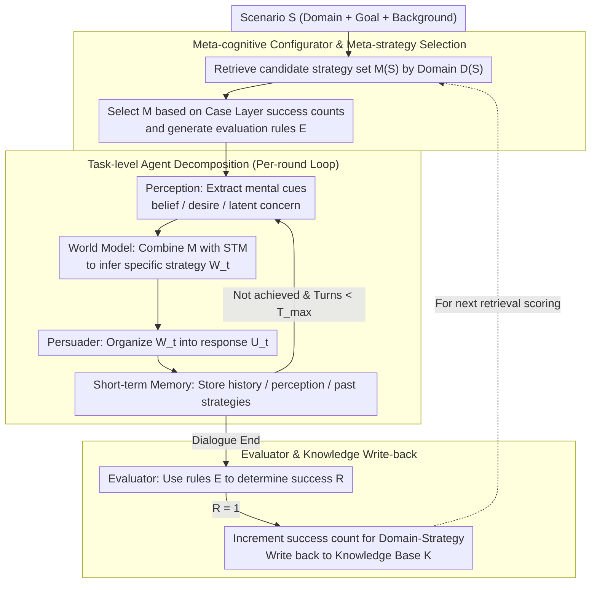

# MA$^2$P: A Meta-Cognitive Autonomous Intelligent Agents Framework for Complex Persuasion

**Conference**: ACL2026 Findings  
**arXiv**: [2605.18572](https://arxiv.org/abs/2605.18572)  
**Code**: The paper claims to release prompts, code, and the knowledge base, but no public repository link is provided in the cache.  
**Area**: Dialogue Systems / LLM Agent / Persuasion Dialogue  
**Keywords**: Complex Persuasion, Meta-cognition, Multi-agent, Theory of Mind Modeling, Strategy Knowledge Base

## TL;DR
MA$^2$P decomposes complex persuasion dialogue into a closed loop of "meta-strategy selection - task-level multi-agent persuasion - post-hoc knowledge update." Without training the base LLM, it transforms the persuadee's beliefs, desires, and concerns into specific strategic actions, significantly improving the persuasion success rate of various LLMs on CToMPersu.

## Background & Motivation
**Background**: Persuasive dialogue has evolved from early single-domain tasks like donation and negotiation to multi-domain tasks with fine-grained user state modeling. New datasets like CToMPersu provide not only dialogue context but also expose the persuadee's mental states (belief, desire, etc.), requiring models to not only generate fluent responses but also plan continuously based on latent concerns.

**Limitations of Prior Work**: Current LLM persuaders usually act as single next-turn generators. While they can identify explicit obstacles such as "lack of money" or "no time," they often stop at general suggestions—for instance, emphasizing the importance of psychotherapy without converting obstacles into actionable items like insurance reimbursement, online sessions, or low-cost trials. Another issue is unstable cross-domain performance: motivation experiments in the cache show gpt-5-mini's success rate on CToMPersu varies across domains from 88.24% to 16.67%, a gap of 71.57 percentage points.

**Key Challenge**: Complex persuasion is not a single-turn language generation task but a partially observable, multi-turn, goal-oriented interaction. The model must select strategies based on the counterpart's hidden states while maintaining stable generalization across domains. Monolithic LLMs lack explicit planning states and strategic memory, leading to reactive outputs that are polished but not actionable.

**Goal**: The authors aim to build a plug-and-play, training-free external framework that enables any base LLM to complete complex persuasion more stably. Specific sub-problems include: extracting mental states from dialogue history, translating high-level psychological strategies into round-specific tactics, reducing cross-domain volatility using historical successes, and writing successful experiences back into the system post-dialogue.

**Key Insight**: The paper draws on the structure of LeCun's autonomous agents (perception, world model, actor, memory, cost/evaluator) while introducing planning, monitoring, and evaluation from meta-cognition. The core observation is that a persuasion system needs to first determine "what high-level strategy should be used for this type of scenario" before a task-level agent generates the next action, rather than letting the LLM improvise every turn.

**Core Idea**: Use a Meta-cognitive Configurator to select domain-relevant meta-strategies from a structured knowledge base, then have Perception, World Model, Persuader, Memory, and Evaluator agents execute and update in a closed loop. This converts mental state cues into strategy-consistent, executable persuasive actions.

## Method

### Overall Architecture
MA$^2$P models a persuasive dialogue as a three-stage cycle. The input is a scenario $S$ (domain, goal, and background); the output is a multi-turn dialogue and an updated knowledge base. The first stage is **Meta-level Judging**: the Configurator retrieves candidate meta-strategies from the knowledge base based on the domain, selects the historically most effective strategy, and constructs evaluation rules. The second stage is **Task-level Persuading**: multiple autonomous agents collaborate to generate each turn's response, including perceiving mental cues, inferring specific strategies, generating utterances, and maintaining short-term memory. The third stage is **Knowledge Updating**: the Evaluator determines if the turn was successful; success cases are written back to the knowledge base to inform future strategy selection in similar domains.

This framework acts as an external orchestration layer for the base model rather than retraining the LLM. In experiments, the same MA$^2$P framework was applied to gpt-4o-mini, gpt-4o, gpt-5-mini, gemini-2.5-flash, and deepseek-v3, demonstrating its plug-and-play design.

### Key Designs

**1. Meta-cognitive Configurator and Meta-strategy Selection: Determining high-level strategy at the start rather than improvising.**

One root cause of cross-domain volatility is the uneven generalization of LLM strategies across domains; in weak domains, they often improvise blindly with vague suggestions. The Configurator addresses this before the dialogue begins: the knowledge base is organized into three layers (meta-strategy, domain, case). It first retrieves the candidate strategy set $M(S)$ matching the current domain $D(S)$, then scores each candidate using historical success counts from the Case Layer, selecting $M=\arg\max_{m \in M(S)} score(m,S)$ as the global intent. Simultaneously, it generates success criteria $E$ for the Evaluator. This explicitly records "which strategy works best in which domain" as retrievable evidence, providing a directional compass before turn-by-turn generation begins.

**2. Task-level Autonomous Agent Decomposition: Translating abstract meta-strategies into specific, actionable turns.**

Monolithic LLMs often identify explicit obstacles like "no money" but default to vague persuasion, showing weak ability to convert obstacles into actionable plans. MA$^2$P splits this into a pipeline: Perception extracts explicit signals and latent mental cues $P_t=f_{perc}(H_t)$ (belief, desire, latent concern) from history $H_t$; World Model combines the selected meta-strategy $M$ with short-term memory $\Sigma_t$ to infer the specific strategy $W_t=f_{wm}(M,\Sigma_t)$; Persuader Agent organizes $W_t$ and history into a natural language response $U_t=f_{pers}(W_t,H_t)$; Short-term Memory continuously stores history, perception, and past strategies $\Sigma_t=\{H_t,P_t,W_{1:t-1}\}$. This division of labor—understanding resistance, deciding tactics, then organizing language—closely mimics human persuasion; in scenarios with latent or dynamic resistance, explicit memory prevents strategy drift or repeating the same arguments.

**3. Evaluator and Knowledge Write-back: Distilling successful persuasion into reusable experience.**

The effectiveness of persuasion strategies is highly dependent on domain and audience. Without recording a one-time success, the system must start from scratch in similar future scenarios. The Evaluator uses rule $E$ and final short-term memory $\Sigma_T$ to determine success $R=f_{eval}(E,\Sigma_T)$. If $R=1$, the system increments the success count of the selected meta-strategy in the current domain: $K_{case}(M,D(S)) \leftarrow K_{case}(M,D(S))+1$, and generates an updated knowledge base $K'=update(K,M,S,R)$. This write-back loop allows the framework to evolve from a cold-start rule-based agent into a meta-cognitive system with experience—providing a more solid basis for the Configurator's scoring in future dialogues.

### Loss & Training
MA$^2$P does not train the base model; it uses a prompt-based, multi-agent scheduled inference-time strategy. Main experiments utilized the CToMPersu official test set (525 instances), with a maximum dialogue turn count $T_{max}=4$. gpt-4o-mini was fixed as the persuadee simulator and LLM judge. Knowledge base size was studied as a warm-up hyperparameter: $K=0$ yielded a 0.66 success rate, while $K=500$ reached 0.79 (the setting for main results).

## Key Experimental Results

### Main Results
The paper compares five base LLMs and their MA$^2$P-enhanced versions on CToMPersu. Metrics include Success, Persuasive, Logic, Helpful, cross-domain Range/SD, and average success turns (Avg_Turn).

| Base Model | Success (Base) | Success + MA$^2$P | Gain | Avg_Turn (Base) | Avg_Turn + MA$^2$P |
|----------|--------------|-------------------|------|---------------|--------------------|
| gpt-4o-mini | 0.45 | 0.79 | +0.34 | 2.94 | 1.86 |
| gpt-4o | 0.46 | 0.75 | +0.29 | 3.03 | 2.00 |
| gpt-5-mini | 0.51 | 0.72 | +0.21 | 2.66 | 1.60 |
| gemini-2.5-flash | 0.46 | 0.66 | +0.20 | 3.27 | 2.08 |
| deepseek-v3 | 0.53 | 0.80 | +0.27 | 3.05 | 1.82 |

Quality metrics generally improved: e.g., gpt-5-mini's Persuasive score rose from 6.40 to 7.15, Logic from 7.81 to 8.28, and Helpful from 7.55 to 8.27. Deepseek-v3's Persuasive score rose from 6.98 to 7.58.

### Ablation Study
The authors compared the base LLM, an autonomous agent system without meta-cognitive enhancement (+Auto), and the full MA$^2$P.

| Model | Config | Success | Range | SD | Note |
|------|------|---------|-------|----|------|
| 4o-mini | Base | 0.45 | 0.450 | 0.104 | Monolithic persuader |
| 4o-mini | + Auto | 0.66 | 0.530 | 0.118 | Higher success, but higher variance |
| 4o-mini | + MA$^2$P | 0.79 | 0.400 | 0.107 | Highest success, lower Range |

### Key Findings
- MA$^2$P improved Success across all five base models, indicating that gains are not due to model-specific prompt tricks.
- +Auto improves average success but sometimes widens domain gaps; the value of the full MA$^2$P lies in combining "multi-agent execution" with "domain-level strategy selection."
- Warm-up requirements are modest: K=100 already improved success from 0.66 to 0.73, though K=500 was most stable.
- Human preference (400 samples, 2 annotators) showed moderate agreement with LLM judges (weighted Cohen's $\kappa_w=0.549$), with trends favoring MA$^2$P.

## Highlights & Insights
- **Reframing persuasion from a generation problem to a closed-loop control problem**: Instead of stacking prompts, the paper models persuasion as a cycle of perception, world modeling, action, memory, and evaluation. This adds an interpretable strategy layer between "understanding concerns" and "generating utterances."
- **Meta-strategy selection addresses cross-domain stability, not just mean improvement**: While +Auto increases success, full MA$^2$P emphasizes reducing Range/SD. This is crucial for real-world systems to avoid total failure in "weak" domains.
- **Lightweight Knowledge Base design**: The Case Layer only records domain-strategy success counts but provides an interpretable meta-strategy prior. This "lightweight experience statistics + prompt scheduling" is more practical than complex retraining for many agent systems.

## Limitations & Future Work
- Automatic metrics rely heavily on gpt-4o-mini as a judge; open-ended persuasion remains subjective. Human validation was limited to 2 annotators and 400 samples.
- Persuadee simulation is simplified, conditioning only on belief and desire without modeling personality, long-term preferences, or trust.
- New domains require a warm-up phase to accumulate cases.
- There are inherent misuse risks with persuasion technology; future applications in sensitive areas require stronger consent, manipulation risk assessment, and audit logs.
- The multi-agent scheduling increases inference costs and latency.

## Related Work & Insights
- **vs. Monolithic LLM Persuaders**: Monolithic approaches are simpler/cheaper; MA$^2$P adds explicit mental state extraction and memory updates for better interpretability and stability at the cost of longer inference chains.
- **vs. ReAct / Reflexion Agents**: ReAct is general-purpose (Thought-Action-Observation); MA$^2$P is task-specific, prioritizing meta-strategies and domain-case success counts.
- **Insight**: Agent "memory" needn't always be full-text; it can be task-relevant structured statistics. For scenarios like customer retention or medical compliance, MA$^2$P's success counting could be extended into more rigorous causal or bandit mechanisms.

## Rating
- Novelty: ⭐⭐⭐⭐☆ Solid combination of autonomous agent blueprints and meta-cognitive strategy selection for persuasion.
- Experimental Thoroughness: ⭐⭐⭐⭐☆ Covers 5 base models, ablation, warm-up, and human preferences; lacks real-user experiments.
- Writing Quality: ⭐⭐⭐⭐☆ Clear motivation and readable algorithms; less analysis on system latency and costs.
- Value: ⭐⭐⭐⭐☆ Highly relevant for researchers interested in training-free, interpretable persuasion agents and cross-domain robustness.

<!-- RELATED:START -->

## Related Papers

- [\[ACL 2026\] Cognitive Policy-Driven LLM for Diagnosis and Intervention of Cognitive Distortions in Emotional Support Conversation](cognitive_policy-driven_llm_for_diagnosis_and_intervention_of_cognitive_distorti.md)
- [\[AAAI 2026\] Emergent Persuasion: Will LLMs Persuade Without Being Prompted?](../../AAAI2026/dialogue/emergent_persuasion_will_llms_persuade_without_being_prompted.md)
- [\[AAAI 2026\] Chatsparent: An Interactive System for Detecting and Mitigating Cognitive Fatigue in LLMs](../../AAAI2026/dialogue/chatsparent_an_interactive_system_for_detecting_and_mitigating_cognitive_fatigue.md)
- [\[ACL 2026\] STRIDE-ED: A Strategy-Grounded Stepwise Reasoning Framework for Empathetic Dialogue Systems](stride-ed_a_strategy-grounded_stepwise_reasoning_framework_for_empathetic_dialog.md)
- [\[ACL 2026\] ETHICMIND: A Risk-Aware Framework for Ethical-Emotional Alignment in Multi-Turn Dialogue](ethicmind_a_risk-aware_framework_for_ethical-emotional_alignment_in_multi-turn_d.md)

<!-- RELATED:END -->
