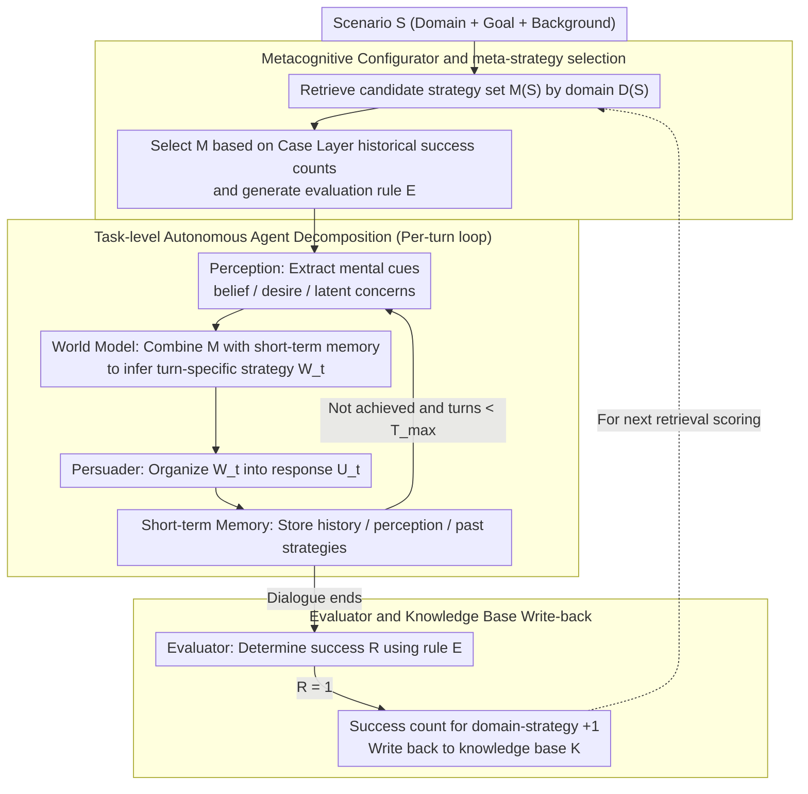

# MA$^2$P: A Meta-Cognitive Autonomous Intelligent Agents Framework for Complex Persuasion

**Conference**: ACL2026 Findings  
**arXiv**: [2605.18572](https://arxiv.org/abs/2605.18572)  
**Code**: The paper claims that prompts, code, and knowledge bases will be released, but no public repository link is provided in the cache.  
**Area**: Dialogue Systems / LLM Agent / Persuasive Dialogue  
**Keywords**: Complex persuasion, Metacognition, Multi-agent, Theory of Mind modeling, Strategy knowledge base

## TL;DR
MA$^2$P decomposes complex persuasive dialogue into a closed loop of "Meta-strategy selection - Task-level multi-agent persuasion - Post-hoc knowledge update". Without training the base LLM, it transforms the persuadee's beliefs, desires, and concerns into specific strategic actions, significantly improving the persuasion success rate of various LLMs on CToMPersu.

## Background & Motivation
**Background**: Persuasive dialogue has evolved from early single-domain donation and negotiation tasks to more diverse domains and fine-grained user state modeling. Datasets like CToMPersu provide not only dialogue context but also expose the persuadee's mental states such as belief and desire. Consequently, models must not only generate fluent responses but also engage in continuous planning based on implicit concerns.

**Limitations of Prior Work**: Current LLM persuaders typically function as a single next-turn generator. While they can identify explicit barriers like "lack of money" or "no time," they often stall at generic suggestions—for instance, emphasizing the importance of psychotherapy without converting barriers into actionable items like insurance coverage, online sessions, or low-cost trials. Another issue is unstable cross-domain performance: motivational experiments in the cache show that the success rate of gpt-5-mini across various domains in CToMPersu spans from 88.24% to 16.67%, a gap of 71.57 percentage points.

**Key Challenge**: Complex persuasion is not a single-round language generation task but a partially observable, multi-turn, goal-oriented interaction. The model must select strategies based on the interlocutor's hidden states while maintaining stable generalization across different domains. Monolithic LLMs lack explicit planning states and strategic memory, making them prone to producing reactive, aesthetically pleasing but non-actionable outputs.

**Goal**: The authors aim to construct a plug-and-play, training-free external framework that enables any base LLM to complete complex persuasion more stably. Specific sub-problems include: how to extract mental states from dialogue history, how to implement high-level psychological strategies into specific next-turn tactics, how to reduce cross-domain volatility using historical success cases, and how to write back successful experiences into the system after a dialogue.

**Key Insight**: The paper draws inspiration from the perception, world model, actor, memory, and cost/evaluator structure of LeCun-style autonomous agents, while introducing planning, monitoring, and evaluation from metacognition. Its core observation is that a persuasion system needs to first determine "what high-level strategy should be used in this type of scenario," followed by task-level agents generating next-turn actions, rather than letting the LLM improvise at every turn.

**Core Idea**: A metacognitive Configurator first selects domain-related meta-strategies from a structured knowledge base, and then Perception, World Model, Persuader, Memory, and Evaluator agents execute and update in a closed loop. This transforms mental state cues into strategy-consistent, executable persuasive actions.

## Method

### Overall Architecture
MA$^2$P models a persuasive dialogue as a three-stage cycle. The input is scenario $S$, including domain, goal, and background; the output is the multi-turn persuasive dialogue and the updated knowledge base. Stage 1 is **Meta-level Judging**: the Configurator retrieves candidate meta-strategies from the knowledge base based on the domain, selects the historically most effective strategy, and constructs the evaluation rules for the current round. Stage 2 is **Task-level Persuading**: multiple autonomous agents collaborate to generate each turn's response, including perceiving mental cues, inferring specific strategies, generating dialogue, and maintaining short-term memory. Stage 3 is **Knowledge Updating**: the Evaluator determines if the session was successful, and successful cases are written back to the knowledge base to provide a better basis for future strategy selection in similar domains.

This framework does not retrain the LLM but acts as an external orchestration layer connected to the base model. In experiments, the same MA$^2$P framework can be applied to gpt-4o-mini, gpt-4o, gpt-5-mini, gemini-2.5-flash, and deepseek-v3, demonstrating its plug-and-play design goal.

### Key Designs

**1. Metacognitive Configurator and meta-strategy selection: Setting high-level strategies at the start instead of improvising each turn**

One root of cross-domain volatility is that LLMs generalize strategies inconsistently across different domains; in weak domains, they often improvise blindly or stall at generic advice. The Configurator addresses this before the dialogue begins: the knowledge base is organized into three layers—meta-strategy, domain, and case. It first extracts candidate strategies $M(S)$ matching the current domain $D(S)$, then uses the historical success counts of that domain-strategy pair in the Case Layer to score each candidate, selecting $M=\arg\max_{m \in M(S)} score(m,S)$ as the global intent for the scenario. Simultaneously, it generates a set of success criteria $E$ for the third-stage Evaluator. This essentially records "which strategies work better in a certain domain" as retrievable evidence, giving the system a roadmap for persuasion before entering turn-by-turn generation, thereby avoiding pitfalls in weak domains.

**2. Task-level Autonomous Agent Decomposition: Translating abstract meta-strategies into specific, grounded turn-by-turn dialogue**

Monolithic LLMs generating the next turn directly may identify explicit obstacles like "lack of money," yet they only offer vague persuasion and fail at converting obstacles into actionable items. MA$^2$P breaks this step into a small pipeline: Perception first extracts explicit signals and latent mental cues $P_t=f_{perc}(H_t)$ (belief, desire, latent concern) from history $H_t$; World Model combines the selected meta-strategy $M$ with short-term memory $\Sigma_t$ to infer a turn-specific strategy $W_t=f_{wm}(M,\Sigma_t)$; Persuader Agent organizes $W_t$ and dialogue history into a natural language response $U_t=f_{pers}(W_t,H_t)$; Short-term Memory continuously saves history, perceived results, and past strategies $\Sigma_t=\{H_t,P_t,W_{1:t-1}\}$. This division of "understand resistance - decide strategy - organize phrasing" is closer to the human persuasion process. In scenarios with implicit and dynamic resistance, explicit memory also prevents strategy drift and repetitive persuasion.

**3. Evaluator and Knowledge Base Write-back: Precipitating a successful persuasion into reusable experience**

The effectiveness of persuasion strategies is highly dependent on domain and population. If a one-time success is not recorded, the system must start from scratch in similar future scenarios. The Evaluator uses the rule $E$ generated in the first stage and the final short-term memory $\Sigma_T$ to determine if the turn was successful, yielding $R=f_{eval}(E,\Sigma_T)$. Once $R=1$, the system increments the success count of the selected meta-strategy in the current domain: $K_{case}(M,D(S)) \leftarrow K_{case}(M,D(S))+1$, and generates an updated knowledge base via $K'=update(K,M,S,R)$. This write-back channel allows the framework to grow from a cold-start rule-based agent into a metacognitive system with experience—providing a more solid basis for the Configurator's scoring in the next dialogue within the same domain.

### A Complete Example: Persuading a visitor concerned about costs to try psychotherapy

Taking a mental health scenario as an example through the closed loop. **Meta-level Judging**: The Configurator identifies domain $D(S)$ as "psychological counseling". It retrieves candidate meta-strategies $M(S)$ from the knowledge base and selects $M$ as "Lowering action thresholds" based on its highest historical success count in the Case Layer, then generates criterion $E$ (e.g., "Visitor explicitly agrees to try once"). **Task-level Persuading**: In turn 1, Perception extracts latent concern = cost concern from the visitor's statement "I think therapy is too expensive." World Model instantiates abstract $M$ into the turn-specific strategy $W_1$ = "Transform cost obstacle into actionable options." Persuader generates $U_1$—no longer vaguely emphasizing "therapy is important," but offering specific actions like insurance reimbursement, online low-cost slots, or a first low-cost trial. Memory records $\Sigma_1=\{H_1,P_1\}$. If the visitor shifts to worrying about time, World Model will switch to time-related schemes based on updated $\Sigma_2$ instead of repeating the previous turn. **Knowledge Updating**: If the visitor agrees to an appointment within $T_{max}=4$ turns, Evaluator sets $R=1$, incrementing the success count of the "Lowering action thresholds" strategy in the "psychological counseling" domain, making future meta-strategy selection more reliable.

### Loss & Training
MA$^2$P itself does not train the base model, nor does it use traditional supervised loss or RL loss. It adopts a prompt-based, multi-agent scheduled inference-time strategy. Main results use the official CToMPersu test set (525 instances), with max turns $T_{max}=4$. gpt-4o-mini is fixed as the persuadee simulator and LLM judge. Knowledge base size was studied as a warm-up hyperparameter: at $K=0$, success is 0.66; it reaches 0.79 at $K=500$, which is the main experiment setting.

## Key Experimental Results

### Main Results
The paper compares five base LLMs and their MA$^2$P-enhanced versions on CToMPersu. Metrics include Success, Persuasive, Logic, Helpful, cross-domain Range/SD, and average turns Avg_Turn. The following table preserves primary success rate and turn counts:

| Base Model | Success Baseline | Success + MA$^2$P | Gain | Avg_Turn Baseline | Avg_Turn + MA$^2$P |
|----------|--------------|-------------------|------|---------------|--------------------|
| gpt-4o-mini | 0.45 | 0.79 | +0.34 | 2.94 | 1.86 |
| gpt-4o | 0.46 | 0.75 | +0.29 | 3.03 | 2.00 |
| gpt-5-mini | 0.51 | 0.72 | +0.21 | 2.66 | 1.60 |
| gemini-2.5-flash | 0.46 | 0.66 | +0.20 | 3.27 | 2.08 |
| deepseek-v3 | 0.53 | 0.80 | +0.27 | 3.05 | 1.82 |

Quality metrics generally improved: for gpt-5-mini, Persuasive rose from 6.40 to 7.15, Logic from 7.81 to 8.28, Helpful from 7.55 to 8.27; for deepseek-v3, Persuasive rose from 6.98 to 7.58, Helpful from 7.84 to 8.42. One exception is gemini-2.5-flash, whose Logic and Helpful dropped slightly, though Success still gained 0.20.

### Ablation Study
The authors compared the base LLM, the autonomous agent system without metacognitive enhancement (+Auto), and the full MA$^2$P. Results show that multi-agent decomposition increases success rate, but the Metacognitive Configurator further reduces cross-domain volatility.

| Model | Config | Success | Range | SD | Description |
|------|------|---------|-------|----|------|
| 4o-mini | Base | 0.45 | 0.450 | 0.104 | Single persuader |
| 4o-mini | + Auto | 0.66 | 0.530 | 0.118 | Success rate rises, but domain fluctuation increases |
| 4o-mini | + MA$^2$P | 0.79 | 0.400 | 0.107 | Highest Success, Range decreases |
| 4o | Base | 0.46 | 0.500 | 0.114 | Single persuader |
| 4o | + Auto | 0.68 | 0.458 | 0.120 | Success rate rises, SD slightly increases |
| 4o | + MA$^2$P | 0.75 | 0.488 | 0.109 | Success continues to rise, SD decreases |

### Knowledge Base Scale and Human Preference

| Setting | Key Result | Meaning |
|------|----------|------|
| K=0 | Success 0.66, Range 0.53, SD 0.118 | Effective even as a cold start, but acts like +Auto |
| K=100 | Success 0.73, Range 0.44, SD 0.107 | Significant improvement with small warm-up |
| K=500 | Success 0.79, Range 0.40, SD 0.107 | Adopted in main experiments; overall best performance |
| Human Preference | 400 samples, labeled by 2 CS masters; LLM-human weighted Cohen's $\kappa_w=0.549$ | Moderate agreement between LLM and human; both favor MA$^2$P |

### Key Findings
- MA$^2$P improves Success across all five base models, indicating the gain is not an accidental prompt trick for a specific API.
- +Auto can increase average success but sometimes widens the domain gap; the value of full MA$^2$P lies in combining "multi-agent execution" with "domain-level strategy selection."
- Warm-up does not require massive scale: K=100 already improves Success from 0.66 to 0.73, though K=500 is most stable in Success and Range.
- The cache only indicates trends in A/B preference charts without listing specific win/tie/lose percentages, so only sample size and $\kappa_w$ are recorded here.

## Highlights & Insights
- **Reframing persuasion as a closed-loop control problem instead of a generation problem**: Instead of stacking prompts, the paper models persuasion as a cycle of perception, world model, action, memory, and evaluation. This adds an interpretable strategy layer between "understanding concerns" and "generating dialogue."
- **Meta-strategy selection addresses cross-domain stability rather than just mean improvement**: While +Auto can raise success rates, full MA$^2$P emphasizes Range/SD. This is crucial as a real-world persuasion system must not only excel in strong domains but avoid total failure in weak ones.
- **Lightweight knowledge base design**: The Case Layer merely records domain-strategy success counts, yet provides an interpretable meta-strategy prior. For many LLM agent systems, this "lightweight experience statistics + prompt scheduling" might be more practical than complex training.
- **Training-free is not deployment-free**: Training costs are traded for multi-agent call and warm-up interaction costs at inference time. This trade-off is suitable for high-value, low-throughput tasks like counseling, educational coaching, or negotiation assistance, but not necessarily for high-concurrency chatbots.

## Limitations & Future Work
- Automated metrics rely primarily on gpt-4o-mini judge; open-ended persuasion quality remains subjective. Although human preference was verified, the scale (2 annotators, 400 samples) is small.
- The persuadee simulator is still simple, only conditioning on belief and desire without systematically modeling personality, long-term preferences, values, or trust relationships. Real "humans" in interactive domains are far more complex.
- New domains require a warm-up phase to accumulate knowledge base cases; while cold-start is usable, optimal results depend on an experience scale like K=500.
- The paper focuses on scenarios with clear user goals (education, counseling), but persuasion technology carries inherent risks of misuse. Deployment for real users would require stronger consent, sensitive domain restrictions, manipulation risk assessments, and auditable logs.
- MA$^2$P's multi-agent scheduling increases inference call costs and system complexity; the paper does not report detailed latency, token costs, or error propagation analysis.

## Related Work & Insights
- **vs. Monolithic LLM Persuaders**: Monolithic methods generate next-turn responses directly from history, offering simplicity and low cost; MA$^2$P adds explicit mental state extraction, strategy selection, and memory updates externally, offering better interpretability and stability at the cost of longer inference chains.
- **vs. User State Aware Persuasion Methods**: Existing methods emphasize recognizing user states or selecting psychological strategies; this paper takes it further by placing strategy selection into an updatable knowledge base and instantiating it into specific actions via a World Model.
- **vs. ReAct / Reflexion type agents**: ReAct is more general, focusing on thought-action-observation; MA$^2$P is specialized for persuasion, placing meta-strategy, persuasion principles, and domain-case success counts at the core.
- **Insights**: Dialogue agent "memory" need not store full long-form text; it can store task-relevant structured statistics. For scenarios like customer retention, learning motivation intervention, or medical adherence communication, one could consider extending MA$^2$P's domain-strategy success count into more rigorous causal or bandit strategy selection mechanisms.

## Rating
- Novelty: ⭐⭐⭐⭐☆ Using autonomous agent blueprints and metacognitive strategy selection for complex persuasion is solid and task-appropriate, though core modules rely heavily on prompt scheduling and success counts.
- Experimental Thoroughness: ⭐⭐⭐⭐☆ Covers 5 base models, ablation, warm-up, human preference, and case studies; weakness is the high proportion of automatic judges and lack of real user experiments.
- Writing Quality: ⭐⭐⭐⭐☆ Clear motivation; the method diagram and three-stage algorithm are readable; some formulas feel like formal packaging, and system cost analysis is sparse.
- Value: ⭐⭐⭐⭐☆ Highly valuable for training-free, interpretable persuasion agents, especially for researchers studying complex dialogue planning and cross-domain robustness.

<!-- RELATED:START -->

## Related Papers

- [\[ACL 2026\] Cognitive Policy-Driven LLM for Diagnosis and Intervention of Cognitive Distortions in Emotional Support Conversation](cognitive_policy-driven_llm_for_diagnosis_and_intervention_of_cognitive_distorti.md)
- [\[AAAI 2026\] Emergent Persuasion: Will LLMs Persuade Without Being Prompted?](../../AAAI2026/dialogue/emergent_persuasion_will_llms_persuade_without_being_prompted.md)
- [\[AAAI 2026\] Chatsparent: An Interactive System for Detecting and Mitigating Cognitive Fatigue in LLMs](../../AAAI2026/dialogue/chatsparent_an_interactive_system_for_detecting_and_mitigating_cognitive_fatigue.md)
- [\[ACL 2026\] STRIDE-ED: A Strategy-Grounded Stepwise Reasoning Framework for Empathetic Dialogue Systems](stride-ed_a_strategy-grounded_stepwise_reasoning_framework_for_empathetic_dialog.md)
- [\[ACL 2026\] ETHICMIND: A Risk-Aware Framework for Ethical-Emotional Alignment in Multi-Turn Dialogue](ethicmind_a_risk-aware_framework_for_ethical-emotional_alignment_in_multi-turn_d.md)

<!-- RELATED:END -->
