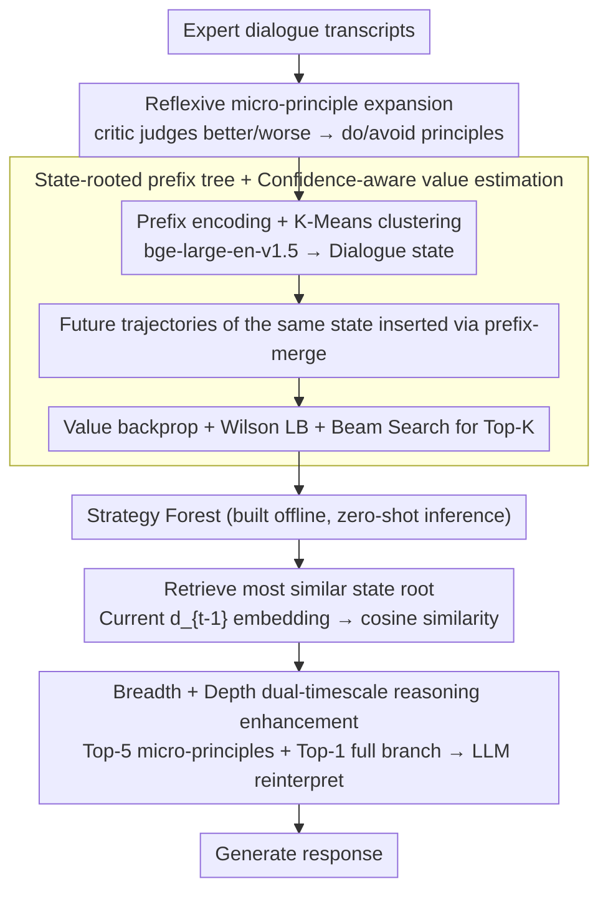

# Metro: Towards Strategy Induction from Expert Dialogue Transcripts for Non-collaborative Dialogues

**Conference**: ACL 2026  
**arXiv**: [2604.11427](https://arxiv.org/abs/2604.11427)  
**Code**: https://github.com/Humphrey-0125/METRO (Available)  
**Area**: Dialogue Strategy / Non-collaborative Dialogue / Knowledge Induction / LLM agent  
**Keywords**: strategy induction, Strategy Forest, negotiation, persuasion, planning logic

## TL;DR
Metro automatically induces expert dialogue transcripts into a "Strategy Forest"—a collection of trees rooted in K-Means clustered dialogue states. Each node represents an LLM-expanded micro-principle action, and branches represent complete action trajectories pruned by Wilson confidence lower bounds and MCTS-style value backpropagation. During inference, it retrieves a specific tree to extract short-term (breadth) and long-term (depth) recommendations in parallel. Without any training, it outperforms baselines such as PRINCIPLES, PPDPP, and GDP-Zero by approximately 10% on P4G and CB non-collaborative dialogue tasks.

## Background & Motivation

**Background**: Non-collaborative dialogues (e.g., price negotiation, charity persuasion, debt collection) require an agent to "win" even when the opponent has a conflicting interest. The standard paradigm relies on (i) domain experts manually codifying strategy action sets (e.g., negotiation acts by He et al. 2018, persuasion acts by Wang et al. 2019) and (ii) training a plug-in planner (PPDPP) or running MCTS (GDP-Zero) to select actions. This pipeline is not scalable, as a new action set must be defined by experts for every new domain.

**Limitations of Prior Work**: (i) Expert dependence: The quality of the action set determines the ceiling, but human coverage is limited (manual actions cover $\le 30\%$ of clusters in the CB dataset). (ii) Lack of planning logic: While PRINCIPLES (Kim 2025) can extract rules in the form "When [situation], you should [action A] rather than [action B], because [reason]," it treats strategies as independent units, losing the multi-turn temporal structure of "what to do next." (iii) High cost: PPDPP requires SFT followed by RL, while GDP-Zero demands massive compute for MCTS during inference.

**Key Challenge**: Strategy comprises two types of knowledge: "what to do" (action set) and "when to do it" (planning logic). The former can be summarized by LLMs, but the latter requires preserving the multi-turn temporal structure of trajectories. Traditional induction methods are proficient at extracting flat rules but struggle to weave trajectories into hierarchical structures.

**Goal**: To allow an LLM to directly induce (a) expanded action sets and (b) multi-turn planning logic bound to dialogue states from raw transcripts, storing them in a retrieval-friendly structure without requiring training.

**Key Insight**: The authors observe that multiple historical trajectories can lead to success or failure under the same dialogue state. By clustering these trajectories by state and performing prefix-merging, a "state-rooted tree" naturally forms. Pruning these trees using Wilson lower bounds and value backpropagation filters out unreliable branches that appear successful but have insufficient samples.

**Core Idea**: Summarize expert transcripts into a "Strategy Forest." Breadth (immediate children of the root) provides short-term tactical responses, while depth (full root-to-leaf branches) provides long-term strategic foresight. Retrieval-augmented prompting is then used to inject both types of knowledge into LLM decision-making.

## Method

### Overall Architecture

Metro aims to simultaneously induce "what to do" (action sets) and "when to do it" (multi-turn planning logic) from expert transcripts. It consists of offline induction and online inference. Off-line, it extracts turn-level actions and expands them into do/avoid micro-principles using an LLM. History prefixes $d'_i$ are encoded into 1024-d vectors using bge-large-en-v1.5 and clustered via K-Means ($K=150$ for P4G, $K=80$ for CB). A tree is built for each cluster by prefix-merging all future trajectories passing through that state. Nodes backpropagate outcome values, and the Top-K branches are retained using Wilson lower bounds and beam search. Online, at turn $t$, the current $d_{t-1}$ is embedded to retrieve the most similar root. Breadth (Top-5 tactical responses) and depth (Top-1 strategic route) are extracted in parallel and reinterpreted by the LLM as context-aware prompts.

### Key Designs

**1. Reflexive micro-principle expansion of action sets.** Actions in raw transcripts are often case-specific (e.g., "Could you go down to \$50?"), leading to poor generalization. Metro uses gpt-4.1-mini as a critic to judge each agent turn as better, worse, or neutral based on local context. For "better" turns, the LLM summarizes a reusable principle in the form "When [situation], do [...]". For "worse" turns, it generates "When [situation], avoid [...]". This abstracts actions into a strategic level, allowing cross-task transfer and absorbing both positive and negative signals.

**2. State-rooted prefix tree + Confidence-aware value estimation.** To capture multi-turn planning logic, Metro segments transcripts into history prefixes. Future trajectories within the same cluster are merged into a tree. For each node $u$, the empirical success rate $\hat p(u)$ and length-penalized outcome value $v(d,t) = r(d) - \lambda_{\text{len}}(t+1)/N_d$ are aggregated. Values are backpropagated using a depth-discount $\gamma^k$. The final score $S(u)=w_{\text{sr}}\cdot p_{\text{lb}}(u) + w_{\text{val}}\cdot \bar V(u) + w_{\text{cnt}}\cdot \log(1+n(u))$ incorporates the Wilson score lower bound $p_{\text{lb}}$, which penalizes branches with high success rates but low sample sizes.

**3. Breadth + Depth dual-timescale reasoning enhancement.** To avoid short-sightedness or excessive rigidity, the Strategy Forest provides two complementary suggestions. During inference, the current dialogue is mapped to the most similar root. **Breadth** retrieves the Top-5 micro-principles for immediate tactical rewriting. **Depth** selects the single full branch with the highest average node value to serve as a high-level strategic directive. This mimics exploitation and rollout in MCTS, but is performed via a single prompt without expensive test-time searches.

### Loss & Training

Metro is **entirely training-free**. Offline induction uses gpt-4.1-mini for expansion and bge-large-en-v1.5 for encoding. Inference uses GPT-3.5-turbo as the backbone. Key hyperparameters: $\lambda_{\text{len}}=0.2$, $\gamma=0.9$, $w_{\text{sr}}=1.0, w_{\text{val}}=0.2, w_{\text{cnt}}=0.05$, Wilson $z=1.96$, Breadth Top-K=5, Depth Top-1.

## Key Experimental Results

### Main Results
Evaluation on P4G (charity persuasion) and CB (price negotiation) using 200 LLM simulators and 5 human participants:

| Method | P4G SR↑ | P4G AT↓ | CB SR↑ | CB SL%↑ | P4G* SR↑ (Human) | CB* SR↑ (Human) |
|------|---------|---------|--------|---------|------------------|-----------------|
| Standard | 0.620 | 4.56 | 0.185 | 0.154 | 0.333 | 0.283 |
| GDP-Zero (MCTS) | 0.660 | 5.35 | 0.495 | 0.125 | 0.600 | 0.450 |
| PPDPP (Trained planner) | 0.730 | 4.67 | 0.250 | 0.150 | 0.633 | 0.383 |
| PRINCIPLES (Induction) | 0.770 | 5.24 | 0.485 | 0.149 | 0.600 | 0.467 |
| **Metro** | **0.780** | 4.76 | **0.575** | **0.189** | **0.661** | **0.483** |

→ Metro shows an average improvement of 10.24% over PRINCIPLES without training or test-time MCTS.

### Ablation Study
Decomposition of Planning Logic (Table 2):

| Configuration | P4G SR | CB SR | CB SL% | Description |
|------|--------|-------|---------|------|
| Full (Top-5 Nodes + Top-1 Full Branch) | 0.780 | 0.575 | 0.189 | Default |
| Breadth Top-1 Node | 0.760 | 0.465 | 0.140 | Breadth narrowing drops 11 pp |
| Depth 1-hop Branch | 0.770 | 0.535 | 0.150 | Depth truncation drops 4 pp |
| Depth Top-3 Branches | 0.760 | 0.485 | 0.150 | More branches reduce performance |
| w/o Exp. Action | (Fig 3) | ↓ | ↓ | Removing micro-principle expansion |
| w/o Depth | ↓ on P4G, **↑ on CB** | — | — | CB high repetition makes depth noisy |

### Key Findings
- **Action diversity is central to Metro's performance**: Cluster Coverage analysis shows Metro covers ~80% of clusters at $K=100$, whereas manual actions cover <30%.
- **Strong cross-task transferability**: Transferring from CB → P4G yields SR=0.755 (near original performance).
- **Transcript quality > Transcript source**: Using LLM-generated transcripts for induction outperformed expert transcripts on CB SR (0.500 vs 0.440), suggesting the framework is sensitive to quality rather than "expert identity."
- **Generalization across personalities**: Metro performed best or second-best in 9/10 subgroups across different Big-Five and decision-making styles.

## Highlights & Insights
- **Abstracting strategy into state-action prefix trees is principled**: It upgrades the flat memory of PRINCIPLES into a state-conditioned hierarchical memory.
- **Wilson lower bounds are a robust addition**: It prevents the model from being misled by "lucky" successes in small sample sizes.
- **Cost-effectiveness**: Unlike RL-based or MCTS-based methods, Metro's offline pre-computation makes it deployment-friendly.
- **Honest reporting on CB depth**: The authors acknowledge that high redundancy in CB source transcripts can make depth-based logic noisy, suggesting an area for data-specific refinement.

## Limitations & Future Work
- Source transcripts are from crowdsourced users (Craigslist/PersuasionForGood) rather than true high-level professionals.
- The multi-step pipeline (critic → expansion → retrieval → gen) risks accumulated hallucinations.
- Hyperparameters like cluster size $K$ and weights are manually tuned rather than adaptive.
- Taking only the Top-1 branch for depth may lose diversity; adaptive branch integration is a future direction.

## Related Work & Insights
- **vs PRINCIPLES**: Metro adds multi-turn planning logic via state-action trees, yielding a 10.24% gain.
- **vs PPDPP**: Metro is training-free and significantly outperforms PPDPP on CB (32 pp higher SR).
- **vs GDP-Zero**: Metro is orders of magnitude cheaper than test-time MCTS while maintaining performance.

## Rating
- Novelty: ⭐⭐⭐⭐
- Experimental Thoroughness: ⭐⭐⭐⭐⭐
- Writing Quality: ⭐⭐⭐⭐
- Value: ⭐⭐⭐⭐⭐

<!-- RELATED:START -->

## Related Papers

- [\[ICLR 2026\] Non-Collaborative User Simulators for Tool Agents](../../ICLR2026/dialogue/non-collaborative_user_simulators_for_tool_agents.md)
- [\[ACL 2026\] STRIDE-ED: A Strategy-Grounded Stepwise Reasoning Framework for Empathetic Dialogue Systems](stride-ed_a_strategy-grounded_stepwise_reasoning_framework_for_empathetic_dialog.md)
- [\[ACL 2026\] Context-Agent: Dynamic Discourse Trees for Non-Linear Dialogue](context-agent_dynamic_discourse_trees_for_non-linear_dialogue.md)
- [\[ACL 2026\] Simulated Students in Tutoring Dialogues: Substance or Illusion?](simulated_students_in_tutoring_dialogues_substance_or_illusion.md)
- [\[ACL 2026\] CoDial: Interpretable Task-Oriented Dialogue Systems Through Dialogue Flow Alignment](codial_interpretable_task-oriented_dialogue_systems_through_dialogue_flow_alignm.md)

<!-- RELATED:END -->
