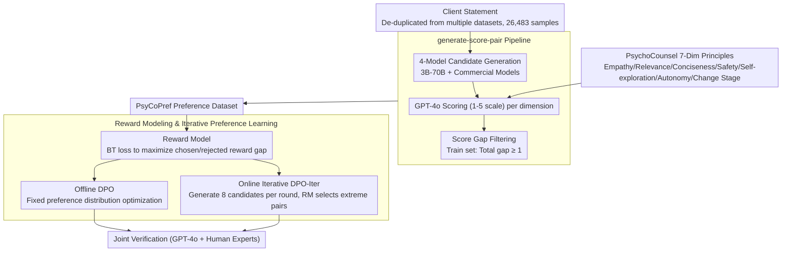

# Preference Learning Unlocks LLMs' Psycho-Counseling Skills

**Conference**: ACL 2026  
**arXiv**: [2502.19731](https://arxiv.org/abs/2502.19731)  
**Code**: [https://huggingface.co/Psychotherapy-LLM](https://huggingface.co/Psychotherapy-LLM)  
**Area**: LLM Safety / Psycho-counseling Alignment  
**Keywords**: Psycho-counseling, Preference Learning, Reward Model, DPO, Human Preference Alignment

## TL;DR

This paper constructs the PsyCoPref preference dataset for psycho-counseling response quality and employs reward models, DPO, and iterative preference learning to train LLMs. The resulting 8B model achieves an 87.0% win rate against GPT-4o in psycho-counseling responses.

## Background & Motivation

**Background**: Psycho-counseling assistance is a promising application for LLMs, as the supply of professional mental health support significantly lags behind demand. Existing systems typically employ general instruction tuning, role-playing prompts, or small-scale counseling data to simulate therapists. however, high-quality real-world session data is difficult to accumulate due to privacy restrictions.

**Limitations of Prior Work**: Psycho-counseling responses are not merely about being "helpful" or "safe." A high-quality response requires empathy, relevance, conciseness, and safety, while also encouraging self-exploration, enhancing autonomy, and identifying the client's stage of change. Existing general reward models or LLM-as-judge frameworks often learn only generalized helpfulness and fail to consistently distinguish professional quality in a counseling context.

**Key Challenge**: Psycho-counseling demands professional supervision, yet high-quality professional annotations are extremely scarce. Simultaneously, variations in experience among different therapists lead to inconsistent response quality in public session data. Directly supervising models with such session text results in the imitation of low-quality counseling behaviors.

**Goal**: The authors aim to establish professional, fine-grained evaluation principles for psycho-counseling responses, generate and verify large-scale preference pairs using these principles, and finally test whether these preferences can train reliable reward models and policy models that respond more effectively to clients.

**Key Insight**: Rather than collecting "gold answers," it is more effective to compare multiple model responses for the same client statement. Preference pairs naturally express relative judgments of counseling quality and bypass the issue of inconsistent response quality from individual therapists.

**Core Idea**: Use professional psycho-counseling principles to transform multi-model generated responses into the high-quality PsyCoPref preference dataset. Subsequently, utilize reward modeling and online iterative DPO to enable LLMs to learn professional and boundary-aware counseling responses.

## Method

### Overall Architecture

The authors reformulate "teaching models to conduct psycho-counseling" as a professional preference learning problem. The input is a client statement, and the output is a response resembling that of a professional counselor. The key component is a set of preference signals capable of stably distinguishing quality. The pipeline proceeds through three layers: first, using professional principles to convert multiple LLM responses into preference pairs to build the PsyCoPref dataset; second, training a Bradley-Terry (BT) reward model using these pairs to learn "which response is more professional"; finally, using the reward model as an anchor to train the policy model via offline DPO and online iterative DPO-Iter, followed by joint verification by GPT-4o and real counseling experts.

### Key Designs

**1. PsychoCounsel 7-Dim Principles: Breaking "Professionalism" into Scorable Dimensions**

The value of a counseling response often lies in fine details—whether it explores triggers, respects client autonomy, or maintains safety boundaries. The authors decompose response quality into seven dimensions: Empathy and emotional understanding, Personalization and relevance, Clarity and conciseness, Avoidance of harmful language, Facilitation of self-exploration, Promotion of autonomy and confidence, and Sensitivity to change stages. The first four cover basic AI safety and usability, while the latter three target professional client-centered counseling goals. Finer dimensions ensure that preference labels align with expert judgment rather than degenerating into mere politeness.

**2. generate-score-pair Pipeline: Constructing High-Quality Pairs via Multi-Model Candidates**

To bypass privacy constraints and therapist inconsistency, the authors compare responses from multiple models instead of collecting "standard answers." Client statements were collected from datasets like counsel-chat, MentalAgora, TherapistQA, and Psycho8k, filtered and de-duplicated to 26,483 samples across 42 sub-themes. For each statement, four models (ranging from 3B to 70B and proprietary models) generate responses. GPT-4o scores each response (1-5) across the seven dimensions, and the average forms the preference score. The training set includes only pairs with a total score gap of at least 1, while the test set selects the highest and lowest scoring responses. This gap filtering prevents noise from samples where quality is too similar for even experts to distinguish.

**3. Reward Modeling & Iterative Preference Learning: Enabling Evaluation and Generation Improvement**

The reward model employs standard BT loss to widen the reward gap between chosen and rejected responses: $L=-\log\sigma(r_\theta(x,y_c)-r_\theta(x,y_r))$. For the policy model, two methods were compared: standard DPO optimized on offline PsyCoPref data, and DPO-Iter, which generates 8 responses per statement in each round, uses a same-scale reward model to select extreme pairs, and updates the policy via DPO. The online version allows the policy to be corrected on its own generation distribution, mitigating distribution shifts and reward hacking common in offline preference learning. This explains why DPO-Iter significantly outperforms offline DPO in the experiments.

### Loss & Training

Reward models were initialized from Llama3.2-3B-Instruct and Llama3.1-8B-Instruct, trained on PsyCoPref for 2 epochs with a batch size of 128 and a learning rate of 9e-6. For the policy model, DPO was used with $\beta=0.1$. DPO-Iter sampled 6,400 statements per round, generating 8 candidates each, with a batch size of 64 and a learning rate of 5e-7 over 1,600 steps. The checkpoint was selected based on a 10% development set.

## Key Experimental Results

### Main Results

**Reward Model performance on PsyCoPref test set**

| Model | Acc.↑ | AUC↑ | ECE↓ | Brier↓ |
|------|-------|------|------|--------|
| Skywork-Reward-Llama-3.1-8B-v0.2 | 57.9 | 0.623 | 0.331 | 0.379 |
| Skywork-Reward-Gemma-2-27B | 69.2 | 0.740 | 0.123 | 0.229 |
| Llama-3.1-Nemotron-70B-Reward | 87.3 | 0.938 | 0.040 | 0.102 |
| Llama-3.1-70B-Instruct (Ranker) | 88.2 | - | - | - |
| PsyCo-Llama3-3B-Reward | 98.1 | 0.997 | 0.050 | 0.014 |
| PsyCo-Llama3-8B-Reward | 97.8 | 0.998 | 0.045 | 0.016 |

**Policy model overall win rate relative to GPT-4o**

| Setting | Llama3-3B | +DPO | +DPO-Iter | Llama3-8B | +DPO | +DPO-Iter |
|------|-----------|------|-----------|-----------|------|-----------|
| No length constraint | 28.5 | 58.5 | 69.4 | 29.3 | 72.9 | 87.0 |
| With length constraint | 15.0 | 37.0 | 46.4 | 18.5 | 49.3 | 77.0 |

### Ablation Study

**Complementarity between PsyCoPref and general HelpSteer2 data**

| Model | Training Data | PsyCoPref Acc.↑ | AUC↑ | Brier↓ | RewardBench Acc.↑ |
|------|----------|------------------|------|--------|-------------------|
| Llama-3B | HelpSteer2 | 81.6 | 0.916 | 0.120 | 83.6 |
| Llama-3B | HelpSteer2 + PsyCoPref | 97.6 | 0.998 | 0.017 | 86.1 |
| Llama-8B | HelpSteer2 | 81.7 | 0.898 | 0.128 | 86.6 |
| Llama-8B | HelpSteer2 + PsyCoPref | 97.5 | 0.998 | 0.018 | 87.2 |

**Data mixture results under fixed 10k training budget**

| Configuration | PsyCoPref Acc.↑ | RewardBench Acc.↑ | Average Acc.↑ | Description |
|------|------------------|-------------------|------------|------|
| Psy10k | 0.963 | 0.745 | 0.854 | Strongest in-domain, but lacks general transfer |
| Help10k | 0.855 | 0.888 | 0.871 | Good general capability, lacks counseling resolution |
| Psy5kHelp5k | 0.958 | 0.896 | 0.927 | Balances domain quality and general reward capability |

### Key Findings
- The 3B version of the PsyCoPref reward model reached 98.1% accuracy, significantly outperforming 70B general reward models, indicating that counseling response quality necessitates domain-specific preference supervision.
- DPO-Iter significantly outperforms offline DPO: Llama3-8B improved from 72.9% to 87.0% without length constraints and from 49.3% to 77.0% with length constraints.
- Real counseling experts and the GPT-4o judge achieved 82.5% agreement, with experts generally preferring PsyCo-Llama3-8B, supporting the credibility of automated evaluation.
- Length constraints decrease the overall win rate but improve clarity, safety, and stage identification, suggesting that models gain an advantage through longer responses post-RL, which requires balancing with inference-stage constraints.

## Highlights & Insights
- The greatest highlight is modeling psycho-counseling capability as a "professional preference modeling" problem rather than simply collecting SFT text; this design is better suited for handling therapist quality variance and privacy issues.
- The seven dimensions of PsyCoPref possess high transfer value, especially self-exploration, autonomy, and change stages, which can serve as evaluation frameworks for medical companionship, coaching dialogues, and crisis support.
- DPO-Iter results demonstrate that counseling quality requires not just learning "expert preferences" but also continuous calibration on the model's own generation distribution to prevent the model from learning fixed clichés.
- Expert case studies show that strong models do not just become safer or more polite; they specifically incorporate client details and propose collaborative exploration questions, which is closer to real counseling practice than generalized empathy templates.

## Limitations & Future Work
- PsyCoPref currently focuses on single-turn client statements and responses, failing to evaluate long-term therapeutic relationships, cross-turn memory, or therapeutic alliance maintenance.
- The seven dimensions are currently weighted equally; the relative importance of these weights might vary significantly across different crisis levels, diagnostic backgrounds, and cultural contexts.
- Data and evaluation lean heavily on GPT-4o as a scorer and judge; while expert validation was positive, the risk of inheriting GPT-4o's preference biases remains.
- The study is positioned for aiding therapists in drafting responses rather than direct client-facing deployment. Future work requires risk stratification, human-in-the-loop review, and crisis intervention protocols.

## Related Work & Insights
- **vs RLHF / General Preference Data**: General RLHF optimizes for helpfulness, harmlessness, and honesty. This paper proves that professional scenarios like psycho-counseling require independent, fine-grained preference principles.
- **vs DPO**: While DPO uses static pairs, DPO-Iter selects extreme preference pairs from online candidates via a reward model, which is more effective at correcting the current policy's output.
- **vs Counseling SFT Datasets**: Directly mimicking counseling dialogues risks absorbing low-quality or unstable responses. PsyCoPref explicitly filters out inferior options through multi-model comparison.
- **Insights**: High-stakes professional dialogues, such as medical QA, legal consulting, and educational feedback, can also adopt the "Expert Principles + Multi-Model Candidates + Preference Learning" roadmap to build domain reward models.

## Rating
- Novelty: ⭐⭐⭐⭐ Models counseling responses as a professional preference learning problem; the combination of data construction and online preference training is well-integrated.
- Experimental Thoroughness: ⭐⭐⭐⭐⭐ Covers reward models, policy models, expert validation, length constraints, offline/online ablations, and data mixture analysis.
- Writing Quality: ⭐⭐⭐⭐ Clear main narrative with sufficient data construction and experimental explanation, though some details rely on the appendix.
- Value: ⭐⭐⭐⭐⭐ Highly valuable for mental health AI systems and provides a reusable paradigm for constructing professional domain preference data.

<!-- RELATED:START -->

## Related Papers

- [\[ICLR 2026\] DRIFT: Learning from Abundant User Dissatisfaction in Real-World Preference Learning](../../ICLR2026/dialogue/drift_learning_from_abundant_user_dissatisfaction_in_real-world_preference_learn.md)
- [\[ACL 2026\] Template-assisted Contrastive Learning of Task-oriented Dialogue Sentence Embeddings](template-assisted_contrastive_learning_of_task-oriented_dialogue_sentence_embedd.md)
- [\[ACL 2026\] Reasoning Gets Harder for LLMs Inside A Dialogue](reasoning_gets_harder_for_llms_inside_a_dialogue.md)
- [\[ACL 2026\] Dual Hierarchical Dialogue Policy Learning for Legal Inquisitive Conversational Agents](dual_hierarchical_dialogue_policy_learning_for_legal_inquisitive_conversational_.md)
- [\[NeurIPS 2025\] KL Penalty Control via Perturbation for Direct Preference Optimization](../../NeurIPS2025/dialogue/kl_penalty_control_via_perturbation_for_direct_preference_optimization.md)

<!-- RELATED:END -->
