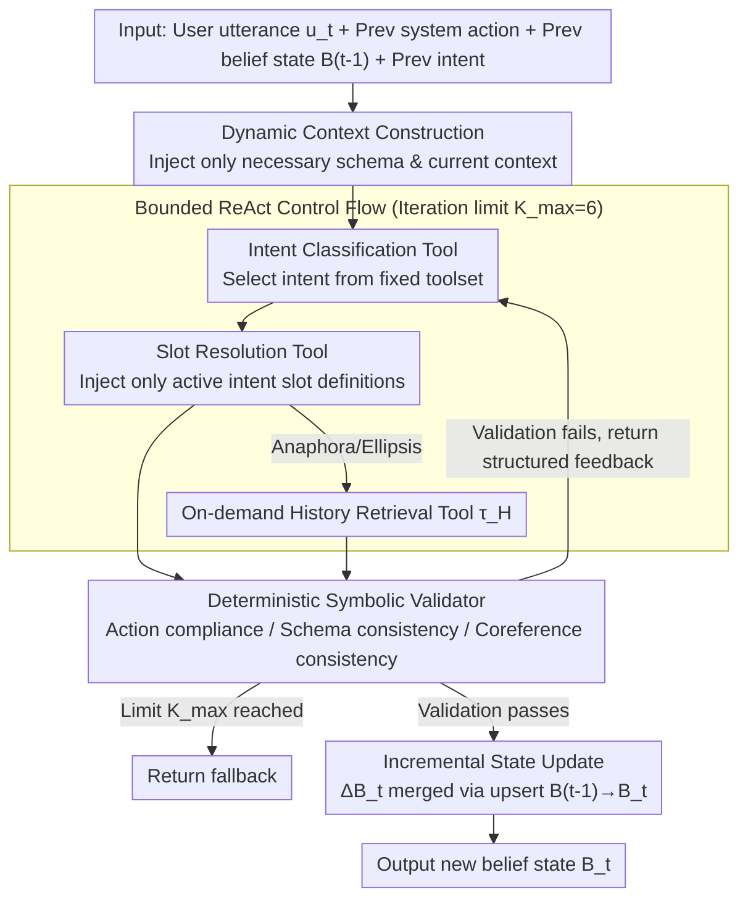

# ReacTOD: Bounded Neuro-Symbolic Agentic NLU for Zero-Shot Dialogue State Tracking

**Conference**: ACL2026  
**arXiv**: [2605.19077](https://arxiv.org/abs/2605.19077)  
**Code**: Not provided in cache  
**Area**: Task-oriented Dialogue / Dialogue State Tracking / Agentic NLU  
**Keywords**: Zero-shot DST, Neuro-symbolic System, ReAct, Tool Calling, Symbolic Validation  

## TL;DR
ReacTOD decomposes task-oriented Dialogue State Tracking (DST) into bounded tool calls and uses a deterministic symbolic validator to intercept and provide feedback on LLM errors. This allows 8B to 32B-scale models to achieve Joint Goal Accuracy (JGA) on zero-shot MultiWOZ and SGD that surpasses previous large-scale LLM prompting methods.

## Background & Motivation
**Background**: Task-oriented dialogue systems typically convert user utterances into executable intents, slots, and values. Traditional enterprise NLU often uses BERT-like discriminative models for Intent Classification and Slot Resolution, which are reliable and low-latency but heavily dependent on fixed label sets and domain-specific annotated data. Recent LLM approaches put the schema into the prompt, using generative models for zero-shot state tracking.

**Limitations of Prior Work**: Single-turn generative DST is prone to formatting errors, hallucinated slots, and over-completion of entities not mentioned in the dialogue. In scenarios like hotel bookings, ride-hailing, or restaurant reservations, incorrect slot values are passed to downstream APIs, causing silent failures. Although unconstrained agents can perform multi-step reasoning, their open loops and heavy LLM dependence introduce latency and cost risks.

**Key Challenge**: Production-grade TOD needs the zero-shot schema generalization of LLMs but cannot accept the randomness associated with LLMs directly modifying system states. The authors observe that many DST errors are not failures in deep semantic understanding but rather local, repairable errors—such as incorrect time formats, illegal slot names, or unresolved generic entities.

**Goal**: To enable medium-sized LLMs to stably perform state tracking without using annotated dialogues, fine-tuning, or in-domain examples, while ensuring every state update is verifiable, reversible, and auditable.

**Key Insight**: Instead of treating DST as one-time text generation, the paper constrains NLU into a sequence of bounded tool calls. The LLM proposes actions, and a deterministic program determines whether the actions are safe and valid.

**Core Idea**: Replace single-pass schema generation with a "Bounded ReAct Tool Loop + Symbolic Validator." This allows the model to self-correct based on structured error feedback rather than relying entirely on a single generation for reliability.

## Method
The core of ReacTOD is reframing dialogue state tracking from a free-generation problem into a controlled neuro-symbolic execution process. Instead of writing the final state directly, the LLM selects from a limited set of tools within each turn: first identifying the intent, then resolving slots related to that intent, and retrieving historical context if necessary. Each tool call passes through a deterministic validator; only slot resolution results that pass validation can update the belief state.

### Overall Architecture
Inputs include the current user utterance $u_t$, the previous system action $a_{t-1}$, the previous belief state $B_{t-1}$, the previous intent, and the current agent's action-observation trace. The output is not a complete rewrite of the state, but an incremental state update $\Delta B_t$, which is finally merged into $B_t$ via an upsert operation.

The specific process can be summarized in four steps. First, the system places only the necessary schema and current context into the prompt, preventing small models from being overwhelmed by the full schema and long history. Second, the LLM calls the Intent Classification tool from the restricted toolset to obtain the current intent. Third, if the intent is a transactional task, the Slot Resolution tool is called, injecting only the slot definitions relevant to that intent; if anaphora or ellipsis occur, the history retrieval tool is called on demand. Fourth, the validator checks action sequence, schema validity, value formats, and coreference consistency; upon failure, it returns structured feedback for the LLM to retry within a maximum limit of $K_{max}=6$.

### Key Designs

**1. Bounded ReAct Control Flow: Retaining self-correction while removing uncontrolled side effects of open loops**

Production systems are wary of unconstrained agents: though capable of multi-step reasoning, open loops and arbitrary state writes bring risks of latency, cost, and silent failures. ReacTOD narrows the agent's action space to a fixed tool library $\mathcal{T}$. Each step allows only one valid tool choice. The prompt guides the model to perform Intent Classification before Slot Resolution, and the validator enforces this sequence as a hard constraint (e.g., "SR must be based on a confirmed intent"). If the iteration limit $K_{max}=6$ is reached, the system returns a fallback rather than consuming more tokens. This preserves the "error correction" capability of ReAct while boxing it into a finite, predictable sequence of actions.

**2. Deterministic Symbolic Validator: Blocking errors before any state modification**

Many DST errors are not failures of deep semantic understanding but are local and repairable—incorrect time formats, illegal slot names, or unresolved generic entities. Instead of using another LLM-as-a-judge (which introduces new uncertainty), ReacTOD employs a deterministic program to perform three types of low-cost checks before any tool call lands: action compliance (e.g., submitting values before IC is called), schema consistency (illegal intents, slot names, or categorical values), and coreference consistency (outputting "restaurant" without resolving the actual entity). If validation fails, it returns explicit structured feedback, such as "slot taxi-arriveby requires HH:MM format," prompting the LLM to retry with the error information. This mechanism solidifies schema constraints, format rules, and state update protocols into verifiable boundaries—the LLM proposes, and the program gates.

**3. Incremental State & Dynamic Context Construction: Preventing small models from instruction loss and state pollution**

Small models often lose track of instructions in prompts containing full schemas and long histories, and intermediate erroneous outputs might persist in the state. ReacTOD controls both ends: the model only predicts incremental updates $\Delta B_t$ each turn, with the full state updated via upserting $\Delta B_t$ into $B_{t-1}$. Slot descriptions are loaded on-demand for the active intent, and dialogue history is omitted from the prompt by default, only being retrieved via the tool $\tau_H$ when anaphora or ellipsis is encountered. A deferred update strategy is used—only validated results are written to $B_t$. Short prompts help small models follow rules, while deferred updates ensure rejected intermediate outputs do not pollute subsequent turns.

### A Complete Example: One Round of State Update with Format Correction

Suppose a user says, "Book me a taxi to arrive by five-thirty PM." The system first injects only the necessary schema and current context into the prompt. The LLM calls Intent Classification and gets the intent `taxi`; since it is a transactional task, it then calls Slot Resolution, injecting only `taxi`-related slot definitions. In the first pass, the LLM resolves the arrival time as `slot taxi-arriveby = 5:30pm`—the validator intervenes, identifying that the value does not match the `HH:MM` format (failing the schema consistency check), blocks the write, and returns structured feedback: "slot taxi-arriveby requires HH:MM format." The LLM receives this feedback and corrects it to `17:30` in the second iteration. All three validation checks pass, and this increment $\Delta B_t$ is upserted into $B_{t-1}$ to produce the new $B_t$. The turn converges with one correction within the $K_{max}=6$ limit—statistically, most turns require only two calls (IC + SR), and approximately 93.1% of turns triggered by the validator successfully self-correct within the limit.

### Loss & Training
ReacTOD does not rely on task-specific training data, fine-tuning, or few-shot examples. All experiments are zero-shot inference. The primary training strategy is actually inference-time architectural constraint: temperature is set to 0.0, a uniform maximum ReAct turn limit $K_{max}=6$ is applied, and different backbones use the same tool protocol and schema injection methods. The MultiWOZ schema is derived from MultiWOZ 2.2 with added slot types, and the SGD schema is programmatically constructed from official service definitions.

## Key Experimental Results

### Main Results

| Dataset | Model / Method | Metric | Ours | Comparison Method | Gain |
|--------|-------------|------|------|----------|------|
| MultiWOZ 2.1 | gpt-oss-20B + ReacTOD | Overall JGA | 52.71% | FnCTOD + GPT-4 38.71% | +14.00 pp |
| MultiWOZ 2.1 | Qwen3-8B + ReacTOD | Overall JGA | 47.34% | FnCTOD + Qwen3-32B 40.36% | +6.98 pp |
| SGD | Claude-Opus-4.6 + ReacTOD | Avg. Service JGA | 80.68% | reproduced SRP 45.20% | +35.48 pp |
| SGD | Qwen3-32B + ReacTOD | Avg. Service JGA | 64.09% | reproduced SRP 45.20% | +18.89 pp |

### Ablation Study

| Model | Dataset | w/o ReAct Loop | ReacTOD | Gain |
|------|--------|----------------|---------|------|
| Qwen3-8B | MultiWOZ Overall JGA | 39.29% | 47.34% | +8.05 pp |
| Qwen3-8B | SGD Avg. Svc. JGA | 45.49% | 57.31% | +11.82 pp |
| gpt-oss-20B | MultiWOZ Overall JGA | 43.39% | 52.71% | +9.32 pp |
| Claude-Opus-4.6 | SGD Avg. Svc. JGA | 73.49% | 80.68% | +7.19 pp |

### Efficiency & Validator Analysis

| Item | Value | Explanation |
|------|------|------|
| P50 LLM calls / turn | 2.00 | Median across all models is two calls (IC + SR) |
| Qwen3-32B output tokens / turn | 150.40 avg / 365.58 P99 | Compact text ReAct output |
| gpt-oss-20B output tokens / turn | 448.09 avg / 1611.29 P99 | native thinking leads to higher token overhead |
| Validator triggered turns | 683 / 7372 | 9.3% of turns triggered correction on Qwen3-8B |
| Validator self-correction rate | 636 / 683 = 93.1% | Only 47 turns reached the $K_{max}=6$ limit |
| W/o validator | 47.34% → 43.00% JGA | 4.34 pp drop for Qwen3-8B on MultiWOZ |

### Key Findings
- The ReAct loop works in tandem with the validator's structured error feedback rather than simply "asking multiple times." Enabling the loop without the validator leads to significant performance drops.
- Smaller models benefit more; Qwen3-8B improved from 45.49% to 57.31% on SGD, suggesting the validator provides more opportunities to catch local errors under complex schemas.
- Costs remain manageable: most turns require only two LLM calls, with the long tail constrained by the iteration limit.

## Highlights & Insights
- The most valuable aspect of this paper is decomposing "LLM reliability" into locally verifiable actions rather than pursuing longer prompts or stronger backbones. For production NLU, this is closer to a deployable system than simple model stacking.
- The validator design is pragmatic: it does not attempt to understand natural language but only checks schemas, formats, and state protocols. This "LLM proposes, Program gates" pattern is transferable to tool calling, form filling, and API parameter generation.
- Incremental state prediction and on-demand history retrieval address the prompt burden common in small models. Results show that architectural control allows an 8B model to outperform the single-generation baseline of much larger models.

## Limitations & Future Work
- ReacTOD requires more LLM calls than single-pass generation. Although loops are bounded, latency and cost must still be evaluated for high-throughput services.
- The method relies on relatively complete, machine-readable schemas, including intents, slot descriptions, type constraints, and categorical values. If schemas are missing, noisy, or open-domain, the safeguards provided by the validator will decrease.
- Some MultiWOZ schemas required manual supplementation of slot types, indicating that "zero-shot" does not equate to zero engineering cost. Future work could explore automatic schema normalization, schema quality diagnostics, and finer-grained error feedback strategies.

## Related Work & Insights
- **vs. Traditional Discriminative NLU**: Methods like JointBERT are reliable and fast but depend on fixed labels and annotated data; ReacTOD sacrifices some inference cost for zero-shot schema transferability.
- **vs. FnCTOD**: FnCTOD functionalizes domain logic but remains focused on single-pass generation; ReacTOD adds bounded ReAct and a validator to intercept and repair errors.
- **vs. General ReAct Agents**: General ReAct agents pursue open tool reasoning with the risk of uncontrollable loops; ReacTOD narrows tool and state-write boundaries, making it more suitable for production DST.
- **Insights**: For LLM systems requiring high-structure output, prioritize designing "verifiable intermediate actions" and allowing the model to iterate on error feedback rather than performing only a final JSON validation.

## Rating
- Novelty: ⭐⭐⭐⭐☆ Combining ReAct, tool calling, and symbolic validation in DST is natural but comprehensively implemented; the key innovation lies in boundary control.
- Experimental Thoroughness: ⭐⭐⭐⭐☆ Covers MultiWOZ, SGD, and multiple backbones, with loop, validator, and efficiency analyses; real-world business latency metrics would make it more complete.
- Writing Quality: ⭐⭐⭐⭐☆ Clear motivation, sufficient engineering details, and dense tables with a focused main theme.
- Value: ⭐⭐⭐⭐⭐ Highly relevant for task-oriented dialogue and structured LLM applications, particularly for zero-shot NLU in production systems.

<!-- RELATED:START -->

## Related Papers

- [\[NeurIPS 2025\] Agentic Persona Control and Task State Tracking for Realistic User Simulation](../../NeurIPS2025/dialogue/agentic_persona_control_and_task_state_tracking_for_realistic_user_simulation_in.md)
- [\[ACL 2026\] APEX-MEM: Agentic Semi-Structured Memory with Temporal Reasoning for Long-Term Conversational AI](apex-mem_agentic_semi-structured_memory_with_temporal_reasoning_for_long-term_co.md)
- [\[ACL 2026\] Surprisal Minimisation over Goal-directed Alternatives Predicts Production Choice in Dialogue](surprisal_minimisation_over_goal-directed_alternatives_predicts_production_choic.md)
- [\[ICLR 2026\] Codified Finite-state Machines for Role-playing](../../ICLR2026/dialogue/codified_finite-state_machines_for_role-playing.md)
- [\[ACL 2025\] Dynamic Label Name Refinement for Few-Shot Dialogue Intent Classification](../../ACL2025/dialogue/dynamic_label_name_refinement_for_few-shot_dialogue_intent_classification.md)

<!-- RELATED:END -->
