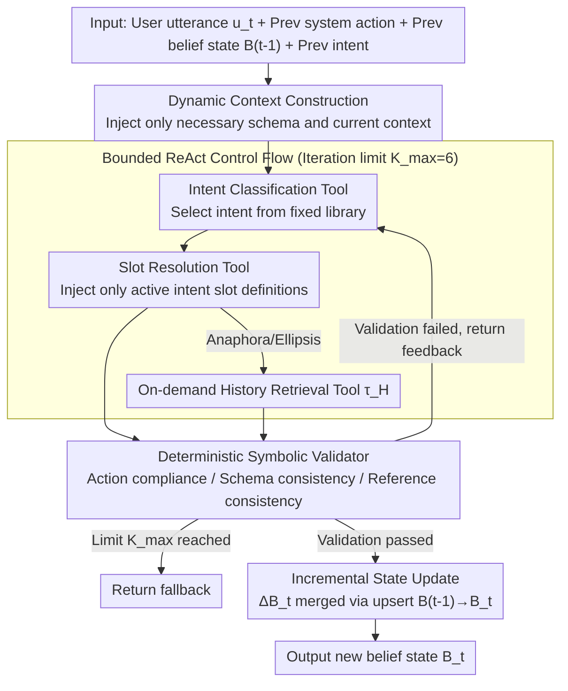

# ReacTOD: Bounded Neuro-Symbolic Agentic NLU for Zero-Shot Dialogue State Tracking

**Conference**: ACL2026  
**arXiv**: [2605.19077](https://arxiv.org/abs/2605.19077)  
**Code**: Not provided in cache  
**Area**: Task-Oriented Dialogue / Dialogue State Tracking / Agentic NLU  
**Keywords**: Zero-shot DST, Neuro-symbolic Systems, ReAct, Tool Calling, Symbolic Validation  

## TL;DR
ReacTOD decomposes Task-Oriented Dialogue State Tracking (DST) into bounded tool calls and utilizes a deterministic symbolic validator to intercept and provide feedback on LLM errors. This enables 8B to 32B scale models to achieve Joint Goal Accuracy (JGA) on zero-shot MultiWOZ and SGD that exceeds previous large-scale model prompting methods.

## Background & Motivation
**Background**: Task-oriented dialogue systems typically convert user utterances into executable intents, slots, and values. Traditional corporate NLU often uses BERT-like discriminative models for Intent Classification and Slot Resolution, which are reliable and low-latency but heavily dependent on fixed label sets and domain-specific annotated data. Recent LLM-based methods incorporate schemas into prompts to perform zero-shot state tracking using generative models.

**Limitations of Prior Work**: Single-turn generative DST is prone to formatting errors, hallucinated slots, and over-completion of unmentioned entities. In scenarios like hotel, taxi, or restaurant bookings, erroneous slot values are passed to downstream APIs, leading to silent failures. While unconstrained agents can perform multi-step reasoning, their open loops and heavy LLM reliance introduce latency and cost risks.

**Key Challenge**: Production-grade TOD requires the zero-shot schema generalization of LLMs but cannot tolerate the stochasticity of LLMs directly modifying system states. The authors observe that many DST errors are not failures in deep semantic understanding but are local, fixable errors, such as incorrect time formats, invalid slot names, or unresolved anaphoric entities.

**Goal**: To enable medium-scale LLMs to stably complete state tracking without using annotated dialogues, fine-tuning, or in-domain examples, while ensuring every state update is verifiable, reversible, and auditable.

**Key Insight**: Instead of viewing DST as one-shot text generation, NLU is constrained as a sequence of finite tool calls. The LLM is responsible for proposing actions, while deterministic programs determine if those actions are safe and valid.

**Core Idea**: Replace single-turn schema generation with a "Bounded ReAct Tool Loop + Symbolic Validator," allowing models to self-correct through structured error feedback rather than relying entirely on a single generation for reliability.

## Method
The core of ReacTOD is reframing dialogue state tracking from a free-form generation problem into a controlled neuro-symbolic execution process. Instead of directly writing the final state, the LLM selects from finite tools within each turn: first determining the intent, then resolving slots related to that intent, and retrieving historical context if necessary. Each tool call passes through a deterministic validator; only validated slot resolution results can update the belief state.

### Overall Architecture
Inputs include the current user utterance $u_t$, the previous system action $a_{t-1}$, the previous belief state $B_{t-1}$, the previous intent, and the action-observation trace of the current agent. The output is not a fully rewritten state but an incremental state update $\Delta B_t$, which is finally merged into $B_t$ via upsert.

The process consists of four steps. First, the system injects only necessary schemas and the current context into the prompt to avoid overwhelming smaller models. Second, the LLM calls the Intent Classification tool from a restricted library. Third, if the intent is transactional, it calls the Slot Resolution tool, injecting only relevant slot definitions; if anaphora or ellipsis is encountered, it calls the history retrieval tool on-demand. Fourth, the validator checks action sequence, schema legality, value formats, and reference consistency, returning structured feedback for retries within a limit of $K_{max}=6$.

### Key Designs

**1. Bounded ReAct Control Flow: Preserving self-correction while removing uncontrollable side effects of open loops**
Production systems avoid unconstrained agents: though capable of multi-step reasoning, open loops and arbitrary state writes risk latency, cost, and silent failures. ReacTOD narrows the agent's action space to a fixed tool library $\mathcal{T}$. Each step chooses one legal tool; the prompt guides it from Intent Classification to Slot Resolution. The validator enforces this order as a hard constraint (e.g., "SR must follow a confirmed intent"). If the iteration limit $K_{max}=6$ is reached, the system returns a fallback rather than continuing inference. This retains the "self-correction" capability of ReAct while pinning it to a finite, predictable sequence of actions.

**2. Deterministic Symbolic Validator: Blocking errors before any state modification**
Many DST errors are local and fixable—incorrect time formats, invalid slot names, or unresolved references. Rather than employing another LLM-as-judge (which introduces new uncertainty), ReacTOD uses deterministic code to perform three types of low-cost checks before any tool call takes effect: action compliance (e.g., submitting slots before intent classification), schema consistency (invalid intents, slots, or categorical values), and reference consistency (e.g., outputting "restaurant" without resolving the actual entity). Upon failure, it returns explicit structured feedback, such as "slot taxi-arriveby requires HH:MM format," prompting the LLM to retry. This mechanism solidifies schema constraints, formatting rules, and state update protocols into verifiable boundaries.

**3. Incremental State and Dynamic Context Construction: Preventing models from being overwhelmed by long prompts**
Smaller models often lose track of instructions in prompts containing full schemas and long histories, and intermediate errors might leak into persistent states. ReacTOD caps both ends: the model only predicts incremental updates $\Delta B_t$, while the full state is maintained by merging with $B_{t-1}$. Slot descriptions are loaded on-demand for the active intent, and dialogue history is excluded by default, accessed only via the history retrieval tool $\tau_H$ when needed. States use deferred updates—only results passing the validator are written to $B_t$. Shorter prompts help smaller models adhere to rules, while deferred writes ensure rejected outputs do not pollute subsequent turns.

### Loss & Training
ReacTOD does not rely on task-specific training data, fine-tuning, or few-shot examples. All experiments utilize zero-shot inference. The primary "training" strategy is actually inference-time architectural constraint: temperature is set to 0.0, a uniform $K_{max}=6$ is applied, and different backbones use the same tool protocols and schema injection methods. MultiWOZ schemas are sourced from MultiWOZ 2.2 with added slot types, while SGD schemas are programmatically constructed from official service definitions.

## Key Experimental Results

### Main Results

| Dataset | Model / Method | Metric | Ours | Prev. Method | Gain |
|--------|-------------|------|------|----------|------|
| MultiWOZ 2.1 | gpt-oss-20B + ReacTOD | Overall JGA | 52.71% | FnCTOD + GPT-4 38.71% | +14.00 pp |
| MultiWOZ 2.1 | Qwen3-8B + ReacTOD | Overall JGA | 47.34% | FnCTOD + Qwen3-32B 40.36% | +6.98 pp |
| SGD | Claude-Opus-4.6 + ReacTOD | Avg. Service JGA | 80.68% | reproduced SRP 45.20% | +35.48 pp |
| SGD | Qwen3-32B + ReacTOD | Avg. Service JGA | 64.09% | reproduced SRP 45.20% | +18.89 pp |

### Ablation Study

| Model | Dataset | w/o ReAct Loop | ReacTOD | Gain |
|------|--------|----------------|---------|------|
| Qwen3-8B | MultiWOZ Overall JGA | 39.29% | 47.34% | +8.05 pp |
| Qwen3-8B | SGD Avg. Svc. JGA | 45.49% | 57.31% | +11.82 pp |
| gpt-oss-20B | MultiWOZ Overall JGA | 43.39% | 52.71% | +9.32 pp |
| Claude-Opus-4.6 | SGD Avg. Svc. JGA | 73.49% | 80.68% | +7.19 pp |

### Key Findings
- The ReAct loop works in tandem with structured error feedback from the validator; simply opening the loop without the validator significantly degrades performance.
- Smaller models benefit more; Qwen3-8B improved from 45.49% to 57.31% on SGD, indicating the validator has more opportunities to capture local errors in complex schemas.
- Costs remain manageable: the median turn requires only two LLM calls (IC + SR), with the long-tail behavior constrained by the iteration limit. About 93.1% of turns triggered by the validator successfully self-correct within the limit.

## Highlights & Insights
- The most valuable aspect of this paper is decomposing "LLM reliability" into locally verifiable actions rather than pursuing longer prompts or stronger backbones. For production NLU, this is more feasible than simply scaling models.
- The validator design is pragmatic: it does not attempt to "understand" natural language but checks schemas, formats, and state protocols. This "LLM proposes, Program guards" pattern is transferable to tool calling, form filling, and API parameter generation.
- Incremental state prediction and on-demand history retrieval address the prompt burden common in small models. Results show architectural control allows an 8B model to outperform single-generation baselines of larger models.

## Limitations & Future Work
- ReacTOD requires more LLM calls than single-turn generation. While the loop is bounded, latency and cost must be evaluated for high-throughput services.
- The method depends on relatively complete machine-readable schemas. If schemas are missing, noisy, or the domain is open, the guarantees provided by the validator decrease.
- Some MultiWOZ schemas required manual slot type augmentation, suggesting that "zero-shot" does not equate to zero engineering cost. Future work could explore automatic schema normalization and finer-grained feedback strategies.

## Related Work & Insights
- **vs. Traditional Discriminative NLU**: Methods like JointBERT are reliable and fast but depend on fixed labels; ReacTOD trades inference cost for zero-shot schema transferability.
- **vs. FnCTOD**: FnCTOD functionalizes domain logic but remains biased toward single generation; ReacTOD adds bounded ReAct and validation for intercepting and fixing errors.
- **vs. General ReAct Agents**: General ReAct pursues open tool reasoning with risks of uncontrollable loops; ReacTOD narrows the tool and state-write boundaries for production DST.
- **Insight**: For LLM systems requiring high-structure output, prioritize designing "verifiable intermediate actions" and iterating on error feedback rather than just validating the final JSON.

## Rating
- Novelty: ⭐⭐⭐⭐☆ Combining ReAct, tool calling, and symbolic validation for DST is natural but comprehensively implemented; key innovation lies in boundary control.
- Experimental Thoroughness: ⭐⭐⭐⭐☆ Covers MultiWOZ, SGD, and multiple backbones with loop, validator, and efficiency analyses.
- Writing Quality: ⭐⭐⭐⭐☆ Clear motivation, sufficient engineering detail, and a well-defined main narrative.
- Value: ⭐⭐⭐⭐⭐ Highly relevant for task-oriented dialogue and structured LLM applications, especially for zero-shot NLU in production systems.

<!-- RELATED:START -->

## Related Papers

- [\[NeurIPS 2025\] Agentic Persona Control and Task State Tracking for Realistic User Simulation](../../NeurIPS2025/dialogue/agentic_persona_control_and_task_state_tracking_for_realistic_user_simulation_in.md)
- [\[ACL 2026\] APEX-MEM: Agentic Semi-Structured Memory with Temporal Reasoning for Long-Term Conversational AI](apex-mem_agentic_semi-structured_memory_with_temporal_reasoning_for_long-term_co.md)
- [\[ACL 2026\] Reasoning Gets Harder for LLMs Inside A Dialogue](reasoning_gets_harder_for_llms_inside_a_dialogue.md)
- [\[ACL 2026\] Surprisal Minimisation over Goal-directed Alternatives Predicts Production Choice in Dialogue](surprisal_minimisation_over_goal-directed_alternatives_predicts_production_choic.md)
- [\[ACL 2025\] Dynamic Label Name Refinement for Few-Shot Dialogue Intent Classification](../../ACL2025/dialogue/dynamic_label_name_refinement_for_few-shot_dialogue_intent_classification.md)

<!-- RELATED:END -->
