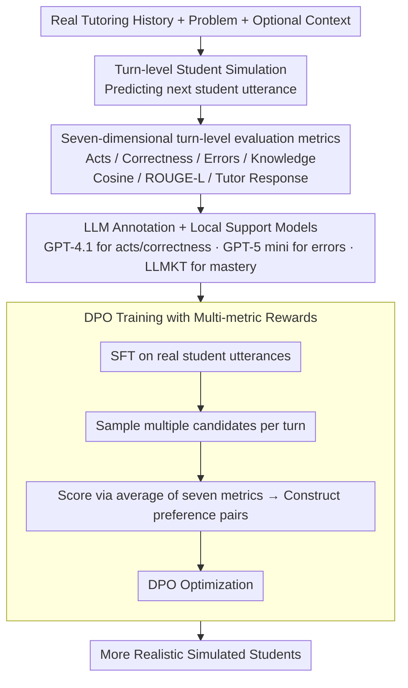

# Simulated Students in Tutoring Dialogues: Substance or Illusion?

**Conference**: ACL2026  
**arXiv**: [2601.04025](https://arxiv.org/abs/2601.04025)  
**Code**: https://github.com/umass-ml4ed/sim-student-eval  
**Area**: LLM Alignment / Educational AI / User Simulation  
**Keywords**: Simulated Student, Intelligent Tutoring, Dialogue Evaluation, DPO, Learning Sciences

## TL;DR
This paper proposes a evaluation framework for simulated students in mathematics tutoring dialogues. It finds that simple prompting often produces "students who seem to know how to answer," whereas SFT and DPO align more closely with real student behavior, though error replication and modeling of individual differences remain largely unresolved.

## Background & Motivation
**Background**: LLMs are widely utilized in Intelligent Tutoring Systems (ITS) to act as both tutors and students during training and evaluation. To avoid the high costs of experiments with real students, many educational AI works employ LLMs to simulate students for testing or training tutoring strategies.

**Limitations of Prior Work**: If simulated students are unrealistic, subsequent tutors trained on them may optimize for the wrong objectives. Simple prompts like "respond like a student" typically result in models that are overly correct, polite, and explanatory, lacking the short phrases, confusion, errors, and randomness characteristic of real students.

**Key Challenge**: The quality of a simulated student cannot be measured by a single metric like text similarity. Real student behavior simultaneously involves dialogue acts, correctness on the current problem, specific error types, changes in knowledge mastery, linguistic style, and the ability to elicit appropriate reactions from a real tutor. Without multi-dimensional metrics, a model might appear reasonable in one dimension while being educationally distorted.

**Goal**: The authors aim to formalize the "turn-level student simulation" task, establish a set of automatically computable and human-validated metrics, and systematically compare the performance of prompting, SFT, and preference optimization methods on real mathematical tutoring dialogues.

**Key Insight**: The paper treats each student turn as a prediction target. The model generates the next student utterance based on prior student/tutor history, the problem, and optional context. Real student utterances are then used as references for multi-dimensional evaluation.

**Core Idea**: Dimensions of student behavior from learning sciences are transformed into automated evaluation metrics. These metrics are further utilized to construct rewards for Direct Preference Optimization (DPO), thereby both evaluating simulated students and exploring how to train more realistic ones.

## Method

### Overall Architecture

The paper formalizes "turn-level student simulation" as a prediction problem: given the history of a real tutor-student dialogue, the problem, and optional context, the model generates the next student utterance at each student turn. Multi-dimensional scoring is performed using the real student utterance as a reference. The design is split into evaluation and training layers. The evaluation layer lets the model generate simulated student utterances turn-by-turn and measures "student-likeness" via dialogue acts, correctness, errors, knowledge acquisition, linguistic similarity, and tutor response predictability. The training layer uses these metrics as feedback signals; models are first SFT-ed on real student utterances, then preference pairs are constructed by scoring candidate responses with these metrics for DPO optimization. Data is sourced from the Question-Anchored Tutoring Dialogues 2k dataset, containing 1,529 training and 382 testing dialogues, characterized by short student turns (avg. 4.11 words).

### Key Designs

**1. Seven-dimensional turn-level evaluation metrics: Replacing single text similarity with learning science dimensions**

In educational contexts, appearing "student-like" is not equivalent to semantic similarity. Identical correct answers may reflect different levels of mastery, and errors must be assessed for authenticity. The authors decompose evaluation into: Acts, Correctness, Errors, Knowledge Acquisition, Cosine Similarity, ROUGE-L, and Tutor Response. While the former focus on behavior and cognition, the latter address linguistic form and dialogue flow.

**2. Integrating LLM annotation with local support models: Balancing scale and human alignment**

Several of the seven dimensions cannot be calculated via string-based metrics, and pure human annotation is prohibitively expensive. The authors distribute the load: GPT-4.1 labels dialogue acts and correctness for real students, and a local LLM is trained to classify acts. More difficult judgments like specific error types are handled by GPT-5 mini, while knowledge acquisition is estimated using an LLMKT-style knowledge tracing model to calculate mastery delta.

**3. DPO simulated student training based on multi-metric rewards: Turning evaluation metrics into training signals**

Calculable metrics are used to improve student models. After SFT, multiple candidate student utterances are sampled per turn. An average score across the seven metrics is calculated; preference pairs are formed when the score difference exceeds a threshold. DPO optimization follows. Notably, the first 5 turns of each dialogue are skipped during DPO training to avoid noisy rewards from sparse context.

### Loss & Training

The student models utilize Llama-3.2-3B-Instruct and Llama-3.1-8B-Instruct. SFT utilizes LoRA with a learning rate of $5 \times 10^{-5}$, an effective batch size of 64, LoRA rank of 32, alpha of 64, and dropout of 0.05. DPO employs a learning rate of $5 \times 10^{-6}$, $\beta=0.1$, sampling 4 candidates per turn with a preference threshold of 0.1. To reduce costs, DPO uses a random 20% of the training dialogues.

## Key Experimental Results

### Main Results
Automated metrics indicate that fine-tuning methods outperform prompting across most dimensions. While prompting appears superior in Correctness, this is primarily because it tends to generate correct answers (the majority class) rather than realistically simulating a student's varied accuracy.

| Method | Acts↑ | Corr.↑ | Errors↑ | Knowledge↑ | Cos. Sim.↑ | ROUGE-L↑ | Tutor Resp.↑ |
|------|-------|--------|---------|------------|------------|----------|--------------|
| DPO Llama 3.1 8B | 0.6840 | 0.5761 | 0.0529 | 0.8787 | 0.7390 | 0.3212 | 0.2039 |
| SFT Llama 3.1 8B | 0.6671 | 0.5670 | 0.0661 | 0.8766 | 0.7383 | 0.3212 | 0.2038 |
| DPO Llama 3.2 3B | 0.6762 | 0.5748 | 0.0584 | 0.8745 | 0.7345 | 0.3109 | 0.2037 |
| Reasoning GPT-5 Mini | 0.5755 | 0.5870 | 0.0088 | 0.8395 | 0.5992 | 0.2170 | 0.1909 |
| Zero-Shot GPT-4.1 | 0.4998 | 0.5926 | 0.0220 | 0.8078 | 0.5460 | 0.1648 | 0.1911 |
| Oracle GPT-4.1 | 0.5097 | 0.6755 | 0.1872 | 0.8063 | 0.6032 | 0.2109 | 0.1942 |

Human evaluation of 190 turns across 38 dialogues corroborates the automated metrics: DPO is more "student-like," while the Oracle model is stronger in correctness and error replication due to leaked summary information.

| Method | Acts↑ | Corr.↑ | Errors↑ | Linguistic↑ | Explanation |
|------|-------|--------|---------|-------------|------|
| DPO | 0.7905 | 0.6377 | 0.0612 | 0.5405 | Best behavioral and linguistic similarity |
| Zero-Shot | 0.6143 | 0.6087 | 0.0408 | 0.3155 | Linguistic style least like real students |
| Oracle | 0.6476 | 0.7101 | 0.2449 | 0.4071 | Relies on extra info; highest error replication |

### Ablation Study
The authors trained DPO with single rewards to analyze coupling. Optimizing a single dimension often causes degradation in others. While an average reward is robust, it is not necessarily the optimal combination for all tasks.

| Reward | Acts↑ | Corr.↑ | Errors↑ | Knowledge↑ | Cos. Sim.↑ | ROUGE-L↑ | Tutor Resp.↑ | Main Observation |
|------|-------|--------|---------|------------|------------|----------|--------------|----------|
| SFT | 0.6795 | 0.5546 | 0.0506 | 0.8723 | 0.7417 | 0.3155 | 0.2102 | No preference optimization |
| Average | 0.6962 | 0.5699 | 0.0562 | 0.8691 | 0.7433 | 0.3181 | 0.2104 | Balanced overall performance |
| Correctness | 0.6692 | 0.5852 | 0.0506 | 0.8652 | 0.7275 | 0.3129 | 0.2081 | Highest correctness but drops in others |
| Knowledge | 0.6846 | 0.5437 | 0.0730 | 0.8756 | 0.7486 | 0.3147 | 0.2124 | Stronger knowledge, errors, and tutor resp. |
| Tutor Resp. | 0.6897 | 0.5349 | 0.0618 | 0.8763 | 0.7447 | 0.3137 | 0.2113 | Leads to more natural dialogue flow |

### Key Findings
- Prompting methods often generate over-long, over-polite, and over-correct responses, failing to capture the short utterances and uncertainty of real students.
- DPO provides only marginal gains over SFT, suggesting this task is not easily solved by simple preference optimization; signals for error replication are particularly sparse.
- The 8B model holds a consistent but small advantage over the 3B model, indicating the bottleneck is likely the inherent randomness and individual differences in student behavior rather than just model capacity.
- There is strong alignment between automated metrics and human evaluation: correlations for Acts, Correctness, Errors, and Linguistic reached 0.7337, 0.6891, 0.6127, and 0.7397 respectively.

## Highlights & Insights
- The primary value of the paper lies in decomposing "student authenticity" into an actionable multi-dimensional evaluation problem rather than relying on intuition.
- The Knowledge Acquisition metric is educationally significant: if two answers are correct, a student answering "c" vs. a model answering "6/10" may represent different mastery states, requiring different tutor strategies.
- The human validation is rigorous, demonstrating that these automated metrics are reliable proxies for human judgment.
- The findings serve as a reminder for Educational AI: before using simulated students for A/B testing or RL training, one must prove the simulations capture the errors, hesitations, and linguistic habits of real students.

## Limitations & Future Work
- Experiments were conducted on a single mathematics tutoring dataset; factors like age, subject, platform, and cultural background could influence simulation difficulty.
- Metrics are reference-based, suitable for offline evaluation but not for open-ended teaching scenarios without standard student answers.
- Knowledge Acquisition and Tutor Response metrics lack human validation due to the difficulty of reliable human judgment in these areas.
- The models do not account for long-term student identity or learning trajectories, leading to weak modeling of individual differences.
- Future work could explore prior student history, student profiles, over-generation and reranking, online human feedback, and reference-free evaluation.

## Related Work & Insights
- **vs. Traditional User Simulation**: While traditional simulation focuses on the coherence of the next turn, this work emphasizes knowledge states and error types specific to education.
- **vs. Persona Prompting**: While persona prompts (e.g., OCEAN) can slightly improve Acts, they are far less effective than SFT/DPO, suggesting high-level descriptions are insufficient to constrain specific learning behaviors.
- **vs. Oracle Prompting**: The Oracle excels in Correctness and Errors because it accesses dialogue act summaries; however, it still lags behind fine-tuned models in linguistic and behavioral dimensions.
- **Insight**: In alignment research, "using simulated users to train assistants" is common. This paper suggests the simulated objects themselves require rigorous evaluation to prevent subsequent alignment results from over-fitting to simulator biases.

## Rating
- Novelty: ⭐⭐⭐⭐☆ Systematically converts learning science dimensions into LLM evaluation metrics.
- Experimental Thoroughness: ⭐⭐⭐⭐☆ Covers automated/human evaluation and reward ablation, though limited to one domain.
- Writing Quality: ⭐⭐⭐⭐⭐ Clear methodology and tight alignment between metrics and educational motivation.
- Value: ⭐⭐⭐⭐⭐ Significant cautionary value for Educational AI, user simulation, and simulator-based training.

<!-- RELATED:START -->

## Related Papers

- [\[ACL 2026\] Your Students Don't Use LLMs Like You Wish They Did](your_students_dont_use_llms_like_you_wish_they_did.md)
- [\[ACL 2026\] Metro: Towards Strategy Induction from Expert Dialogue Transcripts for Non-collaborative Dialogues](metro_towards_strategy_induction_from_expert_dialogue_transcripts_for_non-collab.md)
- [\[ACL 2026\] ReacTOD: Bounded Neuro-Symbolic Agentic NLU for Zero-Shot Dialogue State Tracking](reactod_bounded_neuro-symbolic_agentic_nlu_for_zero-shot_dialogue_state_tracking.md)
- [\[ACL 2026\] Surprisal Minimisation over Goal-directed Alternatives Predicts Production Choice in Dialogue](surprisal_minimisation_over_goal-directed_alternatives_predicts_production_choic.md)
- [\[ACL 2026\] Preference Learning Unlocks LLMs' Psycho-Counseling Skills](preference_learning_unlocks_llms_psycho-counseling_skills.md)

<!-- RELATED:END -->
