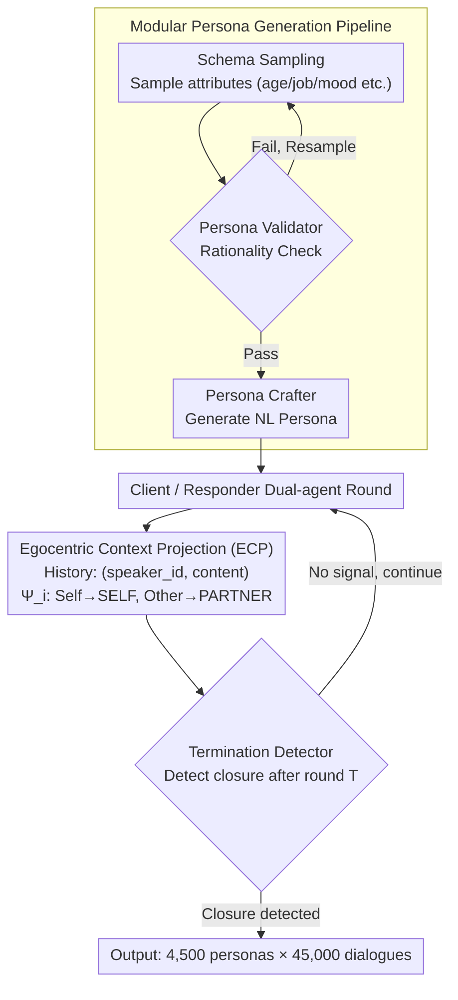

# SPASM: Stable Persona-driven Agent Simulation for Multi-turn Dialogue Generation

**Conference**: ACL 2026 Findings  
**arXiv**: [2604.09212](https://arxiv.org/abs/2604.09212)  
**Code**: [GitHub](https://github.com/lhannnn/SPASM)  
**Area**: Dialogue Systems  
**Keywords**: Persona-driven Dialogue, Multi-turn Simulation, Character Drift, Egocentric Projection, Data Generation

## TL;DR

This paper proposes SPASM, a stability-focused persona-driven multi-turn dialogue simulation framework. By utilizing modular persona generation, Egocentric Context Projection (ECP), and termination detection, it significantly reduces character drift and the "echo" effect in LLM-LLM dialogues, constructing a high-quality dataset of 45,000 multi-turn dialogues.

## Background & Motivation

**Background**: LLMs are widely deployed in multi-turn interaction scenarios such as tutoring, support, and consulting. LLM-LLM dialogue simulation is an effective way to generate large-scale training/evaluation data, offering lower costs and higher controllability compared to human collection.

**Limitations of Prior Work**: Long-term LLM-LLM dialogues accumulate identity-related failures—persona drift (characters gradually deviating from assigned identities), role confusion, and the "echo" effect (where one agent gradually mimics the language and stance of the other). These issues intensify as dialogues lengthen, leading to generated conversations that no longer correspond to the intended settings and polluting synthetic datasets.

**Key Challenge**: The root cause lies in the naive concatenation of dialogue histories—the same utterance occupies different relative roles (user vs. assistant) for different agents, leading to role confusion and feedback loops.

**Goal**: To design a "stability-first" dialogue simulation framework that ensures long-term consistency in characters without modifying model weights.

**Key Insight**: Solve the problem by changing the **representation** of dialogue history rather than the model itself—store dialogue history in a perspective-agnostic format and deterministically project it into each agent's egocentric perspective during generation.

**Core Idea**: Egocentric Context Projection (ECP): Dialogue history is stored in the format of $(speaker\_id, content)$. During generation, a role relabeling operator $\Psi_i$ maps the speaker labels to SELF/PARTNER, ensuring each agent always views the dialogue from its own perspective.

## Method

### Overall Architecture

SPASM aims to resolve the gradual breakdown of characters in long LLM-LLM dialogues. Rather than fine-tuning model weights, it modifies the "representation" of the dialogue history. The pipeline integrates five training-free components: first, the Persona Schema samples persona attributes from predefined fields; the Persona Validator verifies the rationality of the combinations; the Persona Crafter converts attributes into natural language persona descriptions. This is followed by a Client-Responder dual-agent dialogue simulation, where each agent's history is relabeled via Egocentric Context Projection (ECP). Finally, a Termination Detector stops the dialogue upon detecting natural closing signals. The input consists of sampled persona combinations, the intermediate is a perspective-agnostic dialogue history, and the output is a set of role-stable, naturally concluded multi-turn dialogues.

### Key Designs

**1. Modular Persona Generation Pipeline: Sampling-Validation-Refinement to ensure credibility**

Directly concatenating randomly sampled attributes often results in absurd combinations (e.g., "18-year-old student + pension planning"), which pollutes the dataset. SPASM splits persona generation into three steps: Schema Sampling randomly selects fields like age, occupation, location, emotional state, and behavioral patterns; the Validator checks the coherence and rationality of these attributes, triggering resampling if they fail; the Crafter then writes the validated attribute set into a coherent natural language persona description, potentially adding extra details. This sandwich structure of validation and refinement maintains diversity while filtering out implausible attribute sets.

**2. Egocentric Context Projection (ECP): Rooting out role confusion with symmetric SELF/PARTNER representations**

ECP is the most critical design in the paper. The fixed assignment of user/assistant labels in naive concatenation is the source of role confusion and the "echo" effect—the same utterance should occupy different relative roles for different agents. ECP stores the dialogue history as a perspective-agnostic sequence $\mathcal{H}_t = (u_k)_{k=1}^t$, where each $u_k = (s_k, c_k)$ only records the speaker ID and content. When agent $i$ generates a response, the projection operator $\Psi_i(\mathcal{H}_t) = ((\phi_i(s_k), c_k))_{k=1}^t$ deterministically maps absolute speakers to relative roles, labeling its own utterances as SELF and the other's as PARTNER. This completely decouples role labels from agent identity, allowing each agent to view the dialogue from its own perspective. Ablation studies show that ECP nearly eliminates the echo effect and significantly reduces persona drift.

**3. Termination Detector: Stopping at natural conclusions to avoid hard cuts or infinite loops**

Hard truncation at a fixed number of turns produces abrupt endings, while no limit may lead two agents into infinite pleasantries. The Termination Detector activates after round $T$, judging whether a closure signal (such as expressions of gratitude or farewells) has appeared based on the recent $m$ rounds of history and predefined rules. It ensures each generated data point has a coherent, natural conclusion rather than being artificially severed.

### Loss & Training

Entirely training-free. All components are implemented through API calls without modifying model weights.

## Key Experimental Results

### Persona Retrieval Accuracy (Top-1 Acc)

| Client / Responder | Top-1 | Top-10 |
|-------------------|-------|--------|
| GPT / GPT | 0.96 | 1.00 |
| GPT / DeepSeek | 0.50 | 0.82 |
| DS / GPT | 0.99 | 1.00 |
| Qwen / Qwen | 0.98 | 1.00 |

### Ablation Study (ECP Effect)

| Metric | With ECP | Without ECP |
|------|-------|--------|
| Persona Drift | Significantly Lower | High |
| Echo Effect | Near zero (Human eval) | Frequent |
| Silhouette Score | High (0.60) | Low |

### Key Findings
- ECP is the most critical design: it significantly reduces persona drift and nearly eliminates the echo effect in human evaluations.
- Interactions between the same backbone models produce tighter persona clusters (GPT/GPT Silhouette=0.60 vs GPT/DS=0.10).
- The Responder backbone dominates the interaction geometry: when the Responder is fixed as GPT, clustering quality remains high regardless of the Client model.
- Cross-model interactions primarily increase intra-cluster variance rather than decreasing inter-cluster separation.
- A large-scale dataset was constructed consisting of 4,500 personas × 45,000 dialogues.

## Highlights & Insights
- **The "minimal change, maximum effect" of ECP** is elegant: by merely changing the role labels of the dialogue history (user/assistant → SELF/PARTNER), long-term stability is significantly improved. This simple idea suggests that role representation formats are more critical than raw model capabilities for stability.
- **Responder model dominance in interaction geometry** is an interesting discovery: in persona-driven dialogues, the responder (rather than the initiator) determines the structure of the dialogue space, implying the "listener" influences interaction quality more than the "speaker."
- **The persona validation step** prevents unreasonable attribute combinations, making the dataset more credible—a practice worth promoting in synthetic data generation.

## Limitations & Future Work
- The framework has only been validated for English dialogues; its effectiveness in multilingual scenarios is unknown.
- Persona attribute fields are predefined and may not cover all potential application scenarios.
- The maximum dialogue length is limited to 25 rounds per agent; stability in longer dialogues remains untested.
- The effectiveness of the generated data for downstream SFT (Supervised Fine-Tuning) has not been evaluated.
- While theoretically feasible, the extension of ECP to multi-agent (>2) scenarios has not been verified.

## Related Work & Insights
- **vs Self-Chat/RolePlay**: These methods use simple dialogue history concatenation, whereas SPASM solves long-term character consistency via ECP.
- **vs Generative Agents (Park et al.)**: While prior work focuses on memory and behavioral simulation, SPASM focuses on dialogue data generation and identity stability.
- **vs Instruction Drift Research (Li et al.)**: This work extends similar measurement methods to the scenario of persona-driven dialogue generation.

## Rating
- Novelty: ⭐⭐⭐⭐ ECP is simple yet effective; persona stability analysis is in-depth.
- Experimental Thoroughness: ⭐⭐⭐⭐ 9 backbone combinations, 45K dialogues, multi-dimensional analysis.
- Writing Quality: ⭐⭐⭐⭐ Clear formalization and thorough analysis.
- Value: ⭐⭐⭐⭐ Provides a practical stability solution for LLM dialogue data generation.

<!-- RELATED:START -->

## Related Papers

- [\[ACL 2026\] GenesisFunc: Multi-Agent Data Generation for Accurate and Generalizable Function-Calling](genesisfunc_multi-agent_data_generation_for_accurate_and_generalizable_function-.md)
- [\[ACL 2026\] ETHICMIND: A Risk-Aware Framework for Ethical-Emotional Alignment in Multi-Turn Dialogue](ethicmind_a_risk-aware_framework_for_ethical-emotional_alignment_in_multi-turn_d.md)
- [\[ACL 2025\] Exploring Persona Sentiment Sensitivity in Personalized Dialogue Generation](../../ACL2025/dialogue/persona_sentiment_dialogue.md)
- [\[ACL 2026\] Discourse Coherence and Response-Guided Context Rewriting for Multi-Party Dialogue Generation](discourse_coherence_and_response-guided_context_rewriting_for_multi-party_dialog.md)
- [\[ACL 2025\] When Harry Meets Superman: The Role of The Interlocutor in Persona-Based Dialogue Generation](../../ACL2025/dialogue/when_harry_meets_superman_the_role_of_the_interlocutor_in_persona-based_dialogue.md)

<!-- RELATED:END -->
