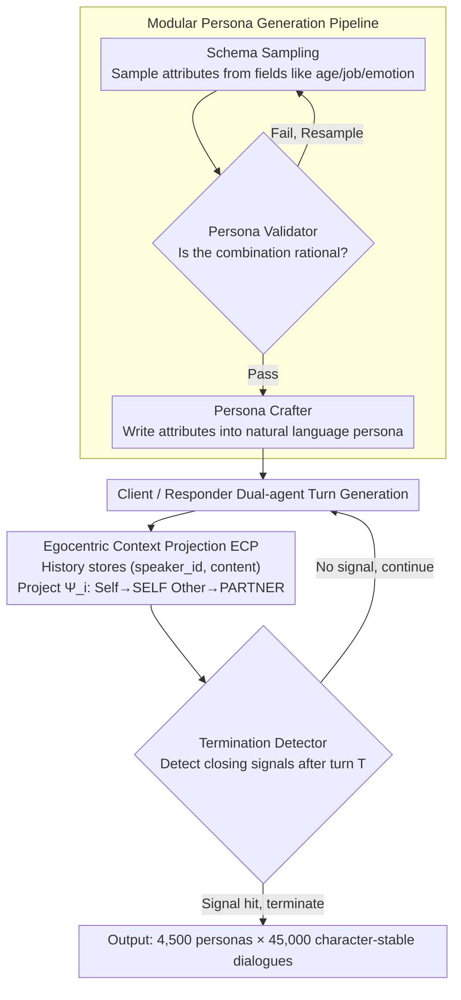

# SPASM: Stable Persona-driven Agent Simulation for Multi-turn Dialogue Generation

**Conference**: ACL 2026 Findings  
**arXiv**: [2604.09212](https://arxiv.org/abs/2604.09212)  
**Code**: [GitHub](https://github.com/lhannnn/SPASM)  
**Area**: Dialogue Systems  
**Keywords**: Persona-driven Dialogue, Multi-turn Simulation, Character Drift, Egocentric Projection, Data Generation

## TL;DR

This paper proposes SPASM, a stability-centric persona-driven multi-turn dialogue simulation framework. Through modular persona generation, Egocentric Context Projection (ECP), and termination detection, it significantly reduces character drift and "echo" effects in LLM-LLM dialogues, constructing a high-quality dataset of 45,000 multi-turn dialogues.

## Background & Motivation

**Background**: LLMs are widely deployed in multi-turn interaction scenarios such as tutoring, support, and consulting. LLM-LLM dialogue simulation is an efficient way to generate large-scale training/evaluation data, being more cost-effective and controllable than human collection.

**Limitations of Prior Work**: Long LLM-LLM dialogues accumulate identity-related failures—persona drift (characters gradually deviating from assigned identities), role confusion, and the "echo" effect (one agent progressively mimicking the language and stance of another). These issues worsen as dialogues lengthen, leading to generated dialogues that no longer match the intended settings and polluting synthetic datasets.

**Key Challenge**: The root cause is the naive concatenation of dialogue history—the same utterance may hold different relative roles (user vs. assistant) for different agents, leading to role confusion and feedback loops.

**Goal**: Design a "stability-first" dialogue simulation framework that ensures long-term character consistency without modifying model weights.

**Key Insight**: Address the problem by changing the **representation** of dialogue history rather than the model itself—storing history in a perspective-agnostic format and deterministically projecting it into each agent's egocentric perspective during generation.

**Core Idea**: Egocentric Context Projection (ECP): Dialogue history is stored as $(speaker\_id, content)$. During generation, a role relabeling operator $\Psi_i$ maps speaker labels to SELF/PARTNER, ensuring each agent always perceives the dialogue from its own perspective.

## Method

### Overall Architecture

SPASM aims to resolve the gradual collapse of characters in long LLM-LLM dialogues. Its starting point is not modifying model weights but changing the "representation" of dialogue history. The pipeline orchestrates five training-free components: first, the Persona Schema samples persona attributes from predefined fields; the Persona Validator verifies the rationality of combinations; and the Persona Crafter writes attributes into natural language persona descriptions. This is followed by a Client-Responder dual-agent dialogue simulation, where each agent's history is relabeled via Egocentric Context Projection (ECP). Finally, a Termination Detector stops the dialogue upon detecting natural closing signals. The input is a sampled persona combination, the intermediate is a perspective-agnostic history, and the output is a character-stable, naturally concluded multi-turn dialogue.

### Key Designs

**1. Modular Persona Generation Pipeline: Three steps of Sampling, Validation, and Refinement to ensure persona credibility**

Directly concatenating randomly sampled attributes easily results in nonsensical combinations (e.g., "18-year-old student + pension planning"), polluting the dataset. SPASM splits persona generation into three steps: Schema Sampling randomly selects fields like age, occupation, location, emotional state, and behavior patterns; the Validator checks the coherence and rationality of these attributes, necessitating re-sampling if they fail; the Crafter then writes the validated attributes into a coherent natural language description, potentially adding extra details. The validator and crafter ensure both diversity and the prevention of implausible attribute combinations.

**2. Egocentric Context Projection (ECP): Eradicating role confusion with symmetric SELF/PARTNER representations**

ECP is the most critical design of the paper. The fixed assignment of user/assistant labels in naive concatenation is the root cause of role confusion and the "echo" effect—the same utterance should occupy different relative roles for different agents, and forcing absolute labels makes one party gradually mimic the other. ECP stores dialogue history as a perspective-agnostic sequence $\mathcal{H}_t = (u_k)_{k=1}^t$, where each $u_k = (s_k, c_k)$ only records speaker ID and content. When agent $i$ needs to generate, a projection operator $\Psi_i(\mathcal{H}_t) = ((\phi_i(s_k), c_k))_{k=1}^t$ deterministically maps absolute speakers to relative roles, labeling its own utterances as SELF and the other's as PARTNER. This decouples role labels from agent identity, allowing each agent to view the entire dialogue from its own perspective and stabilizing long-term consistency. In ablation studies, ECP nearly eliminated the echo effect and significantly reduced persona drift.

**3. Termination Detector: Stopping at natural conclusions to avoid hard truncation or infinite loops**

Hard truncation at fixed turns creates abrupt endings, while no limit might lead to infinite pleasantries. The Termination Detector activates after turn $T$, judging the presence of closing signals (e.g., expressing gratitude, farewells) based on the recent $m$ turns of history and predefined termination rules. Once a signal is hit, the dialogue ends. It ensures each generated interaction has a coherent, natural conclusion rather than being artificially cut off.

### Loss & Training

Completely training-free. All components are implemented through API calls without modifying model weights.

## Key Experimental Results

### Persona Retrieval Accuracy (Top-1 Acc)

| Client / Responder | Top-1 | Top-10 |
|-------------------|-------|--------|
| GPT / GPT | 0.96 | 1.00 |
| GPT / DeepSeek | 0.50 | 0.82 |
| DS / GPT | 0.99 | 1.00 |
| Qwen / Qwen | 0.98 | 1.00 |

### Ablation Study (ECP Effect)

| Metric | With ECP | Without ECP |
|------|-------|--------|
| Persona Drift | Significantly Lower | High |
| Echo Effect | Near Zero (Human Var.) | Frequent |
| Silhouette Score | High (0.60) | Low |

### Key Findings
- ECP is the most critical design: it significantly reduces persona drift and nearly eliminates the echo effect in human verification.
- Interaction between the same backbone models generates tighter persona clusters (GPT/GPT Silhouette=0.60 vs GPT/DS=0.10).
- The Responder model backbone dominates interaction geometry: with GPT as the Responder, clustering quality remains high regardless of the Client.
- Cross-model interactions mainly increase within-cluster variance rather than decreasing inter-cluster separation.
- Constructed a large-scale dataset of 4,500 personas × 45,000 dialogues.

## Highlights & Insights
- **The "minimal change, maximum effect" of ECP** is elegant: by simply changing the role label representation (user/assistant → SELF/PARTNER), long-term stability is significantly improved. This simple idea has profound implications—role representation is more critical than model capability.
- **The discovery that the Responder model dominates interaction geometry** is interesting: in persona-driven dialogues, the responder (not the initiator) determines the structure of the dialogue space, suggesting the "listener" has a greater impact on interaction quality than the "speaker".
- **The persona validation step** avoids irrational combinations, making the dataset more credible—a practice worth promoting in synthetic data generation.

## Limitations & Future Work
- Only English dialogues were verified; effectiveness in multilingual scenarios is unknown.
- Persona attribute fields are predefined and may not cover all application scenarios.
- Maximum dialogue length is limited to 25 turns/agent; stability in longer dialogues is untested.
- The effect of using generated data for downstream SFT training was not evaluated.
- The extension of ECP to multi-agent (>2) scenarios is theoretically feasible but unverified.

## Related Work & Insights
- **vs Self-Chat/RolePlay**: These methods use simple dialogue history concatenation; SPASM solves long-term character consistency via ECP.
- **vs Generative Agents (Park et al.)**: Focuses on memory and behavior simulation; SPASM focuses on dialogue data generation and identity stability.
- **vs Instruction Drift Research (Li et al.)**: This work extends similar metrics to persona-driven dialogue generation scenarios.

## Rating
- Novelty: ⭐⭐⭐⭐ ECP is simple yet effective; persona stability analysis is in-depth.
- Experimental Thoroughness: ⭐⭐⭐⭐ 9 backbone combinations, 45K dialogues, multi-dimensional analysis.
- Writing Quality: ⭐⭐⭐⭐ Clear formalization and thorough analysis.
- Value: ⭐⭐⭐⭐ Provides a practical stability solution for LLM dialogue data generation.

<!-- RELATED:START -->

## Related Papers

- [\[ICML 2026\] Context-Driven Incremental Compression for Multi-Turn Dialogue Generation](../../ICML2026/dialogue/context-driven_incremental_compression_for_multi-turn_dialogue_generation.md)
- [\[ACL 2026\] GenesisFunc: Multi-Agent Data Generation for Accurate and Generalizable Function-Calling](genesisfunc_multi-agent_data_generation_for_accurate_and_generalizable_function-.md)
- [\[ACL 2026\] ETHICMIND: A Risk-Aware Framework for Ethical-Emotional Alignment in Multi-Turn Dialogue](ethicmind_a_risk-aware_framework_for_ethical-emotional_alignment_in_multi-turn_d.md)
- [\[ACL 2026\] Discourse Coherence and Response-Guided Context Rewriting for Multi-Party Dialogue Generation](discourse_coherence_and_response-guided_context_rewriting_for_multi-party_dialog.md)
- [\[ACL 2026\] Context-Agent: Dynamic Discourse Trees for Non-Linear Dialogue](context-agent_dynamic_discourse_trees_for_non-linear_dialogue.md)

<!-- RELATED:END -->
