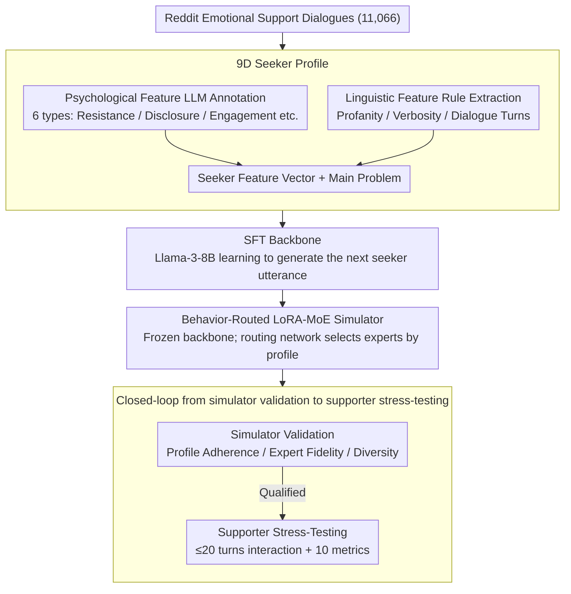

# Stress-Testing Emotional Support Models: Moving from Homogeneous to Diverse Help Seekers

**Conference**: ACL2026 Findings  
**arXiv**: [2601.07698](https://arxiv.org/abs/2601.07698)  
**Code**: None  
**Area**: Emotional Support Dialogue / Dialogue Evaluation / User Simulation  
**Keywords**: Emotional Support Models, Seeker Simulator, Controllable Evaluation, MoE Routing, Stress-Testing  

## TL;DR
This paper constructs nine-dimensional seeker profiles using Reddit emotional support dialogues and trains a controllable seeker simulator using LoRA-MoE with behavioral routing. This enables interactive stress-testing of emotional support models on more realistic, difficult, and diverse seeker populations.

## Background & Motivation
**Background**: Emotional support dialogue models have evolved from single-turn empathetic responses toward multi-turn interactive systems. Evaluation increasingly relies on seeker simulators: letting a simulated seeker converse with a supporter model and scoring based on metrics such as empathy, comfort, suggestions, and coherence.

**Limitations of Prior Work**: Mainstream simulators often generate "cooperative" seekers who are compliant, open, and clear-spoken, acting as idealized test users. Such evaluations overestimate the actual capabilities of supporters, as real seekers may be silent, resistant, off-topic, emotionally volatile, or disclose insufficient information, even rejecting the supporter's suggestions.

**Key Challenge**: Emotional support systems most critically need to maintain performance when interacting with difficult users. However, existing evaluations lack control variables for "population differences." With only an average seeker, it is difficult to determine whether a model lacks empathy overall or specifically fails with populations characterized by high resistance, low disclosure, or low engagement.

**Goal**: The objective is not to train another comforting supporter model but to create a more credible stress-testing environment. Specifically, the framework must construct various seeker profiles, consistently maintain profile behaviors, generate realistic multi-turn dialogues, and expose performance variances of the same supporter under different seeker populations.

**Key Insight**: This work collects real interactions from Reddit online support groups and decomposes seeker behavior into psychological and linguistic features, using these structured features as generation control signals. This approach is more reliable than simple persona prompting because it explicitly exposes psychological variables like "resistance level," "self-disclosure depth," and "engagement" to the model.

**Core Idea**: A LoRA-MoE seeker simulator is controlled by a nine-dimensional seeker profile, allowing expert routing to learn different seeker behavior subspaces. This is then used to generate diverse seeker-supporter interactions for evaluative stress-testing.

## Method
The methodology is divided into two layers: defining and labeling diverse seekers, and ensuring the model consistently portrays these seekers in multi-turn dialogues. 

The approach does not simply append role descriptions to prompts but rather transforms seeker behavioral profiles into learnable control interfaces.

### Overall Architecture
The input consists of real Reddit support dialogues, where each conversation is transformed into a seeker profile.

The profile includes nine categories of features: Psychological features (coping strategy, engagement level, resistance level, utterance style, self-disclosure level, seeker reaction distribution) and Linguistic features (verbosity level, profanity flag, total dialogue turns level).

Furthermore, each profile includes the seeker's main problem, summarized from the original Reddit posts.

During the training phase, standard SFT is performed on Llama-3-8B-Instruct to learn "generating the next seeker utterance given the profile and history."

Subsequently, the SFT backbone is frozen. Multiple LoRA experts are attached to the linear layers of the attention and FFN modules, and a shared routing network outputs dialogue-level routing weights based on the seeker feature vector.

In the inference and evaluation phase, given a specific seeker profile, the simulator interacts with a supporter model for up to 20 turns. The generated dialogues are then evaluated by automatic metrics for emotional support skills, general dialogue skills, and overall quality.

### Key Designs

**1. 9D Seeker Profile: Decomposing real seeker behavior into controllable and verifiable feature vectors**

Traditional persona prompts often describe only identity or situation but fail to control dimensions like "resistance to suggestions," "willingness to disclose," or "verbosity," which truly determine support difficulty. The authors extracted seeker behavior into nine categories from 11,066 Reddit dialogues. Psychological features are annotated by an LLM tagger, while linguistic features are rule-based—profanity is detected via `profanity-check`, verbosity is discretized by token count, and turn level is determined directly by the number of turns. This profile targets the interaction dimensions where support models are most likely to fail, exposing psychological variables that were previously hidden in text.

**2. Behavior-Routed LoRA-MoE Simulator: Decoupling profile control from text prompts to parameter subspaces**

Relying solely on prompts to feed profiles faces a recurring problem: as conversations lengthen, the history and system prompt dilute the profile signal. SFT models often revert to "polite, cooperative, and averaged" language patterns. The authors freeze an SFT backbone and attach multiple low-rank experts to each linear layer. A shared routing network maps the structured seeker feature vector to dialogue-level routing weights $\alpha$. The output of the linear layer thus becomes the original transformation plus the expert increment:

$$y = W x + \sum_i \alpha_i \, \Delta_i(x)$$

Expert semantics are not manually assigned but emerge naturally during the joint optimization of language modeling loss and routing. This shifts profile control to stable parameter subspaces, ensuring the persona remains consistent in long-range interactions.

**3. Closed-loop from Simulator Validation to Supporter Stress-Testing: Proving seeker fidelity before evaluation**

If a simulator is "diverse" but does not actually adhere to its profile, it introduces noise into the supporter ranking. Thus, the authors prioritize validation using profile adherence, expert fidelity, and diversity metrics. Only after confirming the simulator is controllable and diverse do they use 300 held-out profiles to generate interaction dialogues. The simulator also learns an `<|end_of_dialogue|>` token to control dialogue length. This "simulator first, stress-test second" sequence ensures exposed performance gaps stem from actual population difficulty rather than random noise.

### Loss & Training
The first stage involves standard next-token prediction, calculating language modeling loss only on the next seeker utterance. The configuration uses Llama-3-8B-Instruct with LoRA (rank 16) targeting all linear layers.

The second stage freezes the SFT backbone to train only the routing network and LoRA experts. The total objective includes language modeling loss plus training constraints for behavioral differentiation. For the contrastive baseline, a disentanglement loss based on pseudo-feature flipping was designed. The MoE model focuses on letting the router automatically select behavioral subspaces based on the profile, preserving the natural language distribution of Reddit while strengthening controllability over resistance, disclosure, and engagement.

## Key Experimental Results

### Main Results
Simulator profile adherence was measured by Macro F1. The authors compared prompt-based models, SFT, contrastive learning, and the proposed MoE.

| Simulator | Mean Macro F1↑ | Std Dev↓ | Min↑ | Max↑ |
| :--- | :--- | :--- | :--- | :--- |
| GPT-4.1-mini | 0.301 | 0.131 | 0.160 | 0.580 |
| Llama-3-8B-Instruct | 0.259 | 0.148 | 0.110 | 0.580 |
| Qwen-2.5-14B-Instruct | 0.284 | 0.095 | 0.150 | 0.470 |
| GPT-5 | 0.319 | 0.216 | 0.150 | 0.840 |
| DeepSeek-V3.2 | 0.431 | 0.218 | 0.180 | 0.910 |
| SFT | 0.515 | 0.160 | 0.360 | 0.760 |
| Contrastive Learning | 0.484 | 0.178 | 0.340 | 0.850 |
| **Ours** | **0.549** | **0.125** | **0.430** | **0.740** |

These results indicate that general LLMs cannot stably adhere to seeker profiles. MoE achieves the best mean and minimum scores, demonstrating its robustness on difficult profiles. Expert evaluation further compared the simulator against existing benchmarks on language naturalness, character realism, and psychological plausibility.

| Comparison | Language Naturalness Win/Loss/Tie | Character Realism Win/Loss/Tie | Psychological Plausibility Win/Loss/Tie |
| :--- | :--- | :--- | :--- |
| **Ours** vs. Eeyore | 62 / 19 / 9 | 60 / 20 / 10 | 64 / 13 / 13 |
| **Ours** vs. ESC-Judge | 62 / 18 / 10 | 65 / 19 / 6 | 56 / 14 / 20 |
| **Ours** vs. ESC-Role | 72 / 9 / 9 | 61 / 16 / 13 | 61 / 12 / 17 |

In supporter evaluations, the proposed simulator yields lower and more discriminative scores, suggesting it generates test samples closer to real-world difficult interactions.

| Supporter | Seeker Simulator | Identification | Comforting | Suggestions | Informativeness | Overall |
| :--- | :--- | :--- | :--- | :--- | :--- | :--- |
| GPT-5-mini | ESC-Judge | 4.980 | 4.977 | 4.070 | 3.853 | 5.000 |
| GPT-5-mini | **Ours** | 4.410 | 4.477 | 2.820 | 2.393 | 4.853 |
| Llama-ESConv| ESC-Judge | 4.000 | 4.267 | 3.203 | 2.717 | 4.827 |
| Llama-ESConv| **Ours** | 3.390 | 3.150 | 2.303 | 1.807 | 3.887 |

### Ablation Study
The paper uses baseline families and routing analysis to explain the gains from MoE.

| Configuration / Analysis | Key Metrics | Description |
| :--- | :--- | :--- |
| SFT | Macro F1 0.515 | Learns Reddit style but lacks controllability over fine-grained profiles. |
| Contrastive Learning | Macro F1 0.484 | Enhances differentiation via pseudo-feature perturbation but is less stable than behavioral routing. |
| **Ours** MoE | Macro F1 0.549 | Achieves highest profile adherence by routing to diverse low-rank experts. |
| Routing analysis | res. 0.37→0.43, disclosure 0.40→0.45 | MoE specifically improves psychological dimensions difficult for SFT to control. |
| Parameter Cost | ~15,881 params for router | Control benefits stem from expert structural routing rather than model scaling. |

### Key Findings
- MoE advantages are most prominent in "hard-to-control" behaviors, particularly resistance levels and self-disclosure depth, which are exactly the dimensions emotional support systems need to be tested on.
- Strong general models playing a seeker zero-shot show high variance; their stability is inferior to trained simulators, implying profile adherence cannot be solved by model scale alone.
- This seeker simulator causes a general decline in supporter scores, especially in suggestions and informativeness, indicating that traditional simulators may allow models to achieve inflated scores on overly cooperative users.
- Expert routing exhibits interpretable differentiation, such as collaborative/open vs. reclusive modes, suggesting MoE forms distinct regions in the behavioral space.

## Highlights & Insights
- Transforming "seeker diversity" from an abstract concept into a nine-dimensional profile is highly practical. It allows emotional support evaluation to be sliced by population, similar to fairness audits.
- Using a structured feature vector to control MoE experts rather than packing all instructions into a system prompt is an excellent design for long dialogues. Routing remains stable even when text prompts are overwhelmed by history.
- The insistence on validating the simulator before evaluating the supporter makes the signal more credible. 
- This framework is transferable to medical consultations, educational tutoring, and customer complaints. Any domain where goal-oriented "difficult users" can be defined can leverage this for pre-deployment stress-testing.

## Limitations & Future Work
- Data is sourced from Reddit, which differs from clinical counseling or crisis intervention; the profile distribution may not represent all real-world seekers.
- Automatic evaluation depends on LLM judges. While correlation checks were performed, automatic scores cannot fully replace clinical experts or long-term therapeutic outcomes.
- MoE requires open-weight models and training adapters, which is less accessible for teams relying solely on closed-source APIs.
- The 9D profile may still omit variables like age, cultural background, trauma history, or help-seeking stages.
- Future work could develop interactive population configuration tools to automatically generate test sets and failure reports based on selected user groups.

## Related Work & Insights
- **vs. ESC-Eval / ESC-Judge**: These works advanced simulator-based evaluation but relied on fixed personas or prompt-based roleplay. This paper emphasizes fine-grained control and behavioral diversity for stress-testing.
- **vs. ESC-Role / Eeyore**: These have attempted trained seeker models but often remain at surface-level personas. This work uses systematic 9D profiles and MoE routing for sustained behavioral control.
- **Insights for Dialogue Evaluation**: A model performing well on "cooperative users" does not guarantee success with real users. Future evaluations should report performance across population slices (worst-case slices) rather than just global averages.

## Rating
- Novelty: ⭐⭐⭐⭐☆ Using MoE routing for profile control is not entirely new, but its application for emotional support stress-testing is highly targeted.
- Experimental Thoroughness: ⭐⭐⭐⭐☆ Comprehensive validation across simulator fidelity, expert human review, and supporter stress-testing, though clinical external validation is still limited.
- Writing Quality: ⭐⭐⭐⭐☆ Clear structure and a strong experimental loop.
- Value: ⭐⭐⭐⭐⭐ Highly valuable for pre-deployment testing of emotional support models; provides a reusable paradigm for user simulator validation.

<!-- RELATED:START -->

## Related Papers

- [\[ACL 2026\] Cognitive Policy-Driven LLM for Diagnosis and Intervention of Cognitive Distortions in Emotional Support Conversation](cognitive_policy-driven_llm_for_diagnosis_and_intervention_of_cognitive_distorti.md)
- [\[ACL 2025\] Dialogue Systems for Emotional Support via Value Reinforcement](../../ACL2025/dialogue/dialogue_systems_for_emotional_support_via_value_reinforcement.md)
- [\[ACL 2026\] LOCKET: Robust Feature-Locking Technique for Language Models](locket_robust_feature-locking_technique_for_language_models.md)
- [\[ACL 2026\] ETHICMIND: A Risk-Aware Framework for Ethical-Emotional Alignment in Multi-Turn Dialogue](ethicmind_a_risk-aware_framework_for_ethical-emotional_alignment_in_multi-turn_d.md)
- [\[ACL 2026\] MA$^2$P: A Meta-Cognitive Autonomous Intelligent Agents Framework for Complex Persuasion](ma2p_a_meta-cognitive_autonomous_intelligent_agents_framework_for_complex_persua.md)

<!-- RELATED:END -->
