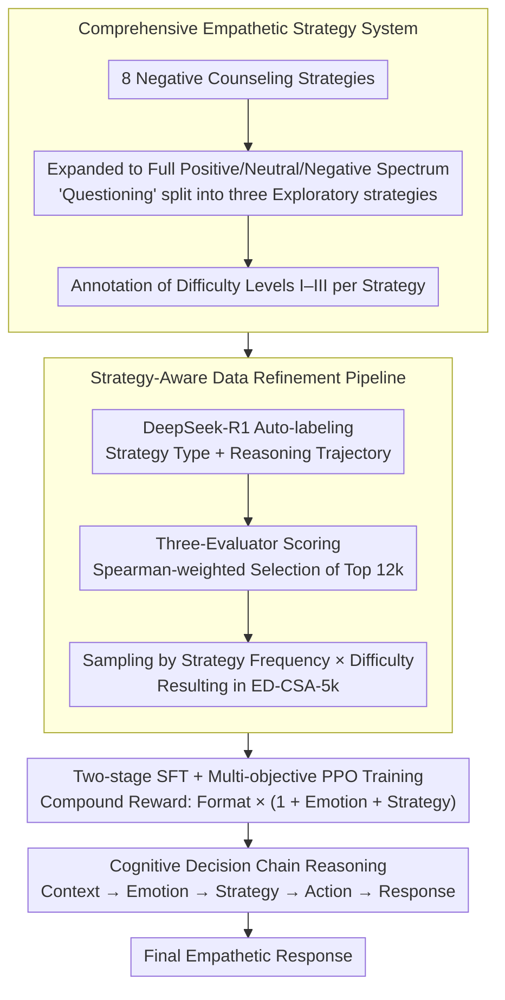

# STRIDE-ED: A Strategy-Grounded Stepwise Reasoning Framework for Empathetic Dialogue Systems

**Conference**: ACL 2026  
**arXiv**: [2604.07100](https://arxiv.org/abs/2604.07100)  
**Code**: [https://github.com/jicoder-nwpu/STRIDE-ED](https://github.com/jicoder-nwpu/STRIDE-ED)  
**Area**: Reinforcement Learning  
**Keywords**: Empathetic Dialogue, Strategy-Grounded Reasoning, Chain-of-Thought, Multi-Objective Reinforcement Learning, Data Refinement

## TL;DR
This paper proposes the STRIDE-ED framework, which constructs a comprehensive empathetic strategy system covering positive/neutral/negative emotions. By designing task-aligned multi-stage cognitive CoT reasoning combined with strategy-aware data refinement and a two-stage SFT+PPO training paradigm, it achieves SOTA performance in empathetic dialogue across multiple open-source LLMs, reaching an emotion accuracy of 57.25% and a BLEU-4 of 4.67.

## Background & Motivation

**Background**: Empathetic dialogue is a core capability of social AI, requiring models to not only identify user emotions but also provide strategic, context-sensitive responses. Early work enhanced emotional understanding through external commonsense knowledge graphs (e.g., ATOMIC), while recent research has shifted towards using CoT prompting in LLMs to explicitly model the reasoning process.

**Limitations of Prior Work**: (1) Incomplete strategy coverage—existing strategy systems (e.g., the 8 strategies from Liu et al. 2021) target only counseling scenarios for negative emotions, ignoring positive and neutral emotions; (2) Lack of task alignment in reasoning—although CoT methods are structurally formal, the reasoning steps are often superficial and lack explicit alignment with the empathetic decision-making process; (3) Insufficient strategy-aware supervision—training data lacks high-quality annotations aligned with strategic reasoning.

**Key Challenge**: Empathetic dialogue is essentially a multi-stage cognitive decision-making process (context understanding $\to$ emotion recognition $\to$ strategy selection $\to$ action reasoning $\to$ response generation). However, existing methods either implicitly skip intermediate steps or use generic CoT without task specialization.

**Goal**: (1) Build an empathetic strategy system covering the full emotional spectrum; (2) Design a multi-stage reasoning framework aligned with cognitive processes; (3) Establish a strategy-aware data refinement pipeline and training paradigm.

**Key Insight**: Grounded in cognitive psychology, empathetic response generation is modeled as a progressive cognitive chain: "Context Summary $\to$ Emotion Recognition $\to$ Strategy Inference $\to$ Action Reasoning $\to$ Response Generation," with explicit outputs and constraints at each step.

**Core Idea**: Support structured reasoning with a comprehensive strategy system, ensure training quality with strategy-aware data refinement, and align three dimensions—emotion, strategy, and format—using multi-objective RL.

## Method

### Overall Architecture

STRIDE-ED treats empathetic response generation as a progressive cognitive decision chain. Taking the dialogue history $\mathcal{C}$ as input, the model does not directly output a response. Instead, it sequentially produces four internal intermediate results: context summary, emotional state, empathetic strategy, and strategy execution actions, before generating the final response $u_t$. Each intermediate step is wrapped in structured tags (`<Context>`, `<Emotion>`, `<Strategy>`, etc.), making the reasoning process interpretable and traversable by reward signals. To enable learning, the framework defines candidate strategies using a comprehensive empathetic strategy system. Then, a strategy-aware data refinement pipeline produces a high-quality, balanced training set. Finally, a two-stage training paradigm consisting of SFT followed by multi-objective PPO aligns the model across emotion, strategy, and format dimensions.

### Key Designs

**1. Comprehensive Empathetic Strategy System: Expanding Strategies to the Full Emotional Spectrum**

Existing strategy systems (e.g., Liu et al. 2021) are designed only for negative emotion counseling. However, real-world dialogues involving positive emotions (e.g., sharing good news) also require empathy and different strategies. This work extends the original 8 strategies to cover positive, neutral, and negative emotions, and subdivides the vague "Questioning" strategy into three "Exploratory" strategies at different cognitive levels. The system spans dimensions such as emotional validation, active listening, cognitive restructuring, and action guidance. Furthermore, each strategy is annotated with a difficulty level (I–III) to reflect cognitive complexity, which is used to weight higher-order strategies during sampling to mitigate bias from simple strategies.

**2. Strategy-Aware Data Refinement Pipeline: Extracting High-Quality, Balanced Training Sets from Noisy Labels**

Directly using LLM-generated labels results in inconsistent quality and significant strategy imbalance. A three-step refinement is designed: first, DeepSeek-R1 is used to auto-label strategy types and reasoning trajectories in EMPATHETICDIALOGUES; second, three independent evaluators (DeepSeek-R1, Qwen3, Llama-3.1) score the labels, with the top 12k samples selected via Spearman correlation weighting; finally, sampling is conducted based on the joint distribution of "Strategy Frequency × Difficulty Weight" to produce the 5k refined set, ED-CSA-5k. This ensures both quality and the inclusion of complex strategies.

**3. SFT + Multi-objective PPO Training: Reasoning Proficiency followed by Three-Dimensional Alignment**

The SFT stage mixes the refined data with strategy labels and original data without labels, teaching the model explicit strategic reasoning while maintaining general response capabilities. Since SFT only mimics demonstrations, it struggles with out-of-distribution strategy choices. The PPO stage follows, using a compound reward $R = r_{\text{format}} \cdot (1 + r_{\text{emotion}} + r_{\text{strategy}})$. The multiplicative structure makes the format reward $r_{\text{format}}$ a gating factor; if the structured tags are incorrect, the total reward becomes zero. Emotion and strategy rewards are additive, guiding the model to align with these dimensions once the format is valid.

### Loss & Training

Standard negative log-likelihood loss is used in the SFT stage. The PPO stage utilizes Proximal Policy Optimization with a reward composed of three binary rewards (Format × (1 + Emotion + Strategy)). The initial learning rate is 1e-4, batch size is 16, and sequence length is 2048.

### Execution Example

If a user says "I finally got the offer!"—a positive emotion statement outside previous systems—STRIDE-ED summarizes the situation in `<Context>`, identifies "Excitement/Pride" in `<Emotion>`, selects a higher-order "Positive Resonance + Guide Celebration" strategy in `<Strategy>`, infers execution actions (affirming effort, inviting details), and generates the final response. Each step uses structured tags, which PPO rewards verify segment by segment.

## Key Experimental Results

### Main Results (EMPATHETICDIALOGUES Dataset)

| Model | B-1 | B-4 | Acc_emo | D-2 | PPL |
|------|-----|-----|---------|-----|-----|
| MoEL | 18.02 | 2.73 | 31.02 | 1.76 | 36.81 |
| CAB | 20.23 | 3.01 | 40.52 | 2.95 | 35.06 |
| ReflectDiffu | 23.59 | 3.62 | 48.76 | 4.35 | 24.56 |
| **Ours** | **24.54** | **4.67** | **57.25** | **13.63** | **10.50** |
| Gain vs ReflectDiffu | ↑4.0% | ↑29.0% | ↑17.4% | ↑213% | ↓57.2% |

### Ablation Study

| Configuration | B-1 | Acc_emo | D-2 | PPL | Description |
|------|-----|---------|-----|-----|------|
| Full | 24.66 | 57.57 | 13.68 | 9.26 | Complete model |
| w/o emotion | 23.58 | - | 13.66 | 10.47 | Removes emotion reasoning |
| w/o sum | 22.91 | 54.14 | 13.42 | 7.78 | Removes context summary |
| w/o strategy | 22.44 | 54.58 | 15.09 | 6.98 | Removes strategy (Diversity ↑ but uncontrolled) |
| w/o CoT | 22.55 | - | 13.26 | 8.64 | Removes structured reasoning |
| w/o Refine+Sampling | 22.22 | 55.93 | 15.25 | 11.86 | Largest performance drop |
| w/o PPO | 23.52 | 54.48 | 14.76 | 2.03 | Lower PPL but poor alignment |

### Key Findings
- Removing strategy reasoning increases diversity (D-2 from 13.68 $\to$ 15.09) but decreases B-1 and emotion accuracy, indicating that models without strategic constraints are more random and less controllable.
- Data refinement and sampling are the most critical components; their removal leads to a significant decrease across all metrics.
- PPO has the largest impact on PPL (2.03 $\to$ 9.26), suggesting the RL phase sacrifices some fluency to achieve alignment with format/emotion/strategy constraints.
- The framework generalizes across multiple open-source LLMs (Qwen3-0.6B/4B, Llama3.2-3B, etc.).

## Highlights & Insights
- **Cognitive Psychology-Driven Multi-stage Reasoning**: The design (Summary $\to$ Emotion $\to$ Strategy $\to$ Action $\to$ Response) is natural and provides explicit, interpretable outputs for each step.
- **Strategy-Aware Sampling**: This effectively addresses data imbalance by ensuring high-order, difficult strategies are sufficiently represented in the training set.
- **Gated Reward Function**: The "gating" design for the compound reward—where format validity is a prerequisite—is a robust strategy for RL alignment in structured tasks.

## Limitations & Future Work
- The strategy system is built on EMPATHETICDIALOGUES and may not generalize to other cultures or domains (e.g., medical consultation).
- Auto-labeling depends on DeepSeek-R1's reasoning quality; labeling errors can propagate through the refinement pipeline.
- Human evaluation was limited to 1,000 dialogue turns.
- Strategic consistency in multi-turn dialogues was not explored; current reasoning is turn-independent.

## Related Work & Insights
- **vs ReflectDiffu (Yuan et al. 2025)**: While ReflectDiffu uses diffusion models for generation quality, STRIDE-ED focuses on strategy-driven reasoning, improving emotion accuracy by 17.4%.
- **vs CAB (Gao et al. 2023)**: CAB models cognitive appraisal and behavior tendencies but lacks a comprehensive strategy system and data refinement; STRIDE-ED offers more systematic strategy coverage and quality control.

## Rating
- Novelty: ⭐⭐⭐⭐ Combination of extended strategy system, multi-stage CoT, and strategy-aware refinement.
- Experimental Thoroughness: ⭐⭐⭐⭐⭐ Comprehensive automatic and human evaluations, detailed ablation, and multi-model verification.
- Writing Quality: ⭐⭐⭐⭐ Clear architectural diagrams and detailed methodology, though notation is slightly dense.

<!-- RELATED:START -->

## Related Papers

- [\[ACL 2026\] Metro: Towards Strategy Induction from Expert Dialogue Transcripts for Non-collaborative Dialogues](metro_towards_strategy_induction_from_expert_dialogue_transcripts_for_non-collab.md)
- [\[ACL 2026\] Reasoning Gets Harder for LLMs Inside A Dialogue](reasoning_gets_harder_for_llms_inside_a_dialogue.md)
- [\[ACL 2026\] CoDial: Interpretable Task-Oriented Dialogue Systems Through Dialogue Flow Alignment](codial_interpretable_task-oriented_dialogue_systems_through_dialogue_flow_alignm.md)
- [\[ACL 2025\] ReflectDiffu: Reflect between Emotion-intent Contagion and Mimicry for Empathetic Response Generation via a RL-Diffusion Framework](../../ACL2025/dialogue/reflectdiffu_empathetic_response.md)
- [\[ACL 2026\] ETHICMIND: A Risk-Aware Framework for Ethical-Emotional Alignment in Multi-Turn Dialogue](ethicmind_a_risk-aware_framework_for_ethical-emotional_alignment_in_multi-turn_d.md)

<!-- RELATED:END -->
