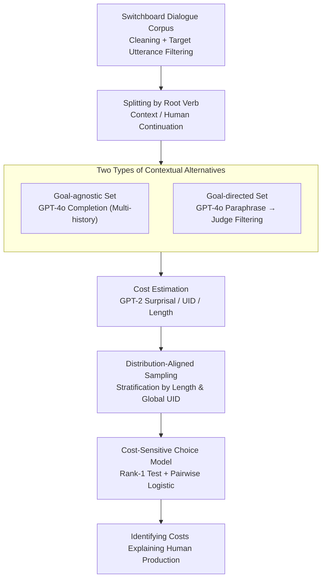

# Surprisal Minimisation over Goal-directed Alternatives Predicts Production Choice in Dialogue

**Conference**: ACL2026  
**arXiv**: [2605.00506](https://arxiv.org/abs/2605.00506)  
**Code**: None  
**Area**: Dialogue Modeling / Psycholinguistics / Information-theoretic Language Production  
**Keywords**: surprisal, goal-directed alternatives, language production, UID, dialogue corpora  

## TL;DR
This paper models utterance generation in natural dialogue as a cost-sensitive choice among contextual alternatives. It finds that minimizing surprisal relative to "goal-directed alternatives" (sharing the same communicative goal) best predicts actual human continuations.

## Background & Motivation
**Background**: In language comprehension, surprisal is used to explain reading times, eye movements, brain imaging, and processing load. In language production, the UID hypothesis and length costs explain why speakers choose specific expressions.

**Limitations of Prior Work**: Many information-theoretic analyses focus solely on observed utterances without identifying the alternatives available to the speaker. Without an alternative set, it is difficult to determine if a sentence was chosen for "low cost" or if it simply appeared by chance.

**Key Challenge**: Production choice must be defined relative to a candidate set, but natural dialogue involves an open-ended generation space. Traditional models either study small sets of syntactic variants or define alternatives too narrowly, failing to cover the expressions speakers actually consider.

**Goal**: The authors aim to use language models to generate open-ended alternatives, distinguishing between two types: goal-agnostic alternatives representing plausible continuations for the listener, and goal-directed alternatives representing paraphrases the speaker could use to achieve the same goal.

**Key Insight**: If a cost metric truly characterizes language production, it should favor human choices within the same communicative goal; if it reflects listener comprehension pressure, it should be more prominent in goal-agnostic alternatives.

**Core Idea**: Generate goal-directed and goal-agnostic alternatives using LMs and compare whether human continuations have lower surprisal, UID, or length costs than these alternatives.

## Method
The key contribution is redefining "production choice" as an experimental framework with a candidate set, cost functions, and probabilistic choice rules.

The crucial distinction is that in the same context, the listener does not know the speaker's intent, while the speaker knows their communicative goal. Therefore, alternatives explaining speaker choice should maintain the same goal.

### Overall Architecture
The study utilizes the Switchboard Dialogue Act Corpus (natural spoken dialogue). 

Transcripts are cleaned of backchannels, pauses, and disfluencies. Target utterances are restricted to 10-30 words, categorized as statements or questions, following an interlocutor's turn. 

Each utterance is split into context and continuation: the root verb serves as the choice point; the root verb and preceding tokens form the context, and the following tokens are the human continuation.

The final analysis set includes 309 contexts, 309 observed human continuations, and 12,360 generated continuations.

GPT-2 Small estimates cost via surprisal. GPT-4o generates goal-agnostic alternatives (completions under varying histories) and goal-directed alternatives (constrained paraphrases). 

A GPT-4o judge filters paraphrases (98.75% accuracy in human sampling). To avoid generation bias, authors use stratified sampling to align the length and global UID distributions of generated alternatives with human data.

A pairwise logistic choice model tests if cost differences predict human preferences.

### Key Designs

**1. Two Types of Contextual Alternatives: Separating Producer and Listener Perspectives**

Previous analyses lacked explicit alternatives. The authors split the candidate set: goal-agnostic sets $A_c$ (conditioned on context $c$) represent listener expectations, while goal-directed sets $A_{c,g}$ (conditioned on $c$ and goal $g$) represent paraphrases with semantic equivalence to the human choice. Lower surprisal in $A_{c,g}$ suggests the speaker chose an efficient form to express a specific meaning.

**2. Cost-Sensitive Choice Model: Probabilistic Hypothesis for Human Choice**

The production probability of a candidate follows an exponential relationship with its utility (utility = constant - cost):

$$P_S(a \mid c, g) \;\propto\; \exp\!\big(-\alpha\, C(a; c)\big)$$

As cost $C$ decreases, selection probability increases. This links deterministic rank analysis with probabilistic logistic analysis.

**3. Stratified Sampling of Alternatives: Preventing Generation Bias**

LMs may inherently favor shorter or smoother sentences. Since generated pools differed significantly from human data in length and global UID, authors used stratified sampling to match the distribution of the generated pool to human data, ensuring comparisons reflect contextual preferences rather than global bias.

### Loss & Training
No new models were trained. GPT-2 Small provides surprisal. Four cost functions are analyzed:

1. **Surprisal**: Negative log-probability of the continuation given context and history.
2. **Local UID (Uniform Information Density)**: Mean squared difference of surprisal between adjacent words.
3. **Global UID**: Variance of surprisal across the entire sentence.
4. **Length**: Word count of the continuation.

Statistical methods include Poisson-binomial rank-1 tests and pairwise logistic choice models.

## Key Experimental Results

### Main Results
Deterministic cost minimization results for human continuations across alternatives:

| Cost | Goal-directed rank-1 | Goal-agnostic rank-1 | Uniform baseline |
|------|----------------------|----------------------|------------------|
| Surprisal | 53.4% | 15.2% | 16.5% / 7.2% |
| Local uniformity | 34.1% | 16.2% | 16.5% / 7.2% |
| Global uniformity | 24.1% | 19.3% | 16.5% / 7.2% |
| Length | 28.6% | 26.6% | 16.5% / 7.2% |

Surprisal in goal-directed alternatives is the strongest predictor (53.4% rank-1), 3.24x the baseline. The pairwise logistic model shows surprisal is significantly negative, with the effect in goal-directed conditions being ~7x stronger than in goal-agnostic conditions.

### Ablation Study
T-tests confirm that human continuations have significantly lower surprisal than alternatives:

| Analysis | Goal-directed | Goal-agnostic | Explanation |
|------|---------------|---------------|------|
| Surprisal t-test | t=-32.48, p<1e-8 | t=-8.23, p<1e-8 | Human surprisal significantly lower than alts |
| Local UID t-test | t=-13.37, p<1e-8 | t=10.57, p=1.00 | UID only follows prediction in goal-directed |
| Global UID t-test | t=-12.11, p<1e-8 | t=26.48, p=1.00 | Direction reverses in goal-agnostic |

### Key Findings
- Surprisal relative to goal-directed alternatives is the strongest predictor, supporting the idea that speakers prefer conventional, easy-to-generate expressions for a given goal.
- UID predictability depends on the alternative set and is less stable than surprisal.
- Length has some predictive power in goal-agnostic sets but fails to explain choice among paraphrases.
- LM-generated alternatives enable testing open-ended dialogue production if controlled for distribution bias.

## Highlights & Insights
- The distinction between goal-directed and goal-agnostic sets resolves ambiguity in previous production research.
- LLMs are used as a toolchain (generator, estimator, judge) rather than being treated directly as cognitive models.
- Stratified sampling is essential to prevent global model biases from contaminating contextual findings.
- Suggests that NLG systems should optimize costs within a paraphrase set rather than just sampling from global high-probability text.

## Limitations & Future Work
- Focuses only on matrix verb choice points in English Switchboard; generalizability to other languages or syntactic structures is unknown.
- Costs are aggregate; future work could explore incremental weighting for tokens closer to the choice point.
- Reliability depends on GPT-4o's ability to maintain semantic equivalence in paraphrasing.
- Communicative effectiveness is not explicitly modeled due to the difficulty of defining success signals in natural dialogue.

## Related Work & Insights
- **vs UID**: Shows that UID's explanatory power is conditional and weaker than goal-directed surprisal.
- **vs RSA**: Extends the rational choice framework from discrete small action sets to open dialogue generation via LMs.
- **vs Comprehension**: Demonstrates that surprisal, traditionally a comprehension metric, has a speaker-oriented interpretation in goal-directed contexts.

## Rating
- Novelty: ⭐⭐⭐⭐☆
- Experimental Thoroughness: ⭐⭐⭐⭐☆
- Writing Quality: ⭐⭐⭐⭐⭐
- Value: ⭐⭐⭐⭐☆

<!-- RELATED:START -->

## Related Papers

- [\[ACL 2025\] Enhancing Goal-oriented Proactive Dialogue Systems via Consistency Reflection and Correction](../../ACL2025/dialogue/enhancing_goal-oriented_proactive_dialogue_systems_via_consistency_reflection_an.md)
- [\[ACL 2026\] ReacTOD: Bounded Neuro-Symbolic Agentic NLU for Zero-Shot Dialogue State Tracking](reactod_bounded_neuro-symbolic_agentic_nlu_for_zero-shot_dialogue_state_tracking.md)
- [\[ACL 2026\] CoDial: Interpretable Task-Oriented Dialogue Systems Through Dialogue Flow Alignment](codial_interpretable_task-oriented_dialogue_systems_through_dialogue_flow_alignm.md)
- [\[ACL 2026\] Reasoning Gets Harder for LLMs Inside A Dialogue](reasoning_gets_harder_for_llms_inside_a_dialogue.md)
- [\[ACL 2026\] Frame of Reference: Addressing the Challenges of Common Ground Representation in Dialogue](frame_of_reference_addressing_the_challenges_of_common_ground_representation_in_.md)

<!-- RELATED:END -->
