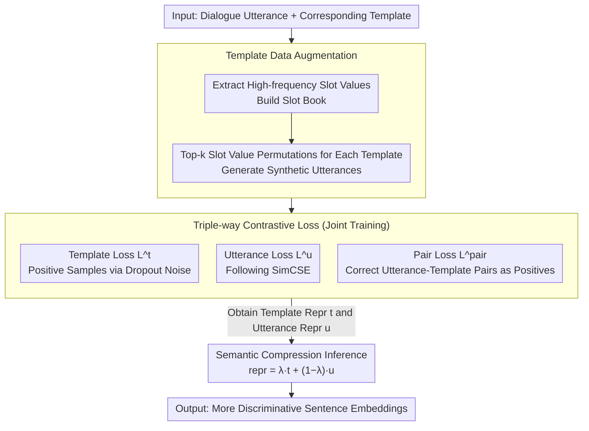

# Template-assisted Contrastive Learning of Task-oriented Dialogue Sentence Embeddings

**Conference**: ACL 2026  
**arXiv**: [2305.14299](https://arxiv.org/abs/2305.14299)  
**Code**: [GitHub](https://github.com/minsik-ai/Template-Contrastive-Embedding)  
**Area**: Dialogue Systems  
**Keywords**: Dialogue sentence embeddings, contrastive learning, template augmentation, intent classification, unsupervised representation learning

## TL;DR
The TaDSE framework is proposed to utilize existing template information in dialogues as auxiliary anchors. Through three stages—template-aware data augmentation, paired contrastive training, and semantic compression inference—it significantly improves the quality of task-oriented dialogue sentence embeddings in unsupervised settings, outperforming previous SOTA and even surpassing supervised commercial embedding models across five benchmarks.

## Background & Motivation

**Background**: Learning high-quality dialogue sentence embeddings is crucial for downstream tasks like intent classification and slot filling in low-resource scenarios. While existing unsupervised sentence embedding methods (e.g., SimCSE, PromptBERT) perform well on general text, their effectiveness drops significantly in the dialogue domain due to the specialized semantic structures between dialogue utterances.

**Limitations of Prior Work**: Obtaining utterance-level semantic relationship labels in the dialogue domain is extremely difficult, whereas token-level annotations (e.g., entities, slots, templates) are relatively easy to acquire. However, existing sentence embedding frameworks are sentence-level self-supervised frameworks that cannot utilize this rich token-level auxiliary knowledge. General data augmentation methods (e.g., back-translation, rule-based substitution) tend to introduce semantic drift or require additional model support.

**Key Challenge**: Dialogues contain a wealth of structured template information (a single template corresponds to multiple utterances with different expressions), but this utterance-template pairing relationship has never been utilized in embedding learning. Existing methods only perform contrastive learning within the utterance space, ignoring that templates can serve as semantic anchors to constrain the structure of the embedding space.

**Goal**: Design an unsupervised framework capable of utilizing template information to enhance dialogue sentence embeddings, making clusters of semantically similar utterances more compact and decision boundaries clearer.

**Key Insight**: The authors observe that templates represent the "semantic skeleton" of utterances—utterances under the same template share a core semantic structure and only differ in slot values. Introducing templates as auxiliary representations into contrastive learning can help the model learn to distinguish correct utterance-template pairs, thereby refining the embedding space.

**Core Idea**: Expand the diversity of utterance-template pairs through template-aware data augmentation, followed by joint training using a triple-way contrastive loss (template loss + utterance loss + pair loss). Finally, use semantic compression during inference to further optimize embeddings by fusing template representations.

## Method

### Overall Architecture

The core idea of TaDSE is to transform existing token-level structures—where "one template corresponds to multiple expressions"—into free supervision signals for sentence-level contrastive learning. Taking dialogue utterances and their corresponding templates as input, it first performs template-aware data augmentation to increase the diversity of utterance-template pairs. It then uses a set of triple-way contrastive losses to simultaneously sculpt template representations, utterance representations, and pair representations. Finally, during inference, template representations are fused back into utterance representations proportionally to output sentence embeddings with higher discriminative power. The entire pipeline does not rely on any utterance-level semantic labels and is purely unsupervised.

### Key Designs

**1. Template Data Augmentation: Feeding Paired Contrastive Learning with Slot Permutations**

For paired contrastive learning to be effective, there must be a sufficient diversity of utterance samples for each template. However, the original utterance/template ratio in datasets is often low, leading to sparse pairing signals. To address this, the authors extract slots (e.g., CITY, DEVICE) and their high-frequency values to build a Slot Book. They then perform top-k frequency slot value permutations for each template to generate natural synthetic utterances—for example, `Book a flight to {CITY}` can derive `Book a flight to Paris/Tokyo/London`.

A total of 834,000 augmented utterances were generated across five datasets, averaging 16 utterances per template. This significantly improved pairing diversity, providing the contrastive loss with enough positive and negative samples to learn fine-grained discriminative capabilities.

**2. Triple-way Contrastive Loss: Using Templates as Semantic Anchors for the Embedding Space**

Simple utterance-level contrast (like SimCSE) only operates within the utterance space and ignores structural template information. TaDSE therefore splits the loss into three parts: the template loss $L^t$ uses dropout noise to generate positive sample pairs and pulls together two encodings of the same template; the utterance loss $L^u$ follows the SimCSE approach to learn utterance representations; the pair loss $L^{pair}$ treats correct utterance-template pairs as positive samples and other utterances as negative samples, forcing the model to recognize semantically matching pairs. The three are jointly optimized as $L^{train} = L^t + \lambda^u L^u + \lambda^{pair} L^{pair}$.

The pair loss is the key to truly utilizing templates: it allows templates to act as semantic anchors, pulling together utterances from the same template and pushing apart those from different templates, thereby forming clearer semantic clusters and decision boundaries in the embedding space.

**3. Semantic Compression Inference: Proportionally Fusing Template Essences into Utterance Representations**

Templates can be viewed as the "semantic skeleton" of utterances. Integrating them appropriately can amplify discriminative power near decision boundaries, separating utterances that look similar but have different semantics. TaDSE constructs the final representation during the inference stage as $repr_i = \lambda^{comp} t_i + (1 - \lambda^{comp}) u_i$, where the mixing coefficient $\lambda^{comp}$ is tuned on the validation set.

This step is not just for inference enhancement; the optimal value of $\lambda^{comp}$ also serves as an analytical tool—it reflects the strength of the semantic correlation between templates and utterances in a given dataset, providing an interpretable window into the representation space.

### Loss & Training

The triple-way contrastive losses are all based on the InfoNCE framework, with negative samples sampled within the mini-batch and independent temperature hyperparameters $\tau_t$, $\tau_u$, and $\tau_{pair}$. The backbone is BERT-base based on SimCSE, using transfer learning, and intent classification is evaluated on the training set using kNN. Optionally, a trainable MLP layer $W_A$ is added to the template branch to adjust the dimensionality of template representations.

## Key Experimental Results

### Main Results

| Model | SNIPS | ATIS | MASSIVE | HWU64 | CLINC150 | Average |
|------|-------|------|---------|-------|----------|------|
| BERT | 80.00 | 78.05 | 41.86 | 50.84 | 33.35 | 56.82 |
| SimCSE | 91.71 | 85.67 | 76.77 | 81.08 | 71.00 | 81.25 |
| DSE | 95.86 | 87.01 | 76.77 | 79.28 | 70.16 | 81.82 |
| **TaDSE** | **97.00** | **89.70** | **78.18** | **82.77** | 70.56 | **83.64** |
| TaDSE w/ MLP | 96.29 | 89.14 | **79.15** | 82.29 | **72.49** | **83.87** |

Comparison with supervised commercial embeddings (TaDSE is unsupervised, with only 110M parameters):

| Model | SNIPS | ATIS | Average |
|------|-------|------|------|
| OpenAI-large | 98.57 | 84.77 | 91.67 |
| Gemini-001 | 98.29 | 86.00 | 92.15 |
| **TaDSE** | 97.00 | **89.70** | **93.35** |

### Ablation Study

| Configuration | SNIPS | ATIS | MASSIVE | CLINC150 |
|------|-------|------|---------|----------|
| w/o Augmentation (SimCSE) | 91.71 | 85.67 | 77.00 | 71.05 |
| + Augmentation | 93.29 | 86.00 | 77.37 | 70.98 |
| + $L^t$ | 95.29 | 88.47 | 78.58 | 71.53 |
| + $L^t$ + $L^{pair}$ | 96.14 | 89.59 | 79.39 | 72.98 |
| + $L^{t'}$ (MLP) + $L^{pair}$ | **97.00** | 88.69 | **79.83** | **73.45** |

### Key Findings
- The pair loss $L^{pair}$ contributes the most; introducing it alone on SNIPS improves results from 93.29 to 96.14 (+2.85%), proving the effectiveness of utterance-template pairing.
- The template loss $L^t$ itself also yields significant performance Gains (+2.0%~2.5%), indicating that salient semantic information in templates makes an independent contribution to embedding learning.
- Augmentation stability varies by dataset: SNIPS/ATIS improve continuously as the amount of augmentation increases (augmentation stable), while MASSIVE/CLINC150 may decline under high-order augmentation.
- Semantic compression consistently provides positive returns on augmentation-stable datasets (SNIPS +0.29%, ATIS +0.44%), validating the quality of template-utterance semantic alignment.

## Highlights & Insights
- The idea of using templates as semantic anchors is ingenious—transforming existing token-level annotations into auxiliary signals for sentence-level contrastive learning enables "free" supervision injection. This approach can be generalized to any domain with structured templates or schemas.
- Semantic compression testing is not just an inference enhancement method, but also an analytical tool—the optimal value of $\lambda^{comp}$ reflects the quality of template-utterance semantic alignment in the embedding space, providing an interpretable window for understanding the representation space.
- An unsupervised 110M small model surpasses the average accuracy of supervised commercial embeddings from OpenAI and Google, demonstrating the enormous potential of domain-specific methods.

## Limitations & Future Work
- Dependency on template and slot labels; dialogue datasets without template annotations require an extra automatic template extraction step (the NER scheme for CLINC150 in the paper showed limited effectiveness).
- Evaluation is limited to intent classification; effectiveness on other downstream tasks (e.g., dialogue state tracking, response selection) has not been verified.
- The outcome of semantic compression is uncertain on non-augmentation-stable datasets, indicating a certain sensitivity to data quality.
- LLMs could be considered for automatically generating high-quality templates to remove reliance on manual labels.

## Related Work & Insights
- **vs SimCSE**: SimCSE only uses dropout noise for positive samples. TaDSE additionally introduces templates as semantic anchors for paired contrast, making better use of structural information in the dialogue domain.
- **vs DSE**: DSE uses consecutive utterances as positive pairs for contrastive learning, but remains at the utterance-utterance level. TaDSE introduces cross-granularity utterance-template pairing, providing more precise semantic association signals.

## Rating
- Novelty: ⭐⭐⭐⭐ The design of templates as contrastive learning anchors and the semantic compression test are innovative, though the base framework is still rooted in SimCSE.
- Experimental Thoroughness: ⭐⭐⭐⭐ Evaluated comprehensively across five datasets with thorough ablations and comparisons to commercial models, though more downstream task validation is missing.
- Writing Quality: ⭐⭐⭐⭐ The paper structure is clear, the method derivation is complete, and tables are rich.
- Value: ⭐⭐⭐⭐ Provides an effective paradigm for utilizing template information in dialogue embedding learning, which can be extended to other domains with structured annotations.

<!-- RELATED:START -->

## Related Papers

- [\[ACL 2026\] CoDial: Interpretable Task-Oriented Dialogue Systems Through Dialogue Flow Alignment](codial_interpretable_task-oriented_dialogue_systems_through_dialogue_flow_alignm.md)
- [\[ACL 2026\] Codebook-Injected Dialogue Segmentation for Multi-Utterance Constructs Annotation: LLM-Assisted and Gold-Label-Free Evaluation](codebook-injected_dialogue_segmentation_for_multi-utterance_constructs_annotatio.md)
- [\[ACL 2026\] Preference Learning Unlocks LLMs' Psycho-Counseling Skills](preference_learning_unlocks_llms_psycho-counseling_skills.md)
- [\[ACL 2026\] Dual Hierarchical Dialogue Policy Learning for Legal Inquisitive Conversational Agents](dual_hierarchical_dialogue_policy_learning_for_legal_inquisitive_conversational_.md)
- [\[ACL 2025\] Know Your Mistakes: Towards Preventing Overreliance on Task-Oriented Conversational AI Through Accountability Modeling](../../ACL2025/dialogue/know_your_mistakes_towards_preventing_overreliance_on_task-oriented_conversation.md)

<!-- RELATED:END -->
