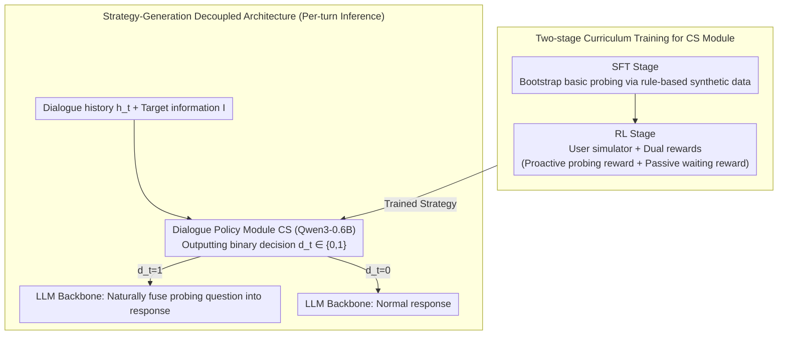

# Towards Proactive Information Probing: Customer Service Chatbots Harvesting Value from Conversation

**Conference**: ACL 2026 Findings  
**arXiv**: [2604.11077](https://arxiv.org/abs/2604.11077)  
**Code**: [https://github.com/SCUNLP/PROCHATIP](https://github.com/SCUNLP/PROCHATIP)  
**Area**: Dialogue Systems  
**Keywords**: Proactive Information Probing, Customer Service Chatbots, Dialogue Policy, Reinforcement Learning, Business Intelligence

## TL;DR

This paper proposes ProChatIP, a framework that transforms customer service chatbots from passive responding tools into proactive information collection engines. Through a specialized dialogue policy module, it learns "when to probe" users for pre-defined target information while minimizing dialogue turns and user friction.

## Background & Motivation

**Background**: AI customer service chatbots have become an essential part of modern business operations, primarily focusing on answering user queries, understanding intent, and extracting Q&A pairs. Chatbots in the LLM era can effectively handle complex interaction dynamics.

**Limitations of Prior Work**: Existing customer service bots are inherently passive—they only respond to user inquiries and lack the ability to proactively gather valuable business information. For example, a chatbot on a commodity trading platform could proactively ask about market trends ("Have you been monitoring inventory levels recently?") during service to acquire market intelligence for pricing models via crowdsourcing.

**Key Challenge**: Users enter customer service dialogues to resolve their own issues. If the bot's information probing appears abrupt or context-irrelevant, users are likely to reject or ignore it, leading to decreased satisfaction. Excessive repetitive questioning can also prolong the dialogue and damage the user experience.

**Goal**: To define the "Proactive Information Probing" task, optimize the timing of probing (when to probe), and maximize information gain while minimizing dialogue length and user friction.

**Key Insight**: Decouple the information probing decision into an independent policy module (CS), separate from the LLM backbone, and train the policy using a two-stage curriculum learning approach with SFT and RL.

**Core Idea**: In each dialogue turn, a lightweight policy module decides whether to probe ($d_t \in \{0,1\}$). If the decision is to probe, the LLM naturally integrates the probing question into its response. The policy is trained using dual rewards (proactive probing reward + passive waiting reward) to learn how to strike at the moment of highest user receptivity.

## Method

### Overall Architecture

The design goal of ProChatIP is to enable customer service bots to learn when to proactively ask a question without disrupting the user's primary request. It decouples probing decisions from generation: in each turn, a lightweight dialogue policy module CS (implemented via Qwen3-0.6B) analyzes the dialogue history $h_t$ and target information $\mathcal{I}$ to output a binary decision $d_t \in \{0,1\}$. This is then executed by the LLM backbone: if $d_t=1$, a probing question is naturally fused into the response; if $d_t=0$, the bot responds normally. The CS module undergoes two-stage curriculum training—SFT for bootstrapping and RL for refinement—transitioning from "learning to probe" to "probing at the right time."

### Key Designs

**1. SFT Stage: Bootstrapping basic probing via rule-based synthetic data**

Existing customer service datasets lack samples of proactive probing; the model has never seen "when it is appropriate to probe." Thus, a cold start is necessary. This paper uses an LLM to generate rule-based synthetic customer service dialogues, where each dialogue corresponds to an explicit rule—for example, "probe when the user shows willingness to expand the topic" or "do not probe when the user clearly refuses." Full-parameter fine-tuning is then performed on this labeled data.

SFT allows the policy module to acquire heuristic pattern recognition capabilities, establishing a functional baseline for probing behavior and providing a starting point for RL that avoids random probing.

**2. RL Stage: Dual rewards teaching the policy when to advance or retreat**

Static rules from SFT cannot capture dynamic optimal timing. Therefore, this paper builds a user simulator with randomized resistance behaviors using an LLM to interact with ProChatIP over multiple turns. A pair of complementary rewards is designed. The proactive probing reward governs whether to "act": a large positive reward is given for successful information acquisition, a penalty for rejection, and a small penalty for being ignored. The passive waiting reward governs whether to "step back": a large positive reward is given for choosing to wait after a rejection (intelligent concession), a small positive reward for waiting after being ignored (pausing before retrying), and a large penalty for continuous inaction to prevent policy laziness.

Crucially, probing rewards alone would make the bot overly aggressive, causing rejection rates to spike. The addition of the waiting reward teaches the policy that "stepping back after rejection is more cost-effective than hard pursuit," ensuring it acts only when user receptivity is highest. The overall system is optimized using the REINFORCE algorithm.

**3. Strategy-Generation Decoupled Architecture: Probing capabilities without polluting main service tasks**

If the same LLM handles both probing decisions and response generation, the probing intent can easily leak into the phrasing, degrading service quality. ProChatIP decouples the two: decisions are handled by an independent 0.6B lightweight module, while the LLM backbone only executes the signal. Upon receiving $d_t=1$, it embeds the probing question naturally; upon $d_t=0$, it provides a standard answer.

This decoupling ensures that response quality remains uncompromised by probing logic and allows the policy module to be deployed as a plug-and-play component for any LLM backbone with extremely low deployment costs.

### Loss & Training

SFT utilizes cross-entropy loss to train the binary classification of probing decisions. RL uses the REINFORCE algorithm ($\theta \leftarrow \theta + \alpha \nabla_\theta \log \text{CS}_\theta(d_t | h_t, \mathcal{I}) \cdot G_t$) to maximize cumulative discounted rewards.

## Key Experimental Results

### Main Results

| Method | TSR↑ | AvgT↓ | RPR↓ | QRR↑ |
|--------|------|------|----------|------|
| Vanilla (GPT-4o-mini) | 0.00% | 7.57 | 0.00% | 99.65% |
| Proactive Baseline | 85.79% | 3.09 | 50.33% | 99.41% |
| ICL-AIF Baseline | 64.42% | 4.10 | 65.08% | 99.37% |
| ProChatIP | 87.38% | 1.92 | 24.59% | 98.67% |

TSR = Target Success Rate, AvgT = Average Turns, RPR = Rejection Rate, QRR = Query Response Rate

### Ablation Study

| Config | TSR | AvgT | Description |
|------|---------|------|------|
| SFT only | Medium | Medium | Basic pattern recognition |
| SFT + RL | 87.38% | 1.92 | RL significantly optimizes timing selection |
| w/o Waiting Reward | Decreased | Increased | Lack of concession strategy leads to higher RPR |

### Key Findings

- **ProChatIP significantly outperforms baselines**: Compared to the strongest baseline, the target information success rate increased by 11.36%, dialogue turns decreased by 39.50%, and user satisfaction increased by 23.73%.
- **Criticality of the waiting reward**: "Intelligent concession" (choosing to wait and re-probe after rejection) is the key to policy success—purely aggressive probing leads to high rejection rates.
- **Consistency with human evaluation**: Evaluation results from the LLM simulator and human participants are highly consistent, validating the effectiveness of the simulator's training environment.
- **Effectiveness of decoupled architecture**: The policy module uses only 0.6B parameters and does not compromise the LLM backbone's service quality (QRR remains >98%).

## Highlights & Insights

- **Paradigm shift in business value**: Transforms customer service interactions from a "cost center" to a "profit center"—every customer dialogue becomes a low-cost channel for business intelligence collection.
- **Dual reward design**: The dual mechanism of proactive probing and passive waiting cleverly encodes strategic wisdom, avoiding a singular aggressive strategy.
- **Deployment-friendly**: The policy module is lightweight (0.6B), compatible with any LLM backbone, and can be deployed as a plug-and-play addition to existing customer service systems.

## Limitations & Future Work

- Currently supports probing for only a single target information item and does not handle prioritization for multiple targets.
- User simulator resistance behaviors are rule-generated and may not fully cover the complex psychology of real users.
- The generation quality of probing questions depends entirely on the LLM backbone and has not been specifically optimized.
- Evaluated only in finance and general customer service domains; broader domain applicability remains to be verified.

## Related Work & Insights

- **vs. Proactive Dialogue Agents**: Existing proactive dialogue systems (e.g., clarifying ambiguity, recommendation) serve the user's interest. ProChatIP introduces a "system-centric utility" dimension—leveraging proactivity to collect business intelligence, creating a multi-objective challenge.
- **vs. Traditional Customer Service**: Traditional service focuses on user experience dimensions such as query resolution and emotional empathy. ProChatIP adds information collection functionality without compromising these dimensions.

## Rating

- Novelty: ⭐⭐⭐⭐⭐ First to define the "Proactive Information Probing" task, with a novel definition and high practical business value.
- Experimental Thoroughness: ⭐⭐⭐⭐ Dual validation via simulator and humans, compared against multiple baselines.
- Writing Quality: ⭐⭐⭐⭐ Clear motivation and complete methodological description.
- Value: ⭐⭐⭐⭐⭐ Directly changes the business positioning of customer service bots with extremely high practical utility.

<!-- RELATED:START -->

## Related Papers

- [\[ACL 2025\] Enabling Chatbots with Eyes and Ears: An Immersive Multimodal Conversation System](../../ACL2025/dialogue/enabling_chatbots_with_eyes_and_ears_an_immersive_multimodal_conversation_system.md)
- [\[ACL 2026\] Cognitive Policy-Driven LLM for Diagnosis and Intervention of Cognitive Distortions in Emotional Support Conversation](cognitive_policy-driven_llm_for_diagnosis_and_intervention_of_cognitive_distorti.md)
- [\[ACL 2026\] Frame of Reference: Addressing the Challenges of Common Ground Representation in Dialogue](frame_of_reference_addressing_the_challenges_of_common_ground_representation_in_.md)
- [\[ACL 2025\] Dialogue Systems for Emotional Support via Value Reinforcement](../../ACL2025/dialogue/dialogue_systems_for_emotional_support_via_value_reinforcement.md)
- [\[ACL 2025\] Enhancing Goal-oriented Proactive Dialogue Systems via Consistency Reflection and Correction](../../ACL2025/dialogue/enhancing_goal-oriented_proactive_dialogue_systems_via_consistency_reflection_an.md)

<!-- RELATED:END -->
