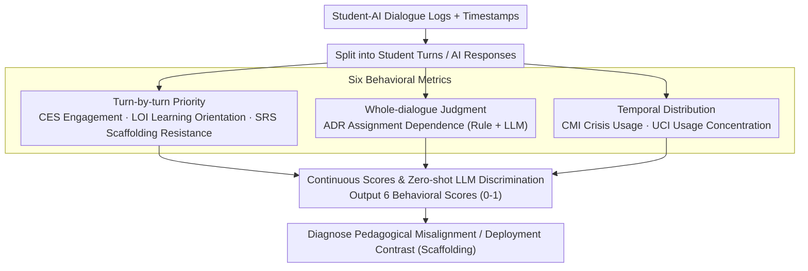

# Your Students Don't Use LLMs Like You Wish They Did

**Conference**: ACL2026  
**arXiv**: [2604.23486](https://arxiv.org/abs/2604.23486)  
**Code**: No public code  
**Area**: Dialogue Evaluation / Learning Analytics / Educational AI  
**Keywords**: Educational AI, Dialogue Evaluation, Learning Orientation, Scaffolding Resistance, Crisis Usage

## TL;DR
This paper proposes six computational behavioral metrics for educational AI dialogues and reveals, across 500 real student-AI conversations, that students frequently utilize LLM tools as answer extractors instead of learning aids. Furthermore, the mode of deployment influences this misalignment more significantly than system design or student preference.

## Background & Motivation
**Background**: Papers in Educational NLP and AI tutoring typically evaluate systems using satisfaction surveys, engagement levels, message counts, and self-reported learning gains. While these evaluations indicate whether students liked the tool, they rarely demonstrate whether the tool achieved educational goals, such as promoting conceptual understanding, encouraging reflection, or reducing direct answer-seeking.

**Limitations of Prior Work**: Educational psychology has long noted that students often mistake "smooth interaction" or "apparent understanding of an answer" for genuine learning—a phenomenon known as the "illusion of fluency." The more fluent and direct an LLM dialogue system is in providing answers, the higher its satisfaction rating may be, yet the more likely it is to bypass "productive struggle." Consequently, satisfaction and pedagogical effectiveness might be inversely correlated.

**Key Challenge**: Educators want AI tutors to maintain scaffolded learning dialogues, but students under pressure and deadlines often prioritize efficiency and answers. Traditional whole-dialogue metrics misinterpret high-frequency interaction as high-quality learning, failing to detect behaviors like "demanding direct answers," "bypassing hints," or "cramming right before exams."

**Goal**: The authors aim to provide an extensible set of computational metrics to directly measure whether students use AI systems according to educational intent. These metrics cover dialogue engagement, learning orientation, scaffolding resistance, assignment dependence, crisis usage, and temporal concentration, with reliability validated via manual annotation.

**Key Insight**: Instead of evaluating only the quality of individual tutor responses, the paper adapts mature concepts from learning analytics and educational data mining—such as gaming, help-seeking, and deadline procrastination—into computable NLP metrics.

**Core Idea**: To evaluate "how students actually use LLMs" using multidimensional behavioral metrics, shifting educational AI evaluation from satisfaction/engagement toward pedagogical alignment—whether usage behaviors align with instructional goals.

## Method
The contribution of this paper is not training a new tutor but proposing an evaluation framework. The input consists of student-AI dialogue logs with timestamps; the output includes six behavioral scores (0–1) or category distributions used to judge pedagogical alignment. The authors compare turn-by-turn analysis with whole-dialogue analysis, finding the former better for capturing fine-grained patterns like immediate answer-seeking or scaffolding bypasses.

### Overall Architecture
The framework first splits student-AI dialogues into student turns and AI responses, then applies rule-based detection or zero-shot LLM judgment for different metrics. CES, LOI, and SRS rely primarily on turn-by-turn analysis to determine if a student is extending the discussion or skipping guidance. ADR uses both rules and LLMs for whole-dialogue analysis to detect direct assignment input. CMI and UCI utilize temporal metadata to compare behavior during normal periods versus exams or deadlines.

To validate these metrics, the authors human-annotated 248 dialogues, with 100 dialogues overlapping between two annotators to estimate human agreement. For the LLM side, they compared GPT-4.1-mini and GPT-5 across both turn-by-turn and whole-dialogue granularities. Finally, the metrics were applied to 500 dialogues (12,650 messages) across five datasets and two deployment paradigms: optional pedagogical scaffolding tools versus unrestricted AI tools integrated into coursework workflows.

### Key Designs

**1. Six behavioral metrics covering distinct pedagogical risks: Deconstructing "whether a student is learning" into observable dimensions.**
Educational AI failures are polymorphic—some systems see high engagement with low learning, some are only used during finals, and others serve as homework machines. A single satisfaction score cannot capture these differences. The paper designs six complementary metrics: CES measures engagement (turns, follow-ups, context citations); LOI measures the ratio of exploratory learning to direct solving; SRS measures resistance to hints, guiding questions, or Socratic scaffolding; ADR detects usage driven by assignment prompts; CMI captures crisis usage near exams/deadlines; and UCI uses a Gini-like coefficient to measure whether usage is clustered in a few high-pressure periods. Together, these distinguish different forms of "tool misuse."

**2. Turn-by-turn analysis prioritized over whole-dialogue analysis: Capturing sequential instances of answer-seeking and scaffolding bypass.**
A dialogue may appear long and active, but most turns might involve pressuring the AI for an answer—pedagogical risks often reside in these local transitions. Looking only at total length is deceptive. Therefore, the framework evaluates each student response at a turn-by-turn granularity: is the student following the tutor’s lead, demanding a direct answer, or ignoring the scaffold? Whole-dialogue analysis, by contrast, collapses the entire session into one generic judgment. Experiments confirm this choice: GPT-5’s turn-by-turn correlations with human labels for LOI, SRS, and CES are significantly higher than whole-dialogue results, proving that granular evaluation preserves patterns otherwise smoothed over by summaries.

**3. Continuous scores and zero-shot LLM discrimination: Enabling cross-course metric transfer without large-scale annotation.**
Student behavior often falls into grey areas—an earnest attempt to understand might immediately pivot to a demand for an answer. Binary classification would ignore this dynamics. The framework uses zero-shot prompting without fine-tuning or few-shot examples, outputting continuous scores between 0 and 1. For instance, SRS assigns a weight of 1.0 for direct resistance, 0.5 for bypassing, and middle values for partial participation. While this sacrifices optimal fit for a specific course, it allows the framework to transition across courses and tools without retraining classifiers—making the zero-shot prompt plus human validation a scalable diagnostic framework rather than a costly bespoke evaluator.

### Loss & Training
No new models were trained, so there is no supervised loss function. The evaluation side employs zero-shot LLM prompts: LOI, SRS, ADR, and CMI are primarily judged by GPT-4.1-mini or GPT-5. Some components of CES also use LLMs for binary classification, while ADR includes a rule-based version. Weights were set based on pedagogical expertise rather than data-driven optimization (e.g., turn count is weighted highest in CES; panic indicators and query directness shifts are weighted highest in CMI).

This strategy prioritizes cross-course generality over niche optimization. Fine-tuning classifiers for every curriculum would render the framework an expensive evaluation tool; zero-shot prompting serves better as a cross-scenario diagnostic.

## Key Experimental Results

### Main Results
Manual validation shows that GPT-5 turn-by-turn analysis approaches human levels of consistency across multiple metrics, whereas whole-dialogue analysis is markedly weaker. This supports the emphasis on turn-by-turn evaluation.

| Method | LOI r/κ | CES r/κ | SRS r/κ | ADR r/κ | Key Conclusion |
|------|-------:|-------:|-------:|-------:|----------|
| GPT-4.1-mini Turn | 0.62 | 0.42 | 0.64 | - | Usable but CES is weak |
| GPT-4.1-mini Whole | 0.33 | 0.21 | 0.25 | 0.22 | Whole-dialogue loses detail |
| GPT-5 Turn | 0.72 | 0.59 | 0.67 | - | Most consistent with humans |
| GPT-5 Whole | 0.47 | 0.46 | 0.49 | 0.31 | Still weaker than turn-by-turn |
| Rule-based | - | - | - | 0.35 | Rule-based ADR is limited |
| Human-Human | 0.58 | 0.67 | 0.64 | 0.65 | Human agreement baseline |

Applying these metrics to 500 real dialogues reveals misalignment across different deployment modes: optional tools become crisis-management tools during exam/assessment periods, while integrated unrestricted platforms, though having more distributed interaction, skew significantly toward direct answer-seeking.

| Dataset | LOI | CES | SRS | ADR-Rule | ADR-LLM | CMI | UCI |
|--------|----:|----:|----:|--------:|--------:|----:|----:|
| DrMattTabolism | 33 | 35 | 16 | 3 | 41 | 20 | 64 |
| DrNucleicAlice | 38 | 72 | 33 | 2 | 39 | 13 | 67 |
| MEDS2004 | 13 | 67 | 27 | 2 | 72 | 14 | 74 |
| OLiMent | 34 | 70 | 16 | 5 | 26 | 18 | 67 |
| StudyChat | 15 | 71 | 22 | 12 | 58 | - | 39 |

### Ablation Study
The "ablation" in this paper is reflected through evaluation granularity, deployment paradigms, and cross-metric comparisons rather than module removal. The most critical comparison is the learning orientation distribution between constrained platforms and StudyChat.

| Platform Type | Answer Seeking | Exploratory | Mixed | Explanation |
|----------|---------------:|------------:|------:|------|
| Constrained optional tools (n=400) | 66.5 | 15.5 | 18.0 | High answer-seeking despite scaffolds |
| StudyChat unrestricted (n=100) | 92.0 | 2.0 | 6.0 | High availability causes pure answer extraction |

| Analysis Item | Key Findings | Note |
|--------|----------|------|
| Turn vs Whole | GPT-5 turn-by-turn LOI/SRS correlation 0.72/0.67 | Summaries hide local scaffolding bypass behavior |
| Satisfaction Validation | Satisfaction on RECIPE4U uncorrelated with all pedagogical metrics, `|r| < 0.12` | Students liking it != students learning |
| Crisis Usage | Optional tools avg UCI 0.681; DrNucleicAlice exam week accounts for 59.7% of semester use | Tools become emergency services when optional |
| ADR Detection | LLM false positive for assignment dependence on MEDS2004 was 72% vs 7% human | Automated "assignment copying" detection is difficult |

### Key Findings
- Students indeed "do not use LLMs the way teachers wish they did." Even with Socratic scaffolding designed into the system, students demand answers, bypass hints, or concentrate usage during exam weeks.
- High engagement can be a negative signal. StudyChat has higher CES than constrained platforms but lower LOI, indicating that more dialogue does not equate to deeper learning.
- Deployment mode is more influential than system design. Optional tools concentrate around deadlines, while integrated tools see more distributed usage but still primarily serve answer extraction.
- Academic integrity detection is not a simple LLM classification task. ADR errors suggest students package assignment needs in natural questions, and models often misjudge legitimate practice as copying.

## Highlights & Insights
- The power of this paper lies in shifting the evaluation object from "is the AI's response good" to "is the student's behavior pedagogically aligned." This is far more relevant to real-world classroom challenges.
- The "Satisfaction-Effectiveness Inversion" is a concept worth noting. The smoother and more effortless the LLM experience, the more likely students are to skip beneficial cognitive difficulties.
- The metrics are transferable. Coding assistants, writing assistants, and medical Q&A systems may exhibit similar phenomena where users are satisfied with fast task completion but fail to achieve system goals like learning or safe decision-making.
- The authors do not moralize answer-seeking. They acknowledge these behaviors can be rational student responses to systemic pressure, making the conclusion balanced: the problem is not just "lazy students" but also deployment and evaluation design.

## Limitations & Future Work
- Limited data reproducibility. Only ~20% of StudyChat data is public; the remaining 400 dialogues are restricted due to ethics and privacy, hindering external replication.
- Sample bias toward STEM. Scaffolding and answer extraction might look different in humanities, writing, or language learning courses, requiring re-calibration.
- Dependence on commercial LLMs, specifically GPT-5; analysis costs (~$145) and model updates may affect future replicability.
- ADR performance is poor, meaning current methods cannot be reliably used for academic integrity monitoring. Direct application for student surveillance would risk significant false positives.
- Manual validation was conducted by the authors; the perspective on educational culture and labeling may be narrow. Future work should involve external educators and students.
- There is no direct measurement of exam scores or long-term learning gains; longitudinal studies are needed to link these metrics to actual learning outcomes.

## Related Work & Insights
- **vs Satisfaction Surveys**: Traditional surveys measure if students "like" the tool; these metrics measure if they use it "as intended." The two often share no correlation.
- **vs Tutor Response Quality Taxonomy**: Work by Maurya et al. evaluates the pedagogical capability of individual AI responses; this paper evaluates temporal behavior patterns, a complementary layer.
- **vs Learning Analytics / Gaming Detection**: Educational Data Mining has long studied "gaming the system"; this paper migrates these concepts to LLM dialogue systems.
- **Insight**: Future educational AI should not just optimize for "better answers" but also adjust "friction" based on real-time metrics—increasing hints or requiring explanations when persistent answer-seeking is detected.

## Rating
- Novelty: ⭐⭐⭐⭐⭐ Transforming pedagogical alignment into computable metrics hits a critical pain point in educational LLMs.
- Experimental Thoroughness: ⭐⭐⭐⭐ Uses real course data and human validation, though data is not fully public and lacks final learning outcome links.
- Writing Quality: ⭐⭐⭐⭐⭐ Sharp argumentation and clear concepts; experimental data robustly supports the core thesis.
- Value: ⭐⭐⭐⭐⭐ Highly insightful for educational AI evaluation, classroom deployment, and dialogue system design.

<!-- RELATED:START -->

## Related Papers

- [\[ICML 2026\] Is Your LLM Overcharging You? Tokenization, Transparency, and Incentives](../../ICML2026/dialogue/is_your_llm_overcharging_you_tokenization_transparency_and_incentives.md)
- [\[ACL 2026\] Simulated Students in Tutoring Dialogues: Substance or Illusion?](simulated_students_in_tutoring_dialogues_substance_or_illusion.md)
- [\[ACL 2025\] Know You First and Be You Better: Modeling Human-Like User Simulators via Implicit Profiles](../../ACL2025/dialogue/know_you_first_and_be_you_better_modeling_human-like_user_simulators_via_implici.md)
- [\[ACL 2026\] Reasoning Gets Harder for LLMs Inside A Dialogue](reasoning_gets_harder_for_llms_inside_a_dialogue.md)
- [\[ACL 2026\] Preference Learning Unlocks LLMs' Psycho-Counseling Skills](preference_learning_unlocks_llms_psycho-counseling_skills.md)

<!-- RELATED:END -->
