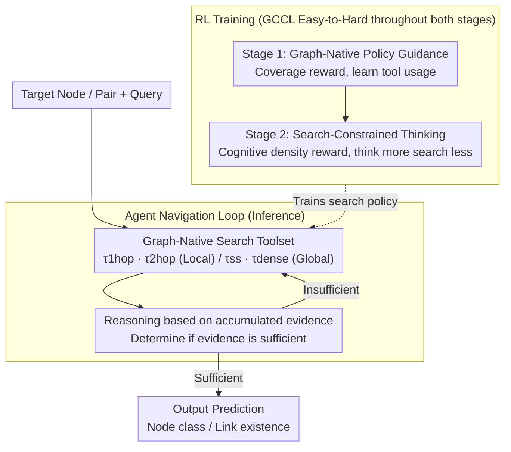

# AgentGL: Towards Agentic Graph Learning with LLMs via Reinforcement Learning

**Conference**: ACL 2026  
**arXiv**: [2604.05846](https://arxiv.org/abs/2604.05846)  
**Code**: [https://github.com/sunyuanfu/AgentGL](https://github.com/sunyuanfu/AgentGL)  
**Area**: Graph Learning / LLM Agent  
**Keywords**: Graph Learning, Reinforcement Learning, Agent Navigation, Text-Attributed Graphs, Tool Use

## TL;DR
AgentGL is proposed as the first reinforcement learning-based Agentic Graph Learning (AGL) framework. It enables LLM agents to autonomously navigate Text-Attributed Graphs (TAGs) using graph-native search tools, achieving absolute accuracy improvements of up to 17.5% in node classification and 28.4% in link prediction.

## Background & Motivation

**Background**: LLMs increasingly rely on agentic capabilities (iterative retrieval, tool calling, decision reasoning) to overcome the limitations of static parameterized knowledge. However, existing agentic frameworks primarily process unstructured text and cannot utilize topological dependencies in real-world data.

**Limitations of Prior Work**: Traditional GNNs model structural signals but struggle with rich textual semantics; GraphLLMs (e.g., GraphGPT, GraphICL) rely on static graph contexts and cannot adaptively explore during inference; Knowledge graphs constructed by GraphRAG are costly and do not preserve original topological associations. All three categories lack dynamic evidence acquisition mechanisms on real graph structures.

**Key Challenge**: Evidence on graphs is multi-scale—some clues exist in tight local neighborhoods, while others manifest only in broader structural patterns. Agents must decide "where to go next" within a combinatorial space while avoiding redundant or uninformative regions. Furthermore, effective graph reasoning requires multi-step exploration, yet search trajectory annotations are extremely scarce in real-world scenarios.

**Goal**: Propose the Agentic Graph Learning (AGL) paradigm, enabling LLM agents to autonomously navigate graph structures, accumulate structural evidence, and iteratively adjust search trajectories based on real-time reasoning.

**Key Insight**: Graph learning is redefined as an alternating process of topology-aware navigation and LLM reasoning, rather than static feature encoding or one-time retrieval.

**Core Idea**: Utilize reinforcement learning to drive LLM agents to learn graph-native search strategies, suppressing over-retrieval via search-constrained thinking and stabilizing long-horizon policy optimization through graph-conditioned curriculum learning.

## Method

### Overall Architecture
AgentGL reformulates graph learning from "static feature encoding" into an agentic decision process. Given a target node (or node pair) and a query, the LLM agent no longer consumes a fixed graph context. Instead, it alternates between "invoking graph-native search tools to gather evidence" and "reasoning about where to search next based on accumulated evidence" until sufficient evidence is gathered to output a prediction. This capability is developed in two stages via reinforcement learning: first, using graph-native policy guidance to teach basic navigation behaviors, and second, using search efficiency optimization to teach the agent to "think more and search less" by pruning redundant calls. Both stages are trained under Graph-Conditioned Curriculum Learning (GCCL) in an "easy-to-hard" sequence.

### Key Designs

**1. Graph-Native Search Toolset: Enabling LLMs to read graphs like text.** 

For agents to navigate autonomously, they require exploration primitives covering both "local vs. global" and "structural vs. semantic" dimensions. AgentGL designs four complementary tools: $\tau_{1hop}$ for 1-hop neighborhood search (prioritizing common neighbors), $\tau_{2hop}$ to expand the field of view to 2-hop neighborhoods, $\tau_{ss}$ for structural salience search (retrieving global topological hubs via PPR scores), and $\tau_{dense}$ using cosine similarity to bridge nodes that are semantically related but topologically disconnected. The former two handle "proximal structural clues," while the latter two manage "distant global hubs and cross-discontinuity semantic associations." Together, these allow the agent to explore from tight local neighborhoods to generalized structural patterns.

**2. Search-Constrained Thinking: Transforming "exhaustive retrieval" into "deep reasoning."** 

Policies trained during the guidance stage often default to searching whenever possible to maximize coverage, which is slow and dilutes reasoning quality. Search-constrained thinking addresses this via three components: a backtracking termination trigger that injects a "cognitive interrupt" after each tool execution, forcing the agent to evaluate evidence sufficiency; cognitive density regularization that penalizes sparse reasoning segments with a reward term $r_{depth} = \alpha \cdot \mathbb{I}[N_{short}=0] - \lambda_d \cdot N_{short}$; and adaptive reward transition which shifts the focus from coverage to accuracy and reasoning density during this stage. These force the agent to achieve the same or better results with fewer searches and denser reasoning.

**3. Graph-Conditioned Curriculum Learning (GCCL): Zero-cost difficulty ranking using graph attributes.** 

Long-horizon RL is prone to instability when trained on mixed-difficulty samples, and traditional curriculum learning requires expensive manual labeling or pilot runs. GCCL leverages the fact that graphs provide quantifiable difficulty priors without additional annotation. For node classification, difficulty is determined by homophily estimation (calibrated via Wilson lower bound) and degree priors. For link prediction, semantic similarity and label consistency of candidate pairs are used. Feeding samples from easy to hard allows policy optimization to stabilize on simple cases before tackling complex ones, leading to more stable training and faster convergence.

### Loss & Training
The two-stage reward design corresponds to "learning to search" then "learning to be efficient." Stage 1 uses $R(\tau) = r_{fmt} + r_{acc} + r_{cov}$ (format + accuracy + tool coverage) to encourage diverse tool usage and basic navigation, optimized via GRPO or REINFORCE++. Stage 2 switches to $R(\tau) = r_{fmt} + r_{acc} + r_{depth}$, replacing coverage incentives with the cognitive density reward $r_{depth}$ to converge the policy from "broad search" to "precise search."

## Key Experimental Results

### Main Results

| Task | Dataset | AgentGL | Prev. SOTA | Gain |
|------|--------|---------|---------|------|
| Node Classification | OGB-Arxiv | 66.3 | 54.1 (GraphPrompter) | +12.2 |
| Node Classification | PubMed | 74.5 | 67.0 (GraphPrompter) | +7.5 |
| Link Prediction | OGB-Arxiv | 91.5 | 79.8 (LLaGA) | +11.7 |
| Link Prediction | PubMed | 75.8 | 62.5 (GraphICL) | +13.3 |
| Zero-shot (NC) | Arxiv-23 | 63.6 | 52.2 (GraphICL) | +11.4 |
| Zero-shot (LP) | Reddit | 83.2 | 62.0 (GraphICL) | +21.2 |

### Ablation Study

| Configuration | Description |
|------|------|
| Full AgentGL | Complete model, optimal performance |
| w/o GCCL | Removed curriculum learning, unstable training, performance drop |
| w/o Search-Constrained Thinking | Excessive retrieval but maintains basic capability |
| w/o Global Tools | Only local tools, limited structural view, significant drop |

### Key Findings
- Signficantly outperforms GNN, GraphLLM, and GraphRAG baselines across all 7 datasets.
- Improvements in zero-shot transfer scenarios are particularly notable (Reddit LP +21.2%), indicating the learned search policies are highly generalizable.
- Search-constrained thinking significantly reduces tool invocation counts while maintaining or improving accuracy.

## Highlights & Insights
- **The AGL paradigm itself is the core contribution**: Redefining graph learning from "static encoding" to "interactive navigation + reasoning" opens new directions for LLM applications on structured data.
- **Zero-cost curriculum learning**: Utilizing intrinsic graph properties to automatically quantify difficulty avoids the bottleneck of manual labeling.
- **Transferable search-constrained thinking**: The "think more, search less" design is applicable to any tool-augmented LLM scenario.

## Limitations & Future Work
- Validated only on node classification and link prediction; community detection and graph classification are not yet covered.
- Graph-native tools are manually designed; future work could allow agents to autonomously discover or combine new tools.
- Training costs are relatively high (multiple RL rounds); scalability on large-scale graphs remains to be verified.

## Related Work & Insights
- **vs GraphRAG (HippoRAG2)**: GraphRAG requires knowledge graph reconstruction and loses original topology, whereas AgentGL navigates directly on the original graph.
- **vs GraphCoT**: Relies on heuristic prompting and is limited to graph QA, while AgentGL optimizes search policies end-to-end via RL.

## Rating
- Novelty: ⭐⭐⭐⭐⭐ First work to combine AGL and RL, pioneering a new direction.
- Experimental Thoroughness: ⭐⭐⭐⭐ 7 datasets + multiple backbones; ablation studies could be more extensive.
- Writing Quality: ⭐⭐⭐⭐ Clear framework and rigorous formulations.
- Value: ⭐⭐⭐⭐⭐ The AGL paradigm has significant potential to drive deep integration of graph learning and LLMs.

<!-- RELATED:START -->

## Related Papers

- [\[ICML 2026\] Graph-GRPO: Training Graph Flow Models with Reinforcement Learning](../../ICML2026/graph_learning/graph-grpo_training_graph_flow_models_with_reinforcement_learning.md)
- [\[ACL 2026\] From Nodes to Narratives: Explaining Graph Neural Networks with LLMs and Graph Context](from_nodes_to_narratives_explaining_graph_neural_networks_with_llms_and_graph_co.md)
- [\[ACL 2026\] Graph-Based Alternatives to LLMs for Human Simulation](graph-based_alternatives_to_llms_for_human_simulation.md)
- [\[ACL 2026\] ARK: Answer-Centric Retriever Tuning via KG-augmented Curriculum Learning](ark_answer-centric_retriever_tuning_via_kg-augmented_curriculum_learning.md)
- [\[ACL 2026\] Evaluating LLMs on Large-Scale Graph Property Estimation via Random Walks](evaluating_llms_on_large-scale_graph_property_estimation_via_random_walks.md)

<!-- RELATED:END -->
