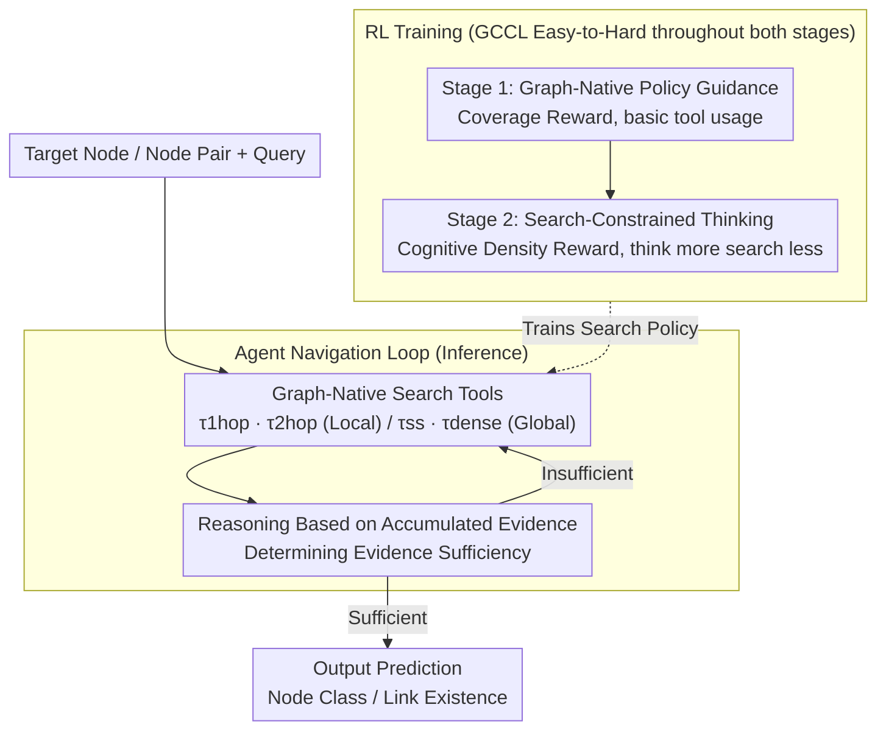

# AgentGL: Towards Agentic Graph Learning with LLMs via Reinforcement Learning

**Conference**: ACL 2026  
**arXiv**: [2604.05846](https://arxiv.org/abs/2604.05846)  
**Code**: [https://github.com/sunyuanfu/AgentGL](https://github.com/sunyuanfu/AgentGL)  
**Area**: Graph Learning / LLM Agent  
**Keywords**: Graph Learning, Reinforcement Learning, Agentic Navigation, Text-Attributed Graphs, Tool Use

## TL;DR
AgentGL is proposed as the first Reinforcement Learning-based Agentic Graph Learning (AGL) framework. It empowers LLM agents to autonomously navigate Text-Attributed Graphs (TAGs) via graph-native search tools, achieving absolute accuracy improvements of up to 17.5% and 28.4% in node classification and link prediction tasks, respectively.

## Background & Motivation

**Background**: LLMs increasingly rely on agentic capabilities (iterative retrieval, tool calling, decision reasoning) to overcome the limitations of static parameterized knowledge. However, existing agentic frameworks primarily process unstructured text and fail to leverage topological dependencies inherent in real-world data.

**Limitations of Prior Work**: Traditional GNNs model structural signals but struggle with rich textual semantics; GraphLLMs (e.g., GraphGPT, GraphICL) rely on static graph contexts and lack adaptive exploration during inference; GraphRAG-constructed knowledge graphs are costly and do not preserve original topological associations. All three categories lack dynamic evidence acquisition mechanisms on actual graph structures.

**Key Challenge**: Evidence on graphs is multi-scale—some clues reside in tight local neighborhoods, while others manifest only in broader structural patterns. Agents must determine "where to go next" within a combinatorial space while avoiding redundant or uninformative regions. Furthermore, effective graph reasoning requires multi-step exploration, yet authentic search trajectory annotations are extremely scarce.

**Goal**: To propose a new paradigm of Agentic Graph Learning (AGL), enabling LLM agents to autonomously navigate graph structures, accumulate structural evidence, and iteratively adjust search trajectories based on real-time reasoning.

**Key Insight**: Redefining graph learning as an alternating process of topology-aware navigation and LLM reasoning, rather than static feature encoding or one-time retrieval.

**Core Idea**: Driving LLM agents to learn graph-native search strategies via reinforcement learning, suppressing over-retrieval through search-constrained thinking, and stabilizing long-horizon policy optimization via graph-conditioned curriculum learning.

## Method

### Overall Architecture
AgentGL reformulates graph learning from "static feature encoding" into an agentic decision-making process: given a target node (or node pair) and a query, the LLM agent no longer consumes a fixed graph context. Instead, it alternates between "invoking graph-native search tools to gather evidence" and "reasoning about the next search location based on existing evidence" until sufficient evidence is collected to output a prediction. This capability is cultivated through two stages of reinforcement learning—first, utilizing graph-native policy guidance to teach basic navigation behaviors, followed by search efficiency optimization to teach the agent to "think more and search less" by pruning redundant calls. Both stages are trained under the "easy-to-hard" sequencing of Graph-Conditioned Curriculum Learning (GCCL) to stabilize long-period policy optimization.

### Key Designs

**1. Graph-Native Search Toolset: Enabling LLMs to read graphs as freely as text.** 

For an agent to navigate a graph autonomously, it requires a set of exploration primitives covering both "local vs. global" and "structural vs. semantic" dimensions. AgentGL designs four complementary tools: $\tau_{1hop}$ performs 1-hop neighborhood search (prioritizing common neighbors and balanced unique neighbor allocation); $\tau_{2hop}$ expands the horizon to the 2-hop neighborhood; $\tau_{ss}$ conducts structural significance search (retrieving global topological hubs using PPR scores); and $\tau_{dense}$ utilizes cosine similarity to bridge nodes that are semantically related but topologically disconnected. The former two handle "proximal structural clues," while the latter two manage "distant global hubs and cross-breakpoint semantic associations," allowing the agent to probe from tight local neighborhoods to generalized structural patterns.

**2. Search-Constrained Thinking: Transforming "exhaustive retrieval" into "deep reasoning."** 

Policies trained during the guidance stage often suffer from a tendency to search excessively to maximize coverage, which slows performance and dilutes reasoning quality. Search-constrained thinking addresses this via three components: a backtrack termination trigger that injects a "cognitive interrupt" after each tool execution, forcing the agent to evaluate evidence sufficiency; cognitive density regularization that penalizes sparse reasoning segments with a reward term $r_{depth} = \alpha \cdot \mathbb{I}[N_{short}=0] - \lambda_d \cdot N_{short}$; and adaptive reward transitions that shift focus from coverage to accuracy and reasoning density. Combined, these push the agent to achieve equal or better results with fewer searches and denser reasoning.

**3. Graph-Conditioned Curriculum Learning (GCCL): Zero-cost difficulty ranking via graph attributes.** 

Long-horizon RL training on mixed-difficulty samples is prone to instability, while traditional curriculum learning requires expensive manual labeling or pilot runs. GCCL leverages the fact that graphs provide quantifiable difficulty priors without additional annotation. For node classification, difficulty is determined by homophily estimation corrected by the Wilson lower bound and degree priors. For link prediction, it considers the semantic similarity and label consistency of candidate pairs. Feeding samples from easy to hard allows policy optimization to stabilize on simple cases before tackling complex ones, leading to more robust training and faster convergence.

### Loss & Training
The two-stage reward design corresponds to "learning to search" then "learning to be efficient." Stage 1 utilizes $R(\tau) = r_{fmt} + r_{acc} + r_{cov}$ (format + accuracy + tool coverage) to encourage the agent to utilize diverse tools and establish basic navigation, optimized via GRPO or REINFORCE++. Stage 2 switches to $R(\tau) = r_{fmt} + r_{acc} + r_{depth}$, removing coverage incentives in favor of the cognitive density reward $r_{depth}$ to converge the policy from "broad searching" to "precise reasoning."

## Key Experimental Results

### Main Results

| Task | Dataset | AgentGL | Prev. SOTA | Gain |
|------|--------|---------|---------|------|
| Node Classification | OGB-Arxiv | 66.3 | 54.1 (GraphPrompter) | +12.2 |
| Node Classification | PubMed | 74.5 | 67.0 (GraphPrompter) | +7.5 |
| Link Prediction | OGB-Arxiv | 91.5 | 79.8 (LLaGA) | +11.7 |
| Link Prediction | PubMed | 75.8 | 62.5 (GraphICL) | +13.3 |
| Zero-shot Transfer (NC) | Arxiv-23 | 63.6 | 52.2 (GraphICL) | +11.4 |
| Zero-shot Transfer (LP) | Reddit | 83.2 | 62.0 (GraphICL) | +21.2 |

### Ablation Study

| Configuration | Description |
|------|------|
| Full AgentGL | Complete model, optimal performance |
| w/o GCCL | Curriculum learning removed; unstable training and performance drop |
| w/o Search-Constrained Thinking | Excessive retrieval while maintaining basic capability |
| w/o Global Tools | Only local tools; restricted structural horizon, significant drop |

### Key Findings
- AgentGL substantially outperforms GNN, GraphLLM, and GraphRAG baselines across all 7 datasets.
- Improvements in zero-shot transfer scenarios are particularly significant (Reddit LP +21.2%), demonstrating the strong generalizability of the learned search strategies.
- Search-constrained thinking significantly reduces tool invocation counts while maintaining or improving accuracy.

## Highlights & Insights
- **The AGL paradigm itself is a core contribution**: Redefining graph learning from "static encoding" to "interactive navigation + reasoning" opens new directions for LLM applications on structured data.
- **Zero-cost curriculum learning**: Utilizing intrinsic graph properties to automatically quantify difficulty avoids the bottlenecks of manual annotation or pilot runs.
- **Transferability of Search-Constrained Thinking**: The "think more, search less" design is applicable to any tool-augmented LLM scenario.

## Limitations & Future Work
- Evaluation is limited to node classification and link prediction; community detection and graph classification are not yet covered.
- Graph-native tools are manually designed; future work could allow agents to autonomously discover or combine new tools.
- Training costs are relatively high due to multi-round RL; scalability on massive graphs remains to be verified.

## Related Work & Insights
- **vs. GraphRAG (HippoRAG2)**: GraphRAG requires knowledge graph reconstruction and loses original topology, whereas AgentGL navigates directly on the original graph.
- **vs. GraphCoT**: GraphCoT relies on heuristic prompting for graph QA, while AgentGL optimizes search strategies end-to-end via RL.

## Rating
- Novelty: ⭐⭐⭐⭐⭐ First work to combine AGL with RL, opening a new direction.
- Experimental Thoroughness: ⭐⭐⭐⭐ 7 datasets + multiple backbones; ablations could be more extensive.
- Writing Quality: ⭐⭐⭐⭐ Clear framework and rigorous formulations.
- Value: ⭐⭐⭐⭐⭐ The AGL paradigm holds great potential for deep integration of graph learning and LLMs.

<!-- RELATED:START -->

## Related Papers

- [\[ACL 2026\] From Nodes to Narratives: Explaining Graph Neural Networks with LLMs and Graph Context](from_nodes_to_narratives_explaining_graph_neural_networks_with_llms_and_graph_co.md)
- [\[ACL 2026\] Graph-Based Alternatives to LLMs for Human Simulation](graph-based_alternatives_to_llms_for_human_simulation.md)
- [\[ACL 2026\] ARK: Answer-Centric Retriever Tuning via KG-augmented Curriculum Learning](ark_answer-centric_retriever_tuning_via_kg-augmented_curriculum_learning.md)
- [\[ICML 2026\] T-GINEE: A Tensor-Based Multilayer Graph Representation Learning](../../ICML2026/graph_learning/t-ginee_a_tensor-based_multilayer_graph_representation_learning.md)
- [\[ICML 2026\] Aitchison Embeddings for Learning Compositional Graph Representations](../../ICML2026/graph_learning/aitchison_embeddings_for_learning_compositional_graph_representations.md)

<!-- RELATED:END -->
