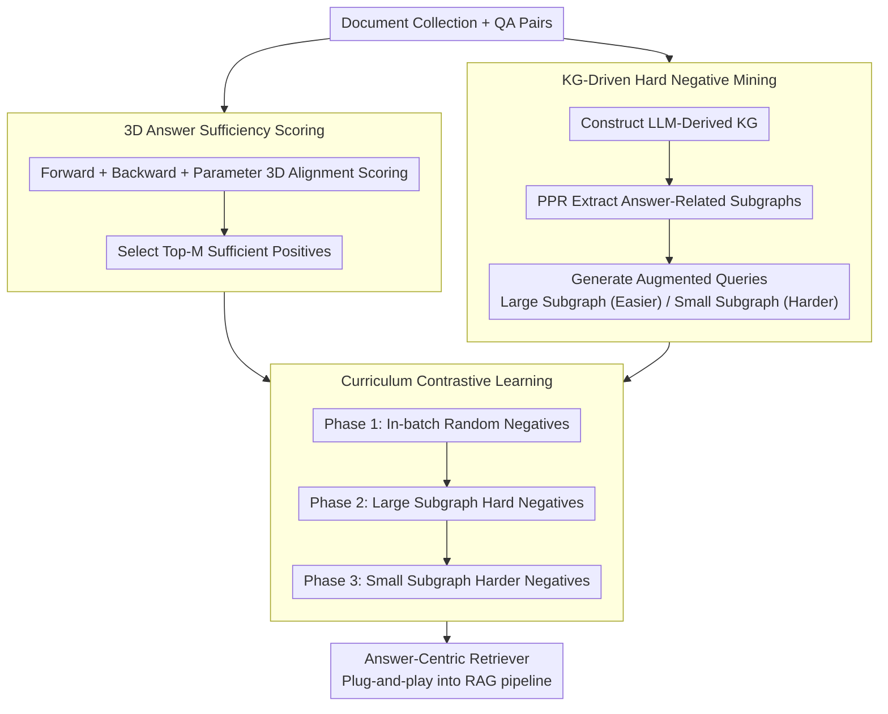

# ARK: Answer-Centric Retriever Tuning via KG-augmented Curriculum Learning

**Conference**: ACL 2026  
**arXiv**: [2511.16326](https://arxiv.org/abs/2511.16326)  
**Code**: [GitHub](https://github.com/valleysprings/ARK/)  
**Area**: Graph Learning  
**Keywords**: Answer-Centric Retrieval, Knowledge Graph Enhancement, Curriculum Learning, Contrastive Learning, Long-Context RAG

## TL;DR

The ARK framework is proposed, which filters positive samples through a three-dimensional answer sufficiency score (Forward + Backward + Retriever alignment) and utilizes LLM-constructed Knowledge Graphs (KG) to generate hard negative samples of progressive difficulty for curriculum contrastive learning. It achieves an average F1 improvement of 14.5% across 10 datasets.

## Background & Motivation

**Background**: RAG enhances generation quality by connecting LLMs with external knowledge sources. however, in long-context scenarios, retrievers often fail to distinguish sparse but critical evidence. Standard retrievers optimize for query-document similarity, which is not aligned with the goal of downstream answer generation.

**Limitations of Prior Work**: (1) Retrieved documents may be topically related but insufficient for generating the correct answer—"relevant but insufficient"; (2) KG-integrated RAG (such as GraphRAG), while effective, incurs extremely high indexing costs (requiring massive LLM calls) and suffers from noise in community clustering; (3) There is a lack of retriever training methods optimized specifically for "answer sufficiency."

**Key Challenge**: A gap exists between the retriever's training objective (query-document similarity) and the final objective of RAG (generating the correct answer).

**Goal**: To train a truly "answer-centric" retriever—where the optimization goal is whether the retrieved content is sufficient to generate the correct answer.

**Key Insight**: Redefine the role of KG in RAG—not as a direct retrieval source, but as a generator of hard negative samples for curriculum learning.

**Core Idea**: Use augmented queries generated from KG subgraphs to mine hard negative samples of progressive difficulty. Through curriculum contrastive learning, the retriever is taught to distinguish between "sufficient" and "seemingly relevant but insufficient" evidence.

## Method

### Overall Architecture
ARK aims to train a truly "answer-centric" retriever—the criterion for evaluating retrieved content is not its similarity to the query, but its sufficiency for generating the correct answer. The entire process is structured into two stages: first, query construction, which involves building a knowledge graph from documents, extracting answer-related subgraphs, and generating augmented queries specifically for mining hard negative samples of progressive difficulty; second, contrastive fine-tuning, which uses three-dimensional answer sufficiency scores to select truly "answer-sufficient" positive samples. These are paired with the hard negatives from the first stage to train the retriever following a curriculum from easy to difficult. The trained retriever maintains its original architecture and can be plugged directly back into existing RAG pipelines.

### Key Designs

**1. Three-dimensional Answer Sufficiency Scoring: Decoupling "Relevance" and "Sufficiency".** 

Selecting positive samples based solely on query-document similarity often results in chunks that are "topically related but insufficient for answering" being treated as positive examples, polluting the training signal. ARK uses three complementary dimensions for joint scoring: Forward alignment $S_f$ measures "the difference in conditional probability of the answer when the chunk is present vs. absent," representing its actual contribution to generating the correct answer; Backward alignment $S_b$ asks "whether the original question can be reconstructed given the answer and the chunk," verifying bidirectional consistency between evidence and question; Parameter alignment $S_v$ retains the cosine similarity of the original retriever as an anchor to prevent fine-tuning from forgetting. These three are weighted and combined to select the top-M as positive samples, ensuring that selected evidence is "both relevant and sufficient."

**2. KG-Driven Hard Negative Mining: Using Subgraph Size as a Difficulty Knob.** 

The most difficult samples to train are not random negatives, but chunks that are "semantically close but factually incorrect for the answer." The community structure of KGs naturally exposes these "close but incorrect" concepts. ARK first constructs an LLM-derived KG from documents, uses Personalized PageRank (PPR) to extract answer-related subgraphs, and generates augmented queries based on these subgraphs. The key is that as the subgraph becomes more focused, the generated query stays closer to the "semantic neighborhood" of the correct answer, making the mined negative samples harder to distinguish. Large subgraphs $Q_L^{aug}$ produce easier hard negatives, while small subgraphs $Q_S^{aug}$ produce harder negatives—effectively making the subgraph size an adjustable difficulty knob.

**3. Curriculum Contrastive Learning: Climbing from Random Negatives to the Hardest.** 

Starting training directly with the hardest negatives can cause severe gradient oscillation and unstable convergence. ARK Categorizes negative samples into three phases by difficulty: Phase 1 uses in-batch random negatives to establish basic discrimination; Phase 2 uses hard negatives $\mathcal{T}_{hard_L}^-$ mined via large subgraphs $Q_L^{aug}$; Phase 3 introduces even harder negatives $\mathcal{T}_{hard_S}^-$ from small subgraphs $Q_S^{aug}$. As difficulty scales progressively, the retriever stabilizes at each level before facing the next challenge, eventually learning to distinguish the subtle differences between "sufficient" and "seemingly relevant but insufficient."

### Loss & Training
The training objective is the standard InfoNCE contrastive loss, with the primary difference lying in sample construction: positive samples are selected via the three-dimensional sufficiency score, and negative samples increase in difficulty according to the curriculum phase. The entire fine-tuning process does not modify the retriever architecture, allowing for seamless integration into existing RAG pipelines upon completion.

## Key Experimental Results

### Main Results

| Metric | Value | Description |
|------|------|------|
| Average F1 Gain | +14.5% | Average across 10 datasets |
| SOTA | 8/10 datasets | Ultradomain + LongBench |

### Ablation Study

| Configuration | Key Metric | Description |
|------|---------|------|
| Remove Forward Alignment | F1 Drops | Answer generation probability is the core signal |
| Remove KG Enhancement | Lower Negative Quality | KG provides structured hard negatives |
| No Curriculum (Direct Hard Negs) | Unstable | Curriculum learning is vital for training stability |
| Large vs. Small Subgraphs | Small Subgraph Negs are Harder | Validates the progressive difficulty design |

### Key Findings
- Answer sufficiency scoring identifies high-quality positive samples more effectively than pure similarity scoring.
- Using KG as a hard negative sample generator is more efficient than using it as a direct retrieval source—significantly reducing LLM calls.
- The progressive difficulty of curriculum learning is crucial for final performance.
- The method is particularly effective in long-context scenarios.

## Highlights & Insights
- Redefines the role of KG in RAG—from a "retrieval index" to a "training signal generator"—drastically reducing the cost of using KGs.
- Three-dimensional answer sufficiency scoring directly aligns "what is retrieved" with "what is generated."
- The method does not change the retriever architecture, making it plug-and-play for existing RAG pipelines.

## Limitations & Future Work
- KG construction still incurs some LLM call costs.
- Forward/Backward scoring requires inference from a generator LLM, increasing data preparation overhead.
- Only encoder-based retrievers were tested.
- Future work could extend this to multimodal RAG and more task types.

## Related Work & Insights
- **vs GraphRAG**: KG is used for training signals rather than retrieval, significantly lowering costs.
- **vs DPR**: Shifts from query alignment to answer alignment, better fitting the ultimate goal of RAG.
- **vs MemoRAG**: While MemoRAG compresses memory, ARK optimizes the retriever itself; the two could be combined.

## Rating
- Novelty: ⭐⭐⭐⭐ Innovative dual approach with answer sufficiency scoring and KG as a negative generator.
- Experimental Thoroughness: ⭐⭐⭐⭐⭐ 10 datasets, 8/10 SOTA, comprehensive ablation.
- Writing Quality: ⭐⭐⭐⭐ Method descriptions are clear and illustrations are intuitive.
- Value: ⭐⭐⭐⭐⭐ Direct practical value for retriever optimization in long-context RAG.

<!-- RELATED:START -->

## Related Papers

- [\[AAAI 2026\] Feature-Centric Unsupervised Node Representation Learning Without Homophily Assumption](../../AAAI2026/graph_learning/feature-centric_unsupervised_node_representation_learning_without_homophily_assu.md)
- [\[ICML 2026\] GILT: An LLM-Free, Tuning-Free Graph Foundational Model for In-Context Learning](../../ICML2026/graph_learning/gilt_an_llm-free_tuning-free_graph_foundational_model_for_in-context_learning.md)
- [\[ICML 2026\] Message Tuning Outshines Graph Prompt Tuning: A Prismatic Space Perspective](../../ICML2026/graph_learning/message_tuning_outshines_graph_prompt_tuning_a_prismatic_space_perspective.md)
- [\[ACL 2026\] AgentGL: Towards Agentic Graph Learning with LLMs via Reinforcement Learning](agentgl_towards_agentic_graph_learning_with_llms_via_reinforcement_learning.md)
- [\[ACL 2026\] MegaRAG: Multimodal Knowledge Graph-Based Retrieval Augmented Generation](megarag_multimodal_knowledge_graph-based_retrieval_augmented_generation.md)

<!-- RELATED:END -->
