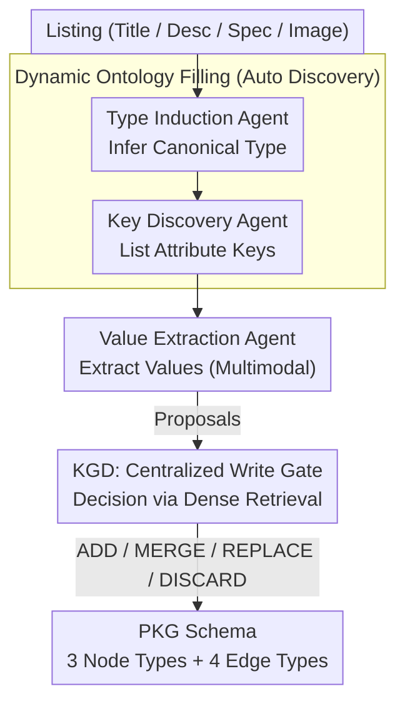

# AutoPKG: An Automated Framework for Dynamic E-commerce Product-Attribute Knowledge Graph Construction

**Conference**: ACL 2026 Findings  
**arXiv**: [2604.16950](https://arxiv.org/abs/2604.16950)  
**Code**: [GitHub](https://github.com/Product-Understanding-Lazada-Alibaba/AutoPKG)  
**Area**: Knowledge Graph  
**Keywords**: Knowledge Graph Construction, E-commerce Attribute Extraction, Multi-agent LLM, Dynamic Ontology, Multimodal

## TL;DR
AutoPKG is proposed as a multi-agent LLM framework for automatically constructing a Product-Attribute Knowledge Graph (PKG) from multimodal e-commerce content. Using a Type Induction Agent, Attribute Key Discovery Agent, Attribute Value Extraction Agent, and a centralized KGD decision agent, it enables continuous evolution and normalization of a dynamic ontology. It achieves 0.953 WKE (Type) and 0.724 WKE (Key) on the Lazada dataset, with a 7.89% recommendation GMV gain in online A/B testing.

## Background & Motivation

**Background**: Product attributes are central to e-commerce infrastructure, powering faceted navigation, search ranking, and recommendation systems. Industrial attribute extraction pipelines typically rely on manually maintained product taxonomies and extract from fixed attribute lists.

**Limitations of Prior Work**: (1) Manually maintained taxonomies are inconsistent across markets, incomplete for long-tail products, and costly to maintain under distribution drift. (2) Even powerful Product Attribute Value Extraction (PAVE) models are restricted by outdated or narrow attribute lists, limiting coverage. (3) Existing frameworks fail to simultaneously address automatic type induction, attribute key discovery, and multimodal extraction.

**Key Challenge**: The e-commerce product space is dynamic, long-tail, and multimodal, yet existing KG construction methods assume fixed, human-managed schemas, failing to adaptively evolve.

**Goal**: Construct a framework capable of automatic PKG construction and continuous evolution from scratch without predefined taxonomies, supporting multimodal attribute extraction from text and images.

**Key Insight**: PKG construction is decomposed into a collaboration between four specialized agents. The core innovation is the Knowledge Graph Decision (KGD) agent—the centralized gatekeeper for all write operations—which ensures global consistency through restricted edit actions (ADD/MERGE/REPLACE/DISCARD).

**Core Idea**: A multi-agent LLM paradigm of "proposal $\rightarrow$ normalization $\rightarrow$ write" is implemented for incremental PKG construction. Centralized KGD unifies all updates into restricted edit decisions to achieve continuous deduplication and normalization.

## Method

### Overall Architecture
AutoPKG addresses the challenge of building and evolving a PKG from scratch given long-tail, multimodal products without an existing taxonomy. It orchestrates four specialized LLM agents: for each product listing, the Type Induction Agent infers its canonical product type; the Attribute Key Discovery Agent lists applicable attribute keys; and the Attribute Value Extraction Agent extracts values from text and images. These function as "proposals," which the centralized KGD agent then processes into a single restricted edit (ADD/MERGE/REPLACE/DISCARD) to maintain a deduplicated, normalized global graph.

### Key Designs

**1. PKG Schema: Separating "Schema" and "Facts" via Three Node Types and Four Edge Types**
To ensure stable incremental growth, product-level temporal facts are separated from globally reusable structures. AutoPKG defines three node types: Product, ProductType, and AttributeKey. Four edge types are divided into schema edges (has_key, has_value), which define what keys and values a type should have, and instance edges (of_type, has_attribute), which record product-specific data. Normalizing attribute values through AttributeKey allows values (e.g., "Red") to be reused across products. This separation enables type checking and allows incremental expansion without disrupting the overall structure.

**2. KGD: Centralized Write Gate Converting Generative Chaos into Restricted Decisions**
Upstream agents generate free-form text, which could lead to redundant nodes. AutoPKG restricts upstream agents to "proposals," making KGD the sole agent permitted to modify the graph. For each proposal, KGD considers the candidate and its local neighborhood retrieved via dense retrieval (using Qwen3-Embedding-0.6B). It selects one of four restricted actions: ADD (new node/edge), MERGE (merge candidate into existing node), REPLACE (promote candidate as new canonical label), or DISCARD (reject invalid proposal). This structures updates as 4-way decisions, acting as a gatekeeper for deduplication and normalization.

**3. Dynamic Ontology Filling: Automated Discovery without Predefined Taxonomies**
AutoPKG enables the Type Induction Agent to propose canonical product types and descriptions directly from listing text, while the Key Discovery Agent proposes attribute keys based on those types. These proposals are processed by KGD to decide whether to create new entries or merge with existing ones, allowing the ontology to self-populate and cover long-tail categories automatically.

**4. WKE: A Weighted Composite Metric Against Aggressive Merging**
To prevent metric manipulation (e.g., achieving high compression via excessive merging at the cost of coverage), AutoPKG introduces Weighted Knowledge Efficiency (WKE). For type induction, it calculates the weighted harmonic mean of Acceptance, Compression, and Coverage. For key discovery, it uses Acceptance, P-Precision, and P-Recall. The harmonic mean ensures that a low score in any dimension significantly penalizes the total, forcing a balance between acceptance, compression, and coverage.

## Key Experimental Results

### Main Results (Product Type Induction, WKE)

| Model | Acceptance | Compression | Coverage | WKE |
|------|-----------|-------------|----------|-----|
| Qwen3-4B | 0.952 | 0.948 | 0.960 | **0.953** |
| Qwen3-30B | 0.954 | 0.936 | 0.960 | 0.952 |
| Gemma-3n-E4B | 0.936 | 0.967 | 0.986 | 0.952 |
| SmolLM3-3B | 0.646 | 0.933 | 0.613 | 0.682 |

### KGD Decision Accuracy

| Model | Accuracy |
|------|----------|
| Qwen3-Next-80B-A3B | **0.764** |
| Qwen3-30B-A3B | 0.734 |
| Llama-3.2-3B | 0.384 |
| SmolLM3-3B | 0.123 |

### Online A/B Testing (GMV Gain)

| Scenario | Gain (GMV) |
|------|---------|
| Badge | +3.81% |
| Search | +5.32% |
| Recommendation | **+7.89%** |
| Filter | +0.26% (not sig.) |

### Key Findings
- **KGD normalization requires strong semantic reasoning**: Small models (Llama-3.2-3B: 0.384) frequently fail the MERGE vs. ADD decision, causing downstream quality loss.
- **Medium models suffice for Type Induction** (Qwen3-4B reached 0.953 WKE), whereas KGD requires larger models.
- **Long-tail coverage is the bottleneck for key discovery**: While precision is high (0.93-0.99), recall remains low (0.27-0.47), indicating difficulty in identifying rare keys.
- **Multimodal extraction F1 is moderate (0.531)**, reflecting challenges with noisy seller text and non-diagnostic images.
- **Online A/B tests confirm production value**, with a 7.89% GMV increase in recommendation scenarios.

## Highlights & Insights
- The **"proposal $\rightarrow$ normalization $\rightarrow$ write" paradigm** for KGD is highly practical, decoupling the flexibility of LLM generation from the consistency required by KGs via a restricted action space.
- The **WKE evaluation protocol** effectively balances multiple dimensions, preventing the gaming of single metrics like compression.
- **Industrial deployment validation** spans from offline metrics to online A/B tests, providing a robust reference for both academic and industrial applications.

## Limitations & Future Work
- High cost due to dependence on powerful LLMs as the KGD backbone (Qwen3-Next-80B inference latency is significant).
- Long-tail coverage for attribute keys remains unresolved (maximum recall of 0.474).
- KGD actions are manually designed; future work could explore learning more flexible edit strategies.
- The dataset is limited to the Southeast Asian market (Lazada); cross-market and cross-lingual generalization require further study.
- Direct comparison with industrial systems like AutoKnow or AliCG is missing (likely due to data proprietary issues).

## Related Work & Insights
- **vs. AutoKnow (Dong et al., 2020)**: While AutoKnow builds e-commerce KGs, it assumes a human-managed schema. AutoPKG automates schema induction and evolution.
- **vs. AutoSchemaKG (Bai et al., 2025)**: AutoSchemaKG performs general-domain schema induction but lacks multimodality and e-commerce specialization.
- **vs. PAVE methods**: Traditional PAVE extracts values for fixed attributes. AutoPKG integrates schema evolution and value extraction into a unified framework.

## Rating
- Novelty: ⭐⭐⭐⭐ First open framework supporting type induction + key discovery + multimodal extraction.
- Experimental Thoroughness: ⭐⭐⭐⭐⭐ Comprehensive validation across offline, online, and public benchmarks.
- Writing Quality: ⭐⭐⭐⭐ Complete system paper, though information-dense.
- Value: ⭐⭐⭐⭐⭐ Significant contribution to the e-commerce KG community via industrial systems, open data, and evaluation protocols.

<!-- RELATED:START -->

## Related Papers

- [\[ICLR 2026\] HGNet: Scalable Foundation Model for Automated Knowledge Graph Generation from Scientific Literature](../../ICLR2026/graph_learning/hgnet_scalable_foundation_model_for_automated_knowledge_graph_generation_from_sc.md)
- [\[ICLR 2026\] One for Two: A Unified Framework for Imbalanced Graph Classification via Dynamic Balanced Prototype](../../ICLR2026/graph_learning/one_for_two_a_unified_framework_for_imbalanced_graph_classification_via_dynamic_.md)
- [\[ICLR 2026\] Scaling Knowledge Graph Construction through Synthetic Data Generation and Distillation](../../ICLR2026/graph_learning/scaling_knowledge_graph_construction_through_synthetic_data_generation_and_disti.md)
- [\[NeurIPS 2025\] FALCON: An ML Framework for Fully Automated Layout-Constrained Analog Circuit Design](../../NeurIPS2025/graph_learning/falcon_an_ml_framework_for_fully_automated_layout-constrained_analog_circuit_des.md)
- [\[ACL 2026\] ComplianceNLP: Knowledge-Graph-Augmented RAG for Multi-Framework Regulatory Gap Detection](compliancenlp_knowledge-graph-augmented_rag_for_multi-framework_regulatory_gap_d.md)

<!-- RELATED:END -->
## Related Papers

- [\[NeurIPS 2025\] FALCON: An ML Framework for Fully Automated Layout-Constrained Analog Circuit Design](../../NeurIPS2025/graph_learning/falcon_an_ml_framework_for_fully_automated_layout-constrained_analog_circuit_des.md)
- [\[ACL 2026\] ComplianceNLP: Knowledge-Graph-Augmented RAG for Multi-Framework Regulatory Gap Detection](compliancenlp_knowledge-graph-augmented_rag_for_multi-framework_regulatory_gap_d.md)
- [\[ACL 2025\] mRAKL: Multilingual Retrieval-Augmented Knowledge Graph Construction for Low-Resourced Languages](../../ACL2025/graph_learning/mrakl_multilingual_retrieval-augmented_knowledge_graph_construction_for_low-reso.md)
- [\[ICML 2026\] DTKG: Dual-Track Knowledge Graph-Verified Reasoning Framework for Multi-Hop QA](../../ICML2026/graph_learning/dtkg_dual-track_knowledge_graph-verified_reasoning_framework_for_multi-hop_qa.md)
- [\[AAAI 2026\] PathMind: A Retrieve-Prioritize-Reason Framework for Knowledge Graph Reasoning with Large Language Models](../../AAAI2026/graph_learning/pathmind_a_retrieve-prioritize-reason_framework_for_knowledge_graph_reasoning_wi.md)

<!-- RELATED:END -->
