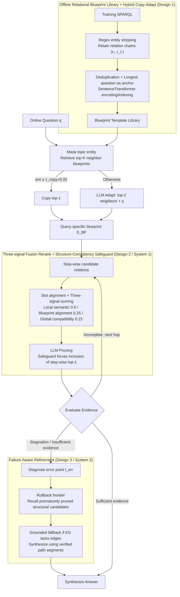

# CoG: Controllable Graph Reasoning via Relational Blueprints and Failure-Aware Refinement over Knowledge Graphs

**Conference**: ACL 2026  
**arXiv**: [2601.11047](https://arxiv.org/abs/2601.11047)  
**Code**: https://github.com/zjukg/CoG (Yes)  
**Area**: Graph Learning / KG Reasoning  
**Keywords**: Knowledge Graph Question Answering, dual-process, relational blueprints, failure-aware backtracking, training-free agent

## TL;DR
CoG is a training-free KGQA framework that applies Kahneman's Dual-Process Theory to KG reasoning: System 1 distills SPARQL from the training set offline into a "Relational Blueprint" template library, which serves as a soft structural constraint online to guide the reranking and pruning of candidate relations; System 2 triggers evidence-conditioned reflection and targeted backtracking when search stalls, correcting early erroneous decisions. It achieves SOTA accuracy on three multi-hop KGQA benchmarks (GPT-4 backbone: CWQ 77.8, WebQSP 89.7, GrailQA 86.4) while maintaining lower costs (CWQ requires 13% fewer tokens and 12% fewer calls than PoG).

## Background & Motivation

**Background**: Mainstream LLM-driven agent paradigms in KGQA (ToG / PoG / KG-Agent) follow a "plan → retrieve → generate" loop, gradually expanding evidence chains from topic entities. However, these methods exhibit high instability under complex multi-hop settings due to severe interference from neighborhood noise.

**Limitations of Prior Work**: The authors attribute this instability to "cognitive rigidity," categorized into two types: (1) Error Cascading from Indiscriminate Exploration—an early incorrect relation choice (e.g., selecting `contains` instead of `adjoins`) drags the agent into a massive noisy candidate set, causing errors to snowball; (2) Structural Misalignment from Myopic Decisions—relying solely on local semantic matching leads to local optima (e.g., selecting `actor` instead of `director`), causing downstream constraints (runtime checks, temporal filters) to go unsatisfied and forcing premature trajectory termination.

**Key Challenge**: Current agents lack a bridge between "local semantic relevance" and "global structural consistency across hops"—they lack both empirical structural priors and the capability to diagnose and backtrack at dead-ends. Fine-tuning methods (RoG, KG-Agent) can learn structural priors but are costly, while zero-shot agents are too unconstrained. Hard-constraint methods like GCR using KG-tries suffer from low robustness, as a single missing edge leads to branch collapse.

**Goal**: (1) Introduce "low-cost, interpretable" structural priors to constrain without locking the agent's search direction; (2) Enable the agent to identify "where it went wrong" and backtrack when search stalls or evidence is insufficient; (3) Ensure the entire mechanism is training-free and does not rely on parameter fine-tuning.

**Key Insight**: The authors map Kahneman's Dual-Process Theory directly to KG reasoning—using System 1 (fast, intuitive) for blueprint-guided candidate filtering and System 2 (slow, analytical) for failure diagnosis and backtracking. This division of labor naturally separates "experience" from "reflection."

**Core Idea**: Relation-only blueprints are distilled offline from training set SPARQL queries as soft priors (storing relation chains without entities). Online, the agent uses these blueprints for candidate relation reranking and pruning. Upon failure, it initiates evidence-conditioned reflection and targeted backtracking, integrating "experience utilization" and "reflection capability" into a single training-free framework.

## Method

### Overall Architecture
CoG targets "cognitive rigidity" in LLM agents for multi-hop KGQA: early incorrect relation choices lead search into noisy candidate sets, and local semantic cues often fail at global dead-ends. Adopting Kahneman's Dual-Process Theory for KG reasoning, the framework is training-free. Offline, it distills SPARQL queries into a "blueprint" library of relation chains. Online, System 1 (fast, intuitive) provides soft constraints for candidate reranking and pruning using blueprints. System 2 (slow, analytical) triggers reflection during stagnation or evidence deficiency to pinpoint errors and perform targeted backtracking. Finally, answers are synthesized based on verified evidence to minimize hallucination risks.

### Key Designs

**1. Offline relational blueprint library + Hybrid Copy-Adapt: Distilling a reusable "structural compass" from training data**

Agents lack inexpensive, interpretable structural priors. CoG uses deterministic rules (regex) to strip Freebase IDs and non-structural elements from training SPARQL queries, leaving only relation sequences $\mathcal{S}(q)=\langle r_1,\ldots,r_L\rangle$. These are deduplicated, and each unique template uses its longest corresponding question as a semantic anchor, indexed via SentenceTransformer. This process is nearly cost-free—WebQSP's 3,098 queries compress to 569 templates (18.4%), and GrailQA's 44k queries to 3.7k (8.3%), indicating that KG reasoning structures are far more limited than natural language syntax. Online, it masks the topic entity and retrieves the top-$K$ neighbor blueprints. If similarity $\geq \tau_{\text{copy}}=0.92$, it copies top-1; otherwise, it sends the top-2 neighbors and the query to the LLM for adaptation, yielding the query-specific $S_{\text{BP}}=\langle r_1^{\text{BP}},\ldots,r_L^{\text{BP}}\rangle$. At $\tau_{\text{copy}}=0.92$, only 8.7% use copy while 91.3% use adapt, ensuring evidence reuse without over-fitting. GPT-3.5 still achieves 83.6% on GrailQA zero-shot splits (vs ToG 72.7, PoG 81.7), confirming that blueprints capture abstract structures.

**2. Three-signal fusion rerank + Structure-Consistency Safeguard: Scoring candidates via local semantics, blueprint alignment, and global compatibility**

Relying only on local semantics leads to local optima (a failure mode of PoG), while relying only on global structure might filter correct edges in sparse KG regions. CoG uses a monotonic slot-alignment index $\pi(t)=\arg\max_j \text{sim}(h(o_t), h(r_j^{\text{BP}}))$ to locate the current sub-goal within the blueprint (enforcing non-decreasing progress). It then fuses three scores: $\text{Score}(r)=\lambda_{\text{loc}}\phi_{\text{loc}}+\lambda_{\text{step}}\phi_{\text{step}}+\lambda_{\text{glob}}\phi_{\text{glob}}$, with weights $\lambda_{\text{loc}}{=}0.6,\lambda_{\text{step}}{=}0.25,\lambda_{\text{glob}}{=}0.15$. After LLM pruning, the Safeguard forces the inclusion of the step-wise top-1 candidate. This dual-source selection treats the LLM as a semantic expert and $\phi_{\text{step}}$ as a structural expert, preventing the omission of structurally correct but semantically obscure relations.

**3. Failure-Aware Refinement (System 2): Replacing blind retries with diagnosis, targeted backtracking, and grounded fallback**

ToG/PoG lacks explicit failure diagnosis; search stagnation leads to loops or premature hallucination (e.g., PoG retrying a node 26 times, consuming 14k tokens). When CoG detects stagnation or insufficient evidence, it enters correction mode. The LLM reviews the trajectory $\mathcal{T}=[e_0,r_1,\ldots]$ and pruned branch summaries given working memory $\mathcal{M}$ to pinpoint the error $t_{\text{err}}$. The agent rolls back the frontier to before $t_{\text{err}}$, recalling structurally relevant candidates that were previously pruned. If the KG is verified to be incomplete, it falls back to grounded inference, using verified path segments and unsatisfied constraints to synthesize the answer, minimizing parametric hallucinations. Ablations show System 2 is the most critical component: removing it drops CWQ accuracy from 66.9 to 58.5 (−8.4), a larger drop than removing blueprint guidance (−5.4).

### Loss & Training
The framework is completely training-free with no gradient updates: (1) Pre-trained SentenceTransformer for blueprint encoding without fine-tuning; (2) Fixed LLM APIs (GPT-3.5 Turbo / GPT-4 / Qwen2.5-7B) for all agents (temperature 0.3, max tokens 1024); (3) Exploration depth limit of 4. Hyperparameters include $\tau_{\text{copy}}=0.92$, reranking weights $(0.6, 0.25, 0.15)$, and retrieval $K$.

## Key Experimental Results

### Main Results (Hits@1 / F1, Three KGQA benchmarks)

| Method | CWQ Hits@1 | CWQ F1 | WebQSP Hits@1 | WebQSP F1 | GrailQA Hits@1 | GrailQA Zero-shot |
|---|---|---|---|---|---|---|
| ToG (GPT-4) | 67.6 | 47.6 | 82.6 | 58.9 | 81.4 | 86.5 |
| PoG (GPT-4) | 75.0 | 42.1 | 87.3 | 59.8 | 84.7 | 88.6 |
| **CoG (GPT-4)** | **77.8** | **69.2** | **89.7** | **75.5** | **86.4** | **89.1** |
| ToG (GPT-3.5) | 57.1 | 41.9 | 76.2 | 50.9 | 68.7 | 72.7 |
| PoG (GPT-3.5) | 63.2 | 43.7 | 82.0 | 58.1 | 76.5 | 81.7 |
| **CoG (GPT-3.5)** | **66.9** | **59.9** | **86.8** | **74.3** | **79.2** | **83.6** |
| KG-Agent (fine-tuned) | 72.2 | — | 83.3 | — | 86.1 | 86.3 |

Ours (GPT-4) F1 on CWQ is +27.1 points higher than PoG (69.2 vs 42.1), suggesting CoG not only finds the answer but recovers the complete answer set more effectively while avoiding premature termination.

### Ablation Study (CWQ Hits@1)

| Configuration | CWQ | WebQSP | GrailQA | Description |
|---|---|---|---|---|
| **Full CoG** | **66.9** | **86.8** | **79.2** | Complete Framework |
| w/o Failure-Aware Refinement | 58.5 | 79.9 | 75.3 | Removes System 2 (−8.4 CWQ) |
| w/o Blueprint Guidance (System 2 only) | 61.5 | 82.2 | 76.4 | Removes System 1 (−5.4 CWQ) |
| w/o Blueprint-guided Reranking | 63.5 | 84.0 | 76.8 | Keep blueprint adapt but exclude from ranking |
| w/o Blueprint Adaptation | 62.4 | 83.5 | 77.5 | Use retrieved blueprints directly |
| Local relevance only (rerank) | 64.6 | 84.4 | 76.2 | Only $\phi_{\text{loc}}$ |

### Key Findings
- **System 2 is the most critical component**: Removing Failure-Aware Refinement causes an 8.4-point drop on CWQ, significantly more than the 5.4-point drop from removing blueprint guidance—indicating that "knowing how to backtrack" is more valuable than "having a blueprint" in multi-hop settings.
- **Strong zero-shot generalization**: GPT-3.5 backbone achieves 83.6% on GrailQA Zero-shot (vs ToG 72.7%, PoG 81.7%), proving blueprints are abstract priors rather than rote memorization.
- **F1 lead suggests complete answer sets**: The 27-point Lead in CWQ F1 over PoG implies CoG does not stop after finding a single answer.
- **Effective cross-KG transfer to Wikidata**: After mapping entities to Wikidata QIDs, CoG still leads PoG by 2.7 on WebQSP and 2.1 on CWQ—blueprints capture reasoning patterns rather than just Freebase schemas.
- **Structural vs. Semantic weights**: Setting $\lambda_{\text{step}}$ smaller than $\lambda_{\text{glob}}$ results in accuracy drops, showing "hop-by-hop alignment" is more important than "global path shape."

## Highlights & Insights
- **Dual-Process Theory is a perfect metaphor for KG agents**: System 1 fast intuition solves "early error amplification," while System 2 slow analysis solves "local optima dead-ends." These mechanisms are more systematic than simple constraints or retries.
- **Zero-cost offline distillation**: Rule-based extraction + encoder forward passes require no LLM calls or fine-tuning. A high compression rate (18.4%) allows training data to benefit agents cheaply.
- **Three-signal rerank + Safeguard is a reusable pattern**: Dual-source selection (LLM as semantic expert ∪ structural top-1) is a general solution for cases where LLMs overlook structurally correct but semantically obscure candidates, applicable to RAG or tool selection.
- **Targeted backtracking over blind retries**: CoG's single diagnosis leads to successful re-routing, avoiding the token waste seen in PoG's 26 identical retries.

## Limitations & Future Work
- **Limitations**: (1) KG incompleteness remains a hard ceiling that refinement cannot fully bypass; (2) Blueprint coverage depends on the training set, risking thinness for niche domains; (3) Multiple backtrack cycles for complex failures increase latency.
- **Future Directions**: Upgrading linear blueprints to typed graph templates; introducing online evolution for blueprint libraries; using learned detectors for refinement triggers; exploring few-shot LLM-generated blueprints for niche domains.

## Related Work & Insights
- **vs ToG (Sun et al. 2024)**: ToG uses LLM-driven beam search. CoG adds structural blueprints for soft guidance and System 2 for error correction, improving CWQ Hits@1 (+9.8) while using 27% fewer tokens.
- **vs PoG (Chen et al. 2024)**: PoG uses heuristic retries for self-correction without structural reflection; CoG's targeted backtracking is more efficient and interpretable.
- **vs GCR / KG-Tries (Luo et al. 2025)**: GCR uses hard branch constraints susceptible to KG incompleteness; CoG's soft constraints are more robust.
- **vs RoG (Luo et al. 2024) / KG-Agent (Jiang et al. 2025)**: CoG (GPT-4, training-free) outperforms RoG on CWQ and matches or exceeds fine-tuned KG-Agents on WebQSP/GrailQA, proving structure + reflection can replace expensive fine-tuning.

## Rating
- Novelty: ⭐⭐⭐⭐ Systemic application of Dual-Process Theory to KG agents; solid integration of blueprints and targeted backtracking.
- Experimental Thoroughness: ⭐⭐⭐⭐⭐ 3 datasets × 3 backbones × multiple baselines, plus cross-KG transfer, zero-shot splits, and efficiency analysis.
- Writing Quality: ⭐⭐⭐⭐ Clear motivation (cognitive rigidity challenges); metaphor maintained throughout; clear formulas and diagrams.
- Value: ⭐⭐⭐⭐ Training-free with significant Pareto improvements; highly applicable to industrial KGQA systems.

<!-- RELATED:START -->

## Related Papers

- [\[ICLR 2026\] Controllable Logical Hypothesis Generation for Abductive Reasoning in Knowledge Graphs](../../ICLR2026/graph_learning/controllable_logical_hypothesis_generation_for_abductive_reasoning_in_knowledge_.md)
- [\[ICML 2025\] Graph-constrained Reasoning: Faithful Reasoning on Knowledge Graphs with Large Language Models](../../ICML2025/graph_learning/graph-constrained_reasoning_faithful_reasoning_on_knowledge_graphs_with_large_la.md)
- [\[ACL 2026\] Which bird does not have wings: Negative-constrained KGQA with Schema-guided Semantic Matching and Self-directed Refinement](which_bird_does_not_have_wings_negative-constrained_kgqa_with_schema-guided_sema.md)
- [\[ICML 2026\] Generative Representation Learning on Hyper-relational Knowledge Graphs via Masked Discrete Diffusion](../../ICML2026/graph_learning/generative_representation_learning_on_hyper-relational_knowledge_graphs_via_mask.md)
- [\[ICLR 2026\] Inductive Reasoning for Temporal Knowledge Graphs with Emerging Entities](../../ICLR2026/graph_learning/inductive_reasoning_for_temporal_knowledge_graphs_with_emerging_entities.md)

<!-- RELATED:END -->
## Related Papers

- [\[ICML 2025\] Graph-constrained Reasoning: Faithful Reasoning on Knowledge Graphs with Large Language Models](../../ICML2025/graph_learning/graph-constrained_reasoning_faithful_reasoning_on_knowledge_graphs_with_large_la.md)
- [\[AAAI 2026\] PCoKG: Personality-aware Commonsense Reasoning with Debate](../../AAAI2026/graph_learning/pcokg_personality-aware_commonsense_reasoning_with_debate.md)
- [\[ICML 2026\] Generative Representation Learning on Hyper-relational Knowledge Graphs via Masked Discrete Diffusion](../../ICML2026/graph_learning/generative_representation_learning_on_hyper-relational_knowledge_graphs_via_mask.md)
- [\[NeurIPS 2025\] Deliberation on Priors: Trustworthy Reasoning of Large Language Models on Knowledge Graphs](../../NeurIPS2025/graph_learning/deliberation_on_priors_trustworthy_reasoning_of_large_language_models_on_knowled.md)
- [\[ICLR 2026\] Relational Graph Transformer](../../ICLR2026/graph_learning/relational_graph_transformer.md)

<!-- RELATED:END -->
