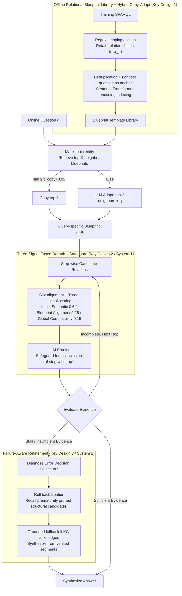

# CoG: Controllable Graph Reasoning via Relational Blueprints and Failure-Aware Refinement over Knowledge Graphs

**Conference**: ACL 2026  
**arXiv**: [2601.11047](https://arxiv.org/abs/2601.11047)  
**Code**: https://github.com/zjukg/CoG (Available)  
**Area**: Graph Learning / KG Reasoning  
**Keywords**: Knowledge Graph Question Answering, Dual-Process, Relational Blueprint, Failure-Aware Backtracking, Training-Free Agent

## TL;DR
CoG is a training-free KGQA framework that applies Kahneman’s Dual-Process Theory to KG reasoning: System 1 distills SPARQL from the training set offline into a "relational blueprint" template library, acting as a soft structural constraint to guide candidate relation reranking and pruning online; System 2 triggers evidence-conditioned reflection and targeted backtracking when search stalls, correcting earlier erroneous decisions. It achieves SOTA accuracy on three multi-hop KGQA benchmarks (GPT-4 backbone: CWQ 77.8, WebQSP 89.7, GrailQA 86.4) while maintaining the lowest cost (13% fewer tokens and 12% fewer calls than PoG on CWQ).

## Background & Motivation

**Background**: The mainstream LLM-driven agent paradigm for KGQA (ToG / PoG / KG-Agent) follows a "plan → retrieve → generate" loop, starting from a topic entity and gradually expanding the evidence chain. However, this method is highly unstable in complex multi-hop settings due to severe interference from neighborhood noise.

**Limitations of Prior Work**: The authors attribute this instability to "cognitive rigidity," categorized into two types: (1) Error Cascading from Indiscriminate Exploration—an early incorrect relation choice (e.g., choosing `contains` instead of `adjoins`) drags the agent into a massive noise set, leading to snowballing errors; (2) Structural Misalignment from Myopic Decisions—relying solely on local semantic matching easily falls into local optima (e.g., choosing `actor` instead of `director`), causing downstream constraints (runtime checks, temporal filters) to be unsatisfiable and forcing premature trajectory termination.

**Key Challenge**: Current agents lack a bridge between "local semantic relevance" and "cross-hop global structural consistency"—they miss both empirical structural priors and the diagnostic backtracking capability when reaching a dead-end. Fine-tuning methods (RoG, KG-Agent) learn structural priors at a high cost, while zero-shot agents are too unconstrained. Methods like GCR that use KG-tries for hard constraints suffer from low robustness, as a single missing edge leads to branch collapse.

**Goal**: (1) Introduce "cheap and interpretable" structural priors to constrain but not lock the agent's search direction; (2) Enable the agent to identify "where things went wrong" and backtrack when search stalls or evidence is insufficient; (3) Ensure the entire mechanism is training-free and independent of parameter fine-tuning.

**Key Insight**: The authors map Kahneman’s Dual-Process Theory directly to KG reasoning: use System 1 (fast, intuitive) for blueprint-guided candidate filtering and System 2 (slow, analytical) for failure diagnosis and backtracking. This division naturally separates "experience" from "reflection."

**Core Idea**: Off-line distillation of relation-only blueprints from training set SPARQL (storing relation chains without entities) serves as a soft prior. Online, the agent uses blueprints to rerank and prune candidate relations, and activates evidence-conditioned reflection and targeted backtracking upon failure, combining "experience usage" and "reflection capability" into a single training-free framework.

## Method

### Overall Architecture
CoG addresses "cognitive rigidity" in LLM agents for multi-hop KGQA: early incorrect relation choices drag searches into noise sets, and local semantic focus leads to dead-ends. It adopts Dual-Process Theory for KG reasoning without training: System 1 (Fast) uses distilled "relational blueprints" for soft candidate reranking and pruning; System 2 (Slow) triggers reflection during stagnation to pinpoint and correct errors, ultimately synthesizing answers from verified evidence to minimize hallucinations.

### Key Designs

**1. Offline Relational Blueprint Library + Hybrid Copy-Adapt: Distilling a "Structural Compass" from Training Data**

Agents lack cheap, interpretable structural priors. CoG uses deterministic rules (regex) to strip Freebase IDs and non-structural elements from training SPARQL, leaving only relation sequences $\mathcal{S}(q)=\langle r_1,\ldots,r_L\rangle$. Unique templates are indexed using a SentenceTransformer encoding of their longest question as a semantic anchor. This is low-cost: WebQSP’s 3098 queries compress to 569 templates (18.4%), and GrailQA’s 44k queries to 3.7k (8.3%), showing that KG reasoning structures are far more limited than natural language syntax. Online, it retrieves top-$K$ blueprints after masking topic entities. If similarity $\ge \tau_{\text{copy}}=0.92$, it copies the top-1; otherwise, LLM adapts the top-2 neighbors + original question into a query-specific $S_{\text{BP}}=\langle r_1^{\text{BP}},\ldots,r_L^{\text{BP}}\rangle$. At $\tau_{\text{copy}}=0.92$, only 8.7% use copy and 91.3% use adapt, reusing experience without overfitting. GPT-3.5 on GrailQA's zero-shot split reached 83.6% (vs. ToG 72.7, PoG 81.7), proving the blueprints learn abstract structures.

**2. Three-Signal Fused Reranking + Structure-Consistency Safeguard: Balancing Local Semantics, Blueprint Alignment, and Global Compatibility**

Relying only on local semantics leads to local optima (PoG’s failure mode), while relying only on global structure can filter correct edges in sparse KG areas. CoG uses monotonic slot-alignment indexing $\pi(t)=\arg\max_j \text{sim}(h(o_t), h(r_j^{\text{BP}}))$ to find the current sub-goal's position in the blueprint (ensuring non-decreasing, hop-by-hop progress). It then fuses three scores: $\text{Score}(r)=\lambda_{\text{loc}}\phi_{\text{loc}}+\lambda_{\text{step}}\phi_{\text{step}}+\lambda_{\text{glob}}\phi_{\text{glob}}$, with weights $(0.6, 0.25, 0.15)$. After LLM pruning, the set forcibly includes the "step-wise top-1"—a Safeguard that treats the LLM as a semantic expert and $\phi_{\text{step}}$ as a structural expert in parallel to catch structure-correct but semantically obscure relations.

**3. Failure-Aware Refinement (System 2): Diagnosis, Targeted Backtracking, and Grounded Fallback**

ToG/PoG lack explicit diagnosis, leading to infinite loops or premature termination with hallucinations (PoG retried 26 times at one node in Appendix Case 2). CoG switches to correction mode upon detecting stagnation or insufficient evidence: the LLM reviews the trajectory $\mathcal{T}=[e_0,r_1,\ldots]$ and pruned branch summaries under working memory $\mathcal{M}$ to pinpoint the error point $t_{\text{err}}$. The agent rolls back to $t_{\text{err}}$ and recalls structural candidates previously pruned. If the KG is truly missing edges, it falls back to grounded inference, using only verified segments and unsatisfied constraints to synthesize an answer, minimizing hallucination risks. Ablation shows System 2 is the most critical component: without it, CWQ accuracy drops from 66.9 to 58.5 (−8.4), a larger drop than removing System 1's blueprint guidance (−5.4).

### Loss & Training
Completely training-free with no gradient updates: (1) Blueprint encoder uses a pre-trained SentenceTransformer without fine-tuning; (2) All agents use fixed LLM APIs (GPT-3.5 Turbo / GPT-4 / Qwen2.5-7B), temperature 0.3, max tokens 1024; (3) Maximum exploration depth is 4. Hyperparameters include $\tau_{\text{copy}}=0.92$, reranking weights $(0.6, 0.25, 0.15)$, and retrieval $K$.

## Key Experimental Results

### Main Results (Hits@1 / F1 on three KGQA benchmarks)

| Method | CWQ Hits@1 | CWQ F1 | WebQSP Hits@1 | WebQSP F1 | GrailQA Hits@1 | GrailQA Zero-shot |
|---|---|---|---|---|---|---|
| ToG (GPT-4) | 67.6 | 47.6 | 82.6 | 58.9 | 81.4 | 86.5 |
| PoG (GPT-4) | 75.0 | 42.1 | 87.3 | 59.8 | 84.7 | 88.6 |
| **CoG (GPT-4)** | **77.8** | **69.2** | **89.7** | **75.5** | **86.4** | **89.1** |
| ToG (GPT-3.5) | 57.1 | 41.9 | 76.2 | 50.9 | 68.7 | 72.7 |
| PoG (GPT-3.5) | 63.2 | 43.7 | 82.0 | 58.1 | 76.5 | 81.7 |
| **CoG (GPT-3.5)** | **66.9** | **59.9** | **86.8** | **74.3** | **79.2** | **83.6** |
| KG-Agent (fine-tuned) | 72.2 | — | 83.3 | — | 86.1 | 86.3 |

CoG (GPT-4) F1 on CWQ is +27.1 points higher than PoG (69.2 vs 42.1), suggesting CoG not only finds the answer but retrieves the full answer set more completely.

### Ablation Study (CWQ Hits@1)

| Configuration | CWQ | WebQSP | GrailQA | Description |
|---|---|---|---|---|
| **Full CoG** | **66.9** | **86.8** | **79.2** | Full framework |
| w/o Failure-Aware Refinement | 58.5 | 79.9 | 75.3 | Without System 2 (−8.4 CWQ) |
| w/o Blueprint Guidance | 61.5 | 82.2 | 76.4 | Without System 1 (−5.4 CWQ) |
| w/o Blueprint-guided Reranking | 63.5 | 84.0 | 76.8 | Has blueprint adapt but no reranking |
| w/o Blueprint Adaptation | 62.4 | 83.5 | 77.5 | Direct use of retrieved blueprint |
| Local relevance only (rerank) | 64.6 | 84.4 | 76.2 | Only $\phi_{\text{loc}}$ |

### Efficiency Analysis (Average per query)

| Metric | Method | LLM Calls | Input tokens | Output tokens | Total tokens | Hits@1 |
|---|---|---|---|---|---|---|
| CWQ | ToG | 22.6 | 8,182.9 | 1,486.4 | 9,669.4 | 57.1 |
| CWQ | PoG | 13.3 | 7,803.0 | 353.2 | 8,156.2 | 63.2 |
| **CWQ** | **CoG** | **11.7** | **6,589.0** | 486.8 | **7,075.8** | **66.9** |

On CWQ, CoG uses 1.6 fewer LLM calls and 1080 fewer tokens than PoG while gaining 3.7 points—a clear Pareto improvement.

## Key Findings
- **System 2 is the single most important component**: Removing Failure-Aware Refinement drops CWQ by 8.4 points, surpassing the 5.4-point drop from removing blueprint guidance—showing that "knowing how to backtrack" is more valuable than "having a blueprint" in multi-hop KGQA.
- **Strong Zero-shot generalization**: On GrailQA’s Zero-shot split, GPT-3.5 hits 83.6% (vs. ToG 72.7%), proving blueprints capture abstract reasoning patterns rather than rote memorization.
- **F1 lead suggests answer set completeness**: The huge F1 advantage on CWQ (69.2 vs 42.1) implies CoG does not stop after finding the first answer.
- **Cross-KG transferability remains effective**: After mapping entities to Wikidata QID, CoG still leads PoG on WebQSP (+2.7) and CWQ (+2.1).
- **Sensitivity of internal structural vs. semantic weights**: Setting $\lambda_{\text{step}} < \lambda_{\text{glob}}$ causes performance drops, showing step-wise alignment's "hop-by-hop verification" is more critical than global path shape.

## Highlights & Insights
- **Dual-Process Theory is a fitting metaphor for KG agents**: System 1 fast intuition addresses "early error amplification," and System 2 slow analysis resolves "local optima dead-ends." These complement each other better than simple constraints.
- **Offline blueprint distillation is nearly zero-cost**: Rule-based extraction and encoder forward passes require no LLM calls or fine-tuning, allowing training data to inform the agent cheaply with high compression.
- **Three-signal rerank + Safeguard is a reusable pattern**: Combining LLM semantic expertise with structural top-1 selection solves the problem of LLM missing structurally correct but semantically subtle relations; this can be ported to RAG or tool selection.
- **Failure-Aware Refinement replaces blind retries**: Case studies show PoG wasting 14k tokens on 26 retries, while CoG succeeds via a single diagnosis and re-route, improving efficiency and interpretability.

## Limitations & Future Work
- Authors' Limitations: (1) KG incompleteness is a hard ceiling that refinement cannot bypass; (2) Blueprint coverage depends on the training set, risking failure for niche domain queries; (3) Multiple backtracks in complex cascades increase latency.
- Observations: Blueprints are linear chains, limiting expression for tree/graph queries (authors suggest mixing with KG-tries); offline libraries don't evolve online and may become stale; cross-schema generalization (e.g., Freebase to BioMed) is untested; System 2 relies on LLM "insufficient evidence" detection, which could misfire.
- Future Directions: Upgrading blueprints to typed graph templates; introducing online learning for incremental library evolution; using a learned detector for refinement triggers; and exploring LLM-generated blueprints for niche domains.

## Related Work & Insights
- **vs ToG (Sun et al. 2024)**: ToG uses LLM-driven beam search; CoG adds soft structural guidance and System 2 error correction, increasing CWQ Hits@1 by 9.8 with 27% fewer tokens.
- **vs PoG (Chen et al. 2024)**: PoG uses heuristic retries; CoG uses evidence-conditioned reflection for targeted repair, avoiding PoG’s identified infinite loop issues.
- **vs GCR / KG-Tries (Luo et al. 2025)**: GCR uses hard branch constraints that collapse if edges are missing; CoG's blueprints are soft and robustly handle missing edges via refinement.
- **vs RoG (Luo et al. 2024) / KG-Agent (Jiang et al. 2025)**: CoG (training-free) matches or exceeds these fine-tuned models on several benchmarks, proving structural priors + reflection can replace expensive fine-tuning.

## Rating
- Novelty: ⭐⭐⭐⭐ Systematically applying Dual-Process Theory to KG agents is a first; the combination of offline blueprints + three-signal reranking + refinement is comprehensive.
- Experimental Thoroughness: ⭐⭐⭐⭐⭐ 3 datasets × 3 backbones, plus cross-KG transfer, zero-shot splits, efficiency analysis, and hyperparameter sensitivity—nearly no experimental gaps.
- Writing Quality: ⭐⭐⭐⭐ Motivation from "cognitive rigidity" is clear; the Dual-Process metaphor is consistent; formulas and diagrams align well.
- Value: ⭐⭐⭐⭐ Training-free with significant Pareto improvements makes it directly applicable for industrial KGQA; blueprints are transferable to other retrieval-then-reason tasks.

<!-- RELATED:START -->

## Related Papers

- [\[ICML 2025\] Graph-constrained Reasoning: Faithful Reasoning on Knowledge Graphs with Large Language Models](../../ICML2025/graph_learning/graph-constrained_reasoning_faithful_reasoning_on_knowledge_graphs_with_large_la.md)
- [\[AAAI 2026\] PCoKG: Personality-aware Commonsense Reasoning with Debate](../../AAAI2026/graph_learning/pcokg_personality-aware_commonsense_reasoning_with_debate.md)
- [\[ICML 2026\] Generative Representation Learning on Hyper-relational Knowledge Graphs via Masked Discrete Diffusion](../../ICML2026/graph_learning/generative_representation_learning_on_hyper-relational_knowledge_graphs_via_mask.md)
- [\[ICLR 2026\] Relational Graph Transformer](../../ICLR2026/graph_learning/relational_graph_transformer.md)
- [\[NeurIPS 2025\] Deliberation on Priors: Trustworthy Reasoning of Large Language Models on Knowledge Graphs](../../NeurIPS2025/graph_learning/deliberation_on_priors_trustworthy_reasoning_of_large_language_models_on_knowled.md)

<!-- RELATED:END -->
