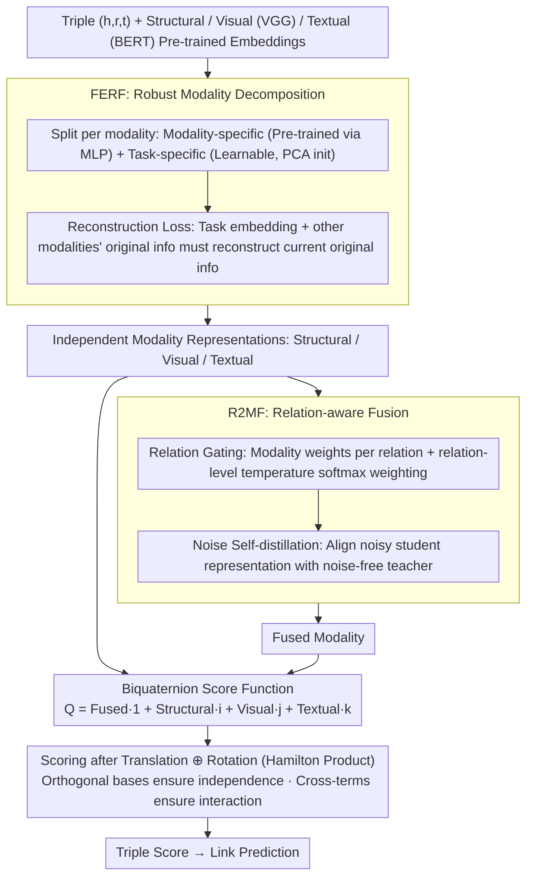

# Collaboration of Fusion and Independence: Hypercomplex-driven Robust Multi-Modal Knowledge Graph Completion

**Conference**: ACL 2026  
**arXiv**: [2509.23714](https://arxiv.org/abs/2509.23714)  
**Code**: https://github.com/zjukg/M-Hyper (Available)  
**Area**: Multi-modal Fusion / Knowledge Graph Completion / Representation Learning  
**Keywords**: Multi-modal Knowledge Graph, Hypercomplex Space, Biquaternion, Modality Fusion, Link Prediction

## TL;DR
M-Hyper encodes multi-modal knowledge graph entities into the four orthogonal bases of a biquaternion, carrying structural, visual, and textual modalities separately alongside a fused modality. Through the Hamilton product, it simultaneously achieves "modality independence preservation" and "sufficient pairwise interaction," outperforming 18 baselines with minimal GPU memory and the shortest training time across DB15K, MKG-W, and MKG-Y datasets.

## Background & Motivation
**Background**: Multi-modal Knowledge Graph Completion (MMKGC) currently follows two mainstream paths: fusion-based (IKRL, OTKGE, AdaMF, MyGO, etc.), which use explicit fusion modules or cross-modal losses to compress multi-modal info into a unified representation; and ensemble-based (MoSE, IMF, MoMoK, etc.), which train independent sub-models for each modality and make joint decisions.

**Limitations of Prior Work**: Fusion-based methods rely on fixed strategies, inevitably losing modality-unique information and failing to dynamically adjust modality weights based on different relations. Ensemble-based methods retain independence but lack deep cross-modal interaction mechanisms, making it difficult to model nuanced dependencies under complex relations.

**Key Challenge**: Modality contributions in MMKGs are dynamic, context-dependent, and task-related—requiring both modality independence (to avoid fusion loss) and sufficient cross-modal interaction (to capture synergy). Satisfying these two requirements simultaneously is nearly impossible in traditional Euclidean vector spaces.

**Goal**: Design a representation space where "independent modalities" and a "fused modality" coexist, natively supporting pairwise modality interaction while possessing translation and rotation capabilities for relationship modeling.

**Key Insight**: The authors observe that quaternion algebra has four linearly independent orthogonal bases $\{\mathbf{1}, \mathbf{i}, \mathbf{j}, \mathbf{k}\}$, and the Hamilton product naturally generates all pairwise cross-terms—perfect for carrying "3 independent modalities + 1 fused modality." Furthermore, using biquaternions (quaternions with complex coefficients) allows the simultaneous modeling of translation and rotation relation transformations.

**Core Idea**: Map structural, visual, textual, and fused modalities onto the four orthogonal bases of a biquaternion. Use the Hamilton product as the scoring function, where independence is guaranteed by the orthogonality of bases and interaction is provided by the cross-terms of the product.

## Method

### Overall Architecture
M-Hyper seeks a representation space where "independent" and "fused" modalities coexist with natural pairwise interaction—avoiding the loss of unique information seen in fusion methods and the lack of deep interaction in ensemble methods. Recognizing that quaternion algebra provides four linearly independent orthogonal bases, it maps structural, visual, and textual modalities, along with one fused modality, onto the four bases of a biquaternion. Inputting triples $(h,r,t)$ with structural embeddings $\mathbf{e}^s$, visual embeddings $\mathbf{e}^v$ (VGG), and textual embeddings $\mathbf{e}^t$ (BERT), FERF first decomposes each modality into robust representations. Then, R2MF performs relation-aware fusion to obtain the fused modality $\hat{\mathbf{e}}^j$. These are combined into $Q = \hat{\mathbf{e}}^j + \hat{\mathbf{e}}^s \mathbf{i} + \hat{\mathbf{e}}^v \mathbf{j} + \hat{\mathbf{e}}^t \mathbf{k}$, scored via a biquaternion function incorporating both translation and rotation. Orthogonality ensures modality independence, while Hamilton product cross-terms facilitate interaction.

### Key Designs

**1. FERF: Decomposing modalities into "Modality-specific + Task-specific" to denoise without losing pre-trained semantics**

Using only pre-trained encoder outputs risks contamination by modality noise and semantic ambiguity, while using only learnable embeddings loses pre-trained semantics. FERF splits each modality $m$ into two paths: modality-specific $\mathbf{e}^m_m$ (MLP-processed pre-trained output) and task-specific $\mathbf{e}^m_t$ (learnable embedding initialized via PCA from visual/textual features). The final representation is $\hat{\mathbf{e}}^m = \mathbf{e}^m_m + \mathbf{e}^m_t$. A reconstruction loss $\mathcal{L}_{recon} = \sum_m \|\mathcal{E}^m(\mathbf{e}^m_t; \{\mathbf{e}^{\hat{m}}_m: \hat{m} \neq m\}) - \mathbf{e}^m_m\|^2$ constrains the model: the "task embedding + other modalities' original embeddings" must reconstruct the original info of the current modality. This forces task embeddings to retain modality characteristics while collaborating with others, resulting in denoised, semantically complete independent representations.

**2. R2MF: Relation-aware Gating Fusion + Noise Self-distillation for adaptive and robust fusion**

Fixed fusion cannot adapt to the reality that different relations depend on different modalities (e.g., *born_in* relies on text, *has_color* on vision). R2MF first performs relation-aware gating: an MLP calculates weights $w^m$ for each modality based on $[\hat{\mathbf{e}}^m; \mathbf{r}^T; \mathbf{r}^R]$. Relation-level learnable temperatures $\tau_r$ produce $\hat{w}^m(e,r) = \exp(w^m/\tau_r) / \sum_i \exp(w^i/\tau_r)$, followed by weighted summation and a fusion-specific task embedding $\mathbf{e}^j_t$. Noise self-distillation is then applied: Gaussian noise $\tilde{\mathbf{e}}^m \sim \mathcal{N}(\bm{\varphi}^m, \bm{\mu}^m)$ creates a student fused representation $\hat{\mathbf{e}}^{j'}$. The noise-free $\hat{\mathbf{e}}^j$ acts as a teacher via $\mathcal{L}_{distill} = \frac{1}{n}\sum \|\hat{\mathbf{e}}^j_i - \hat{\mathbf{e}}^{j'}_i\|^2$.

**3. Biquaternion Score Function: Unifying "Independence + Interaction + Translation + Rotation"**

M-Hyper places $\hat{\mathbf{e}}^j, \hat{\mathbf{e}}^s, \hat{\mathbf{e}}^v, \hat{\mathbf{e}}^t$ onto the $\mathbf{1}, \mathbf{i}, \mathbf{j}, \mathbf{k}$ bases of a biquaternion (coefficients remain complex). Relations learn two sets of embeddings $Q_r^T$ and $Q_r^R$. Scoring involves translation $Q_{h'} = Q_h \oplus Q_r^T$ followed by rotation via Hamilton product $Q_{h''} = Q_{h'} \otimes Q_r^R$. The inner product with $Q_t$ yields the score: $\phi(h,r,t) = \langle (Q_h \oplus Q_r^T) \otimes Q_r^R, Q_t \rangle$. The Hamilton product expansion naturally produces all pairwise cross-terms $\hat{\mathbf{e}}^m_h \cdot \hat{\mathbf{e}}^{m'}_t$ (algebraically proven in Theorem 2), ensuring interaction, while base orthogonality preserves independence. Theorem 1 further proves from an Information Bottleneck perspective that this representation is strictly superior to pure fusion $T_f$ or ensemble $T_{ens}$: $\mathcal{L}_{IB}(Q) < \min(\mathcal{L}_{IB}(T_f), \mathcal{L}_{IB}(T_{ens}))$.

### Loss & Training
Total loss is $\mathcal{L}_{total} = \mathcal{L}_{recon} + \mathcal{L}_{distill} + \mathcal{L}_{triple} + \mathcal{L}_{reg}$, where $\mathcal{L}_{triple}$ is standard cross-entropy (with 1-vs-all candidates) and $\mathcal{L}_{reg}$ is $N3$ regularization. Using the Adagrad optimizer, batch size 1000, key hyperparameters $d=128$, $\lambda=0.005$, noise rate $\beta=0.2$, and learning rate $\alpha=0.1$. Training includes inverse triples $(t, r^{-1}, h)$.

## Key Experimental Results

### Main Results
Performance on DB15K, MKG-W, and MKG-Y benchmarks compared to 18 baselines:

| Dataset | Metric | M-Hyper (Ours) | Prev. SOTA (MoMoK) | Gain |
|--------|------|---------|-------------------|------|
| DB15K | MRR | **41.25** | 39.57 | +1.68 |
| DB15K | Hit@10 | **56.09** | 54.14 | +1.95 |
| MKG-W | MRR | **37.02** | 36.10 (MyGO) | +0.92 |
| MKG-W | Hit@10 | **48.84** | 47.75 (MyGO) | +1.09 |
| MKG-Y | MRR | **39.46** | 38.44 (MyGO) | +1.02 |
| MKG-Y | Hit@10 | 45.22 | 45.48 (AdaMF) | -0.26 |

Average MRR increased by approx. 4.25%, and Hit@10 by approx. 3.89%. Efficiency analysis shows M-Hyper has the **shortest training time per epoch and near-optimal GPU memory usage** among 6 compared methods—reaching 40.75% MRR in just 1160 seconds.

### Ablation Study

| Configuration | DB15K MRR | MKG-W MRR | MKG-Y MRR | Note |
|------|-----------|-----------|-----------|------|
| M-Hyper (Full) | **41.25** | **37.02** | **39.46** | — |
| w/o Fused Modality $\hat{\mathbf{e}}^j$ | 36.36 | 35.09 | 36.71 | Most significant drop; fusion is core |
| w/o Visual $\hat{\mathbf{e}}^v$ | 35.09 | 36.46 | 37.95 | Visual info crucial for DB15K |
| w/o Structural $\hat{\mathbf{e}}^s$ | 39.77 | 34.62 | 38.03 | Structural info crucial for MKG-W |
| w/o FERF | 39.24 | 35.93 | 37.93 | Robust decomposition contributes significantly |
| w/o Distillation | 39.64 | 36.10 | 38.16 | Distillation helps ~1.6 MRR |
| w/o Relation Gating | 40.18 | 36.18 | 38.21 | Dynamic fusion contributes moderately |
| w/o Rotation $\mathbf{r}^R$ | 38.91 | 36.46 | 37.78 | Drop after degrading to quaternion; proves rotation power |
| M-Hyper-fusion variant | 39.23 | 35.54 | 37.52 | Significant loss with pure fusion |
| M-Hyper-ensemble variant | 39.31 | 34.75 | 37.58 | Significant loss with pure ensemble |

### Key Findings
- Removing the **fused modality $\hat{\mathbf{e}}^j$** caused the steepest performance drop (DB15K -4.89 MRR), proving that the real part of the biquaternion carries essential cross-modal synergistic signals.
- Removing **rotation $\mathbf{r}^R$** (degrading from biquaternion to quaternion) led to drops across all datasets, indicating that rotation in the complex domain genuinely increases expressive power.
- M-Hyper outperformed AdaMF and MoMoK in scenarios involving missing modalities, noise, and sparse links, showing that the combination of task embeddings and self-distillation is more stable than pure noise augmentation.
- t-SNE visualization indicated that the fused modality provided the highest discriminative power for city-country relations.

## Highlights & Insights
- **Algebraic Structure as Representation Constraint**: Using the four orthogonal bases of a biquaternion to encode "3 Independent + 1 Fused" is an elegant design. Orthogonality automatically ensures independence, and the Hamilton product automatically ensures interaction, removing the need for extra regularization terms.
- **FERF's Modality/Task-specific Decomposition**: This uses reconstruction loss to explicitly separate information that *must* come from its own modality from information that *can* be collaborated across modalities.
- **Unified Score Function**: Combining dual-direction transformations with biquaternion algebra while layering multi-modal semantics represents a pinnacle in the evolution of KGE scoring functions.
- Information Bottleneck theoretical proofs provide a formal explanation for why biquaternions excel over pure fusion or ensemble methods.

## Limitations & Future Work
- The study is limited to **transductive** static MMKGC and cannot handle dynamic scenarios such as new entities or modalities.
- The 8d dimensionality of biquaternion space doubles parameter size compared to quaternions; while efficient due to design simplicity, this advantage may diminish as $d$ increases.
- Robustness was tested against random noise/omission but not adversarial perturbations.
- Future work includes extending "coexistence and collaboration" to entity alignment, KGQA, and NER.

## Related Work & Insights
- **vs MoMoK (ICLR 2025)**: MoMoK uses MoE for decoupling with MI minimization for independence but lacks explicit interaction between sub-models. M-Hyper uses biquaternion structure for both.
- **vs MyGO (AAAI 2025)**: MyGO uses fine-grained multi-modal tokenization but loses modality independence after fusion.
- **vs BiQUE (EMNLP 2021)**: BiQUE embeds single-modal KGs in biquaternion space for rotation and translation; M-Hyper is the first to extend this to multi-modal contexts.
- **vs AdaMF (LREC-COLING 2024)**: AdaMF uses adversarial training for noise enhancement; M-Hyper employs self-distillation for more stable robustness.

## Rating
- **Novelty**: ⭐⭐⭐⭐⭐ High originality in using algebraic bases to carry modalities.
- **Experimental Thoroughness**: ⭐⭐⭐⭐⭐ Extensive benchmarks, baselines, and three-dimensional ablations.
- **Writing Quality**: ⭐⭐⭐⭐ Method and theory are clear, though biquaternion derivation is dense.
- **Value**: ⭐⭐⭐⭐ New SOTA for MMKGC with a strong conceptual framework for multi-view learning.

<!-- RELATED:START -->

## Related Papers

- [\[ACL 2026\] GS-Quant: Granular Semantic and Generative Structural Quantization for Knowledge Graph Completion](gs-quant_granular_semantic_and_generative_structural_quantization_for_knowledge_.md)
- [\[AAAI 2026\] MyGram: Modality-aware Graph Transformer with Global Distribution for Multi-modal Entity Alignment](../../AAAI2026/graph_learning/mygram_modality-aware_graph_transformer_with_global_distribution_for_multi-modal.md)
- [\[ACL 2026\] ComplianceNLP: Knowledge-Graph-Augmented RAG for Multi-Framework Regulatory Gap Detection](compliancenlp_knowledge-graph-augmented_rag_for_multi-framework_regulatory_gap_d.md)
- [\[NeurIPS 2025\] RAD: Towards Trustworthy Retrieval-Augmented Multi-modal Clinical Diagnosis](../../NeurIPS2025/graph_learning/rad_towards_trustworthy_retrieval-augmented_multi-modal_clinical_diagnosis.md)
- [\[CVPR 2026\] Graph-to-Frame RAG: Visual-Space Knowledge Fusion for Training-Free and Auditable Video Reasoning](../../CVPR2026/graph_learning/graph-to-frame_rag_visual-space_knowledge_fusion_for_training-free_and_auditable.md)

<!-- RELATED:END -->
